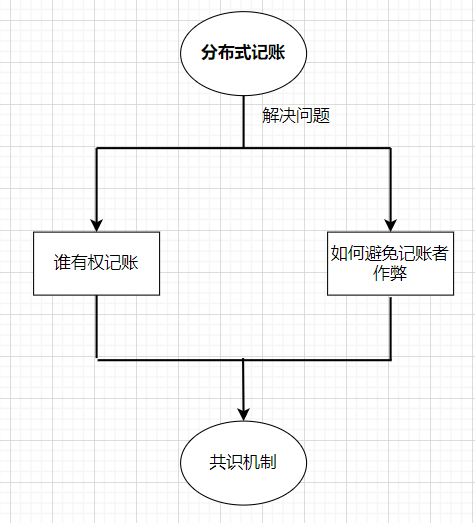
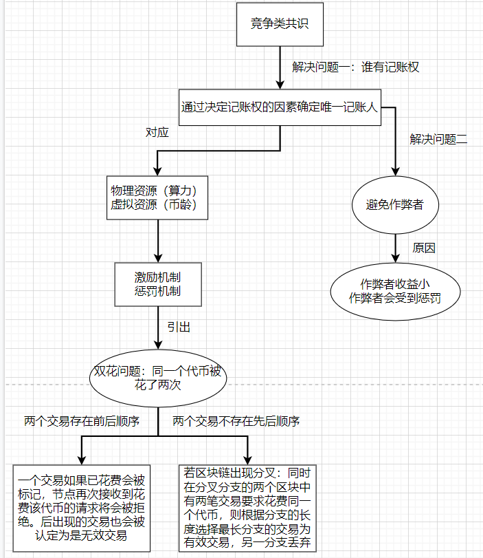
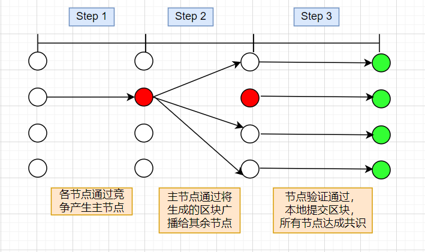
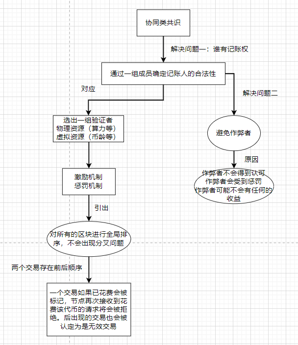
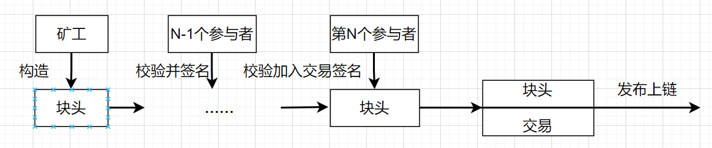
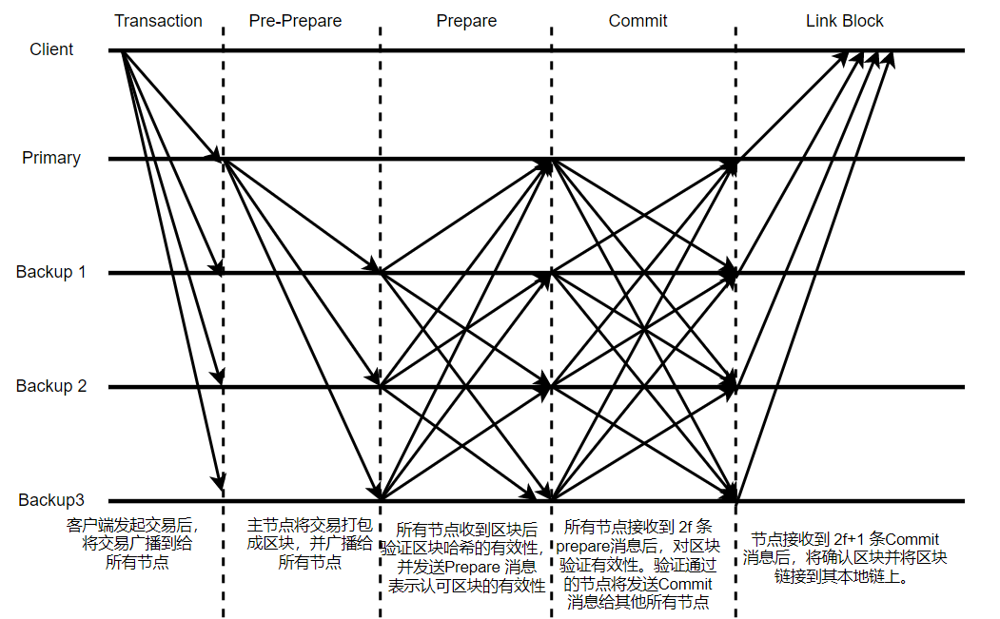

# 根据区块链存储结构的共识算法分类

分布式记账需要解决的问题：谁有记账权，如何避免记账者作弊。

## 链式存储共识算法

每个节点都会局部的维护一条区块链。

### 竞争类共识算法

共识过程如下：
* 各个节点通过竞争的方式产生主节点；
* 主节点将从交易池中打包部分交易，引用当前区块链的最新一个区块，从而形成一个新的区块，并广播给其他节点；
* 其他节点收到区块之后，会检查区块的有效性和合法性。如果验证成功，则接收并提交区块，所有节点达成共识。否则，将拒绝承认该区块。

竞争类共识算法需要确保大多数节点都是诚实，否则系统就会被恶意攻击者掌控。

#### PoW

代表是比特币。

节点通过解决一个哈希难题找到一个Nonce值使得最终结果达到目标值。这个过程需要耗费大量的算力。这个过程是一个需要巨大工作量的过程。当最后的结果达到目标值时，就能说明这个节点完成了这些工作量，以此作为该节点具有生成区块的权利，并可作为之后其他节点验证该区块有效性的证明。这个共识算法中，各个节点都是独立工作，并且只需要引用区块链上的最新交易，因此非常适用于链式存储结构的区块链系统。

PoW算法的优点：
* 机制本身当然很复杂，有很多细节，比如：挖矿难度自动调整、区块奖励逐步减半等，这些因素都是基于经济学原理，能吸引和鼓励更多人参与。
* 理想状态，这种机制，可以吸引很多用户参与其中，特别是越先参与的获得越多，会促使加密货币的初始阶段发展迅速，节点网络迅速扩大。在CPU挖矿的时代，比特币吸引了很多人参与“挖矿”，就是很好的证明。
* 通过“挖矿”的方式发行新币，把比特币分散给个人，实现了相对公平。同时这种机制也不再需要具有高信任度的第三方来发行法币，创建了一个很好的信任机制。

但是这个共识算法存在一些弊端：
* 算力不公平：拥有巨大算力的矿场比单个节点的竞争力更大。并且随着硬件的发展会使得破解哈希难题的难度降低。比如现在需要10分钟左右才能破解的哈希难题，量子计算机可以几秒就破解。这时候这类共识算法的安全性就不太能够得到保证了。
* 巨大的算力浪费：大量的哈希计算除了使得恶意攻击者不能轻易的伪造身份以外，并没有其他的实际价值和科学价值。最终也只是浪费了大量的资源做了一个类似于身份的证明，这是得不偿失的。
* 比特币区块奖励每４年将减半，当挖矿的成本高于挖矿收益时，人们挖矿的积极性降低，会有大量算力减少，比特币网络的安全性进一步堪忧。

#### PoS

代表是点点币。
系统在创世区块中写明了股权分配比例，之后通过转让、交易的方式（首次公开募股Initial public offerings IPO），逐渐分散到用户的手中，并且通过“利息”的方式新增货币，实现对于节点的奖励。根据用户持有货币的多少和时间（币龄），发放利息的一个制度。用户需要将一些利益存放在链中（相当于押金）才具有参与共识的权利。引入奖惩机制，一旦用户作恶，将失去押金，使得系统可以更好的防止攻击。

PoS共识过程：加入PoS的都是持币人，将成为验证节点。验证节点中具有更高持币币龄的节点有权利生成新的区块并广播。接收到新生成的区块之后，其他验证节点会验证区块的有效性（币龄是否最高、区块是否合法）。一旦验证成功，就接受该区块；否则就拒绝该区块。如果一定时间内没有新区快产生，则系统会选择下一个区块生成者，从而重复以上过程。新的区块只会引用本地维护的最长区块链的最新的区块作为父区块。因此这个共识算法也非常适合链式结构的区块链。

PoS的优点：
* 省资源：不需要挖矿，不需要大量耗费电力和能源。
* 更加去中心化：相对于比特币等PoW类型的加密货币，更加去中心化，相比PoW算法的51%算力攻击，PoS需要购买51%的货币，成本更高，并且一旦生成了新的区块，币龄也会归零重新计数，没有攻击意义。
* 避免通货膨胀：PoW机制的加密货币，因为用户丢失等各种原因，可能导致通货紧缩。PoS机制的加密货币按一定的年利率新增货币，可以有效避免紧缩出现，保持基本稳定。比特币之后，很多新币采用PoS机制，很多采用工作量证明机制的老币，也纷纷修改协议，“硬分叉”升级为PoS机制。

PoS的缺点：
* POS会面临发币的问题，起初只有创世块上有币，意味着只有这个节点可以挖矿，所以让币分散出去才能让网络壮大。所以早期采取的是POW+POS，即第一阶段POW挖矿，第二阶段POS挖矿，后来ERC20合约代币出现后，可以只存在POS的挖矿形式。
* 开发者作恶：纯PoS机制的加密货币，只能通过IPO的方式发行，这就导致“少数人”（通常是开发者）获得大量成本极低的加密货币，很有可能造成大面积的抛售。
* 币龄其实就是时间，一旦挖矿者囤积一定的币，很久很久之后发起攻击，这样将很容易拿到记账权。
* 矿工可以囤积代币从而导致货币流通困难。
* POS面临的最严重的一个问题就是无成本利益问题，在PoS系统中做任何事几乎没有成本，比如在PoS系统上挖矿几乎没有成本，这也就意味着分叉非常方便。

#### PoET

PoET 的工作机制如下：网络中的每位参与节点都必须等待一个随机选取的时期，首个完成设定等待时间的节点将获得一个新区块。区块链网络中的每个节点会生成一个随机的等待时间，并休眠一个设定的时间。最先醒来的节点，即具有最短等待时间的节点，唤醒并向区块链提交一个新区块，然后广播必要的信息到整个对等网络中。同一过程将会重复，以发现下一个区块。
在 PoET 网络共识机制中，需要确保两个重要因素。
第一，参与节点在本质上会自然地选取一个随机的时间，而非某一个参与者为胜出而刻意选取了较短的时间。
第二，胜出者的确完成了等待时间。

优点：
* 参与代价低。更多人可轻易加入，进而达到去中心化。
* 对于所有参与者而言，更易于验证领导者是通过合法选举产生的。
* 控制领导者选举过程的代价，是与从中获得的价值成正比的。
  
缺点：
* 尽管 PoET 的代价低，但是必须要使用特定的硬件。因此不会被大规模采纳。
* 不适用于公有区块链。

### PoC

矿工们首先在一个叫做“绘图”的过程中开展工作。在这个过程中，矿工们的硬碟会被载入许多不同难题的解决方案。每当创建区块时，就有难题产生；有些解决方案比其他解决方案更快，能够最快找到解决问题的矿工就成了领导者，获得区块奖励。拥有更多硬碟空间的矿工，能拥有更多潜在解决方案，因此发现最快解决方案的机会就比别人大。

容量证明涉及到两个部分：绘制（Plotting）和计算截止日期：
*  绘制（Plotting）： 绘图，也称为创建绘图文件，根据硬盘的大小，绘制周期也将不同，一般为几天甚至数周。矿工为绘图分配的硬盘空间越多，存储的nonce就越多。一个随机数最终将包含8192个哈希值，这8192个哈希是成对组织的，称为scoop，每个scoop会被分配一个从0到4095的数字。
*  计算截止日期：在挖矿过程中，你需要计算一个0到4095之间的一个勺数。假设你的计算给你一个42的勺数，然后你会去挖掘一个42的nonce1并使用该scoop数据计算一个时间量，这个时间称为截止日期。你对硬盘上的所有nonce重复此过程，在计算完所有截止日期后，你将选择最短期限，截止日期表示*在允许创建块之前，最后一个块被创建后经过的秒数*，如果没有其他人在这段时间内创建一个区块，你创建了一个区块便会获得一个区块奖励，因为你能够生产的截止日期比其他矿工的截止日期短，你比其他矿工快，所以你将得到奖励。

完整的PoC共识出块流程：
* 步骤1-2，GenHash的生成：GenHash类似于BitCoin中BlockHash的概念，用于形成前后相继的区块链结构。BurstCoin中，由于该Hash同时参与共识过程中参数的建立，其将概念拆分为两个：GenSig由上一个区块中的GenSig与上个区块的出块者做Hash得出，GenHash由GenSig与快高信息做Hash得出。通过这样两次Hash计算，即将当前区块前的所有区块形成了不可修改历史区块的链式结构，同时也得出了PoC共识中的重要参数GenHash。
* 步骤3-4. Scoop Number的计算：钱包生成GenHash后，将此值发送给矿工，矿工由此计算本次出块需要的Scoop Number。GenHash Modulo 4096 即是Scoop Number的值。该Scoop Number用来定义本次出块中，全网的所有矿工应当查询自己拥有的所有Nonce中的Scoop的数据。结合上一章节内容我们可以得知，也即其拥有的某个Scoop中两个Hash的值。
* 步骤5，计算target，deadline：首先，矿工需要遍历磁盘，找到自己拥有的所有nonce中对应于上一步计算出的Scoop Number的两个hash，记为scoopdata，使表达式 target=Hash(scoopdata, GenSig)的值最小。之后利用该最小值targer，计算target/BaseTarget得出deadline。target类似bitcoin中的difficulty_target参数，控制全网挖矿难度，而dealine决定了了该矿工产生的区块在全网中是否成功得到该区块铸造权。

POC的优势：
* POC挖矿减少了大量的计算，同时避免了AISC化的矿机出现，大大降低了挖矿的门槛和矿工的成本，POC的优势愈发明显：
* 抗AISC 化、节能：没有了专业的挖矿设备，硬盘挖矿的门槛更低。全球拥有硬盘设备的人不计其数，这将使得矿工们更加分散，更加去中心化，矿工们的收益也将大大提高。同时挖矿过程中所产生的电力也是极低的，一块硬盘平均耗费5～8瓦。
* 重复利用：矿工们一旦停止挖矿，便可以删除硬盘内的数据，将硬盘重新用于任何其他资料存储等。

### 协同类共识

通过选出一组区块验证者，对于一个区块的人有效性达成一致即达成全局共识。

#### DPoS

DPoS的原理是让每一个持有股的人进行投票，由此产生101位代表 , 我们可以将其理解为101个超级节点或者矿池，而这101个超级节点彼此的权利是完全相等的。如果代表不能履行他们的职责（当轮到他们时，没能生成区块），他们会被除名，网络会选出新的超级节点来取代他们。DPOS的出现最主要还是因为矿机的产生.

每一个持股人通过投票选出一组代表或受托人。受托人的节点服务器相当于比特币网络里的矿机，在完成本职工作的同时可以领取区块奖励和交易的手续费。主要的功能有
*  提供一台服务器节点，保证节点的正常运行；
*  节点服务器收集网络里的交易；
*  节点验证交易，把交易打包到区块；
*  节点广播区块，其他节点验证后把区块添加到自己的数据库；

DPoS主要分为两部分；
* 选出一组受理人（区块生成者）：
* 调度生产

每个受理人轮流生成区块。如果有人错过了自己的轮次，不会再其他轮次产生区块（就算产生也是无效的）。通过通信交流，所有人受理人会对每个区块的有效性达成一致，最终广播到网络达成全局一致。
优点：节能；快速。
缺点：为了性能，对去中心化做了一个妥协。具有高股权的参与者可以投票使得自己成为一名验证者。比如EOS来说，就21个超级节点，那么这个区块链网络已经不是真正意义上的“去中心化”了，反而变成了“弱中心”或者说“部分去中心化”。

#### PoA(Proof of Authority)

系统通过权威选出一组权威证明者。建立权威必须在梁上验证身份（并签署法律文件）、资格很难获得、检查和程序上具有完全的一致性。被选中成为验证者的身份信息将会被公布。

这些具有权威的验证节点才有生成区块记录交易的权限，并获得区块奖励和交易费用。在PoA中，验证者（validator）是整个共识机制的关键。 验证者不需要昂贵的网卡，也不需要足够的资产，但它必须具有已知的，并且获得验证的身份。验证者通过放置这个身份来获得担保网络的权力，从而换取区块奖励。若是验证者在整个过程中有恶意行为，或与其它验证者勾结，那通过链上管理可以移除和替换恶意行为者。现有的法律反欺诈保障会被用于整个网络的参与者免受验证者的恶意行为。

POA中的验证者通过智能合约来管理，验证者可以投票添加或删除验证者甚至是更新治理合约。每个验证者出块的几率均等，每产生一个块可以过得一个 POA 币以及所有的手续费。PoA 网络平均每 5 秒出一个块， 区块大小是 800 万 Gas，Gas price 固定为 1GWei（1POA＝1,000,000,000Gwei）， 因此可以推算 PoA 网络大概比以太坊快３倍，而运行 DApp 的 gas 费用则大大降低，当前一个 POA 的价格不到 0.2 元，历史最高时也只有６元，不像一个以太几千上万的价格。

PoA的优点：
* 需要更少的算力，不需要挖矿，节能环保
* 验证速度快，支持更快的事务。官方宣称5s就能打包1个区块，每天能处理150万笔交易。
* 整个网络，验证者互相监督，随时可以投票加入新的验证者或者剔除不合格验证者
* 硬分叉受法律保护，每个Validator均签订法律协议。即每个Validator对自己验证的交易负有一定的法律责任。
* 高度可扩展性和高度兼容性，POA Network兼容以太坊上所有的DAPP，任何基于以太坊开发的应用均可移植到POA Network。

PoA的缺点：
* 公开身份，隐私和匿名性将减少。
* 集中的权威节点
* PoA不能保证审查制度的抵抗力。

#### Proof of Activity

POActivity算法原理是，挖矿节点构造出一个符合难度要求的块头，通过矿工得到的块头计算衍生出N个币的编号。根据币的编号追溯可以得到这几个币目前所属的参与者。挖矿节点将这个块头发送给这N个参与者，其中前N-1个参与者对这个块进行校验和签名，最后第N个参与者校验并将交易加入到该块中，将这个区块发布出去，即完成一个区块的出块。

具体步骤
* 每个矿工先利用自身算力通过工作量证明机制后得出nonce并生成一个空区块头，这个区块头与正常区块一致但是没有交易信息。
* 最先生成空区块的节点广播全网节点，全网节点接收到消息后，将此区块的hash值与上一区块的hash值进行拼接，然后加上n个固定后缀值进行再hash，最后得出n个值作为输入，进入follow-the-satoshi程序，然后可输出n个随机权益持有者。
* 前n-1个随机权益持有者对空区块进行签名，第n个随机权益持有者即为获取到记账权的节点，他将在空区块的基础上添加交易数据与签名。
* 第n个随机权益持有者将打包好的区块广播全网，全网节点接收到区块后进行验证，验证成功后上链。
* 产生空区块的矿工与第n个随机权益持有者以及前n-1个已签名的随机权益持有者共享交易费奖励。

优点：改进网络拓扑，维持在线节点比例，节能、交易费低。同时，攻击成本要高于纯PoW协议。
缺点：继承工作证明和股份证明的缺点，即使用的高资源和恶意验证器。

#### PBFT

节点之间对于新的区块通过通信达成共识。主要是由三个阶段构成：预准备阶段、准备阶段和提交阶段。

1.	交易转发阶段：
a.	客户端(Client)将交易发送到区块链中的任意节点；
b.	Backup节点将接收到的交易广播给所有节点,节点将收到的交易放入交易缓存池；
2.	Preprepare阶段： 
a.	Primary会选择交易缓存池交易进行打包，构造批量交易的哈希；
b.	Primary通过PrePrepare消息将区块广播给其他节点；
3.	Prepare阶段：
Backup接收来自Primary的PrePrepare消息之后,对区块中的交易哈希进行验证，验证无误后构造Prepare消息发送给其他Replica节点，表明该节点接收到来自主节点的PrePrepare消息并认可主节点的区块。
4.	 Commit阶段：
Backup接收到2f个节点的Prepare消息之后对区块的消息进行合法性验证，验证通过之后向其他节点广播Commit消息，表示本节点同意Primary节点的验证结果。
5.	写入账本：
Replica节点接收到2f+1个Commit之后执行区块中的交易并写入本地账本。
值得注意的是，主节点除负责对交易打包外，与从节点功能无异。并且当从节点不认可主节点的区块时可以发起相应请求，集齐一定数量的该请求即可切换主节点。

优点：可以确保强一致性、节能、快速共识，不会出现分叉
缺点：当节点数量增加时，通信复杂度会大大提升；不太适用于公链场景。

#### DBFT

该算法是对PBFT算法的一个改进。借鉴了PoS的特点 利用最小的资源来保障网络免受拜占庭故障的影响，同时也弥补了 PoS 的一些问题。节点分为两类节点：一类为共识记点，负责和其他共识记点之间进行共识通讯，产生新的区块；另外一类为普通节点，不参与共识，但能够验证和接受新的区块。共识节点由全网用户通过投票产生。采用投票选取出相对较小数量的共识节点内部进行PBFT共识生成新区块，然后将该新区块发布到全网中达成全网共识。产生新区块的正常共识流程如下：
* 开启共识的节点分为两大类，非记账人和记账人节点，非记账人的不参与共识，记账人参与共识流程
* 选择议长，议长产生机制是根据当前块高度和记账人数量做MOD运算得到，议长实际上按顺序当选
* 节点初始化，议长为primary节点，议员为backup节点
* 满足出块条件后议长发送PrepareRequest
* 议员收到请求后，验证通过签名发送PrepareResponse
* 记账节点接收到PrepareResponse后，节点保存对方的签名信息，检查如果超过三分之二则发送 block
* 节点接收到block，PersistCompleted事件触发后整体重新初始化。

提出changeview机制进一步增强dBFT的安全性。当节点在经过一段时间间隔后仍未达成共识，或接收到包含非法交易的提案后，开始进入视图更换流程：
* 发现故障的节点提出视图更换的请求；
* 任意节点受到至少 $n-f$ 个不同节点的视图编号时，试图更换达成，之后将在这个视图下达成共识。
* 若在一段时间之后还未达成视图更换，则重新提出新的试图编号，并回到第一步。

优点：快速；可扩展。不会分叉
缺点：每个人都争相成为根链。如果发言人或代表恶意，它可能导致分叉。

#### Steller共识算法

**法定体的概念：**一个节点，可信赖的集合。就为这个节点的法定体。
**层级概念：**最顶层为初始信息节点，决定整个网络的最终结果。

共识过程：
* pre-prepare阶段： 节点A和他的法定体交换，初始提交slot等内容。
* promise阶段：节点收到他的法定体的大多数节点接受slot A,他也就接受A。节点会给其他节点发送confirm prepare的（promise）消息。
* AcceptCommit阶段：然后节点收到大多数节点的promise消息，表示大多数人同意，就最后accept这个slotA。
* ConfirmCommit阶段：然后这个节点会想全网广播commit消息，表示接受这个slotA。这一步主要是为了让全网达成共识。向全网广播，根据群提交的概念，让全网每个节点达成共识。

系统的风险是：整个系统达成一致的过程中，不可避免的被阻断，失去活跃度。节点要么提交命令，要么中止命令。系统可能因为达不成一致，而处于停滞状态。当系统在某一个状态停止时，节点会投中止命令。

SCP 同时具有四个关键属性：分布式控制、低延迟、灵活的信任机制和渐近安全性。

#### Algorand

首先，使用者必须自动加入“宣告参加委员会”。那些加入宣告的人可以自己发现他们是否已经成为委员会的一部分，并不需要联系网路上的其他人。这是通过一个程式来执行的，该程式将前一个区块的资讯作为输入，然后会对每个加入的宣告者输出他是否被选入委员会的结果。 对于加入的宣告者来说，这就像开彩票一样，她只要看彩票就知道她是否赢了。
那些被选中的委员们将验证交易的有效性，并创建新的区块，同时负责把新区块的消息传播到网路的其他节点。委员们的身份只有在区块被创建后才会发布。
以下是 Algorand从委员会的选择到区块生成的步骤：
* 系统随机选出一个领导者。领导者提出并流通一个新的区块。
* 系统随机选出一个委员会。委员们就领导者提出的区块达成拜占庭协定。
* 大部分委员会成员对协定好的区块进行数码签名。
* 委员会的成员负责传播数码签名、签名者的身份以及新区块的内容，以便网路上的每个人都可以确证新区块。

Algorand只需要很少的计算能力，并且出错返回的概率不高。加入区块链的区块可以直接被视为具有终极性。
* 现实环境的随机选择的空间并不大。VRF是可以提供了公平且不容易收到伪造和攻击的委员会随机选择方式，但是任何随机数的生成必须依赖大的种子集合才可以有作用，在VRF中假设80%节点是诚实的，Committee需要2000个成员才够大，现实情况是不太可能有这么多成员的。
* 完全没考虑网络延迟情况。VRF Committee集合选举时依赖数量庞大的主机通讯的，主机之间相互沟通造成的延迟，必然大大拖慢整个系统的处理速度。
* 没考虑节点的动态加入和退出情况。Algorand的下一个区块的发布者是从k个区块之前的所有参与者（在k区块之前的某段链上发过交易的节点）里选。于是，恶意节点想影响下个区块的发布者，他得影响k个区块才行，当k很大的时候，这个影响也是微乎其微。于是，Algorand得到了一个无偏向的随机数产生器。不过，这个做法有一个问题——k区块之前的节点，有可能已经不在线了。
* 签名数据庞大，造成存储浪费并影响性能。Algorand使用VRF来确定提案组与验证组，这个方式充分发挥了VRF的可验证性优势，且后验优势使得Algorand的共识体系更安全。但是，Algorand进入验证阶段，采用的是一种可扩展的拜占庭容错算法，即BA* 算法，参与节点通过VRF秘密抽签选出。这一设计使Algorand在验证前必须等待凭证（VRF prove）到来，才能知晓参与节点。而且，由于使用了可扩展的拜占庭容错算法，使得Algorand的验证组规模必须比较大(2000～4000人)，这将导致签名数据异常庞大。根据我们的估算，在平均每组3000个验证节点的规模下，每组的签名数据长达126KB，加上其它信息，通知信息约300K，每块的签名数据可达2000* 64 *12=1M（共12组，每组3000人，至少2/3达成共识。ed25519签名数据长度是64。），远超一般门限签名几十个字节，严重浪费存储和容量（因每块存储的交易量将被占用，不存储签名又会影响安全），不仅造成存储浪费，而且更影响性能。
* 无法构建很好的激励机制:Algorand协议并没有设计经济激励机制，Micali教授曾回应”Algorand协议只需要进行平凡的计算，因此不需要激励”。在没有经济激励机制下，高性能带宽和服务器必然不愿意参与（因为它本身要消耗费用），整个网络会遇到网络本身无法解决的困难。
* 存在潜在的安全问题。网络用户必须连续访问其私钥，以确定其在每一轮中的VRF状态（即验证者、提议者，或者两者都不是）。一般认为，对于那些将大量资产存储在区块链上的个人，为了防止攻击，他们应该把私钥以冷存储的方式进行保存。而持续的验证（需要经常签名）会需要高频率地动用私钥，从而增加被攻击的风险。这显然将导致网络中很多诚实的个体（出于安全的考虑）会避免参与验证过程，从而造成区块链缺乏活力的问题。
* 买断问题。在区块链的婴儿期，系统的通证价值通常较低，其市值也是处在相对较低的水平。Token的发行往往要经过私募-->基石-->公募 等逐步分散的过程，因此很长一段时间里币是集中在少数人手里的，因此任何POS共识都面临着EOS类似的中心化的问题。
* 没有惩罚问题。Algorand所存在的另一个问题是，没有办法识别“离线验证者”并惩罚它们。因此，在没有惩罚措施来防止无效的情况下，没有经济激励就是一个问题，很多人会选择不为共识做贡献，因此离开这个网络。假设网络中只有10%的诚信节点在不断地进行验证，而其余节点是离线的状态，与此同时，恶意的节点选择保持在线，那其就很容易超过在线委员会节点。这使得恶意节点更容易控制共识。

#### Ripple共识算法

在讲算法之前，有一些基本概念需要了解：

* 服务节点，就是可以接收交易的区块链节点，包括验证节点与非验证节点两种，验证节点是指被其它节点加入到信任列表中的节点，可参与共识过程，非验证节点不参与共识过程。
* 区块，区块记录交易，在RPCA中有两种区块比较关键，一个是最新关闭的区块，也就是最新被共识过的区块，另一个是开放区块，开放区块是指当前正被共识的区块，当开放区块被共识过，也就成了新的最新关闭的区块。
* 信任节点列表，每个服务节点都会维护一个信任节点列表，这里的信任并不是我们通常理解的信任，而是指我信任这个列表中的节点不会联合起来作弊。在共识过程中，我们只接受来自信任节点列表中节点的投票。在Ripple中，我们用在配置文件中加入其它验证节点的公钥的方式来指定UNL。

Ripple网络每隔几秒就会产生一个新的区块，这个区块的产生过程就是所有网络节点RPCA共识的过程。假设共识过程是成功的，并且网络中没有分叉产生，那么新生成的区块就是全网唯一的。RPCA对交易分两个阶段完成，第一阶段是达成交易集的共识，第二阶段是对新生成的区块进行提议，最终形成被共识过的区块。

达成交易集的共识分轮进行，在每一轮中进行下面的操作：
* 每个节点在共识开始时尽可能多的收集所能收集到的需要共识的交易，并放到“候选集”里面；
* 每个节点对它信任节点列表中的 “候选集”做一个并集，并对每一个交易进行投票；
* UNL中的服务节点交流交易的投票结果，达到一定投票比例的交易会进入到下一轮，达不到比例的交易要么被丢弃，要么进入到下一次共识过程的候选集中；
* 在最终轮中，所有投票超过80%的交易会被放到共识过的交易集中，这里的交易集与比特币类似，也是Merkle树的数据结构。

形成交易集后，每个节点开始打包新的区块，打包区块的过程如下：
* 把新的区块号、共识交易集的Merkle树根Hash、父区块Hash、当前时间戳等内容放到一起，计算一个区块哈希
* 每个节点广播自己得出的区块哈希到它可见的节点，这里的可见节点不仅仅指可信列表中的节点，而是通过节点发现过程能发现的节点
* 节点收集到它所有可信列表中节点广播过来的区块哈希后，结合自己生成的区块哈希，对每个区块哈希计算一个比例，如果某一哈希的比例超过一个阈值（一般是80%），则认为这个哈希是共识通过的区块哈希。如果自己的哈希与之相同，则说明自己打包的区块得到了确认，是新的被共识过的区块，直接存到本地，并且更新状态。如果自己的哈希与共识通过的哈希不同，那就需要去某个区块哈希正确的节点索要新的区块信息，要到之后存储到本地并且更新当前状态。
* 如果上面没有对某一区块哈希超过设定的阈值，那么重新开始共识过程，直到满足条件。

至此，一个区块的共识过程结束，开启下一轮共识过程。

#### Raft 共识算法

在Raft中，任何时候一个服务器可以扮演下面角色之一：
* Leader: 处理所有客户端交互，日志复制等，一般一次只有一个Leader.
* Follower: 类似选民，完全被动
* Candidate候选人: 类似Proposer律师，可以被选为一个新的领导人。
* Term（任期）： Raft把时间切割为任意长度的任期，每个任期都有一个任期号，采用连续的整数
* Log replication（复制日志集）：Leader复制日志集到Follower
* Heart Beat（心跳）：Leader会不停的给Follower发心跳消息，表明自己的存活状态。在一段时间内如果没有收到来自leader的心跳，从follower切换到candidate，发起选举。
Raft阶段分为两个，首先是选举过程，然后在选举出来的领导人带领进行正常操作，比如日志复制等。
* 选举流程：如果一个或多个跟随节点在选举超时（election timeout）内没有收到领导节点的心跳（一个名为AppendEntries的RPC消息，本意是做日志复制用途，但此时不携带日志数据），就会发起选举流程：
    * 增加本地的currentTerm值，将自己切换到候选状态，给自己投一票；
    * 给其他节点发送名为RequestVote的RPC消息，请求投票；
    * 等待其他节点的消息。根据其他节点回复的消息，会出现如下三种结果：
        * 收到多数节点的投票，赢得选举，成为领导节点；
        * 收到其他当选节点发来的AppendEntries消息，转换回跟随节点；
        * 选举超时后没收到多数票，也没有其他节点当选，就保持候选状态重新选举。
    获得多数票的节点只要当选，就会立即给其他所有节点发送AppendEntries，避免再次选举。另外，在同一任期内，每个节点只能投一票，并且先到先得（first-come-first-served），也就是会把票投给RequestVote消息第一个到达的那个节点。当没有节点能得到多数票，选举有可能无限继续下去。所以，Raft设置的选举超时并不是完全一样的，而是有些许随机性，来尽量使得投票能够集中到那些较“快”的节点上。
* 日志复制流程：Raft的记账过程按以下步骤完成：
    * 假设leader领导人已经选出，这时客户端发出增加一个日志的要求；
    * leader要求follower遵从他的指令，都将这个新的日志内容追加到他们各自日志中；
    * 大多数follower服务器将交易记录写入账本后，确认追加成功，发出确认成功信息；
    * 在下一个心跳中，leader会通知所有follower更新确认的项目。
    
    当客户端发来请求时，领导节点首先将其加入自己的日志队列，再并行地发送AppendEntries RPC消息给所有跟随节点。领导节点收到来自多数跟随者的回复之后，就认为该请求可以提交了。然后，领导节点将请求应用（apply）到复制状态机，并通知跟随节点也这样做。这两步做完后，就不会再回滚。这种从提交到应用的方式与最基础的一致性协议——两阶段提交（2PC）有些相似，但Raft只需要多数节点的确认，并不需要全部节点都可用。

## DAG存储共识算法

这类算法详见[DAG Blockchain](./Blockchain/../../Research%20Plans/DAG%20Blockchain%20V3.md)
