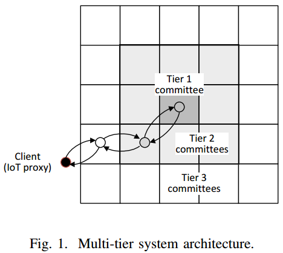

# Trade-offs in large blockchain-based IoT system design(J.Misic&etal, 2021)

[相关论文链接](../Papers/9.%20Trade-offs%20in%20large%20blockchain-based%20IoT%20system%20design(J.Misic&etal,%202021).pdf)

## 文章创新点

为了减少排队延时和消除单节点故障，本文使用一个多接口、多层PBFT结构的物联网系统。本文研究发现排序节点的分布会影响从物联网接收数据块到将其链接到全局区块链上那一刻的最小总延时。最终结果表明：给定区域范围和排序节点数量，将排序节点分割为具有更多集群的较少层会降低区块链接时间。这类结果可用于确定区块链物联网系统的多层集群架构的规模。

## 系统架构

### 系统设置
1. 共识系统由多个簇层组成，在这些簇层中，位于给定层的簇中的节点与上下两层附近簇中的节点通信，而与同一层的其他簇不通信。记总共有 $j$ 层的系统中第 $i$层的簇为 $(i,j)$
   
2. 一个簇中的节点通过TCP连接利用广播媒体来实现完全互联；
3. 代理服务器作为客户机存在，预先准备交易的区块和提交到最近的最底层簇中的节点。收集交易并验证交易，之后打包成区块提交到最底层的节点，最顶层节点只对交易区块进行排序。
4. 排序节点接收到区块后，通过广播RTS消息给所有同一簇中的排序节点进行带宽预约，当收到足够数量CTS消息时表明预约成功。
5. 在进行带宽预约时，若出现RTS冲突后，排序节点就会进行一个回退过程。在等待一个随机时间后，再次尝试发送RTS消息。当节点接收到 $2f$ 条CTS消息时，就可以开始无争用的PBFT共识协议了。随后将达成共识的区块其最近的上层簇的节点，上层节点也将重复这个过程直到最顶层簇达成共识。随后这个区块就被链接到全局区块链上，并将结果传输到下层簇中，最终达到提交区块的物联网代理服务器。
6. 带宽预约协议在每个簇中独立使用，并不考虑其所在的层。因此，代理服务器提交请求到最底层簇中最近的节点，块负载在给定层的所有簇之间以及给定簇的所欲节点之间是共享的，任意节点出现拜占庭故障并不影响共识结构的操作。

### 多层PBFT架构建模

分层架构的分析模型由几个独立的子模型组成：簇边缘的单项传播延时、无争用的带宽预约服务和区块插入服务、CSMA/CA争用下的块插入服务、区块在到达队首之前的等待时间以及多簇的互联模型。

#### 建模分析

  1. 单项传输延时：假设簇是一个取值范围为 $0 \leq x ,y \leq L_{i,j}$ 的方形区域中，其中 $L_{i,j}$ 记作在 $(i,j)$ 层的簇的物理区域。节点将均分分布在这个区域中。记在第 $1 \leq i \leq j$ 层的单向传输延时为 $D_{i,j}$，那么所有层的单向传输延时为 $D = \sum_{i = 1}^j D_{i,j}$，那么所有层的往返时间限制在 $2D$。
  2. 无争用的记录插入时间：主要由使用RTS/CTS信令执行带宽预约的时间和执行预准备、准备和提交投票阶段的时间组成。最大单向延时的概率分布取决于边缘簇的单向传输延时$D_{i,j}$ 和第 $i$ 层簇中节点的数量为 $n_{i,j}$。
      * 使用RTS/CTS信令执行带宽预约的时间：本文中近似使用RTS/CTS信令执行带宽预约的时间的上界为在簇中的最大单项延时的三倍。在簇 $(i,j)$ 的平均最大单向延时可近似为： $\mathcal{D}_{i,j} = 0.95D_{i,j} = 0.5D_{i,j}e^{-0.26 D(n_{i,j}-1)}$，其中最大单向延时的变量的系数与节点数量有关。RTS/CTS信令完成以及其对应的超时可建模为均值为 $\overline{T_{cr,i,j}} = 3\mathcal{D}_{i,j}$ 并且变量系数为 $\mathcal{v}_{i,j} < 0.04$ 或更小的伽马概率分布。因此，完成RTS/CTS信令的最大时间的LTS为 $T_{cr,i,j}^*(s) = (1 + br_{i,j}s)^{-cr_{i,j}}$，其中 $br_{i,j} = \mathcal{v}_{i,j}\cdot 3\mathcal{D}_{i,j}, cr_{i,j} = \frac{1}{\mathcal{v}_{i,j}}$。
      * 无争用的最大记录插入时间：可近似为六个最大单向传输延时的和 $\overline{T_{it,i,j}} = 6\mathcal{D}_{i,j}$，该时间变量的平方系数记作 $\mathcal{V}_{i,j}$ （大小与节点数量有关）。该时间的概率分布可用参数为 $\beta_{i,j} = \mathcal{V}_{i,j}\cdot 6\mathcal{D}_{i,j}, \gamma_{i,j} = \frac{1}{\mathcal{V}_{i,j}}$ 的伽马分布近似。无争用的记录插入时间分布的LST为 $T_{it,i,j}^*(s) = (1 + s\beta_{i,j})^{-\gamma_{i,j}}$。
      * 请求争用的简化模型：给定层簇中的节点之间争用时回退的时隙 $\delta_{i,j}$ 是根据最大单向延时来设置的。所有簇中的报头和有效负载的数据率为 $R$ bps，因此单个回退周期为 $\Delta = R\cdot\delta$。记 $N_h$ 为所有簇中协议栈的所有头部所需位数；其中RTS/CTS消息和请求有效负载分别占 $rpl$ 位和 $rs$ 位。在时隙下请求传输时间的LST为 $T_{blk,i,j}^*(s) = e^{-s(N_h + rpl)/\Delta_{i,j}}$。
      * 总区块插入时间：节点将区块发送到下一层的簇中的节点并受到回复的往返时间建模。假设到达下一层簇的节点的时间是均值为 $D_{i,j}$ 的指数分布，其LTS为: 当 $i<j$ 时， $T_{D,i,j}^* (s) = \frac{1}{1 + s\cdot D_{i,j}/\delta_{i,j}}$；当 $i = j$ 时有 $T_{D,j,j}^* (s) = exp(0)$。每个簇中的回退时隙表示时，RTS-CTS与请求的长度分别为 $rts-{i,j} = cts_{i,j} = \frac{N_h + rs}{\Delta_{i,j}}, \ell_{i,j} = \frac{N_h + rpl}{\Delta_{i,j}}$。在簇 $(i,j)$ 中无争用的总插入时间和不成功的带宽预约时间的LST分别为 $Sr_{i,j}^*(s) = e^{-s(rts_{i,j} + cts_{i,j})}T_{it,i,j}^*(s)$ 以及 $Cr_{i,j}^*(s) = e^{-s(rts_{i,j} + cts_{i,j})}T_{cr,i,j}^*(s)$ 。
      * 给定簇 $(i,j)$ 中节点访问概率为 $\tau_{i,j}$，请求总到达率为 $\lambda_{i,j}$，节点数量为 $n_{i,j}$，节点因其他节点成功传输而停止回退计数的概率为 $Ps_{i,j} = (n_{i,j} - 1)\tau_{i,j}(1 - \tau_{i,j})^{n_{i,j} - 2}$，节点因RTS冲突而停止回退计数的概率为 $Pc_{i,j} = 1 - (1 - \tau_{i,j})^{n_{i,j}-1} - (n_{i,j} - 1)\tau_{i,j}(1 - \tau_{i,j})^{n_{i,j} - 2}$，目标节点出现 RTS冲突的概率为 $Pr_{i,j} = 1 - (1 - \tau_{i,j})^{n_{i,j}-1}$。在簇 $(i,j)$ 中回退计数之间的周期时长的LTS(在回退时隙下表示)为 $\beta_{i,j}^*(s) = \frac{(1-Pr_{i,j})e^{-s}}{1 - (Pc_{i,j}Cr_{i,j}^*(s) + Ps_{i,j}Sr_{i,j}^*(s))}$。
      * 回退窗口为 $W_k$，在每次尝试失败后都会加倍，直到达到回退限制: 当 $k \leq m$ 时 $W_k = 2^kW_0$；当 $k > m$ 时 $W_k = 2^mW_0$。因此，第 $k$ 次尝试的回退时间的LST为 $B_{k,i,j}^*(s) = \frac{1 - \beta_{i,j}^*(s)^{W_k}}{W_k(1 - \beta_{i,j}^*(s))}$。
      * 有争用时区块插入总时间的LST为 $T_{i,j}^*(s) = \frac{\sum_{k = 1}^m\prod_{\ell = 0}^{k-1} B_{k,i,l}^*(s)(Pr_{i,j}Cr_{i,j}^*(s))^{k-1})(1-Pr_{i,j})Sr_{i,j}^*(s)}{\sum_{k = 1}^m\prod_{\ell = 0}^{k-1} B_{k,i,l}^*(0)(Pr_{i,j}Cr_{i,j}^*(0))^{k-1})(1-Pr_{i,j})Sr_{i,j}^*(0)}$， 其均值为 $\overline{T_{i,j}} = -\frac{dT_{i,j}^*(0)}{ds}$。
      * 单个节点的负载为 $\rho_{i,j} = \frac{\lambda_{i,j}}{n_{i,j}}\overline{T_{i,j}}$。
      * 全局区块链接时间：簇中区块插入时间的LST为 $S_{i,j}^*(s) = \frac{s(1 - \rho_{i,j})T_{i,j}^*(s)}{s - (1 - T_{i,j}^*)\lambda_{i,j}/n_{i,j}}$，其均值为 $\overline{S_{i,j}} = \overline{T_{i,j}} + t\frac{\lambda_{i,j}T_{i,j}^{(2)}}{2n_{i,j}(1 - \rho_{i,j})}$。由此得到总区块链接时间的LST为 $T_{tot,j}^*(s) = (\prod_{i = 1}^j S_{i,j}^*(s)T_{Sc,i,j}^*(s)^2)T_{b\ell k,i,j}^*(s)^{j-1}$，总往返时间的均值为 $\overline{T_{tot,j}} = \sum_{i=1}^j\overline{T_{i,j}}\delta_{i,j} + \sum_{i = 1}^j\frac{\lambda_{i,j}T_{i,j}^{(2)}}{2n_{i,j}(1 - \rho_{i,j})\delta_{i,j}} + 2D + (j-1)\frac{N_h + rpl}{R}$。

## 性能估计

在给定节点总数之后，为了使得区块插入时间尽可能的小，我们要找到节点在不同簇层中的最优分布。
1. 假设覆盖区域是方形的，并且对应单向传输延时为 $D$;
2. 系统请求到达率为 $\lambda$ 均匀分布在最底层簇；
3. 给定层的所有簇都有相同的大小，通过对应的延时 $D_{i,j}$ 以及对应的回退周期 $\delta_{i,j}$ 表示；
   
由此可规范化为一个优化问题：
    $$\min \overline{T_{tot,j}} \\
    s.t. \sum_{i = 1}^j N_{i,j}n_{i,j} = C\\
    \sum_{i = 1}^{j}D_{i,j} = D.$$
 
随后，通过实验分析该架构的性能：
1. 以系统请求到达率作为参数，在改变节点数量时，最小平均链接时间的变化：
   * 在低负载下：平均链接时间与总节点数量几乎无关，由于三层架构比两层架构需要额外的块传输时间；
   * 在高负载下：随着节点数量的增加，两种架构下的最低平均链接时间递减，这是因为每个簇的链接时间降低，使得每个节点的排队负载也降低，但两条曲线接近说明层数并不太影响链接时间。
2. 底层簇中最有节点数是4，争用保持在最小；但在不同架构中的顶层簇有所不同，由于需要处理高系统负载，顶层簇中节点数量应该尽可能多；
3. 低负载时性能：
   * 随着节点数量的增加，非顶层簇数量在缓慢增加；
   * 顶层簇中节点数量为4可以支撑整个系统负载，在底层簇中每个节点的负载随着节点数量的增加在缓慢降低；
4. 高负载时性能：
   * 随着节点数量的增加，非顶层簇数量在缓慢增加（与低负载时差不多）；
   * 随着节点数量的增加，底层节点承担的负载在线性下降；顶层节点的负载是逐步递减；
5. 两种架构中的某些数据点出现了重叠，这是因为节点分布的优化能够将所有层中订购者的最大提供负载保持在大致相同的值。不同架构下，顶层簇中每个节点提供的的负载几乎相同，这是因为节点总数是相同的。
6. 随着负载的增加，两层体系结构提供更好的性能；

## 最终结论

1. 在低负载时，最小链接时间与节点数量几乎无关；高负载时，区块的最小链接时间会随着节点数量的增加而降低，但层级数量并不会有太大的影响；
2. 顶层簇覆盖尽可能小的区域以减少簇中的最大单向延时，从而减小簇中带宽预约和共识达成的时间；
3. 将每个簇中节点的数量保持在一个较小的范围可以减少争用，降低带宽预约和共识时间；
4. 底层簇中节点用于承担请求负载，从而减少请求的队列时间等；
5. 链接数据区块到全局链上的平均时间与系统架构的层数没有太大的关系，三层体系结构使用额外的层来减少集群覆盖，这减少了服务时间，但牺牲了额外的传输时间，结果抵消了减少覆盖带来的好处（不是层数越多就越好）。
6. 在系统中，但顶层簇覆盖更小的区域减少传输延时并且拥有最多节点来减少共识时间时，就能获得最好的性能。
   
## 问题提出与解决

1. 文章中关于层数的增加为什么不能提升系统的性能？
   * 当层数增加时，在总结点数量不变的情况下，每层簇中节点的数量可以保持比较低，从而降低带宽预约协议执行时争用发生的概率和最大单向传输的时延，同时也会降低执行PBFT共识的时间。但是多了一层就表示区块传输时延会增加，并且当区块比较大时，这个增加将是巨大的，远远会超过前面节省的时间，因此最后可能会使得区块链接到全局链上的时间增加，从而降低系统的性能。如果是这样的话，当系统只有一层时，节点数量的增加会提升带宽预约协议执行时争用发生的概率和最大单向传输的时延，同时也会提高执行PBFT共识的时间。因此，如果要采用这类架构，需要根据系统的负载情况和节点的总数量来选择设计相应的架构。
2. 为什么要求顶层簇覆盖范围小，但不要求节点数量少？
   * 这是因为覆盖范围小可以减少带宽预约协议执行时争用发生的概率和最大单向传输的时延，同时也会降低执行PBFT共识的时间，这将使得系统高负载下迅速处理请求，并且节点数量多可以降低每个节点的负载，从而降低数据区块的排队时间，提升系统的性能。
3. 如果层簇中节点数量不一致，若是其中某一个簇出现故障，是否会影响最终结果，若攻击者只是成功攻击了最顶层簇，是否能够掌控这个系统？
   * 若是攻击者攻击顶层簇，可以使得最终共识无法达成，从而使得区块无法被最终连接到全局链上。此时若最顶层簇只有一个节点，那么就会出现单点故障，使得整个系统无法正常运行。因此为了避免这类攻击，最顶层的簇中应该是节点数量最多并且覆盖范围最小的，并且共识委员会的成员最好不要是固定不变，可以设计成是动态变化的，并且最好是康女巫攻击的，这样可以最大程度上避免系统被攻破。