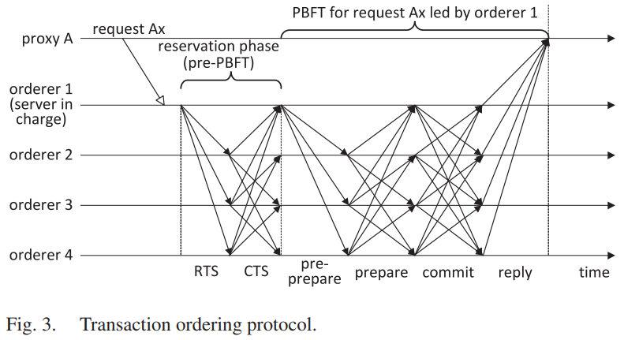

# 无线网络中的区块链

无线网络中资源有限的设备不能使用消耗物理资源的工作量证明作为系统共识机制。因此，如何在无线区块系统上尽可能节约资源的达成一致是无线区块链系统急需解决的问题。

## 无线网络中的区块链协议

在设计无线区块链协议时，主要从系统模型、协议架构，协议分析以及仿真试验这几个方面入手。我们将分别总结在区块链中这几个部分的特点。

### 系统模型

在设计无线网络区块链协议时，重点要考虑网络模型、干扰模型以及攻击者模型。

#### 网络模型

首先需要定义区块链系统中网络模型的构建，并且定义每个节点的基本设置参数。
* 系统是由 $n$ 个节点组成，节点集合记作 $V = { V_1, \cdots, V_n}$；
* 节点通过发送信号进行通信，每个节点 $V_i$ 都是半双工收发器；
* 记 $d(u,v)$ 是节点 $u$ 和 $v$ 的欧式距离，以及 $DR(v)$ 是以 $v$ 为中心，以 $R$ 为半径的圆盘, 记 $NR(v)$ 为在 $DR(v)$ 中包括节点 $v$ 在内的节点的集合。
* 假设每个节点都知道其他节点的身份、位置以及公钥；
* 假设每个节点都可以生成密钥对并且可以访问安全EUF-CMA 数字签名方案；
* 根据适用的场景决定节点节点能否自由的加入或者离开网络（许可网络、开放网络）。

在构建网络模型时，主要是考虑节点的连接方式、节点的通信方式、节点的组成等都需要重点考虑。最重要的是节点在协议中拥有的功能（这将在后面的协议架构中讨论）。
#### 干扰模型
采用信号发射的方式传递消息的无线网络也需要考虑信号发射过程中必然存在干扰，因此需要考虑无线网络中的信道干扰模型。
* 信道传输的干扰模型主要采用信号干扰噪声模型 $SINR = \frac{\mathcal{S}}{(\mathcal{I}+\mathcal{N})} \geq \beta$，其中 $\mathcal{S} = P\cdot d(u,v)^{-\alpha}$ 是节点 $v$ 从节点 $u$ 处接收信号功率，而 $P$ 是均匀信号发射功率；
* 在节点 $v$ 处的干扰为 $\mathcal{I} = \sum_{w\in W\setminus{u}} P\cdot d(w,v)^{-\alpha}$，其中 $W$ 是在当前轮中传输的节点的集合；
* 记环境噪声为 $\mathcal{N}$，路径损耗指数为 $\alpha\in(2,6]$，阈值 $\beta > 1$ 取决于硬件。为了捕获细粒度噪声，定义 $\mathcal{N} = \mathcal{ADV}(v)$ 是由环境和敌手生成的组合噪声。
* 信号干扰噪声模型的假设：
  * 每个节点都使用先沟通的噪声阈值 $\theta$ 并且任意两节点之间的距离的界为 $R_0 = (\frac{P}{\beta\theta})^{\frac{1}{\alpha}}$； 
  * 每个节点都可以执行物理载波监听。若节点 $v$至少有一个邻居 $u$ 广播消息，那么 $v$ 要么接收消息，要么感应到信道忙碌。
   $$ v=\left\{
    \begin{aligned}
    \text{ sense idle channel} &  & \text{if } \mathcal{I+N} < \theta, \\
    \text{ receive a message}  &  & \text{if }  \mathcal{I+N} > \theta \text{ and }  SINR \geq \beta,\\
     \text{ sense busy channel}  &  & \text{if }  \mathcal{I+N} > \theta \text{ and } SINR < \beta.
    \end{aligned}
  \right.$$  

#### 攻击者模型
对于无线网络中，部分节点可能会被攻击者控制作恶使得系统最终崩溃。因此在讨论区块链系统的故障容忍性时，需要预先定义节点可能的故障行为。通常节点会出现两种故障：节点崩溃故障和节点拜占庭故障。
* **节点崩溃故障：** 在节点崩溃之前的所有消息都是正确的，一旦节点崩溃将不在进行任何工作（不在发送或者接收任何消息）；
* **节点拜占庭故障：** 节点可能发送错误消息阻止系统共识的达成，或者阻止干扰其他节点的消息传输，或者创建假身份误导其他节点。

通常为了防止系统一开始被攻击者控制，会限制攻击者的能力：
* 攻击者最多可以控制少于全网 $50\%$ 的网络资源（算力或者节点）；
* 攻击者可以发起阻塞攻击，但是为了确保无线网络中诚实节点拥有通信机会，攻击者不能阻塞所有所有轮中的通信（至少要给诚实节点留下通信的轮）。

### 协议架构

在设计区块链协议时，主要考虑系统中节点的功能、共识机制、区块（交易）验证机制、检查点机制等。其中最为重要的的部分是节点功能以及区块链系统的共识机制。

#### 节点功能函数

无线网络区块链协议的最基本构成就是节点。节点都承担了交易生成、消息发送和接收、生成区块等基本功能。为了确保系统的正常运行，需要对节点的检点函数给出相应的定义。
* 节点生成普通消息 $m$ ：
* 节点生成交易消息 $m_T$ ：
* 节点生成区块消息 $m_B$ ：
* 节点打包交易生成区块：
* 节点添加区块到区块链：
* 交易的数据结构：
* 区块的数据结构：
* 节点的数据结构：
* 消息的数据结构：

#### 共识机制

##### 区块链的共识分类
区块链系统根据容忍的故障类型可以分为拜占庭容错共识算法和非拜占庭容错共识算法，根据区块的确定性程度可以分为非确定性共识算法和确定性共识算法，根据区块链的能耗可以分为资源证明（物理资源和虚拟资源）共识算法和消息传输共识算法。而根据共识节点数量则可以分为首领选择共识算法和委员会决议共识算法。下面我们根据共识节点的数量来讨论分析无线网络中区块链的共识算法。

* **基于首领选择的共识机制**
基于首领选择的共识算法的核心是首领选择，工作流程如下：
  * 一个任期的开始选出一个系统公认的首领；
  * 首领收集交易打包生成区块并广播出去；
  * 其他节点接收到区块后，验证其有效性并链接到局部链上，开始新一轮任期选出新的首领。

  首领选择的机制是区块链系统的核心，需要满足随机性、公认性以及公平性。主要的首领选择机制如下：
  * 随机机制选举首领：设置一个随机函数，上一轮区块的结果作为随机种子输入到随机函数中选出新一轮任期的首领；
  * 轮换机制选举首领：根据已知的节点ID，设置一个轮换函数，每个任期依次指定一个节点作为首领；
  * 竞争机制选举首领：节点通过竞争的方式成为首领，所有节点在一个任期中抢占信道的快慢、工作量证明计算的快慢以及资源的大小等方式选举出首领。

  选出的首领的正确性与合法性是可以由系统中其他节点验证的，如果不合法则系统将不会承认该节点为首领。一旦首领选出并确定后，其他诚实节点必须承认接收该节点生成的有效区块，并链接到本地局部链上。最终，系统的所有节点在区块链上达成全局一致。

* **基于委员会的共识机制**
  基于委员会的共识算法主的核心是委员会成员的选择以及共识达成的机制：
  * 选取委员会成员，并选出当前任期内的区块提案者；
  * 委员会成员通过通信对提出的区块达成一致，并将结果广播；
  * 根据最后的结果，系统中所有节点将接收到的区块链接到局部链上，并开始新一轮操作。 

  委员会分为静态委员会和动态委员会：
  * **静态委员会：** 在系统开始运行时就选定固定的委员会成员，并且将一直不发生变化；
  * **动态委员会：** 每一个委员会都只能工作固定时长，一旦任期结束就会进行部分或全部更换。

  静态委员会机制比较高效节省资源，但是中心化程度过高，并且容易受到腐蚀攻击；动态委员会机制会额外的资源和通信开销，但是安全性高，且成员更换有利于节点的安全性（不容易被腐蚀和攻击）。

##### 实例

在这几篇无线网络区块链共识协议中，[BLOWN协议](./Notes/1.md)采用的是竞争首领选择机制的共识算法，利用无线信道特性，选出节点作为首领。在确认首领之后，收集交易并打包成区块，发送给其他跟随者节点达成全局一致。而[wChain协议](Notes/6.md)则利用无线网络节点距离和最大独立集来构造一个多跳网络通信架构——Spanner，从而选出首领，并利用这个通信架构收集交易，最终首领将交易打包成区块，并将区块作为提案，通过消息通信所有节点最终对于提案达成一致。最后所有节点接受该区块，并链接到局部链上，达成全局一致。[SENATE协议](Notes/5.md)则采用的是委员会机制，通过双重选择的方式确定最终委员会的成员：首先通过随机抽签的方式选出候选人，其次再根据节点的分布特性利用K聚类算法选出最终委员会成员。之后委员会成员提出提案达成委员会共识后，将结果广播给所有节点，接收到结果的节点将结果添加到本地账本中。

### 协议分析
分析协议时主要从协议的性能和安全性方面入手。区块链的性能分析则是研究区块链协议的交易吞吐量和交易确认延时。区块链协议的安全性分析主要是讨论区块链协议的一致性、活性以及抗攻击性。针对无线区块链系统通信协议的特点，根据协议的设计架构进行具体分析。

#### 安全性
区块链协议的安全性主要是从考虑区块链中数据的一致性、系统的活性以及系统的抗攻击性。
* **一致性：** 所有诚实节点维护相同的区块链（当一个节点返回一个请求的结果时，其他诚实节点也会返回相同的结果）；
* **活性：** 所有的诚实节点最终都会确认一个区块。

对于区块链系统要确保一致性需要保证系统中绝大部分节点都是诚实的，确保最终共识结果掌控在诚实节点中，使得系统的区块链是全局一致的。此外，也要确保区块链系统能够一直运行下去。系统中只要生成了区块，在有限时间内该区块要么达成共识被链接到各诚实节点的区块链上，要么不被所有诚实节点接受，最终被拒绝。针对不同的网络模型，一致性的实现将会有差异：
* 无许可网络：对于开放网络，节点无法获知系统中节点的总数量。因此节点无法通过绝大多数节点的认可来确认区块的有效性。每个节点都维护自己的局部账本，但这类区块链系统中所有的节点都遵循统一的区块链确认原则（最长链原则或最大权重原则），进而确保区块链系统最终只维护一条统一的区块链。这类网络下的区块链系统的共识算法通常是改了才行共识。由于每个节点都是维护自己的局部账本，因此区块链容易出现分叉，极易受到双花攻击；
* 许可网络：针对于许可网络，节点可以知道系统中节点的总数量。因此，系统中的节点可以对于区块达成统一的共识，使得系统中所有节点都是维护一个区块链。这类网络设计的区块链共识算法通常是确定性共识算法，区块链不会出现分叉，可以很好的避免双花攻击。

#### 性能

在研究区块链的安全性满足后，会分析区块链协议的性能。在完美通信的假设下，对于链式结构的区块链协议的性能主要考虑该区块链的交易吞吐量和交易确认时间。
* **交易吞吐量：** 是指单位时间内交易完成的数量；
* **交易确认时间：** 是指交易从打包进入区块到第一次被确认的时间。

在讨论区块链的性能时，通常会研究这两个性能指标随着网络大小的变化。但是，无线网络具有特殊性，并且无线网络中的节点具有动态性。因此在无线网络中，需要从以下几个角度分析协议的安全性：
* 分析区块链协议的通信复杂度，尤其是共识协议的通信复杂度；
* 分析协议的时间复杂度。达成共识所需的时间与共识机制关系紧密。必要时可以观察网络中某些参数变化引起共识时间的变化来讨论协议的性能；
* 网络节点的密度也是影响区块链性能的重要因素，通过观察节点密度的变化对于吞吐量和交易确认时间的影响可以分析协议的性能；
* 此外，在无线网络中还面临着阻塞攻击的威胁。阻塞攻击通常会延长达成共识的时间，进而影响吞吐量。因此可以通过探究阻塞攻击时参数的变化对共识时间和吞吐量的影响来分析区块链协议的性能；
* 女巫攻击是区块链协议面临的常见攻击。攻击者通过伪造身份获得更多的权益，进而使得自己获益。因此在讨论无许可的区块链协议时需要讨论女巫攻击节点数量的变化对于共识达成时间以及吞吐量的影响。

### 总结

无线网络区块链协议的核心组成为：**共识协议和网络通信协议**。在分析区块链协议的安全性时，主要是考虑区块链共识协议的安全性。这个主要是根据共识协议安全性的定义——一致性和活性两个方面展开讨论。在分析区块链协议的性能时，主要从网络协议下区块链性能指标的主要影响因素——网络大小、攻击节点的数量、网络密度等来分析区块链协议的性能。由于无线网络中通信协议的特殊性会影响区块链的性能，我们需要从实际网络通信协议出发来针对具体的区块链协议进行分析讨论。此外，仿真阻塞攻击参数变化和女巫攻击节点数量的变化对于协议性能的影响可以分析协议的女巫攻击和阻塞攻击的抗性。对于双花攻击，就需要考虑共识协议是否是概率性共识。如果是，则需要分析其双花攻击成功的概率以及收益，一次来分析区块链协议的双花攻击抗性等。

## 物联网中的区块链协议
物联网中的区块链协议需要克服资源有限的问题，因此设计区块链协议的核心——共识协议时，消耗物理资源进行证明的。在设计物联网区块链协议时需要了解物联网的特性。物联网分为三层：感知层、网络层以及应用层。
* **感知层：** 将传感器嵌入需要关注和采集的地点、物体以及系统中，实时获取关键的特征值和信息流；
* **网络层：** 建设无处不在的网络连接，支持IPv6，以便给各种移动终端提供巨量的IP地址；
* **应用层：** 提供相应的应用。比如，智能家居、智能医疗、智能城市等

将区块链技术应用在物联网中，从而为物联网提供更好的服务。由于感知层的设备都是资源有限的，因此为了使得物联网中所有设备达成共识，使用基于PoW的共识算法显然是不合理的，因此需要设计新的区块链协议以适用于物联网环境。下面将分别介绍三种适用于物联网的区块链协议。

### Concordia共识协议

这个协议是一个拜占庭容错共识协议，且并不需要使用昂贵的首领驱动通信，适用于分片的区块链网络。该协议的模型假设如下：
* 所有节点通过广播信道以及点对点信道连接；
* 在参与节点数量为 $2f+1$ 时，正确同步节点数量至少为 $f +1$;
* 攻击者的算力时有界的（不超过总算力的 50%）；
* 绝大多数节点都能正确的运行 Concordia节点。

**协议框架**
通过分片管理层将区块链网络中的所有节点进行分片处理、随机生成以及生成表示区块记录每个任期的随机数、有效标识以及分片成员等。根据生成的随机数选出下一个生成交易区块的分片，并执行Concordia协议对新生成的区块达成共识，并链接到区块链上。本文设计的Concordia协议只在每个分片中执行。执行过程如下：共识协议的开始就会为所有节点生成密钥。每一轮协议的执行过程如下：
* 根据上一个区块的集体签名，各个节点会独立地生成一个轮随机数；
* 基于这个轮随机数，可以选举出一个块提出者；
* 块提出者将会生成一个区块，并扩散到全网的所有其他节点；
* 节点接收到区块，就会验证区块并且通过添加签名到该有效块以及扩散新收到的有效签名来执行终止过程；
* 当节点接收到足够的签名（超过阈值），将会恢复群组签名作为区块终止的证明；
* 节点会将最终区块扩散到全网：
  * 要么收集到足够的签名并且恢复最终签名；
  * 要么接收到拥有群组签名的终止区块。
* 当节点接收或生成群组签名时，将会计算新一轮的随机数，开始下一轮。

**安全性分析**
由于Cooncordia是一个许可分片内执行的共识协议，因此分析协议的安全性主要是从几个方面入手：共识安全性、共识活性、门限签名方案的随机创建性以及Gossip协议的安全性。

**性能评估**
* 在评价协议性能时主要从延时和吞吐量两个指标来评估。通过观察随着区块大小、网络大小变化时两个指标的变化来分析协议的性能；
* 此外，还需要研究协议的故障容忍度。通过比较相同环境下类似协议与本协议的性能指标随着网络变化的变化趋势来分析协议的容错性能。

### Microchain共识协议

同样是针对资源有限的物联网环境，设计出一种适用于有限资源的区块链共识机制。本文也是通过委员会机制达成共识。接下来从模型假设、协议框架以及协议分析几个方面来梳理本文。

**模型假设**
* 假设微链是在**同步网络**中运行，所有进程的操作都是在拥有**延时有限界**的轮中协同完成；
* 最终微链能够满足**一致性**（即所有用户应就相同的交易达成一致，并且最终的交易应在分布式账本中处于相同的位置）和**活性**（确保诚实节点提交的交易在足够长的时间后在最终确定的块中得到确认）；
* 时间被分成不相交的**离散时隙**；
* 微链网络通过最终委员会在一个任期内处理交易（随机委员会形成协议确保了委员会选择过程不可被预测）；
* 假设一个任期时间内最终智能确认生成一个区块；
* 混合PoC-VCF共识机制确保了区块的提出和最终确认；
* 每个区块只能打包**固定数量**的拥有**相同数据大小**的交易；
* 每个参与者必须要注册成功后才能加入到需要许可的区块链网络。

**协议框架**
微链协议主要有五部分组成：
  * **初始化：** 包含由管理者指定的一组验证器的特殊王朝（任期）作为初始化区块链初始委员会；
  * **委员会选择：** 若当前王朝是初始委员会，则跳过这步。否则在王朝开始时利用基于VRF的密码学抽签方案根据信用比重随机选择验证节点集作为最终委员会成员；
  * **提出区块：** 区块提出机制使用PoC随机选择区块提出者，随后生成新区块链接到区块链上；
  * **链终止：** 在每一时代结束时，与当前时代相同高度的链头都会成为检查点（或者说，当前时代提出的区块都能竞争加入链），链终止利用基于投票(VCF)的算法来确定最终加入到主链上的区块；
  * **委员会改变：** 结束一个王朝之后，当前委员会成员会对新王朝的随机字符串达成一致，新的委员成员要重新选择。

根据区块协议的框架可知，协议的几个重点算法为：基于VRF的委员会选举算法、基于PoC的区块提案算法以及基于投票的链终止算法。
**基于VRF的随机抽签算法**

在每个朝代之初就通过上一个区块的随机种子作为输入，采用[VRF算法](https://blog.csdn.net/jingzi123456789/article/details/107023051)选择出当前时代的最终委员会成员，并将委员会成员记录在当前区块中。一个时代存活的时间开始于委员会选择，结束于朝代变化。每一个最终委员会的成员将只存活于一个时代，时代结束之后将会重新选择。

**基于PoC的区块提案算法**

根据当前时代信用分布的概率，当前时代的验证者若解决了一个谜题，则该验证者可以生成提出一个区块，并广播带有签名的区块到委员会中。每个委员会的成员会接受所有有效的区块（满足确认要求的区块）。在一个任期结束时，拥有任期大小作为区块链高度的区块将会作为一个检查点（用于解决分叉和最终定下区块链的历史）。最终通过基于投票的方式决定最终链接到区块链主链上的区块。

**基于投票的链终止算法**

根据区块链系统的运行情况，验证节点发现区块已经是检查点时，就广播发送投票消息给委员会中的成员。而委员会的成员接收到提出的投票后，将检查投票的正确性与有效性。若验证得出投票没有违反链分叉解决规则，则计数加1.直到计数值超过一定阈值之后，大多数已提交链接被接受，最终解决了分叉，确认了区块链的历史。

**性能分析**

微链的性能主要也是从网络延时和吞吐量两个方面来进行衡量。
1. 网络延时：随着委员会节点的增加，提交交易的延时也线性增加，块提出延时随着委员会通信复杂度而增加，链终止延时随着节点数量的增加而迅速增加；
2. 微链以增加延时为代价提高吞吐量（本文中的吞吐量定义与其他文中的定义不一样），吞吐量主要受到网络和系统性能的限制；
3. 最终委员会的容错率为 $\frac{1}{3}$，链终止需要在检查点上达成一致。微链可以抵抗双花攻击、交易抵赖攻击、远距离攻击、自私攻击等。

### 基于无线通信协议的自适应PBFT共识协议

#### 系统假设

1. 假设系统是由任意多个物联网域组成，这些物联网域可以分布在很大的地理区域；
2. 每个物联网域包含至少一个可以从物联网设备收集（直接或通过一个或多个物联网网关）数据（组成记录或者交易）的物联网代理；
3. 相较于普通的物联网节点，代理和网关拥有更多算力和 通信能力；
4. 网关可以在正向模式下工作也可以在反向模式下工作；
5. 系统包括多个排序服务器，用于在他们的内存池中实现记录/交易的全序；
6. 所有排序节点都通过TCP连接形成一个全连接图，每个代理使用TCP连接来连接多个排序节点，代理的主排序服务器应该是具有最小往返时间的那个排序节点，其他拥有更大往返时间的排序服务器用作备用，以防主排序服务器出现故障，或用于排序服务器之间负载均衡；
7. 每个排序服务器都保留有一个内存池，用于存放还未打包到区块中的记录/交易，这些记录/交易都有有全序的。
8. 当排序服务器中故障服务器不超过 $\frac{1}{3}$ 时，插入服务依然可以在内存池中实现记录/交易全局排序。

#### 协议架构

根据物联网的特性，在PBFT协议的基础上加上了一个带宽预约协议，从而随交易/请求进行排序，随后利用PBFT协议进行提交确认过程，达成区块共识。根据物联网的架构，底层为感应设备，主要用于底层数据的收集。中间层为代理层，用于连接底层传感设备和上层的服务器设备作为数据传输的中继。而上层的服务器设备则用于对数据达成共识，并存储数据提供服务等。对于顶层的服务器节点对于交易数据达成共识采用的PBFT协议，但在这个协议之上增加了一个[广播带宽预约协议](./Papers/8.%20Adapting%20PBFT%20for%20Use%20With%20Blockchain-Enabled%20IoT%20Systems(J.Misic&etal,%20Dec.2021).pdf)来选出交易提出的节点，具体协议如下：

**广播带宽预约协议**
   
该协议是基于建立在排序节点上的广播通信媒体，所有的的排序节点都要持续侦听所有其他节点对应的TCP套接字。利用CSMA/CA协议的原理使得其他排序节点不会出现冲突访问。带宽预约的自适应CSMA/CA协议

* 排序节点确认上一轮的插入记录操作已经完成后，排序节点通过所有TCP连接发送一个RTS消息给其他排序节点；
* 当节点接收到RTS消息之后将回复CTS消息（包括源节点ID，请求ID，但节点并不是立刻回复CTS消息）。
* 节点发送CTS消息表明在请求节点处理完当前请求之前，不会代表其他客户进行带宽预约。随后就开始当前请求的PBFT协议的运行(Pre-Prepare, Prepare, Commit)。

在执行完带宽预约协议确定了请求提出者之后，开始执行PBFT算法对交易/记录进行排序后插入交易池中，融合算法执行过程的示意图如下所示：

**融合带宽预约的PBFT算法**

  * 代理收集一批记录/交易后将提交给直接相连的排序节点（最好是往返时间最短的节点），当在规定时间未收到排序节点的回复时，新的排序节点会被重新选择作为接收请求的服务器（假设节点 $i$ 被选中为该批次的排序服务器）；
  * 排序节点 $i$ 会将接收到的请求按照先入先出的原则加入到其请求队列中，当请求到达队首，排序节点将会根据内存池中交易的序列号为记录/交易分配暂定序列号；
  * 排序节点 $i$ 检查是否已经收到最近请求的 $2f+1$ 条Commmit消息，若收到，则开始为即将进行的原子广播预约带宽，发送RTS消息给所有排序节点，否则就需要等到上一个记录/交易请求插入完成；
  * 当请求排序节点收到 $2f$ 条关于预约带宽请求的回复消息CTS时，节点就可以开始原子广播Pre-Prepare消息给所有排序节点；
  * 要求Pre-Prepare消息在最大允许单向传输时间内到达其他排序节点，节点若接收Pre-Prepare消息将检查提出的记录/交易的序列号是否与内存池中已有的序列号冲突。若不冲突，广播Prepare消息给其他所有排序节点；
  * 每个排序节点需要接收到 $2f$ 条Prepare消息，之后就广播Commit消息到所有其他排序节点；
  * 当每个节点接收到 $2f+1$ 条Commit消息后将对请求的内容和序列号达成一致，并将记录/交易插入到内存池中，释放带宽预约，并开始新一轮请求的带宽预约。
  
1. 区块形成
  * 当内存池中的记录/交易数量超过阈值时，或者区块生成的时间周期超时了，排序节点（可以是上一个完成记录/交易插入过程的节点，或者利用公式$ID = K\mod N$，其中$K$是区块链长，$N$是排序节点的总数量，计算得到的节点ID，主节点的选择可以根据实际情况进行选择）将会初始化创建一个新的区块。对于区块达成共识的算法是融合带宽预约协议的PBFT算法，执行的过程与记录/交易插入过程基本一致.随后，所有排序节点都会连接新区块，并分不到所有代理上。
  
2. 在执行融合带宽预约的PBFT协议时，当出现RTS冲突节点将声明RTS冲突，并在请求重传之前执行新的回退。在执行回退的过程中，排序节点将持续侦听TCP套接字，并在传输PBDT内容时暂停回退。

#### 协议分析

在物联网中，节点可能更多的是通过无线网络进行消息和数据的传输。因此网络延时是影响物联网的协议性能的主要因素。通过物联网协议的设置，本文对于网络延时进行详细的[建模分析](./Notes/8.md)。通过分别分析节点传输时延的概率分布可以进一步得出带宽预约协议的时延和PBFT协议时的时延的概率分布情况。在系统总负载不断增加的过程中，排序节点数量、地理集群覆盖率对多接口PBFT系统性能的影响。建模分析了排序系统的通信、估计了请求回复时间和系统容量。
1. 给出不同排序节点的单向延时概率分布和最大单向延时，并且用红色虚线表示伽马近似，结果表明计算出的分布与伽马近似值的拟合非常好；
2. 平均最大单向延时与平均记录插入时间都随排序节点的数量以及单向延时跨度的增加而增加；
3. 在小集群中，请求服务时间短，容量限制比较高，当中小集群中排序节点数量增加时，每个排序节点的负载会降低，这回减少队列时间，降低媒体访问概率；
4. 平均请求服务时间随着排序节点数量的增加而线性增长，这是由于RTS冲突平频率增加，接近容量限制，并且由于请求成功，回退计数终止；
5. 平均系统响应时间包括等待时间和请求服务时间。平均系统响应时间主要受到记录插入时间的影响，因此会随着排序节点数量的增加而增加。随着总负载的增加，接入访问时间增加是因为队列时间会随着负载增加而增加，等待时间主要受排序节点队列请求数量的影响。因此平均响应时间会受到总负载量和排序节点数量的影响。

**最终结论**

1. 由于排序节点之间存在争用，因此增加排序节点数量会提升容量和请求服务时间；
2. 当排序节点书来给你增加时，会减轻单个节点的负载，降低请求队列时间；
3. 排序节点的数量提升会增加RTS冲突的概率和接入访问交互的时间；
4. 增加排序节点的数量会提升每个节点的有效负载，但是也会提升最大单向延时和媒体之间争用的机会；
5. 提升节点之间的物理距离将会提升用于插入记录到分布式账本中所需要的时间；
6. 本文大部分都是分析节点通过无线网络通信时的网络时延，通过分析时延、系统负载量与排序节点数量、地理集群覆盖率的大小之间的关系来分析系统的性能。
   

### 总结

当针对无线网络通信的物联网时，为了设计适用于物联网的区块链协议，需要重点考虑节点之间的通信协议（用于通信和传输数据）和最终共识协议。

#### 物联网通信协议

[物联网通信协议](https://zhuanlan.zhihu.com/p/145123681)分层总结如下：

**物理层、数据链路层协议**

* 远距离蜂窝通信：2G/3G/4G移动通信系统协议、NB-IoT、5G；
* 远距离非蜂窝通信：WiFi、ZigBee、LoRa；
* 近距离通信：RFID、NFC、Bluetooth；
* 有线通信：USB、串口通信协议、以太网、MBus

**网络层、传输协议**

* IPv4;
* IPv6;
* TCP;
* 6LoWPAN;

**应用层协议**

* MQTT协议；
* CoAP协议；
* Rest/HTTP协议;
* DDS协议；
* AMQP协议；
* XMPP协议；

在物联网中，通常根据应用场景不同需要采用不同的通信协议。而通信协议的不同将会使得物联网的传输性能有差异，进一步的将会导致节点之间数据传输的时延有很大的差异。

#### 区块链共识协议

可以根据不同的网络通信协议，重新设计区块链的共识协议使得共识协议更加谁用于物联网的环境。区块链的共识协议主要分为两大类：
* 资源证明共识协议：
  * 物理资源证明：PoW等
  * 虚拟资源证明：PoS等
* 消息通信共识协议：基于委员会的共识达成协议。
