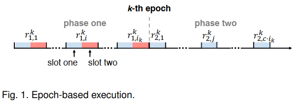
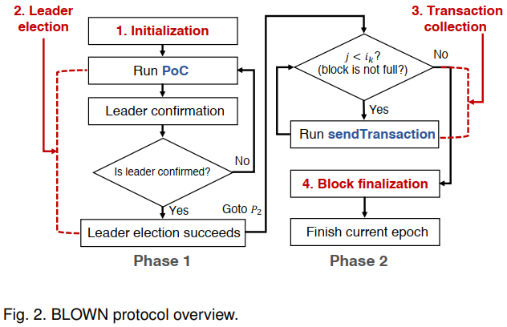
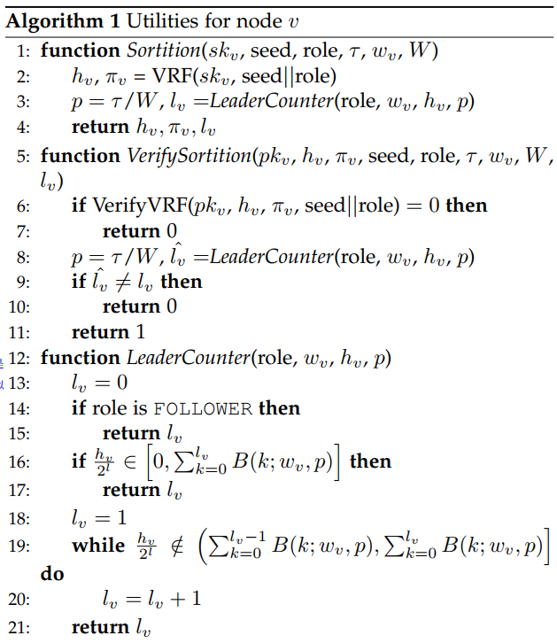
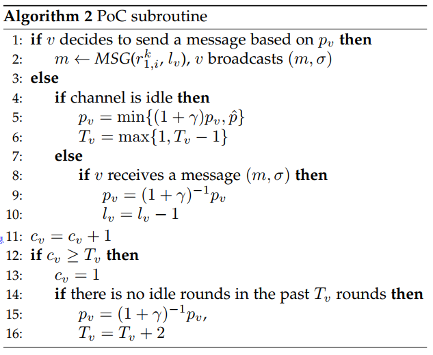
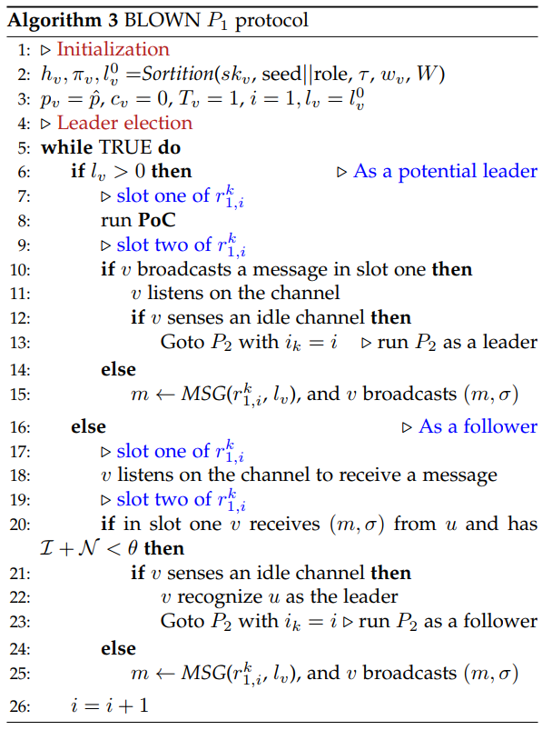

# BLOWN -- A Blockchain Protocol for Wireless Networks under Adversarial SINR(M.Xu&etal, 2021)

[相关论文链接](./../Papers/1.%20BLOWN_A%20Blockchain%20Protocol%20for%20Wireless%20Networks%20under%20Adversarial%20SINR(M.Xu&etal,%20Mar.2021).pdf)

## 文章创新点

本文利用无线网络通信的特点提出一种新的共识算法 PoC。同时提出针对对抗性SINR模型下的无线网络的BLOWN协议。用通用组合框架形式化了BLOWN协议，证明了该协议的安全性（持久性、活性以及对阻塞攻击、双花攻击、女巫攻击的抵抗性）。

## 模型假设

1. 网络模型:
   系统是由 $n$ 个节点组成，节点集合记作 $V = { V_1, ..., V_n}$, 并且每个节点 $V_i$ 是半双工收发器，记 $d(u,v)$ 是节点 $u$ 和 $v$ 的欧式距离，以及 $DR(v)$ 是以 $v$ 为中心，以 $R$ 为半径的圆盘, 记 $NR(v)$ 为在 $DR(v)$ 中包括节点 $v$ 在内的节点的集合。每个节点都知道其他节点的身份、位置以及公钥；每个节点都可以生成密钥对并且可以访问安全EUF-CMA 数字签名方案。
2. 干扰模型：
   本文中信道传输的干扰模型主要采用信号干扰噪声模型 $SINR = \frac{\mathcal{S}}{(\mathcal{I}+\mathcal{N})} \geq \beta$，其中 $\mathcal{S} = P\cdot d(u,v)^{-\alpha}$ 是节点 $v$ 从节点 $u$ 处接收信号功率，而 $P$ 是均匀信号发射功率；在节点 $v$ 处的干扰为 $\mathcal{I} = \sum_{w\in W\setminus{u}} P\cdot d(w,v)^{-\alpha}$，其中 $W$ 是在当前轮中传输的节点的集合。记环境噪声为 $\mathcal{N}$，路径损耗指数为 $\alpha\in(2,6]$，阈值 $\beta >1$ 取决于硬件。为了捕获细粒度噪声，定义 $\mathcal{N} = \mathcal{ADV}(v)$ 是由环境和敌手生成的组合噪声。信号干扰噪声模型的假设：a. 每个节点都使用先沟通的噪声阈值 $\theta$ 并且任意两节点之间的距离的界为 $R_0 = (\frac{P}{\beta\theta})^{\frac{1}{\alpha}}$； b. 每个节点都可以执行物理载波监测。若节点 $v$至少有一个邻居 $u$ 广播消息，那么 $v$ 要么接收消息，要么感应到信道忙碌。
   $$ v=\left\{
    \begin{aligned}
    \text{ sense idle channel} &  & \text{if } \mathcal{I+N} < \theta, \\
    \text{ receive a message}  &  & \text{if }  \mathcal{I+N} > \theta \text{ and }  SINR \geq \beta,\\
     \text{ sense busy channel}  &  & \text{if }  \mathcal{I+N} > \theta \text{ and } SINR < \beta.
    \end{aligned}
  \right.$$  
3. 基于任期的操作：本文中的协议是在一系列不相交连续的时间段内运行。每个时间段称作一个**任期**，每个任期由两阶段组成，每个阶段都包含了多个轮。如下图所示：在 $e_k$ 中 $r_{1,i}^k, r_{2,j}^k$ 分别表示第一阶段的第 $i$ 轮和第二阶段的第 $j$ 轮。其中 $r_{1,i}^k$ 是由两个时隙组成，而 $r_{2,j}^k$ 是由一个时隙组成。记 $i_k， j_k$ 分别为两个阶段的轮数。 
   
4. 敌手假设: 敌手可以自由的加入或离开网络、创建身份或在任意时刻制造噪声干扰诚实节点。敌手最多可以控制少于全网 $50\%$ 的网络资源（算力或者节点）。对手可以发起阻塞攻击。为了为诚实节点留下通信的机会，攻击者是在长度为 $T$ 轮的任何时间间隔中 $(1 - \epsilon, T)$ 有界，表明超级攻击者在 $T$ 轮中最多可以非均匀阻塞 $(1-\epsilon)T$ 轮，其中 $T\in N, 0 < \epsilon \leq 1$。每个节点维护的变量 $T_v$ 是节点 $v$ 对 $T$ 的估计。

## 算法设计

本文中将时间分成了不同的时隙来执行BLOWN协议，BLOWN协议是一个两段式协议，第一阶段主要初始化（抽签）和Leader选择；第二阶段则是交易收集和区块最终化。整个BLOWN协议的流程图如下所示：

该协议包含了5个算法：节点功能函数设置（Utilities）, 节点首领选择算法（PoC subroutine）, 协议初始化和首领选择（BLOWN $P_1$ protocol）, 首领从跟随者处收集交易（sendTransaction）以及首领将收集到的交易打包成区块并最终确认区块（BLOWN $P_2$ protocol）。

1. Utilities 部分定义了节点的功能函数，主要包括：基于VRF的抽签函数、抽签验证函数、首领计数函数、消息创建函数、交易生成函数以及区块生成函数。
   * 基于VRF的抽签算法以私钥 $sk_v$、随机种子和角色作为输入，最终输出一个哈希 $h_v$ 和其对应的证明 $\pi_v$。记 $W$ 是网络中所有用户累积的币数；而 $w_v$ 是节点 $v$ 的存款；记 $\ell_v \in \{0, 1, \cdots, w_v\}$ 是节点 $v$ 的首领计数；并且 $p = \frac{\tau}{W}$ 是每枚币用于增加计数值的概率，其中 $\tau$ 决定了硬度。而 $\ell_v = k$ 的概率服从二项分布 $B(k;w_v,p) = C_{w_v}^kp^k(1-p)^{w_v - k}$，其中 $\sum_{k= 0}^{w_v}B(k;w_v,p) = 1$。为了确定 $\ell_v$，首领计数函数将 $[0,1]$ 分割为连续的分段
      $I(\ell_v)=\left\{
      \begin{aligned}
      [0, \sum_{k= 0}^{\ell_v}B(k;w_v,p)] &  & \text{if } \ell_v = 0, \\
      (\sum_{k= 0}^{\ell_v - 1}B(k;w_v,p), \sum_{k= 0}^{\ell_v}B(k;w_v,p)) &  & \text{if }\ell_v \in \{1, \cdots, w_v\}.
      \end{aligned}
      \right.$ 
   若节点 $v$ 是跟随者，则 $I(\ell_v)=0$；否则，若范式哈希 $\frac{h_v}{2^{\ell}}$ 在区间 $I(\ell_v)$ 中，则 $\ell_v$ 作为首领计数值被返回。抽签验证函数主要是利用VRF验证函数和重新计算首领计数函数来检查抽签函数输出 $h_v, \pi_v, \ell_v$ 的有效性。
   * MSG()为第一阶段中的首领选举创建基本消息 $m$；MSGT() 生成一条包含交易的消息 $m_T$，主要用于第二阶段交易收集时；MSGB() 生成包含区块的消息 $m_B$，主要包括首领节点生成的区块、以及链头、首领计数的当前值、以及用于验证有效性的字符串等。
   * 节点函数功能统一如下：
      
      

2. 对于BLOWN协议的第一阶段主要是完成首领的选举。对于选举首领主要采用PoC共识算法(Proof of Channel)，该算法利用信道的特性，挑选出最早占用信道的节点，并将该节点作为leader。随后根据首领的选举算法，BLOWN协议的第一阶段通过初始化系统后，开始选举首领，算法如下：
   
   
   * 在初始化过程中，首先执行一个抽签算法输出 $h_v, \pi_v, \ell_v^0$，其中 $\ell_v^0$ 表示最初的首领计数。当 $\ell_v = 0$ 时表示该节点是跟随者；当 $\ell_v > 0$ 时表示该节点有可能成为首领。记 $\hat{p} \in(0，1)$ 是最大传输概率.设置好初始参数的值 $p_v = \hat{p}, c_v = 0, T_v = 1, i = 1, \ell_v = \ell_v^0$，其中 $c_v = 1$ 是记录节点执行PoC协议的轮信息的计数变量，而 $T_v$ 是节点估计的攻击者占用信道的时间窗口，$i$ 是第一阶段中执行轮数的计数，$\ell_v$ 是初始值为 $\ell_v^0$ 的首领计数变量的初始值；
   * 根据检测信道的情况，当节点 $v$ 是可能的想要竞争首领时$\ell_v > 0$，要么以概率 $p_v$ 广播消息 $(m,\sigma)$，其中 $\sigma$ 是消息 $m$ 的签名；要么以概率 $1 - p_v$ 监测信道。根据信道情况，自适应调节传输概率系数为 $1 + \gamma$，其中 $\gamma = O(1/(\log T + \log\log N))$。当信道为空闲时，提升传输概率，降低攻击者的时间窗口；当信道忙碌时，降低传输概率和首领计数。一次成功的广播会使得所有接收节点的首领计数降1。当 $\ell_v = 0$ 时，节点就成为跟随者，在下一轮的时隙1中只能监测感知信道，不能发送消息抢占信道。
   * 在第一阶段中，每一轮的第一个时隙中，若节点 $\ell_v > 0$ 则节点 $v$ 执行PoC算法；否则就监听信道并接收消息。在每一轮的第二个时隙中：若节点在第一个时隙中作为潜在首领广播消息，并且在第二个时隙中监测到空闲信道，则成为首领进入第二阶段；否则在第二个时隙中广播消息。只有当跟随者认为在第一个时隙中只有一个节点是收发器，并且感知到在第二个时隙中信道为空，则认定该节点是首领。
3. 在挑选出Leader之后，开始收集系统中的交易，节点发送交易的算法如下：
   
   * 这一算法主要是跟随者执行，将交易以一定概率发送到首领节点，这个概率也是自适应的。
4. BLOWN协议的第二阶段主要实现交易收集和区块最终化。在前面 $c\cdot i_k-1$ 个时隙中主要是收集交易，确保首领能够收集到足够完整的交易，最后第 $c\cdot i_k$ 个时隙则是将这些交易打包成区块，并将区块发送到其他跟随者，然后链接到各自的局部链上。最后算法如下：
   

## 理论分析

本文利用通用组合框架将BLOWN形式化随后从持久性和活性方面证明了该协议的安全性。

1. 状态机应该有的几个状态为：开始、首领、提交、终止。
   **开始状态**：系统需要满足 1）$|\{v|v\in V,\ell_v >0| > 1$；2）z在上一个任期中接受了 $B_v^{k-1}$ 的诚实节点已经完成了初始化；
   **首领状态**：系统满足1）系统只有一个节点的 $\ell_v >0$;2) $j = 0$; 3)节点 $v$ 的交易栈大小 $|txp_v| = 0$；
   **提交状态**：系统满足1）系统只有一个节点的 $\ell_v >0$;2) $0<j <c\cdot i_k$; 
   **终止状态**：系统满足两个条件：1）每个诚实节点 $v$ 都接收到了有效 $m_B$ 并且接受了区块 $B_u^k$；2）诚实节点在第 $(c+1)\cdot i_k$ 轮并没有收到区块。
2. 定义安全性的两个性质。
   **Persistence：** 若诚实节点 $v$ 宣布一个交易 $tx_i^j$ 是 $t-stable$, 其他诚实节点要么报告相同结果要么报告错误消息；
   **Liveness：** 若诚实节点生成一个交易 $tx_i^j$ 并且进入第二阶段，那么BLOWN协议可以最终将有很高的概率将该交易添加到区块链上。
3. 以上两个性质可以用链增长性质、共同前缀性质和链质量性质来进行更加具体的描述。
   **链增长性质：** 记 $C_1, C_2$ 分别为两个诚实节点在两个不同的时期 $e_1, e_2$ 的开始提出的链，且有 $e_1 < e_2$ 并且 $e_1$ 至少比 $e_2$ 早 $k$ 个时期。因此满足 $len(C_1) - len(C_2) \geq \tau \cdot k$，其中 $\tau\in(0,1]$ 是速度系数且 $k\in \mathbb{N}$。
   **共同前缀性质：** 记 $C_1, C_2$ 分别为两个诚实节点在两个不同的时期 $e_1, e_2$ 的开始提出的链有 $e_1 < e_2$，则满足 $C_2^{\lceil k} \preceq C_1$，其中 $k\in \mathbb{N}，C_1^{\lceil k}$ 记作从 $C_1$ 中移除最后 $k$ 个区块的链，且 $\preceq$ 是前缀序。
   **链质量性质：** 考虑诚实节点在一个时期的开始进行的链中的任意长度 $\ell$ 个连续区块。那么来自攻击者的区块占比最多为 $1-\mu$，其中 $\mu\in(0,1]$ 是链质量系数。 
随后通过通用组合框架分析证明BLOWN协议满足这三个性质来证明这个协议是安全的。（**由于对于通用组合架构的证明不太了解，因此在这里就不添加该文的详细分析过程了**）

通过分析

## 仿真结果

通过仿真实验发现每个任期协议执行的轮数、网络的大小和网络密度都是影响协议性能的关键：

1. 随着轮数的增加，第一阶段的交易聚集概率递减，最后保持在5左右；进入第二阶段以后将递增，并最后趋近于10；吞吐量在第一阶段为零，第二阶段递增并最后保持在5000~6000之间。该协议的第一阶段主要时首领选举阶段，因此交易聚集概率不会高，也不会存在吞吐量的变化；
2. 当网络增大时，任期变长，这是因为首领选举的时间更长了，吞吐量会随着网络的变大而降低，这是因为网络的争用变大了；节点高斯分布与均匀分布相比，任期时间更长，吞吐量更低，这是因为节点密集聚集会导致更大的争用；
3. 网络密度增加吞吐量降低，但是任期时间也在缓慢增加，这是因为节点争用大，导致性能降低；
4. 随着阻塞攻击概率增加，吞吐量不会有太大变化，任期长度会降低；
5. 女巫攻击不会对任期长度有太大的影响，但是吞吐量会随着女巫攻击节点数量的增加而线性降低。

## 最终结论

1. 提出了基于PoC共识的BLOWN协议，并且证明了这个协议的安全性；
2. 通过仿真实验，采用吞吐量和任期长度最为衡量度量，仿真了网络大小、网络密度、阻塞攻击和女巫攻击对吞吐量和任期长度的影响，表明了该协议是安全的。

## 问题讨论
1. 本文中Leader选择过程为什么采用二项式分布？论文中phase two 中的c如何定？ $P_1$ 的轮数与 $P_2$ 的轮数有什么关联？这样设置是否合理？
   * 对于本文中的首领选举过程主要是通过轮盘赌的方式。对于单个节点而言，$\ell$ 的取值与节点的存款有关，每个币被选中的概率为 $p$，那么选中币的数量可能的范围为 $0, 1, \cdots, w_v$，那么对于事件 $\{\ell = k\}, 0 \leq k \leq w_v$ 的概率分布应该是符合二项分布的。对于协议阶段一中的轮数应该与节点传输概率、节点首领计数、攻击者时间窗口的大小有关，而阶段二中的轮数应该只与交易数量、节点数量、节点传输概率以及攻击者窗口大小有关。两个阶段的轮数应该没有直接关联，因此第二阶段设置的轮数大小可能是作者设置了一个足够大能够收集到全部完整交易的轮数，这个常数 $c$ 的大小可能也是作者根据仿真实验情况进行设置的。这样的设置应该是不合理的，因为如果系统中交易数量少，系统也需要执行足够的轮数，会浪费资源。其次，这个应该有一个上界，也许可以根据交易到达速率、节点传输概率等计算得到。
2. 论文中并没有仿真双花攻击对于吞吐量和任期长度的影响。
   * 由于这个协议是单首领的机制，所有交易最终都会发送到首领，如果出现双花交易，首领将会发现并拒绝承认后面一个交易的有效性，从而避免了双花交易的出现。这是因为所有的交易接收、排序、打包成块是一个耦合的过程，并不会出现部分节点维护不同区块链的情形。因此本文作者并不考虑双花攻击对于性能的影响。但是针对这种情形，容易出现单点故障，一旦首领节点出现故障，这一任期将无法生成区块或者生成错误的区块，这将对于系统造成损失。但是恶意首领作恶也只能在一个任期中，并不会影响后面的任期。 
3. 本文并没有提出相应的激励机制，如何确保网络节点愿意持续工作是一个需要考虑的问题。
   * 本文中所有节点工作都没有说明奖励的问题，这将使得理智的节点不愿意成为首领，为了激励节点的积极性，可以奖励成为首领的节点，这样使得节点更愿意抢占信道，提升信道抢占的随机性，从而使得系统更加安全。
4. 本文并没有讨论每个任期的首领船舰区块的大小设置，并且每个任期收集的交易数量都不同，所有的交易都要生成区块，还是每次只有部分交易打包进区块，剩下的交易就释放？
   * 一般而言，区块链中区块的大小在一开始就是固定的，因此能够打包的交易数量也是有限的。当交易数量很多时，本文作者只是将所有交易都打包进区块，这是非常不合理的。因此可以设计处一个合适的交易收集轮数，使得交易收集的数量不会超过区块规定的大小，从而避免因交易过多造成有些有效交易无法被打包进区块最后被记录在区块链上。剩下的未提交的交易可以等到下一轮再进行提交。这里可能涉及到一个交易排序的问题（可以根据交易发生的事件戳排序），还有，有可能在最大轮数之前，首领就收集到最大交易数量，此时需要通知跟随者停止收集，并进去区块生成阶段。
   * 此外，该协议其实并不能预防女巫攻击，因为女巫攻击会极大的影响吞吐量，因此为了系统更好的安全性，应该提出一些手段降低女巫攻击成功的概率。比如节点身份验证、押金惩罚机制、节点身份证明机制等。
