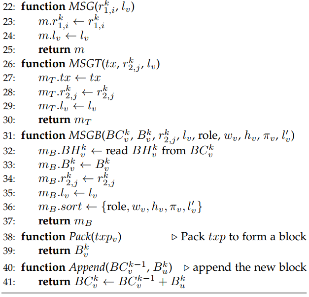
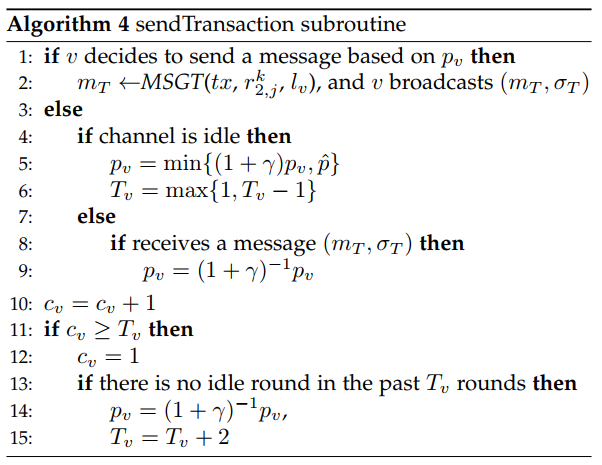
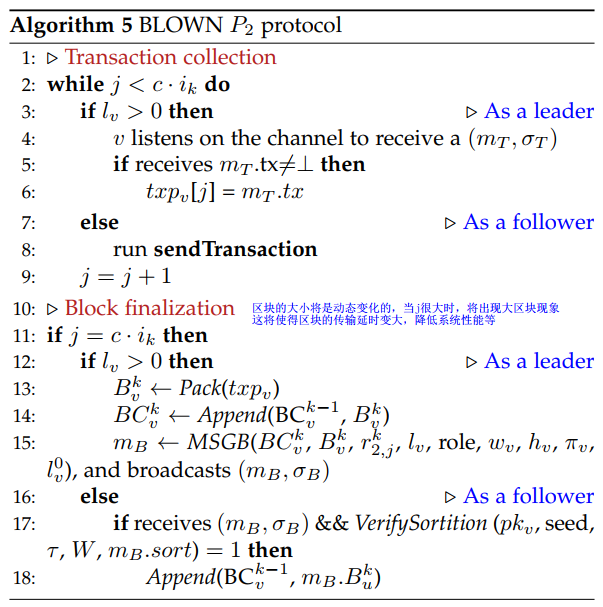

# BLOWN -- A Blockchain Protocol for Wireless Networks under Adversarial SINR(M.Xu&etal, 2021)

主要从文章创新点、模型假设、理论分析、仿真结果以及最终结论几个部分来介绍本文。

## 文章创新点

本文利用无线网络通信的特点提出一种新的共识算法 PoC。同时提出针对对抗性SINR模型下的无线网络的BLOWN协议。用通用组合框架形式化了BLOWN协议，证明了该协议的安全性（持久性、活性以及对阻塞攻击、双花攻击、女巫攻击的抵抗性）。

## 模型假设

1. Network Model:
 $V = { V_1, ..., v_N}, V_i$ is a half-duplex transceiver, $d(u,v)$ is  the Euclidean distance between node $u$ and $v$; $DR(v)$ is  the disk centered at $v$ with a radius $R$, and $NR(v)$ denote the set of nodes within $DR(v)$ including $v$. Each node knows the identities, locations and public keys of all other nodes. each node can generate key pairs and has access to a secure EUF-CMA digital signature scheme.

2. Interference Model: SINR = S/(I+N)>=β, the assumptions for SINR model: a. each node uses a common noise threshold θ; b. each node can perform physical carrier sensing.
   
3. Adversary Assumptions: Adversaries can freely join or leave the network, create identities, or make noises to interfere with any honest node at any time.

## 算法设计

本文中将时间分成了不同的时隙来执行BLOWN协议，BLOWN协议是一个两段式协议，第一阶段主要初始化（抽签）和Leader选择；第二阶段则是交易收集和区块最终化：

整个BLOWN协议的流程图如下所示：

该协议包含了5个算法：Utilities, PoC subroutine, BLOWN $P_1$ protocol, sendTransaction以及BLOWN $P_2$ protocol.

1. Utilities 主要事定义了节点的功能函数，算法如下：
   
   

2. PoC共识算法(Proof of Channel)主要用于挑选出最早占用信道的节点，并将该节点作为leader,算法如下：

3. BLOWN协议的初始化和首领选择主要在第一阶段实现，代码如下：
   

4. 在挑选出Leader之后，开始收集系统中的交易，节点发送交易的算法如下：
   

5. BLOWN协议的第二阶段主要实现交易收集和区块最终化，算法如下：
   

## 理论分析

本文利用通用组合框架将BLOWN形式化随后从持久性和活性方面证明了该协议的安全性。

### Persistence and liveness.
1. Persistence states that if an honest node v proclaims a transaction $tx_i^j$ as $t-stable$, other honest nodes, if queried, either report the same result or report error messages. 
2. Liveness property states that if an honest node generates the transaction $tx_i^j$ and contends to broadcast it in phase two, the BLOWN protocol can add it to the blockchain within finite epochs w.h.p.

## 仿真结果

通过仿真实验发现每个任期协议执行的轮数、网络的大小和网络密度都是影响协议性能的关键：

1. 随着轮数的增加，第一阶段的交易聚集概率递减，最后保持在5左右；进入第二阶段以后，事递增，并最后趋近于10；吞吐量在第一阶段为零，第二阶段递增并最后保持在5000~6000之间。
2. 随着网络大小的增加,不同的节点分布模型对吞吐量和任期中轮数将有所不同；
3. 网络密度越大，任期长度会降低，吞吐量变化不太大；
4. 随着阻塞攻击概率增加，吞吐量不会有太大变化，任期长度会降低；
5. 女巫攻击不会对任期长度有太大的影响，但是吞吐量会随着女巫攻击节点数量的增加而线性降低。

## 最终结论

1. 提出了基于PoC共识的BLOWN协议，并且证明了这个协议的安全性；
2. 通过仿真实验，采用吞吐量和任期长度最为衡量度量，仿真了网络大小、网络密度、阻塞攻击和女巫攻击对吞吐量和任期长度的影响，表明了该协议是安全的。

## 问题讨论
1. 本文中Leader选择过程为什么采用二项式分布（主要是通过轮盘赌的方式选择首领）？论文中phase two 中的c如何定？ $P_1$ 的轮数与 $P_2$ 的轮数有什么关联？这样设置是否合理？（论文中并没有详细说明，但是应该与网络拓扑和交易数量有一定的关系，可以从这儿入手，计算得到一个界）
2. 论文中并没有仿真双花攻击对于吞吐量和任期长度的影响。
3. 针对这样的通信模式，双花攻击成功的概率如何？
4. 本文并没有提出相应的激励机制，如何确保网络节点愿意持续工作是一个需要考虑的问题。
