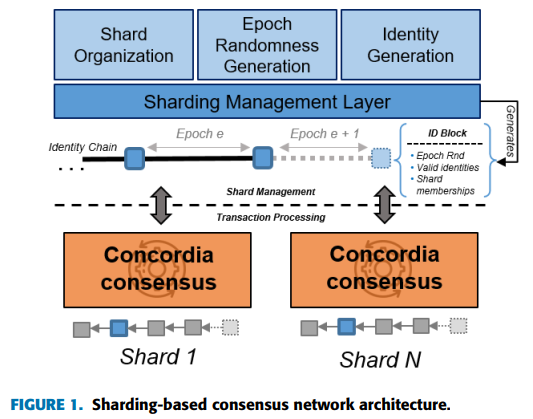
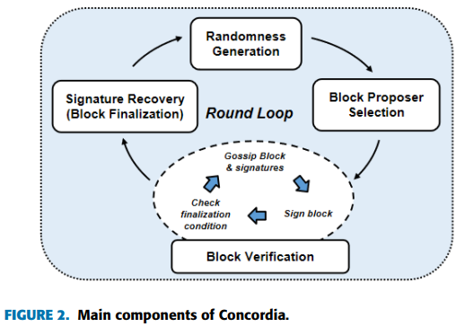
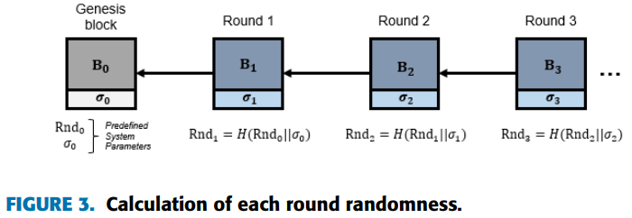
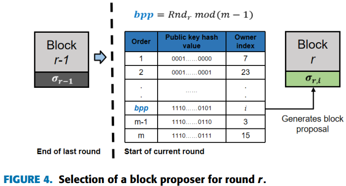
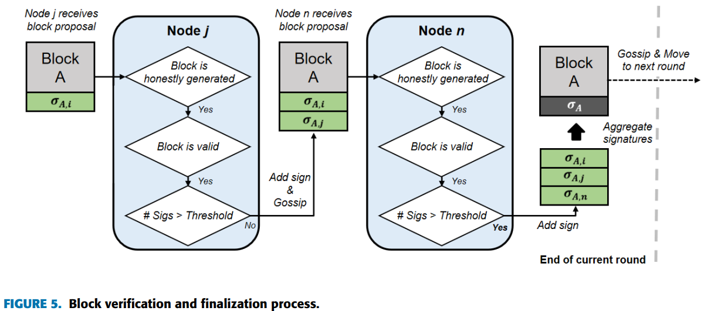

# Concordia -- A Streamlined Consensus Protocol for Blockchain Networks(C.Santiago&etal, 2021)

主要从文章创新点、系统模型、理论分析、仿真结果以及最终结论几个部分来介绍本文。

## 文章创新点

本文针对分片区块链网络提出了一个新的拜占庭容错共识协议。这个协议每次都选择单个块提议者，并且使用门限签名作为投票机制来确认和验证提出的区块的有效性。这个共识协议的容错性为$\frac{1}{2}$，并且具有较好的性能。

## 系统模型

### 模型假设

1. All nodes are Connected by broadcast channel and point-to-point channel;
2. more than $f+1$ nodes are correct and synchronous among $2f +1$ participants;
3. adversary is computationally bounded( no more than 50%);
4. majority participants are correctly runs Concordia.

### 协议框架

Concordia用于许可环境，管理层将网络分成同步的委员会，形成并行的分片。在区块链系统中，设置分片管理层对区块链网络分片进行管理；同时设置了标识块，主要用于记录参与者的标识和共识分片，一个标识区块的生成表示上一个block proposer任期的结束和下一个block proposer任期的开始。

Concordia 是由基于门限签名的分布式随机生成方案(VRF)、块提议人选择方案、加速块验证过程（Gossip通信协议）和群组签名恢复方案组成。

一轮共识协议的循环如下：

协议中每个轮块提议者的选择通过VRF算法抽签决定。通过上一轮的群组签名和上一轮的随数性计算得到本轮的随机数，随后利用得到的随机数选出本轮的块提案者，过程如下：

最终，通过收集足够的签名对区块进行验证和最终确定，过程如下：

## 理论分析

通过分析该共识协议的安全性和活性，最终得出结论该协议是安全的。

1. Safety: all correct nodes commit on the same identical block for a particular consensus round.
2. Liveness: all correct nodes eventually commit a block and generate the round randomness for the following round.
3. 由于攻击者控制的节点不会过半，因此一个攻击者不可能长期控制区块的生成过程($Pe(X \geq n) \leq (\frac{1}{2})^n > 10^\lambda) , (\lambda \leq -6)$时， $n \geq 20$).
4. 失败轮的概率受限于攻击者的比例和Gossip 故障概率。

## 仿真结果

本文主要通过共识延迟和吞吐量两个度量来分析该协议的性能。分析结论如下：
1. 共识延时随着块大小的增加而增加，主要时由于块增加，在有限带宽下传输块的时间要增加，从而造成共识延时的增加；
2. 共识延时会随着网络规模的增加儿童增加，主要是网络参与者增加后，确认区块的签名数量将增加，这意味着验证者需要验证更多的部分签名数量，以及最终签名收集过程的门限也将更高，从而导致更高的延时；
3. 随着网络规模变大，Concordia的延时相较于其他拜占庭容错协议增加更缓慢，因此其扩展性更优。
4. 通过仿真发现，用于验证部分签名份额的延时要高于签名恢复算法的延时。
5. 随着区块大小的增加，吞吐量也在增加。

## 最终结论

1. 通过合理设置区块的大小，可以实现合理的共识延时；
2. 通过在受到签名时逐步验证签名来减少验证部分签名份额花费的时间；
3. 在同步网络假设，下本文算法的容错率高达50%。
4. 本文算法实现了高吞吐量和低延时。

## 问题讨论

1. 本文中区块大小和网络规模是影响协议性能的主要因素，主要是影响网络延时，吞吐量的计算却受到交易数量和延时的共同影响，论文中并没有详细讨论他们之间的逻辑关系；
2. 部分签名验证延时非常高，甚至高于最终签名恢复算法执行的延时，如何降低这方面的延时将是该协议非常重要的问题；
3. 当出现分片委员会甚至最终委员会出现故障时，对于协议共识的达成有何影响，是否能够提前或者事后检测？
4. 静态的委员会容易受到攻击，是否可以用动态委员会的方法来提升委员会的安全性，委员会重组对于共识延时的影响会有多大？
5. 