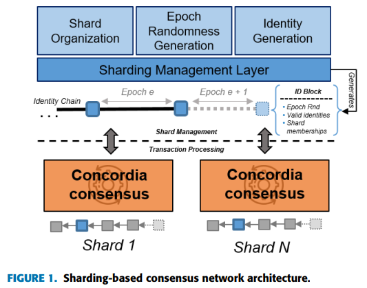
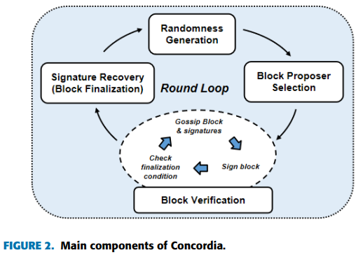
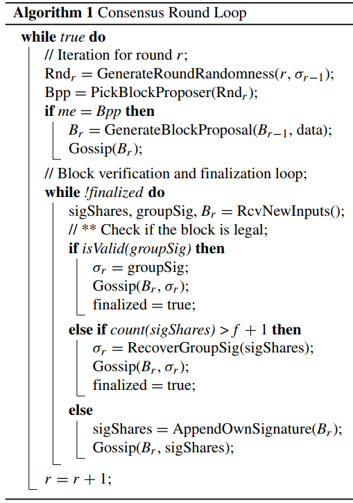
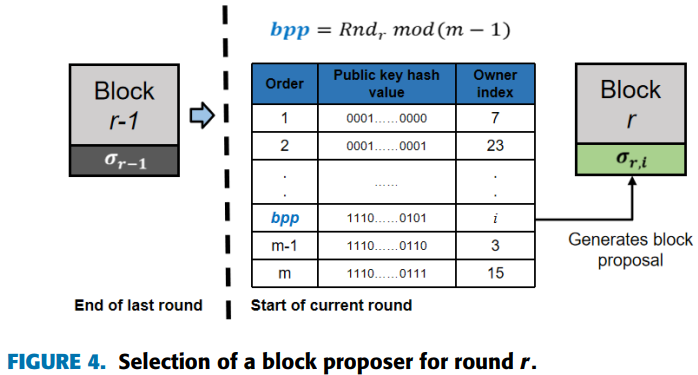

# Concordia -- A Streamlined Consensus Protocol for Blockchain Networks(C.Santiago&etal, 2021)

[相关论文链接](../Papers/2.%20Concordia_A%20Streamlined%20Consensus%20Protocol%20for%20Blockchain%20Networks(C.Santiago&etal,%20Jan.2021).pdf)

## 文章创新点

本文提出的Concordia是在许可环境下对于新区块达成共识的协议。本文为了实现这个目标，设计了一个加速选举机制，这个机制采用了使用Gossip网络通信协议的聚合签名机制以及随机区块提出者选举算法。这个协议每次都选择单个块提议者，并且使用门限签名作为投票机制来确认和验证提出的区块的有效性。这个共识协议的容错性为$\frac{1}{2}$，并且具有较好的性能。

## 系统模型

Concordia是在许可环境下对于新区块达成共识的协议。本文为了达成全网共识，设计了一个加速选举机制，这个机制采用了群组签名机制、Gossip网络协议以及随机区块提出者选举算法。

### 模型假设

1. 所有节点通过广播信道以及点对点信道连接；
2. 在参与节点数量为 $2f+1$ 时，正确同步节点数量至少为 $f +1$;
3. 攻击者的算力时有界的（不超过总算力的 50%）；
4. 绝大多数节点都能正确的运行 Concordia节点。

### 协议框架

1. Concordia是在许可环境下对于新区块达成共识的协议。所有节点在加入网络之前都有需要提交一个抗女巫攻击的证明，从而才能成为系统参与者。随后管理层将网络分成多个同步的委员会，形成并行的分片。在区块链系统中，设置分片管理层对区块链网络分片进行管理；同时设置了标识块，主要用于记录参与者的标识和共识分片，一个标识区块的生成表示上一个block proposer任期的结束和下一个block proposer任期的开始。

    

2. 在每一份分片中，所有的参与者共同执行Concordia共识协议。该协议是由基于前一轮生成的门限签名的分布式随机生成方案(VRF)、块提议人选举方案、加速块验证过程（嵌在Gossip通信协议中）和群组签名恢复方案组成。如下图所示：

    
    共识协议的开始就会为所有节点生成密钥。每一轮协议的执行过程如下：
    * 根据上一个区块的集体签名，节点会生成一个轮随机数；
    * 基于这个轮随机数，可以选举出一个块提出者；
    * 块提出者将会生成一个区块，并扩散到全网的所有其他节点；
    * 节点接收到区块，就会验证区块并且通过添加签名到该有效块以及扩散新收到的有效签名来执行终止过程；
    * 当节点接收到足够的签名（超过阈值），将会恢复群组签名作为区块终止的证明；
    * 节点将会扩散最终区块到全网，若 1)收集到足够多签名和恢复最终签名；或2）接收到拥有最终签名的终止区块；
    * 当节点接收或生成群组签名，将会计算新一轮的随机数，开始下一轮。
    一轮共识协议的循环如下：

        

3. 协议中每个轮块提议者的选择通过VRF算法抽签决定。通过上一轮的群组签名和上一轮的随数性计算得到本轮的随机数（$Rnd_{r+1} = H(Rnd_r || \sigma_r)$，其中 $\sigma_r$ 是上一轮对应的群组签名），随后利用得到的随机数选出本轮的块提案者（$Bpp_r = Rnd_r\mod (m-1)$），过程如下：

    
    
    一个区块可表示为一个元组 $(r,p,\sigma_{r,i},Bpp_r,root, d)$，其中 $r$ 是轮数，$p$ 是上一个区块的哈希指针，$\sigma_{r,i}$ 是本轮部分签名，$Bpp_r$ 是本文区块的提出者，$root$ 是交易的默克尔根，最后 $d$ 是交易数据。
4. 最终，通过收集足够的签名对区块进行验证和最终确定。验证区块的有效性主要是验证前一个区块的指针 $p$，默克尔根 $root$ 以及数据 $d$ 和部分签名 $\sigma_{r,i}$。这个验证过程将一直进行下去，直到区块收集到足够的有效支撑。当节点收集到 $f+1$ 个签名时，保证这个区块时证实的。签名也将被恢复成唯一的群组签名。由此区块被最终确认，并且被所有节点接受。具体过程如下图所示：

    
    一个有效区块被终止需要满足以下条件：
    * 区块的提出者正确地提出一个有效区块；
    * 大多是诚实地节点会接收到该区块并签字。
    只有当超时或者区块提出者提出以一个无效地区块，验证者才会在一个空块上签字。

## 理论分析

通过分析该共识协议的安全性和活性，最终得出结论该协议是安全的。

**安全性:** 所有正确节点将会在一个特殊的共识轮对相同唯一的区块达成共识。
**活性:** 所有的正确节点最终会确认区块并生成下一轮的随机数。
1. 共识安全性：为了确保安全性，协议需要 $f+1$ 个节点地法定数量来满足门限签名地要求。
   * 唯一性：门限签名方案允许任意 $f+1$ 个部分签名可以创建出一个唯一地群组签名；
   * 可验证性：任何人都可以使用唯一地公钥来验证群组签名地有效性。
  
本文中的共识协议并不依赖区块的提出者的正确性来确保协议的安全性。
**声明1** 即使恶意块提议者生成一个矛盾区块，所有正确的节点将会在相同的区块上达成一致；
**声明2** 若正确的节点 $i$ 确认区块B，那么所有其他正确的节点也将确认区块B。
2. 共识活性：为了确保同步节点的两个子集始终至少有一个参与过协议，则在任何时间都要有至少 $f+1$ 个节点保持同步。
   **声明3** 假设 $C$ 是参与某一轮的共识的正确同步节点的子集的大小，那么若 $C\geq f+1$ ，则可以确保活性。
   **声明4** 过节点 $i$ 是正确的，即使节点存在 $f$ 个故障节点，该节点也能终止并计算得到一个下一轮的随机种子。
   
3. 创建随机性
   本文的随机性协议是基于鲁棒门限签名方案。故障节点并不能阻止系统生成有效群组签名。由于攻击者控制的节点不会过半，因此一个攻击者不可能长期控制区块的生成过程。攻击者控制 $n$ 个连续的区块生成的概率的上界为： $P(X \geq n) = (\frac{1}{2})^n < 10^\lambda) , (\lambda = 6)$时， $n \geq 20$ 。
4. Gossip安全性：攻击者可以拒绝扩散任何消息。一个节点选择的邻居扩散节点中有 $x$ 个是故障节点的累计分布函数为为 $p = F(x) = \sum_{i = 0}^x \frac{C_K^i\cdot C_{M-K}^{N-i}}{C_M^N}$。

## 仿真结果

本文主要通过共识延迟和吞吐量两个度量来分析该协议的性能。分析结论如下：
1. 共识延时随着块大小的增加而增加，主要是由于块增加，在有限带宽下传输块的时间要增加，从而造成共识延时的增加；
2. 共识延时会随着网络规模的增加而增加，主要是网络参与者增加后，确认区块的签名数量将增加，这意味着验证者需要验证更多的部分签名数量，以及最终签名收集过程的门限也将更高，从而导致更高的延时；
3. 随着网络规模变大，Concordia的延时相较于其他拜占庭容错协议增加更缓慢，因此其扩展性更优。
4. 通过仿真发现，用于验证部分签名份额的延时要高于签名恢复算法的延时。
5. 随着区块大小的增加，吞吐量也在增加。

## 最终结论

1. 通过合理设置区块的大小，可以实现最优的共识延时；
2. 随着网络规模的增加，会使得区块终止的延时增加，但是同等条件下，相对于其他共识算法而言，增加比较缓慢，具有较好的扩展性；
3. 在同步网络假设，下本文算法的容错率高达50%。
4. 本文算法实现了高吞吐量和低延时。

## 问题讨论

1. 本文中影响协议性能的主要因素有哪些？
   * 区块大小和网络规模是影响协议性能的主要因素，主要是影响网络延时，吞吐量的计算却受到交易数量和延时的共同影响。当区块过大时，在网络中的传输时延会比较大，从而使得区块终止的延时比较高并且会提高吞吐量。
   * 网络规模的增加，会使得区块传输到所有节点的传输时延增加，从而增加了时延。同时，需要验证的部分签名的数量可能也会增加，这方面的时延增加也会导致总时延的增加。
2. 部分签名验证延时非常高，甚至高于最终签名恢复算法执行的延时，如何降低这方面的延时？
   * 不要在接收到许多签名后进行验证，而是在收到签名时逐步验证签名来减少验证部分签名份额花费的时间，或者直接在收集到足够数量的签名后，通过重组算法恢复群组签名来验证这些签名的有效性。此外，这方面的延时也会随着节点的增加而增加，因为节点增加，需要验证的签名数量将增加，由此会增加延时。
3. 当出现分片委员会出现故障时，对于协议共识的达成有何影响，是否能够提前或者事后检测？
   * 当单个分片执行共识算法出现故障时，无法达成共识，此时打包一个空区块，并将开始新一任期进行共识。因此分片委员会或者最终委员会出现故障时，致会打包一个空区块，并不会对协议的共识过程造成什么损失或影响。此外，在系统中，最多能够检查到节点崩溃故障，拜占庭故障一半没办法通过故障检测器检测。系统中的故障都没办法提前检测，只有在发生故障后一段时间后才有可能能够检查到。
4. 静态的委员会容易受到攻击，是否可以用动态委员会？
   * 静态委员会中的成员，时间长了容易被腐蚀，从而阻止共识的达成，降低系统的性能（高延时低吞吐量）。解决办法是定期更新委员会成员，但这个过程会造成一些额外的时间开销，甚至是资源的损耗（节点进出委员会需要时间，此外，成为委员会的委员需要给出证明，有些证明会消耗物理资源等）。但是动态委员会确实能够降低系统被攻击的概率，从而提高系统的安全性。
5. 这类系统会出现双花问题吗？如何解决？
   * 本文中将网络分成同步的几个分片，每个分片作为一个共识委员会，只负责分类账本中的某一部分，每个分片委员会使用Concordia协议达成共识。这类架构会可能会使得出现双花问题。具有相同输入的两笔交易分别被提交到不同的分片中，并且在各自的分片中达成共识，最终被存放在区块中。这时候那个交易在前，哪个交易在后，就需要管理层进行确定，并没有相应的规则说明这类问题的解决方法。可以根据每个部分分片区块提交的时间戳进行排序，时间戳早的就承认有效，否则就是无效区块将不会被链接到主链上；如果时间戳相同，则根据交易数量或交易发生时间等来确定交易的有效性。最终包含有效交易的区块被承认，无效交易所在的区块最终被换成空块，随后开始新一轮任期。