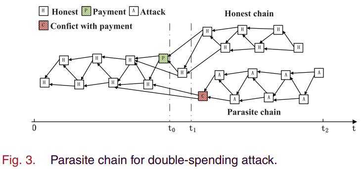
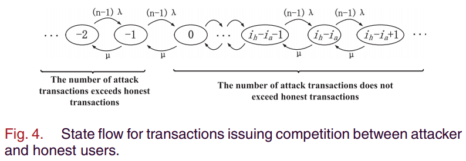
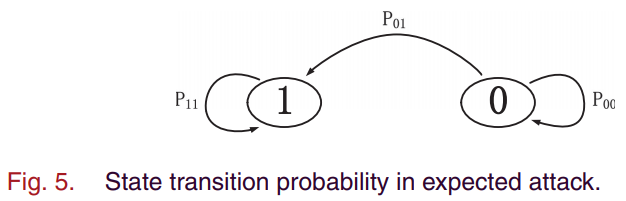

# How Does CSMA-CA Affect the Performance and Security in Wireless Blockchain Networks(B.Cao&etal, 2020)

主要从文章创新点、模型假设、理论分析、仿真结果以及最终结论几个部分来介绍本文。

## 文章创新点

本文分析了CSMA/CA 通信协议对无线区块链网络性能和安全的影响。本文旨在调查使用媒体接入控制机制的CSMD/CA机制是否适用于无限区块链网络。以Tangle为例，考虑由CSMA/CA引起的排队和传输延时对网络性能的影响。通过分析不考虑通信协议和考虑CSMA/CA通信协议时网络的交易确认延时、交易吞吐量以及交易丢失率分析网络性能。随后通过建模在CSMA/CA下双花攻击成功概率来分析安全性能。仿真结果表明，在无线网络中运行区块链，性能会受到CSMA/CA协议的限制。同时CSMA/CA协议也会影响双花攻击成功的概率。

## 系统模型

针对无线网络的特性和基于有向无环图的区块链，在无线网络中达成共识的过程如下：
   * 当用户收到新交易之后，需要根据本地信息选择两个非冲突的tips进行支持；
   * 用户使用私钥对交易进行签名。为了通过无线信道广播，交易进入缓存等待广播；
   * 用户争用无线信道遵循CSMA/CA，交易在缓存中排队遵循先入先出；
   * 用户将成功广播交易，否在在回退之后重新广播；
   * 其他用户接收到交易之后，就检查确认交易的合法性。若合法，则该交易成为新的tip并等待直接或者间接的支持进行确认。
   
   在交易排队等候广播的时候，网络中流量负载会造成严重的通信延时。当用户想竞争无线信道广播包到无限区块链网络时，使用CAMS/CA进行媒体访问；
   

   本文使用 Tangle 作为典型共识协议实例讨论基于有向无环图的区块链；
   
   

### 模型假设和定义

1. 系统假设
   * 本文只考虑在相同局域网下的用户；
   * 假设在Tangle中有 $n$ 个用户，在分析性能时，所有用户都是诚实的，在做安全性分析时假设有一个攻击者，其余 $n-1$ 个都是诚实的；
   * 用户之间可以直接通过无线信道通信；
   * 每个用户的交易到达都遵从泊松点过程。

2. 定义
   * 记 $\lambda, \mu$ 分别是诚实用户和攻击者的新交易到达速率，且每个交易的权重为 $1$；
   * 定义 $h$ 是通过CSMA/CA通信协议广播一个包的平均传输延时，而 $m$ 是一次广播的最大交易数量，记 $Q = km(k\in\mathbb{N})$ 是每个用户的最大缓存，$W(t)$ 是一个交易在 $t$ 时刻的权重。并且 $L(t)$ 表示在 $t$ 时刻的tips总数量。

3. 根据网络负载条件，将排队状态分为两种：轻网络负载和重网络负载
   * 轻网络负载 $\lambda = \lambda_\ell$ ，每个用户广播概率为 $\frac{1}{n}$ ，每个用户竞争的平均时间为 $C_n^1h = nh$，每个用户等待广播交易的累积交易数量为 $nh\lambda_\ell$，在 $t$ 时刻Tangle中tips的总量为 $L(t) = 2nh\lambda_\ell$。
   * 高网络负载 $\lambda = \lambda_h$，每个用户广播概率为 $\frac{1}{n}$，每个用户等待广播交易的累积交易数量为 $nh\lambda_h$，在 $t$ 时刻Tangle中tips的总量为 $L(t) = 2m$，其中 $m$ 是新交易的最大广播数。

## 理论分析

### 性能分析

通过分析只考虑网络共识协议两种网络负载情况下的交易延时、交易吞吐量以及交易丢失率，以及在考虑基于CAMA/CA机制下的交易延时、交易吞吐量以及交易丢失率来讨论无线区块链网络的性能。

为了确认交易，两个时期的延时是需要考虑的：通信网络的排队延时和共识过程中区块链权重累积的时间。
1. 交易确认延时 $T_d$

   * 定义交易确认延时为 $T_d =  T_q + T_a + T_\ell$，其中 $T_q$ 是排队延时，主要受CSMA/CA通信协议的影响。而 $T_a + T_\ell$ 是共识期间的累积权重的延时，其中 $T_a$ 是适应时间，而 $T_\ell$ 是线性增长时间。
2. 考虑共识协议的性能期望
   * 假设由无线通信网络造成的延时是可忽略的，即 $T_q = 0$。那么在适应子周期，新交易的累积权重为 $W_a(t) = 2\exp(0.352\frac{t}{h})$。
   * 假设新交易的显示时间为 $h$(也是通过CSMA/CA通信协议广播一个包的平均传输延时)，可以假设在无线区块链网络中的Tangle更新周期为 $h$。因此，共识过程是一个离散随机过程，不同的负载下，适应子周期长度为:
      $T_a=\left\{
      \begin{aligned}
      \lfloor 2.84\cdot\ln(2nh\lambda_\ell)\rfloor\cdot h &  & \text{LR}, \\
      \lfloor 2.84\cdot\ln(2nh\lambda_h)\rfloor\cdot h &  & \text{HR}.
      \end{aligned}
      \right.$
   * 当交易通过直接或间接的支持被tips完全覆盖，就结束了适应期，进入了线性增长子时期，这个交易的累积权重增长速率为 $\lambda$。假设在适应时期结束时交易的累积权重为 $w_a$，那么从 $w_a$ 时刻到确认权重 $w$ 时刻线性增长的子周期长度为:
      $T_\ell=\left\{
      \begin{aligned}
      \frac{w-w_a}{\lambda_\ell} &  & \text{LR}, \\
      \frac{w-w_a}{\lambda_h} &  & \text{HR}.
      \end{aligned}
      \right.$
   其中 $w_a$ 在不同负载下分别为：
      $w_a=\left\{
      \begin{aligned}
      2\exp(0.352\cdot\lfloor 2.84\cdot\ln(2nh\lambda_\ell)\rfloor) &  & \text{LR}, \\
      2\exp(0.352\cdot\lfloor 2.84\cdot\ln(2nh\lambda_h)\rfloor) &  & \text{HR}.
      \end{aligned}
      \right.$
   * 最终计算得到不考虑CSMA/CA排队和争用时，交易确认延时的期望为：
      $T_d=\left\{
      \begin{aligned}
      \lfloor 2.84\cdot\ln(2nh\lambda_\ell)\rfloor\cdot h + \frac{w-w_a}{\lambda_\ell} &  & \text{LR}, \\
      \lfloor 2.84\cdot\ln(2nh\lambda_h)\rfloor\cdot h + \frac{w-w_a}{\lambda_h} &  & \text{HR}.
      \end{aligned}
      \right.$
   * 交易吞吐量(Tansaction per second)在不同负载下的计算分别如下：
      $TPS=\left\{
      \begin{aligned}
      \frac{nh\lambda_\ell}{\lfloor 2.84\cdot\ln(2nh\lambda_\ell)\rfloor\cdot h + \frac{w-w_a}{\lambda_\ell}} &  & \text{LR}, \\
       \frac{nh\lambda_h}{\lfloor 2.84\cdot\ln(2nh\lambda_h)\rfloor\cdot h + \frac{w-w_a}{\lambda_h}} &  & \text{HR}.
      \end{aligned}
      \right.$
   * 交易损失率：定义 $P_{tl}$ 为新交易无法插入到区块链中的比率为交易损失率。由于本分析模型采用的是完美信道，因此所有的新交易都唔那个成功进入区块链系统，即没有交易损失 $P_{tl} = 0$。
3. 基于CSMA/CA的区块链性能 
   * 交易确认延时
      * 在CSMA/CA中每个包冲突概率为： $\rho = 1 - (1-\tau)^{n-1}$。在回退过程中，用户其中在一个随机时隙传输概率为 $\tau = \frac{2(1-2\rho)}{(1 - 2\rho)(CW_{\min} + 1) + \rho CW_{\min}(1-(2\rho)^s)}$。基于 $\tau$，考虑 $n$ 个用户的系统中，在一个时隙时间中至少有一个用户广播的概率为 $P_{tr} = 1 - (1-\tau)^n$，一个用户成功在一个时隙广播的概率为 $P_s = \frac{\tau(1-\tau)^{n-1}}{P_{tr}/n} = \frac{n\tau(1-\tau)^{n-1}}{1-(1-\tau)^n}$，在一个时隙中出现广播冲突的概率为 $P_c = 1 - P_s$。记 $T_s$ 为由于成功广播而被检测到信道忙碌的平均时间，$T_c$ 是由于冲突而监测到信道忙碌的平均时间，记 $\sigma$ 为一个空时隙的持续时间。这三个时间对应的概率分别为 $1 - P_{tr}, P_{tr}P_s, P_{tr}P_c$。由此可以计算得到新交易的显示时间（即，通过CSMA/CA通信协议广播一个包的平均传输延时） $h = (1-P_{tr})\sigma + P_trP_sT_s+ P_{tr}P_cT_c$，即 $h$ 为在CSMA/CA中的广播时间。记 $E[P]$ 为平均包负载大小，那么在四次握手时 $T_s, T_c$ 表示为：
      $\left\{
      \begin{aligned}
      & T_s= T_{RTS} + SIFS + \delta + T_{CTS} + SIFS + \delta + H + T_{E[P]} + SIFS + \delta + T_{ACK} + DIFS + \delta, \\
      & T_c = T_{RTS} + DIFS + \delta.
      \end{aligned}
      \right.$
      其中 $T_{RTS}, SIFS, \delta, T_{CTS}, H = PHY_{hdr} + MAC_{hdr}, T_{E[P]}, T_{ACK}， DIFS$ 分别是RTS的广播时间、短帧间时间、传输延时时间、CTS广播时间、报头广播时间、有效负载数据包广播时间、ACK广播时间以及长帧间时间。
      * 考虑CSMA/CA的公平性，每个用户有相同的概率访问无线信道广播。在LR中新交易的平均排队时间为 $\frac{nh}{2}$；在 HR中，新交易的平均排队时间为 $knh - \frac{m}{2\lambda_h}$，其中 $m, k, \frac{m}{2\lambda_h}$ 分别是缓存最大交易数量、由于FIFO而导致的广播竞争时间以及新交易的平均时间（从缓存有存储空间的时间开始计算，直到它再次变满为止）。由此，两种负载下的排队时间为
      $T_q' = \left\{
      \begin{aligned}
      \frac{nh}{2} &  & \text{LR}, \\
      knh - \frac{m}{2\lambda_h} &  & \text{HR}.
      \end{aligned}
      \right.$
      * 当HR中的 $L(t) = 2m$ 时，适应子周期的时间为：
      $T_a' = \left\{
      \begin{aligned}
      \lfloor 2.84\cdot\ln(2nh\lambda_\ell)\rfloor\cdot h &  & \text{LR}, \\
      \lfloor 2.84\cdot\ln(2m)\rfloor\cdot h &  & \text{HR}.
      \end{aligned}
      \right.$
      * 由于在CSMA/CA中最大广播交易数量为 $m$，因此新交易在Tangle中的到达速率为 $\frac{m}{nh}$，因此线性增长子周期的时间为：
      $T_\ell'=\left\{
      \begin{aligned}
      \frac{w-w_a'}{\lambda_\ell} &  & \text{LR}, \\
      \frac{w-w_a'}{m/nh} &  & \text{HR}.
      \end{aligned}
      \right.$
      其中 $w_a'$ 在不同负载下分别为：
      $w_a'=\left\{
      \begin{aligned}
      2\exp(0.352\cdot\lfloor 2.84\cdot\ln(2nh\lambda_\ell)\rfloor) &  & \text{LR}, \\
      2\exp(0.352\cdot\lfloor 2.84\cdot\ln(2m)\rfloor) &  & \text{HR}.
      \end{aligned}
      \right.$
     * 最终计算得到考虑CSMA/CA排队和争用时，交易确认延时的期望为：
      $T_d'=\left\{
      \begin{aligned}
      \frac{nh}{2} + \lfloor 2.84\cdot\ln(2nh\lambda_\ell)\rfloor\cdot h + \frac{w-w_a'}{\lambda_\ell} &  & \text{LR}, \\
      knh - \frac{m}{2\lambda_h} + \lfloor 2.84\cdot\ln(2m)\rfloor\cdot h + \frac{w-w_a'}{m/nh} &  & \text{HR}.
      \end{aligned}
      \right.$
   * 交易吞吐量(Tansaction per second)在不同负载下的计算分别如下：
      $TPS'=\left\{
      \begin{aligned}
      \frac{nh\lambda_\ell}{\frac{nh}{2} + \lfloor 2.84\cdot\ln(2nh\lambda_\ell)\rfloor\cdot h + \frac{w-w_a'}{\lambda_\ell}} &  & \text{LR}, \\
       \frac{m}{knh - \frac{m}{2\lambda_h} + \lfloor 2.84\cdot\ln(2m)\rfloor\cdot h + \frac{w-w_a'}{m/nh}} &  & \text{HR}.
      \end{aligned}
      \right.$
   * 交易损失率：在HR中，只有一定数量的交易能够在广播成功后进入缓存，剩下的交易将会由于没有存储空间而被丢弃。因此会出现交易损失。每次广播后将有 $m$ 个交易进入缓存，但用户的平均广播时间为 $nh$。真正进入的交易数量为 $nh\lambda—_h$。计算得到交易损失率为
      $P_{tl}'=\left\{
      \begin{aligned}
      0 &  & \text{LR}, \\
      1 - \frac{m}{nh\lambda_h} &  & \text{HR}.
      \end{aligned}
      \right.$

### 安全分析

通过分析了完美通信时双花攻击成功的概率以及在考虑CSMA/CA通信机制下的爽滑攻击成功的概率。以此来分析Tangle共识协议下无限区块链系统的安全性。

1. 攻击模型
   在Tangle中实行双花攻击的过程如下图所示：
   
   主要攻击过程为：
   * 在 $t_0$ 时刻攻击者广播一笔目标交易，诚实用户将会支持这笔交易；
   * 在 $t_1$ 时刻，攻击者以离线的方式建造一条欺诈链来支持攻击交易，并将该链秘密附加到tips。并且 $t_1$ 时在 $t_0$ 交易的适应期结束时刻；
   * 在 $t_2$ 时刻，交目标易的累积权重达到 $w$ 被确认，随后受害者会发送产品给攻击者；
   * 在 $t_1$ 时刻之后，攻击者利用其自身的算力持续产生交易来提升攻击交易的累计权重；
   * 只要攻击交易的累计权重超过 $t_2$ 时刻实现支付的权重，攻击者就会向整个无线区块链网络广播离线分支；
   * 攻击者争用无线信道广播离线分支立即更新Tangle，并且由于较高的累积权重，基于MCMC算法的无线区块链网络中的其他诚实用户将接受攻击交易。最后，目标交易将会在Tangle中被孤立，即使提供了产品，也无法收到付款（将被取消）。此时，双重支出攻击成功。
2. 计算双花攻击成功的概率
   * 假设 $i_h, i_a$ 分别是从 $t_1$ 到 $t_2$ 诚实用户和攻击者发起的而交易数量。交易数量的不同会使得区块链的状态不同，在 $t_2$ 时刻是初始状态为 $i_h - i_a$。并且状态 $+1, -1$ 决定了谁发起下一个新交易，如下图所示：
   
   
   $P_e\{attack succeed\} = P_1(t_2) + P_0(t_2)P_{01} = \sum_{i_a = i_h + 1}^\infty C_{i_a + i_h -1}^{i_h-1}\alpha^{i_h}\beta^{i_a} + \sum_{i_a = 0}^{i_h} C_{i_a + i_h -1}^{i_h-1}\alpha^{i_h}\beta^{i_a}(\min(\beta/\alpha, 1))^{i_h - i_a +1} = \left\{ \begin{aligned}
      1 - \sum_{i_a = 0}^{i_h} C_{i_a + i_h -1}^{i_h-1}(\alpha^{i_h}\beta^{i_a} - \alpha^{i_a - 1}\beta^{i_h + 1}) &  & \text{if } \alpha > \beta, \\
      1 &  & \text{if } \alpha \leq \beta
      \end{aligned}
      \right.$
   双花攻击成功的概率为：$P\{\text{attack succeeds}\} = P\{\text{attack succeeds at }t_2\} + (1 - P\{\text{attack succeeds at }t_2\})P\{\text{attack succeeds after }t_2\}$
   * 成功攻击概率的期望
   双花攻击状态转换概率如下图所示：
   
   记诚实用户生成新交易的概率为 $\alpha = \frac{(n-1)\lambda}{(n-1)\lambda + \mu}$，攻击者生成新交易的概率为 $\beta = \frac{\mu}{(n-1)\lambda + \mu}$。攻击者在 $t_1$ 到 $t_2$ 这段时间生成交易数量是一个随机过程，记作 $N_a$，其对应的概率质量函数为：$P\{N_a = i_a\} = C_{i_a + i_h -1}^{i_h-1}\alpha^{i_h}\beta^{i_a}$。类似的计算出攻击者在 $t_2$ 时刻失败的概率为 $P_0(t_2) = \sum_{i_a = 0}^{i_h}C_{i_a + i_h -1}^{i_h-1}\alpha^{i_h}\beta^{i_a}$ 和攻击者在 $t_2$ 时刻赢了的概率为 $P_1(t_2) = \sum_{i_a = i_h + 1}^{\infty}C_{i_a + i_h -1}^{i_h-1}\alpha^{i_h}\beta^{i_a}$。
   * 当 $N_a >i_h$ 时，双花攻击将会在 $t_2$ 时刻成功；否则，攻击者为了成功，将要追赶已生成交易的差额，直到在 $t_2$ 时刻之后欺诈链上攻击交易的累积权重超过诚实链上目标交易ide权重。因此，攻击者要追赶的交易差额至少为 $i_h - N_a +1$，追赶对应的概率为 
      $P_{01} = \left\{
      \begin{aligned}
      (\beta/\alpha)^{i_h - i_a +1} &  & \text{if } \alpha > \beta, \\
      1 &  & \text{if } \alpha \leq \beta
      \end{aligned}
      \right.$
   因此，成功的概率为：
   $P_e\{attack succeed\} = P_1(t_2) + P_0(t_2)P_{01} = \sum_{i_a = i_h + 1}^\infty C_{i_a + i_h -1}^{i_h-1}\alpha^{i_h}\beta^{i_a} + \sum_{i_a = 0}^{i_h} C_{i_a + i_h -1}^{i_h-1}\alpha^{i_h}\beta^{i_a}(\min(\beta/\alpha, 1))^{i_h - i_a +1} 
      = \left\{ \begin{aligned}
      1 - \sum_{i_a = 0}^{i_h} C_{i_a + i_h -1}^{i_h-1}(\alpha^{i_h}\beta^{i_a} - \alpha^{i_a - 1}\beta^{i_h + 1}) &  & \text{if } \alpha > \beta, \\
      1 &  & \text{if } \alpha \leq \beta
      \end{aligned}
      \right.$
   * 在 $t_1$ 时刻，目标交易的支持交易数量为 $W(t_1) - 1$，在 $t_2$ 时刻就有 $i_h = w - W(t_1) + 1$，因此成功攻击的概率为
      $P\{attack succeeds\} = \left\{ \begin{aligned}
      f( w - W(t_1) + 1) &  & \text{if } \alpha > \beta, \\
      1 &  & \text{if } \alpha \leq \beta
      \end{aligned}
      \right.$
   其中 $f(x) = 1 - \sum_{i_a = 0}^{x} C_{i_a + x -1}^{x-1}(\alpha^{x}\beta^{i_a} - \alpha^{i_a - 1}\beta^{x + 1})$ 并且 $W(t_1)$ 时适应期间内的累积权重。对于不同网络负载中的 $\alpha, \beta$ 分别设置为 $\alpha\ell = \frac{(n-1)\lambda_\ell}{(n-1)\lambda_\ell + \mu}, \beta_\ell = \frac{\mu}{(n-1)\lambda_\ell + \mu}$ 以及 $\alpha_h = \frac{(n-1)\lambda_h}{(n-1)\lambda_h + \mu}, \beta_h = \frac{\mu}{(n-1)\lambda_h + \mu}$

3. 在CSMA/CA下攻击成功的概率
   * 在CSMA/CA下广播最大交易数量为 $m$，最大交易到达率为 $\frac{m}{nh}$。假设在一跳无线网络中诚实用户数量为$n-1$，攻击者数量为 $1$。那么 $\lambda' = \min\{\lambda, \frac{m}{nh}\}, \mu' = \min\{\mu, \frac{m}{nh}\}$ 分别为诚实用户和攻击者的交易到达率。记 $\alpha' = \frac{(n-1)\lambda'}{(n-1)\lambda' + \mu'}, \beta' = \frac{\mu'}{(n-1)\lambda' + \mu'}$ 分别为诚实用户和攻击者广播交易的概率。由此计算得到攻击者成功的概率为
   $P_p\{\text{attack succeed}\} = \left\{ \begin{aligned}
      1 - \sum_{i_a = 0}^{i_h} C_{i_a + i_h -1}^{i_h-1}(\alpha'^{i_h}\beta'^{i_a} - \alpha'^{i_a - 1}\beta'^{i_h + 1}) &  & \text{if } \alpha' > \beta', \\
      1 &  & \text{if } \alpha' \leq \beta'
      \end{aligned}
      \right.$

## 仿真结果

在做仿真实验时，设置用户数量$n=10, \omega = 500$.

1. 第一个实验通过改变新交易到达率$\lambda$和传输延时$h$评估排队、共识、确认时延。
   1.1 将交易到达率作为变量：在完美通信下，排队时延为0，共识时延等于确认时延； 在WBN中，考虑CSMA/CA通信协议时，轻网络负载时，排队时延很小，实际的共识延时与期望的共识延时相同；当重网络负载时，排队延时增加，共识延时保持为一个常数； 由于确认延时 = 排队延时+共识延时，因此在轻网络负载时，实际确认延时基本接近期望确认延时，当重网络负载时，实际网络延时会远远高于期望的网络延时。
   1.2 将传输延时作为变量： 实际排队时延随着传输时延的增加而变大，这是因为随着传输延时的增加，缓存的交易会变多，因此交易排队的时间按就长；低网络负载时，排队延时低，共识延时基本保持一致，因此确认延时很接近；高网络负载时，实际排队延时增加，共识延时保持在一个常熟范围左右，因此实际的确认延时会远高于去往的确认延时。
2. 当低网络负载时，实际交易吞吐量与期望的交易吞吐量非常接近，在高网络负载时，实际的网络吞吐量会降低并最终保持为一个常数，而期望的交易吞吐量将一直增加；
3. 当低网络负载时，实际交易丢失率与期望的交易丢失率为零，在高网络负载时，实际的交易对是绿将增加，而期望的交易丢失率依然为零；
4. 轻网络负载时，随着攻击者交易到达率的提升，期望双花攻击的概率会增加到1，而实际的双花攻击会增加最后稳定在2%处；重网络负载时，实际成功攻击的概率随攻击者交易到达率增加而增加，最终稳定在1.3%，而期望成功攻击的概率一直增加直到 1.
5. 诚实交易的到达率增加会降低攻击成功的概率，并且对于完美通信时讷讷感狗确保安全，但在实际中，由于通信协议的的影响，即使诚实节点的交易到达率很高，也不能确保系统的安全。

## 最终结论
1. 在无限区块链系统中，通信协议CSMA/CA明显的影响区块链的性能；
2. 发起攻击的能力会受到无线网络广播的限制；
3. 高负载的网络也并不能确保区块链系统的安全性。

## 问题讨论

1. 不同的无线网络通信协议对于无线区块链网络的性能的影响有何不同，哪一种通信协议能够确保更好的性能；
   * 无线网络通信协议造成的影响主要是排队延时、数据传输延时以及争用处理延时。因此在针对不同的无线网络传输协议，根据网络的传输协议和负载的不同，会有不同的交易确认延时、交易吞吐量和交易丢失率。因此在分析无线区块链网络性能的时候我们主要采用这三个指标作为衡量性能的指标。
2. 在本文中讨论安全性的时候，只考虑了双花攻击，对于女巫攻击或者阻塞攻击并没有详细讨论；
   * 在区块链系统中，双花攻击成功与否不仅与共识机制有关还与网络的传输协议密切相关。一般在研究区块链系统时，就需要着重讨论双花攻击抗性，这对于系统的安全性分析至关重要。而女巫攻击主要时通过伪造假名来使攻击者具有攻击优势（增加份额等），在无线网络中的通信协议主要是根据攻击者发送概率和交易生成算力来影响攻击，因此假名数量并不会提升攻击成功的概率。因而不考虑具体分析女巫攻击。此外，就算系统出现女巫攻击，也可以通过使用身份证明的方式来降低甚至避免这类攻击。阻塞攻击是通过在无线网络上传输干扰信号的攻击，会降低接收节点的信噪比，并且中断通信。这对于讨论网络通信的性能没有价值。如果网络都不能正常传输数据了，就没办法分析通信协议的性能了。因此，阻塞攻击时在物理设备方面的攻击，与本文的讨论的通信协议没有直接关系，作者一开始就默认了不考虑阻塞攻击的问题。
3. 网络的拓扑结构和节点之间的连接性对于双花攻击的影响大吗？
   * 通过本文中的分析发现，本文考虑的时单跳网络，网络的拓扑与节点的连接性直接决定了网络中的数据到达率（交易到达速率），而根据网络双花攻击成功概率的计算公式可知，交易到达率直接关系到了双花攻击成功的概率，因此网络拓扑结构和节点之间的连接对于刷概念化攻击成功的影响很大。或许可以从这方面入手来降低双花攻击的概率。
4. 不同的确认权重对于确认时延应该有很大的影响，设置多大的确认权重比较合理？
   * 在Tangle中交易权重的大小决定了交易被确认的时间的长短和追赶差额的大小，由此直接影响双花攻击成功的概率。当权重变大时，会增加确认时间和追赶差额，从而会降低双花攻击成功的概率，使得系统更健全。我们可以通过给出系统能够容忍的最大双花攻击成功的概率，然后u你想推出最小的权重，从而设置为系统权重提升系统安全性。但是估计这个权重应该非常大，这会演唱交易确认时间，降低交易吞吐量，从而降低系统的性能。因此，在设计区块链系统时，需要根据系统的要求，来设置合理的权重更加好。