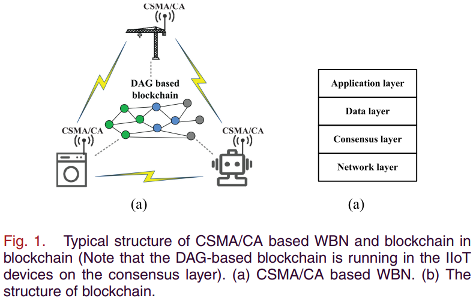
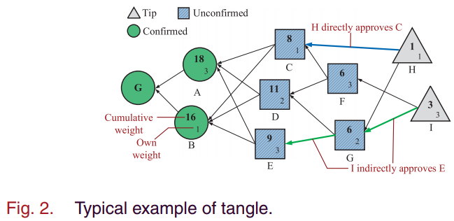

# How Does CSMA-CA Affect the Performance and Security in Wireless Blockchain Networks(B.Cao&etal, 2020)

主要从文章创新点、模型假设、理论分析、仿真结果以及最终结论几个部分来介绍本文。

## 文章创新点

本文分析了CSMA/CA 通信协议对无限区块链网络性能和安全的影响。本文旨在调查使用媒体接入控制机制的CSMD/CA机制是否适用于无限区块链网络。以Tangle为例，考虑由CSMA/CA引起的排队和传输延时的影响，通过分析确认延时、交易吞吐量以及交易丢失率分析性能。随后本文提出一个随机模型来通过考虑恶意双花攻击分析安全性能。仿真结果表明，在无线网络中运行区块链，性能会受到CSMA/CA协议的限制。同时CSMA/CA协议也会影响双花攻击成功的概率。

## 模型假设

1. 在本文中，当用户想竞争无线信道广播包到无限区块链网络时，使用CAMS/CA进行媒体访问；
2. 
   

3. 本文使用 Tangle 作为典型共识协议实例讨论基于有向无环图的区块链；
   
   
   
4. 本文只考虑在相同局域网下的用户；
5. 假设在Tangle中有$n$个用户，在分析性能时，所有用户都是诚实的，在做安全性分析时假设有一个攻击者，其余$n-1$个都是诚实的；
6. 用户之间可以直接通过无线信道通信；
7. 每个用户的交易到达都遵从泊松点过程。
8. 根据网络负载条件，将排队状态分为两种：轻网络负载和重网络负载
   7.1 假设轻网络负载$\lambda = \lambda_l$，每个用户广播概率为$\frac{1}{n}$，每个用户竞争的平均时间为 $C_n^1h = nh$，每个用户等待广播交易的累积交易数量为 $nh\lambda_l$，在$t$时刻Tangle 中tips的总量为$L(t) = 2nh\lambda_l$。
   7.2 高网络负载$\lambda = \lambda_h$，每个用户广播概率为$\frac{1}{n}$，每个用户等待广播交易的累积交易数量为 $nh\lambda_h$，在$t$时刻Tangle 中tips的总量为$L(t) = 2m$，其中$m$是新交易的最大广播数。

## 理论分析

### 性能分析

通过分析只考虑网络共识协议两种网络负载情况下的交易延时、交易吞吐量以及交易丢失率，以及在考虑基于CAMA/CA机制下的交易延时、交易吞吐量以及交易丢失率来讨论无线区块链网络的性能。

### 安全分析

通过分析了完美通信时双花攻击成功的概率以及在考虑CSMA/CA通信机制下的爽滑攻击成功的概率。以此来分析Tangle共识协议下无限区块链系统的安全性。

## 仿真结果

在做仿真实验时，设置用户数量$n=10, \omega = 500$.

1. 第一个实验通过改变新交易到达率$\lambda$和传输延时$h$评估排队、共识、确认时延。
   1.1 将交易到达率作为变量：在完美通信下，排队时延为0，共识时延等于确认时延； 在WBN中，考虑CSMA/CA通信协议时，轻网络负载时，排队时延很小，实际的共识延时与期望的共识延时相同；当重网络负载时，排队延时增加，共识延时保持为一个常数； 由于确认延时 = 排队延时+共识延时，因此在轻网络负载时，实际确认延时基本接近期望确认延时，当重网络负载时，实际网络延时会远远高于期望的网络延时。
   1.2 将传输延时作为变量： 实际排队时延随着传输时延的增加而变大，这是因为随着传输延时的增加，缓存的交易会变多，因此交易排队的时间按就长；低网络负载时，排队延时低，共识延时基本保持一致，因此确认延时很接近；高网络负载时，实际排队延时增加，共识延时保持在一个常熟范围左右，因此实际的确认延时会远高于去往的确认延时。
2. 当低网络负载时，实际交易吞吐量与期望的交易吞吐量非常接近，在高网络负载时，实际的网络吞吐量会降低并最终保持为一个常数，而期望的交易吞吐量将一直增加；
3. 当低网络负载时，实际交易丢失率与期望的交易丢失率为零，在高网络负载时，实际的交易对是绿将增加，而期望的交易丢失率依然为零；
4. 轻网络负载时，随着攻击者交易到达率的提升，期望双花攻击的概率会增加到1，而实际的双花攻击会增加最后稳定在2%处；重网络负载时，实际成功攻击的概率随攻击者交易到达率增加而增加，最终稳定在1.3%，而期望成功攻击的概率一直增加直到 1.
5. 诚实交易的到达率增加会降低攻击成功的概率，并且对于完美通信时讷讷感狗确保安全，但在实际中，由于通信协议的的影响，即使诚实节点的交易到达率很高，也不能确保系统的安全。

## 最终结论
1. 在无限区块链系统中，通信协议CSMA/CA明显的影响区块链的性能；
2. 发起攻击的能力会受到无线网络广播的限制；
3. 高负载的网络也并不能确保区块链系统的安全性。

## 问题讨论

1. 不同的无线网络通信协议对于无线区块链网络的性能的影响有何不同，哪一种通信协议能够确保更好的性能；
2. 在本文中讨论安全性的时候，只考虑了双花攻击，对于女巫攻击或者阻塞攻击并没有详细讨论；
3. 网络的拓扑结构和节点之间的连接性对于双花攻击的影响大吗？
4. 不同的确认权重对于确认时延应该有很大的影响，设置多大的确认权重比较合理？