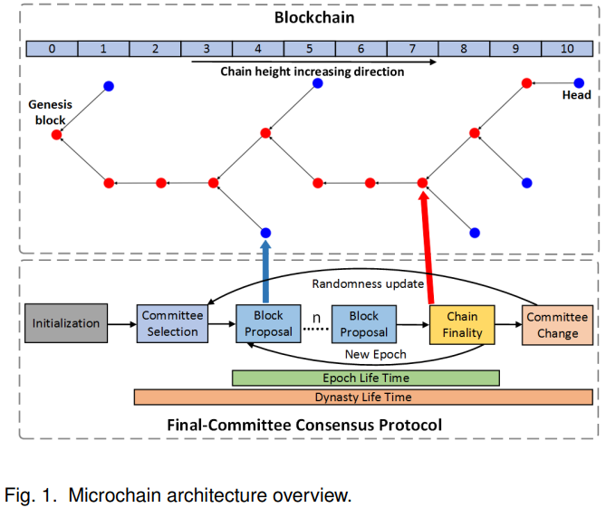
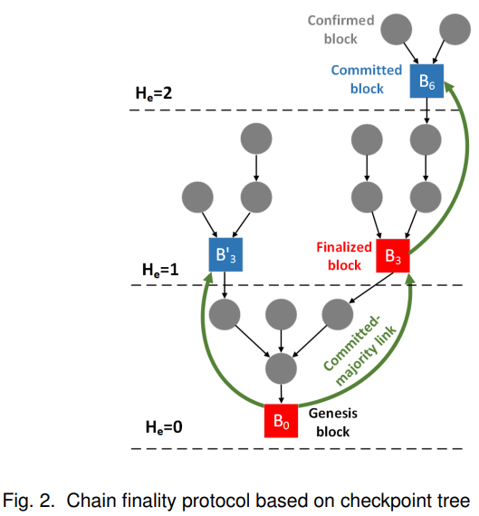
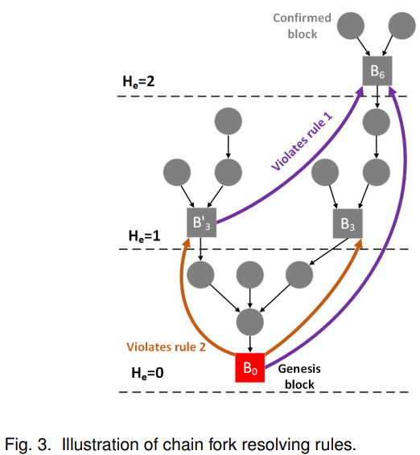

# Microchain -- A Hybrid Consensus Mechanism for Lightweight Distributed Ledger for IoT(R.Xu&etal, 2019)

[相关论文链接](../Papers/4.%20Microchain_A%20Hybrid%20Consensus%20Mechanism%20for%20Lightweight%20Distributed%20Ledger%20for%20IoT(R.Xu&etal,%20Sep.2019).pdf)

## 文章创新点

本文基于信用证明和基于投票链终止提出一个混合协议——Microchain共识协议。该协议的目标是将轻量级的分布式账本应用在网络边缘的资源有限IoT环境，在较小数量的验证节点之间运行共识机制达成系统共识。Microchain网络通过最终委员会在固定周期处理交易。混合PoC-VCF共识机制用于提出区块和终止链历史。其中PoC机制来随机选择提出区块的参与者，而VCF机制用于解决链分叉和选择唯一链来确定块的历史记录。最终实验结果验证了该协议是适用于IoT的部分去中心化、可扩展并且轻量级分布式账本协议。

## 模型假设

1. 微链网络通过最终委员会在一个任期内处理交易（随机委员会形成协议确保了委员会选择过程不可被预测）；
2. 混合PoC-VCF共识机制确保了区块的提出和最终确认；
3. 假设微链是在同步网络中运行，所有进程的操作都是在拥有延时有限界的轮中协同完成；
4. 最终微链能够满足一致性（即所有用户应就相同的交易达成一致，并且最终的交易应在分布式账本中处于相同的位置）和活性（确保诚实节点提交的交易在足够长的时间后在最终确定的块中得到确认）；
5. 时间被分成不相交的离散时隙；
6. 每个区块只能打包固定数量的拥有相同数据大小的交易；
7. 区块确认时间只与时隙的长度有关；
8. 每个参与者必须要注册成功后才能加入到需要许可的区块链网络（许可证明）。

## 术语定义

   **偏序 $\rightarrow$：** 分布式账本是一个区块的偏序，去哦区块 $a$ 早于区块 $b$，则表示为 $a\rightarrow b$;
   **逻辑时钟 ticks：**可以给出一个时间的全序。每个时隙 $sl_t$ 可通过tick $t$ 进行索引，其中tick可表示为单调递增整数 $t\in\{1,2,3,\cdots\}$。记延时的上界为 $\Delta$，为了确保消息的传输，每个时隙应该要足够大，即 $sl_t \geq \Delta$。
   **密钥对 $(sk_i,pk_i)$：** 用户 $u_i$ 的信用份额满足 $c_i \leq C_{\max}$，其中 $C_{\max}$ 是最大信用份额。该用户对应的密钥对 $(sk_i,pk_i)$ 主要用于消息的签名和验证。所有注册用户的集合可以表示为 $U = \{$(pk_1, c_1), (pk_2, c_2), \dots,(pk_n, c_n)$\}$，其中 $n$ 是注册用户数量。
   **任期（epoch）：** 一个任期是 $R$ 个子序列时隙的集合，表示为 $e = \{sl_1, sl_2, \cdots, sl_t\}, 0 \leq t\leq R$。其中 $R$ 是任期的大小，通常由多个单位时隙组成。
   **验证者：** 验证者 $v_i \in V \subseteq U$ 是具有最终委员会候选资格并且执行共识算法的注册用户。
   **朝代：** 一个朝代是当前最终委员会的集合 $D = \{$(pk_1, c_1), (pk_2, c_2), \dots,(pk_k, c_k)$\}\subseteq V, 0 \leq k \leq K$，其中 $K$ 是委员会的大小。朝代的选择是基于最终委员会选择算法，并且一个朝代的时长为多个任期。
   **区块：** 由验证者 $v_j$ 在一个时隙 $sl_t$ 中生成的区块表示为 $B_i = (hash_{pre}, height, Data_{txs}, sl_t, pk_j, \sigma_j)$。
   **创世区块：** 特殊区块表示为 $B_0 = (hash_{pre} = 0, height = 0, sl_0 = 0, init_D)$，其中 $init_D$ 表示初始朝代。
   **区块链：** 区块链 $\mathcal{C}$ 是区块的偏序 $B_0 \rightarrow B_1 \rightarrow\cdots\rightarrow B_{n-1}\rightarrow B_n$ 是时隙 $sl_t$ 严格递增的。其中对于每个区块 $B_i$ 都有 $hash_{pre} = \mathcal{H}(B_{i-1})$，$len(B_n) = n, head(\mathcal{C}) = B_n$

## 协议框架

微链协议主要有五部分组成，其架构如 Fig 1所示：
   **初始化：** 包含由管理者指定的一组验证器的特殊王朝（任期）作为初始化区块链初始委员会$D_{init}$；
   **委员会选择：** 若当前王朝是初始委员会，则跳过这步。否则在王朝开始时利用基于VRF的密码学抽签方案根据信用比重随机选择验证节点集作为最终委员会；
   **提出区块：** 区块提出机制使用PoC随机选择区块提出者，随后生成新区块链接到区块链上；
   **链终止：** 在每一时代结束时，与当前时代相同高度的链头都会成为检查点（或者说，当前时代提出的区块都能竞争加入链），链终止利用基于投票(VCF)的算法来确定最终加入到主链上的区块；
   **委员会改变：** 结束一个王朝之后，新的委员成员要重新选择，当前委员会成员会对新王朝的随机字符串达成一致。
   
   

### 基于PoC的区块提出机制

基于PoC的区块提出机制是一个纯PoS机制，通过随机选择区块提出者来仿真挖矿。区块的生成依赖于与当前朝代信用分布相关的首领选择过程时隙。链扩展规则确保新块在最终确定的主链上增长，并防止冲突块。

1. 交易池
    **交易：** 交易表示为 $tx = \{hash_{tx}, pk_{sender}, pk_{recipient}, T_{stamp}, data, \sigma\}(tx \in \{0, 1\}^*)$。

    在网络中接收到广播的交易时，验证者需要根据下面条件验证交易：
    * 验证接收者和发送者是否是 $U$ 中的用户，并且利用发送者的公钥 $pk_{sender}$ 验证 $Verify(hash_{tx}, pk_{sender}, pk_{recipient}, T_{stamp}, data) = \sigma$；
    * 交易 $tx$ 既不在交易池中，也不在最后 $\kappa$ 个已提交的区块中；
    * 时间戳 $T_{stamp}$ 要么在当前时隙中，要么在最后 $\kappa$ 个已提交区块的过去时隙序列中。
2. 时隙首领选择
    **信用分布：** 信用分布表示为 $\mathcal{D} = \{p_1, p_2, \cdots, p_K\}$，其中 $p_j = \frac{c_j}{\sum_{j = 1}^Kc_j}$ 并且 $K$ 是委员会的大小。
    **信用证明（Proof-of-Credit）：** 给定一个自适应难度参数 $\xi$，解决PoC谜题的过程旨在验证字符串 $hc$，该字符串是 $\mathcal{H}(head(\mathcal{C})), pk_j, c_j$ 串的哈希码，使得取 $hc$ 的 $\xi$ 长度低位小于由难度条件 $d_{cond}(\xi,p_j$ 生成的目标值，即 $\mathcal{TB}(hc,\xi) \leq d_{cond}(\xi, p_j), hc = \mathcal{H}(\mathcal{H}(head(\mathcal{C})), pk_j, c_j), d_{cond}(\xi, p_j) = (2^{\xi} - 1)\cdot p_j, d_{cond}(\xi, p_j) \in \{0,1\}^{\xi}$，而 $\mathcal{TB}(hc,\xi)$ 返回 $hc$ 哈希码的低 $\xi$ 位。
    基于PoC的时隙首领选择过程描述如下：
    * **块提出：** 1）在当前时隙 $sl_t$ 中每个朝代中的验证者 $v_j$ 基于当前的信用份额 $c_j$ 计算得到 $hc$ 的哈希码；2）根据公式 $\mathcal{TB}(hc,\xi) \leq d_{cond}(\xi, p_j)$ 来决定其是否有资格提出区块；3）若有资格，则该验证者生成一个新区块 $B_{i+1} =  (\mathcal{H}(head(\mathcal{C}), height + 1, Data_{txs}, sl_t, pk_j, \sigma_j)$ 并广播到网络上。
    * **块验证：** 当接收到提出的区块 $B_{i+1}$ 之后，每个验证者都要检查1）发送者 $pk_j$ 是否是委员会成员；2）使用发送者的公安哟验证签名的有效性；3）检查时间戳是否在时隙 $sl_t$ 中，$B_{i+1}[height] = head(\mathcal{C}) + 1, B_{i+1}[hash_{pre}] = \mathcal{H}(head(\mathcal{C}))$；4）最终根据公式 $\mathcal{TB}(hc,\xi) \leq d_{cond}(\xi, p_j)$ 验证区块 $B_{i+1}$ 的解的证明。
    * 对于链增长遵循最大确认区块高度规则：1）只有一个候选区块，则接收该区块并链头设为该区块；2）有多个候选区块，则所有区块都被接收为确认区块，链头更新遵守以下规则：i）链头为区块提案者拥有最大credit的区块；ii）若相同credit，则链头为拥有最小TB(hc,ε)的区块；3） 若没有候选区块，就提交一个空区块作为该任期接收作为确认状态。

### 基于投票的链终止机制：

由于网络网络延时或者“Nothing at stake”攻击，链也会出现分叉。攻击者通过修改份额值很容易提高被选中的概率，这种行为并不会被检查到。为了防止这种情况，提出了基于选票的链终止机制。这种机制确保了区块链不会随意被篡改，并增加了攻击成本。
1. 检查点终止协议
    由于网络延时或者攻击造成区块链分叉时，块提出机制会使得多个冲突区块出现。这些区块将会使得区块了变成树形结构，如下图所示：
    
    链终止协议主要是为了确保最终只有一个区块被选中，确保链的唯一性。
    * **检查点：** 区块 $B_i$ 在树中的高度为任期大小 $R$ 的倍数的区块被指定为检查点，即 $B_i[height]\mod R = 0$。
    * **任期高度：** 区块 $B_i$ 在任期的当前高度，记作 $H_e(B_i) = \lfloor\frac{B_i[height]}{R}\rfloor$
    *  **选票：** 由验证者 $v_j$ 在时间 $T_{stamp}$ 发送给目标节点的检查点区块选票记作 $Vote_j = (hash_{vote}, h_{source}, h_{target}, H_e(source), H_e(target), T_{stamp}, pk_j, \sigma_j)$。
    * 在链终止过程的时隙 $sl_t$ 中，当前朝代的每个验证者 $v_j$ 都会为正在提交的检查点区块生成一条 $vote_j$ 消息。当给定投票结果后检查点区块具有如下性质：
    **Commited-majority Link：** 给定一个检查点区块的序 $(B_s, B_t), B_s \rightarrow B_t$，若超过2/3的验证者都对其投票，那么该关系 $B_s \rightarrow B_t$ 被称作committed-majority link。实例如图2中的 $B_0\rightarrow B_3, B_3\rightarrow B_6$。
    **Commited Block：** 检查点区块 $B_t$ 被称作已提交区块若 1) $B_t$ 是创世块；2)存在一个committed-majority link $B_s\rightarrow B_t$，其中 $B_s$ 就是已确认区块；
    **Finalized Block：** 检查点区块 $B_s$ 被称作最终区块，如果满足1)区块 $B_s$ 是创世块，或2）区块 $B_s$ 是一个已提交区块，并存在一个committed-majority link $B_s\rightarrow B_t$，其中 $B_s$ 在检查点树上是 $B_t$ 的父亲，即 $(H_e(B_t) = H_e(B_s)+1)$。
    * 基于选票的链终止协议利用检查点区块形成检查点树来确认区块链。链终止工作流程如下：
        * **Sending Voting** 在当前时隙 $sl_t$ 中，当前朝代的验证节点 $v_j$ 检查是否有 $H_e(head(\mathcal{C})) = H_e(B_c) + 1$，其中 $B_c$ 是局部链 $\mathcal{C}$ 最后被提交的区块。若成立，该节点就生成对新的committed-majority link $B_c\rightarrow head(\mathcal{C})$ 投票的 $Vote_j$ 消息。并广播签名的 $Vote_j$ 消息给所有委员会中的成员；
        * **Counting Votes** 在接收到已提出的投票 $Vote_j$ 后，每个验证节点 $v_i, i\in K$ 检查投票是否来自有效验证者 $v_j$ 以及签名 $\sigma_j$ 的正确性，之后验证接收的选票是否违反链分叉解决规则.若都验证成功，验证者将更新 $vote_{count}[h_{source}, h_{target}]$ 的值增加 $1$；
        * **Finalizing Checkpoint** 当committed-majority link $B_s\rightarrow B_t$ 的选票计数 $vote_{count}$ 超过阈值 $\mathcal{T}\cdot K$ 时将会为接受，其中 $\mathcal{T} = \frac{2}{3}$，$K$ 是委员会数量。若 $vote_{count} > \frac{2K}{3}$， 则检查点区块 $B_t$ 被接受成为已提交区块，区块 $B_s$ 被接受成为终止区块。

2. 链分叉结局规则
    若两个检查点区块 $B_i, B_i'$ 具有相同的任期高度 $H_e$，但是是两个完全不同的分支，那么他们就是冲突块。为了处理冲突检查点块从而解决分叉问题，定义了一些链分叉解决规则：
    * **Rule 1：** 给定选票 $Vote_j = (hash_{vote}, h_s, h_t, H_e(s), H_e(t), T_{stamp}, pk_j, \sigma_j)$，若 $H_e(t) \neq H_e(head(\mathcal{C}))$ 或者 $H_e(t) \neq H_e(s) + 1$，那么xuanjuren $j$ 违反规则，并且 $Vote_j$ 将会被拒绝。
    * **Rule 2：** 给定来自相同选举人 $j$ 的两个选票 $Vote_1 = (hash_{vote}, h_{s1}, h_{t1}, H_e(s1), H_e(t1), T_{stamp}, pk_j, \sigma_j), Vote_2 = (hash_{vote}, h_{s2}, h_{t2}, H_e(s2), H_e(t2), T_{stamp}, pk_j, \sigma_j)$，若 $t1 \neq t2, H_e(t1) \neq H_e(t2)$，选举人 $j$ 违反规则，并且所有来自该选举人的选片都会被拒绝。
    下图表明选举人如何违反上述两种规则的情形：
    

3. 激励
    为了确保节点能够诚实工作，会奖励提出区块、验证区块和投票给最终检查点区块的验证节点。奖励包括费用和信用值。
    * 在每个朝代结束的时候，当前委员会中区块中包含的所有交易费用将收集到奖励费用池中作为奖励费用，然后将其分配给所有没有违规行为记录的诚实验证者。
    * 每个诚实的验证者 $v_i$ 将会添加 $1$ 个信用值到 $c_i$。信用越高越容易被选中作为块提出者。
    * 要成为委员会成员，验证者 $v_i$ 要抵押一笔固定费用到特殊股份 $sc_i$。一旦其被检查到有不诚实的行为，将被惩罚押金被没收。验证者 $v_i$ 的信用值还会被减 $1$。

## 仿真结果

本文对于提出的微链进行仿真，评估再物联网上运行微链的网络延时、吞吐量、性能和安全性。
1. 网络延时：随着委员会节点的增加，提交交易的延时也线性增加，块提出延时随着委员会通信复杂度而增加，链终止延时随着节点数量的增加而迅速增加；
2. 微链以增加延时为代价提高吞吐量，吞吐量主要受到网络和系统性能的限制；
3. 对于每一轮中关键步骤的延时开销随着块大小的增加而增加；
4. 相较于基于PoW的区块链，微链只在主机上引入较轻开销；
5. 最终委员会的容错率为 $\frac{1}{3}$，链终止需要 $n\geq 3f+1$ 在检查点上达成一致，因此攻击成功的概率 $<\frac{1}{4}$。微链可以抵抗双花攻击、交易抵赖攻击、远距离攻击、自私攻击等。

## 最终结论

1. 微链追求低块确认时间，块确认时间受到委员会规模的影响，合理的选择委员会的大小和设计委员会选择算法可以提升扩展性；
2. 提高吞吐量会导致网络延时的增加（增加块大小），因此我们需要再确保网络延时不增加过大的情况下，提升交易量；
3. 合理的设置块大小，以及合理设计相应任务的执行方案可以尽可能的减少网络延时的开销；
4. 虽然微链减少了算力的消耗，但是却增加了网络的开销；
5. 微链中恶意检查点成功的概率小于\frac{1}{4}，容错率虽然高，但是也有较大风险。

## 问题讨论

1. 本文提出的微链希望降低块确认时间，但是最终结果表明相较于以太坊，也就是降低了一半，并没有成指数下降，为什么扩展性不算特别好？
   * 虽然相较于以太坊快确认时间被降低了，但是这个比较其实是不合理的。这个协议应该跟同类型的采用委员会机制的区块链系统的性能进行比较，比如：HyperLedger。而且本文由于添加了一个投票过程，这个过程耗费的时间取决于委员会的大小，这会是一个比较大的时间开销。并且当委员会数量增加时，这个时间也会随着增加，因此扩展性不会特别好。
2. 本文作者只说明微链可以抵抗许多攻击，但并没有详细说明如何抵抗攻击，抗攻击性能由多好，攻击成功的概率有多大，可以通过何种方案降低攻击的概率等？
   * 首先需要讨论的是该协议能否抵抗女巫攻击。即节点能否同时制造多个假名假装同时有很多节点。由于节点选择的块提出者选举机制是根据每个节点的信用来选择的。就算同时出现多个假名，但是总的信用占比并没有发生变化，因此不会提升攻击者被选中概率提升的情况，因此女巫攻击不起作用。此外阻塞攻击只适用于无线网络中，并且主要是针对网络传输协议的攻击，如果发起，可能会影响网络延时，从而造成链分叉，但是针对这一情形，文中已经提出结局办法，因此针对这类攻击，系统也是安全的。由于每个区块都会在一个时期内被确认，并且不在会被更改，因此不会出现交易双花的问题。
3. 检查点机制的设置是否有点多余，并且再这一阶段耗费的网络延时比较大，委员会成立后，直接选出一人提出区块应该会更加节省资源，也避免了之后多个检查点的问题，至于分叉就可以采用最长链原则就行不是更好？
   * 检查点机制是由于前面的区块提出机制的设置导致问题的结局方案，采用这样的区块生成机制就是会出现竞争区块的现象，从而导致链分叉。针对这一问题，提出检查点机制来确定最终唯一的区块，确保系统始终维护唯一链。如果有比较好的方式能够确定唯一区块提出者，使得每个任期就只有一个唯一的区块生成，确保所有节点维护区块链的唯一性。但是这样的唯一区块链提出者可以通过VRF算法选择，不会出现冲突，也不会事先被知晓，非常安全。但是本文并没有提到这一机制。只能说作者提出了一个比较特别的方案吧。
4. 此外，最初的信用应该如何初始化才能确保系统节点不会过于中心化，或者出现金融寡头的问题？
   * 由于PoC是一个纯PoS的共识协议，因此每个节点初始信用如何给出还未有比较好的解决办法。如果初始进行分配会造成中心化程度高的问题。可以采用其他的方式来选举块提出者。比如无线网络可以采用信道争用最先的方式来选择区块提出者，从而不会出现金融寡头的问题，而是与信道特性和节点的传输概率有关。