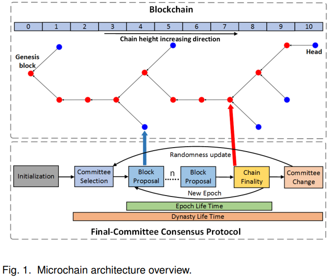
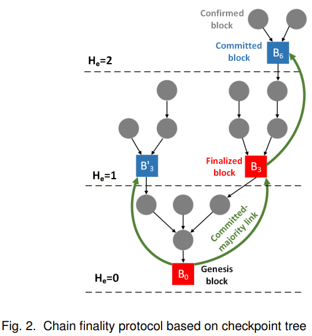

# Microchain -- A Hybrid Consensus Mechanism for Lightweight Distributed Ledger for IoT(R.Xu&etal, 2019)

主要从文章创新点、模型假设、协议框架、仿真结果以及最终结论几个部分来介绍本文。

## 文章创新点

本文基于混合信用证明和基于投票链终止提出一种Microchain共识协议.通过使用抗偏差随即协议和密码抽签算法，抽选出最终委员会成员的节点集合来执行协议。该混合共识协议依赖于PoC来决定是否成为有资格提出区块的参与者。而基于投票的链终止协议用于检查解决冲突并选择唯一链来确定块的历史记录。

## 模型假设

1. 微链网络通过最终委员会在一个任期内处理交易（随即委员会形成协议确保了委员会选择过程不可被预测）；
2. 混合PoC-VCF共识机制确保了区块的提出和最终确认；
3. 假设wei'lian是在同步网络中运行；
4. 最终微链能够满足一致性和活性（即安全性）；
5. 时间呗分成不相交的离散单位-时隙；
6. 每个区块只能打包固定数量的拥有相同数据大小的交易；
7. 区块确认时间只与时隙的长度有关；
8. 每个参与者必须要注册成功后才能加入到需要许可的区块链网络。

## 协议框架

微链协议主要有五部分组成：
1. 初始化：包含一组由管理者指定的一组验证器的特殊王朝（任期）作为初始化区块链初始委员会$D_{init}$；
2. 委员会选择：若当前王朝时初始委员会，则跳过这步。否则在王朝开始时利用基于VRF的密码学抽签方案根据信用比重随机选择验证器的子集作为最终委员会；
3. 提出区块：区块提出机制使用PoC生成新区块；
4. 链终止：在每一时代结束时，与当前时代相同高度的链头都会成为检检查点（或者说，当前时代提出的区块都能竞争加入链），链终止利用基于投票的算法来确定最终加入到主链上的区块；
5. 委员会改变：结束一个王畴之后，新的文员会成员要重新选择，当前委员会成员会对新王朝的随机字符串达成一致。
   
   

6. 对于链增长遵循最大确认区块高度规则：1）只有一个候选区块，则接收该区块并链头设为该区块；2）有多个候选区块，则所有区块都被接收为确认区块，链头更新遵守以下规则：i）链头为区块提案者拥有最大credit的区块；ii）若相同credit，则链头为拥有最小TB(hc,ε)的区块；3） 若没有候选区块，就提交一个
空区块作为该任期接收作为确认状态。
7. 基于投票的链终止机制：当前任期的验证者将会对正在提交的检查点区块抛
出一个投票消息，给定一个投票结果，检查点区块将有如下性质：
    7.1. Commited-majority Link:给定一个检查点区块的序，若超过2/3的验证者都对其投票，那么该关系被称作committed-majority link。
    7.2. Commited Block：检查点区块被称作已提交区块若1)该区块是创世块或2)存在一个committed-majority link其中Bs就是已确认区块；
    7.3 最终区块：满足1)该区块是创世块，或2）Bs区块是一个已提交区块，并存在一个CML(Bs,Bt)，其中Bs在检查点树上是Bt的父亲(He(Bt)= He(Bs)+1)。
    
    
    7.4 基于投票的链终止过程：1）验证器对检查点候选人的节点发起投票；2）之后根据投票规则计算投票；3）最后确定检查点（投票最多的成为检查点）。

基于投票的链终止机制不仅可以确定检查点区块，还能再出现分叉时，确认主链。本文中，将生成区块和处理交易的奖励都给验证器节点。

## 仿真结果

本文对于提出的微链进行仿真，评估再物联网上运行微链的网络延时、吞吐量、性能和安全性。
1. 网络延时：随着委员会节点的增加，提交交易的延时也线性增加，块提出延时随着委员会通信复杂度而增加，链终止延时随着节点数量的增加而迅速增加；
2. 微链以增加延时为代价提高吞吐量，吞吐量主要受到网络和系统性能的限制；
3. 对于每一轮中关键不中的延时开销随着块大小的增加而增加；
4. 相较于基于PoW的区块链，微链只在主机上引入较轻开销；
5. 最终委员会的容错率为\frac{q}{3}，链终止需要 $n\geq 3f+1$ 再检查点上达成一致，因此攻击成功的概率 $<\frac{1}{4}$。微链可以抵抗双花攻击、交易抵赖攻击、远距离攻击、自私攻击等。

## 最终结论

1. 微链追求低块确认时间，块确认时间受到委员会规模的影响，合理的选择委员会的大小和设计委员会选择算法可以提升扩展性；
2. 提高吞吐量会导致网络延时的增加（增加块大小），因此我们需要再确保网络延时不增加过大的情况下，提升交易量；
3. 合理的设置块大小，以及合理设计相应任务的hi行方案可以尽可能的减少网络延时的开销；
4. 虽然微链减少了算力的消耗，但是却增加了网络的开销；
5. 微链中恶意检查点成功的概率小于\frac{1}{4}，容错率虽然高，但是也有较大风险。

## 问题讨论

1. 本文提出的微链希望降低块确认时间，但是最终结果表明相较于以太坊，也就是降低了一半，并没有成指数下降，因此扩展性不算特别好。
2. 本文作者只说明微链可以抵抗许多攻击，但并没有详细说明如何抵抗攻击，抗攻击性能由多好，攻击成功的概率有多大，可以通过何种方案降低攻击的概率等？因此，这些可以作为以后研究的方向；
3. 检查点机制的设置是否有点多余，并且再这一阶段耗费的网络延时比较大，委员会成立后，直接选出一人提出区块应该会更加节省资源，也避免了之后多个检查点的问题，至于分叉就可以采用最长链原则就行不是更好?