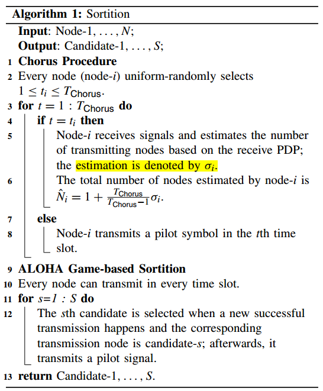
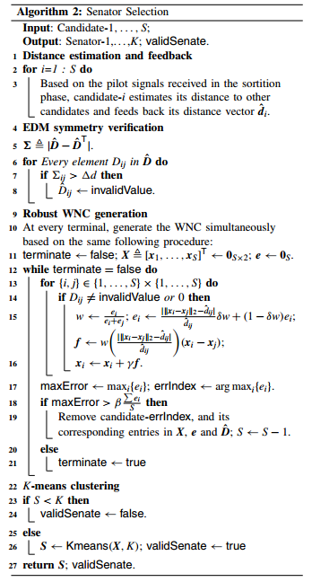

# SENATE -- A Permissionless Byzantine Consensus Protocol in Wireless Networks for Real-Time Internet-of-Things Applications(Z.Jiang&etal, 2020)

主要从文章创新点、系统模型、协议框架、仿真结果以及最终结论几个部分来介绍本文。

## 文章创新点

本文提出了无线网络女巫证明基于协作的拜占庭共识-SENATE，该共识算法具有实时达成共识和女巫证明的优点。SENATE中的参议员是根据无线网络坐标从参与的节点中选出。被选中的节点将参与之后的共识过程并广播结果。最后仿真结果表明SENATE在拥有上百个节点的网络中实现了实时共识。

## 系统模型

1. 本文主要考虑实时物联网应用，因此需要精确传输实时性消息，并且应识别和避免假消息和发送假消息的终端；
2. 无线网络是由$N$个全连接的分布式节点组成；
3. 系统是开放的，任意节点不需要身份授权都能加入系统；
4. 不同的节点由不同的初值（与状态机不同）；
5. 本文中故障节点的行为分为3类：
   5.1 故障节点的目标是操纵共识过程是自身受益而非组织共识的达成；
   5.2 拜占庭节点可以禅师假名使得在共识过程获得更多不合法的权力；
   5.3 在覆盖无线网络中，故障节点不会阻止或干扰其他节点的传输和消息；
6. 本文假设节点基于接收到的导频信号

## 协议框架

SENATE主要由抽签阶段、参议员选择阶段和拜占庭一致阶段三部分组成。

1. 抽签：为了防止恶意节点大量产生假名，通过采用自私用户的ALOHA游戏来地勘女巫攻击：1）节点通过接收信号的PDP来估计多径组件数量；2）在通过基于ALOHA有意的抽签来选出$s$个候选人；
   
   
   注意：1）也允许每个节点都是自私的，存在对称平衡；2）访问概率随$N$的拜年话很小；3）抽签方案并不能完全阻止女巫节点进入下一阶段，也不能非故障节点是绝大多数。
2. 参议员选择阶段是通过交叉检查分布式节点的距离估计来移除由恶意节点生成的假名；
   

对被选中的 $s$ 个候选节点的距离估计进行交叉检测：1）先通过距离估计和反馈进行一轮筛选；2）通过比较节点之间的欧式距离对称验证；3）根据无线节点坐标生成的鲁棒性（跷跷板实验）排除掉假名；4）最终通过K聚类算法选出$k$个参议员。
3. 最终选出的参议员将执行拜占庭一致性协议达成共识，并广播结果。
   Jack 方案：
   3.1 Setup Stage: 每个参议员广播初始值给其他参议员并接收其他参议员的初始值；
   3.2 Serch Stage: 在$(t+1)$个预设确定的领导人之间轮换，每轮一个领导人收到其他参议员的建议，并根据其可接受的值提出一个值；若提出的提议达成一致，则领导者提出商定的值。

## 仿真结果

为了检测SENATE的性能，对于城市交通信号灯控制进行仿真（自动驾驶技术面临共识延时问题）。

以环境参数作为输入（包括每个方向的车辆数量），仿真了在每个方向的等待时间：
1. 完美调度，假设始终能够达成正确共识，从而调度车辆等待最多的方向；
2. 基于SENATE共识；
3. 一个传统循环交通灯，在同一个方向有五辆恶意车辆，他们总是发起Sybil攻击，并试图操纵共识使自己获益。
通过比较以上三种情况下的结果，我们得知：
1. 基于SENATE的共识的等待时间远低于传统信号灯的等待时间，并且非常接近于完美共识调度；
2. 通过调查恶意节点数量对于SENATE的影响，通过将发起女巫攻击的节点的数量作为变量发现SENATE当没有女巫攻击时，SENATE的性能接近于传统PBFT，当恶意节点数量增加时，SENATE具有更好的性能；
3. 通过调查SENATE在达成共识之前的时间消耗，这代表了SENATE在实时物联网应用上的可行性：抽签过程是共识过程消耗时间最多的，但在关键参数值方面非常稳定，共识过程延时随着网络规模的增加而增加，在网络节点规模为几百时，SENATE依旧可以在数百毫秒内达成共识。

## 最终结论

1. SENATE 共识协议能够达成实时共识，并且不需要很长的等待时间，使用SENATE共识协议能够实现很好的调度性能；
2. SENATE可以很好的抵抗女巫攻击；
3. SENATE相较于基于PoW的共识更适合应用于实时应用中。

## 问题讨论

1. SENATE的拜占庭一致性阶段为什么采用中值有效性？是因为提议者提出的值是在一个范围都可以，那么这个范围的值有什么特殊的含义吗？
2. 本文中的实验只有一次委员会成员选择过程，这个设置是否合理？如果委员会成员长期不变化，是否会为系统或共识过程带来安全隐患？
3. 本文仿真实验中设置委员会中参议员数量太少，但实际中，当参议员个数增加很大之后，就会带来很大的通信开销，这将大大增加共识延时。
4. 本文并没有详细分析SENATE的效率、性能和安全性（持久性和活性）。