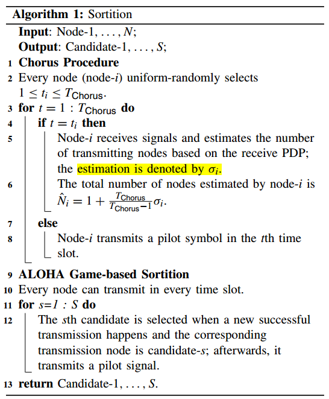
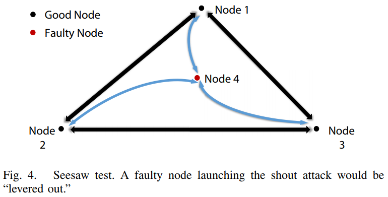
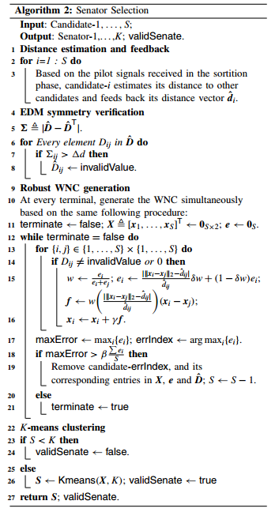
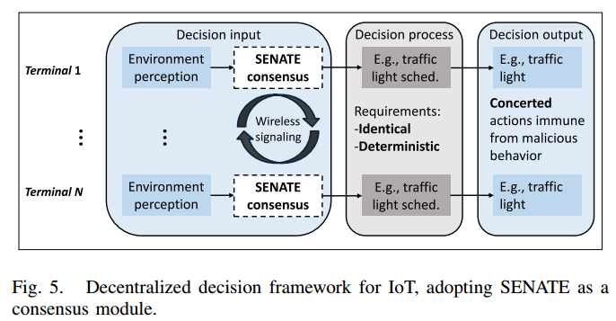

# SENATE -- A Permissionless Byzantine Consensus Protocol in Wireless Networks for Real-Time Internet-of-Things Applications(Z.Jiang&etal, 2020)

[相关论文链接](./../Papers/5.%20SENATE_A%20Permissionless%20Byzantine%20Consensus%20Protocol%20in%20Wireless%20Networks%20for%20Real-Time%20Internet-of-Things%20Applications(Z.Jiang&etal,%20Feb.2020).pdf)

## 文章创新点

本文提出了能够第康女巫攻击的基于无线网络坐标的拜占庭共识-SENATE协议。该协议通过两次选举选出参议员，并最后执行PBFT共识算法实现实时共识和抗女巫攻击。SENATE中首先根据导频信号估算出节点的数量，然后根据ALOHA游戏随机选出参议员候选人。在参议员候选者中，通过欧式距离矩阵的对称验证以及鲁棒无线网络坐标的生成筛选出发起呐喊攻击的故障节点。随后采用K均值聚类算法选出最终参议员，避免被多个假名的节点的影响结果。最终被选中的节点将参与之后的共识过程并广播结果。仿真结果表明SENATE协议能够在拥有上百个节点的网络中实现实时共识。

## 系统模型

1. 本文主要考虑在实时物联网应用——智能交通中的交通信号灯，因此需要精确传输实时性消息并且应识别和避免假消息和发送假消息的终端；
2. 无线网络是由 $N$ 个全连接的分布式节点组成；
3. 系统是开放的，任意节点不需要身份授权都能加入系统；
4. 不同的节点由不同的初值（与状态机不同）；
5. 本文中故障节点的行为分为3类：
   * 故障节点的目标是操纵共识过程是自身受益而非组织共识的达成；
   * 拜占庭节点可以假名使得在共识过程获得更多不合法的权力；
   * 在覆盖无线网络中，故障节点不会阻止或干扰其他节点的传输和消息；
6. 本文假设节点基于接收到的导频信号估计其他节点的距离长度（根据接收信号长度RSS或者到达时间等ToA）。根据统计模型考虑实际的距离估计，即 $\hat{d}_{i,j} = \sigma_{i,j}d_{i,j} + n_{i,j}$，其中$d_{i,j}$ 是节点  $i$ 与节点 $j$ 的测距，且有 $d_{i,j} = d_{j,i}$。此外，两节点的距离估计为 $\hat{d}_{i,j}$，而 $\sigma_{i,j}, n_{i,j}$ 为估计误差的乘法和加法的随机参数。针对无线网络时，通常假设：
   * 基于ToA的距离估计中，$\sigma_{i,j} = 1, n_{i,j}$ 通常建模为一个高斯分布变量；
   * 基于RSS的距离估计，阴影衰落建模为 $\sigma_{i,j}$，通常是一个对数正态分布。通常称作对数正态阴影衰落，两边取对数。

## 协议框架

SENATE主要由抽签阶段、参议员选择阶段和拜占庭一致阶段三部分组成。

1. 抽签：为了防止恶意节点大量产生假名，通过采用自私用户的ALOHA游戏来降低女巫攻击对于系统的影响。在ALOHA游戏中，诚实玩家需要知道用户的总数量来决定其行动。但是故障节点可以发起女巫攻击使得诚实节点相信系统中存在很多用户，从而使得故障节点获利。为了防止这种情况，提出使用Chorus过程利用接收信号PPD的唯一性来估计总的参与节点。故障节点无法通过伪造多径组件来获利，因此可以用这中方式来估计节点数量。
   * Chorus过程：这个过程由 $T_{Chorus}$ 个时隙组成，每个节点随机的选择一个时隙接收，其他 $T_{Chorus}-1$ 个时隙都发送导频信号。随后在接收时隙，节点 $i$ 估计接收信号的PDP，并且计算多径组件数量（假设节点非全双工的）；
   * 基于ALOHA游戏的抽签：给定了节点关于系统总结点数量的估计之后，假设在ALOHA游戏中每个节点都是自私的来防止恶意节点获得优势。一旦一个节点在一个时隙中成功传输，就选为第 $s\in \{1, 2, \dots, S\}$ 个候选人,随后该节点立刻发送用于测距估计的导频信号。
   * ALOHA游戏的纳什均衡：假设每个节点在每个时隙的发送概率为 $p_n \in (0,1)$，在选出 $S$ 个候选人后，抽签阶段结束，进入参议员选择的下一阶段。ALOHA游戏过程如下：
      * 节点在一个时隙成功传输，接收到回报为 $1-c$，其中 $c\in[0,1]$ 是一次传输的成本。随后节点离开游戏；
      * 若在一个时隙出现冲突，每一个传输节点的回报为 $-c$。
   * 纳什均衡：ALOHA游戏过程存在一个纳什均衡——每个节点在每个时隙都以概率 $p(c,N) = 1 - \sqrt[N]{c}$ 传输。关于第一阶段抽选出 $S$ 个候选人的算法如下所示：
   
   * 关于抽签阶段的分析
     * 在Chorus过程分析：节点 $i$ 接收信号，并且假设其对于传输节点的估计是正确的，那么诚实节点在这个时隙中传输的概率为 $o_{g,j} = 1 - \frac{1}{T_{Chorus}}$，节点 $j$ 是诚实节点且 $j \neq i$。因此计算节点数量的无偏估计为 $\hat{N}_i = 1 + \frac{T_{Chorus}q_i}{T_{Chorus}-1}$，其中 $q_i$ 是在节点 $i$ 的接收时隙对于传输节点的估计。当故障节点发起女巫攻击使得诚实节点相信系统中有许多节点时，对于Chorus过程的影响主要在传输方面。因此 $\hat{N}_i \leq 1 + \frac{T_{Chorus}F}{T_{Chorus}-1} + \frac{T_{Chorus}\sum_{n=1}^{N-F-1} m_n}{T_{Chorus}-1}$，其中 $m_n$ 是参数为 $1 - \frac{1}{T_{Chorus}}$ 的伯努利随机变量。当 $T_{Chorus}$ 远远大于 $N$ 时，就有 $N < \hat{N}_i \leq 1 + \frac{T_{Chorus}F}{T_{Chorus}-1} + (N-F-1) + O(\frac{N}{T_{Chorus}}) = N + O(\frac{N}{T_{Chorus}}), F \leq N$。因此Chorus的时隙的长度为 $T_{Chorus} \approx \mathcal{O}(N)$
     * ALOHA游戏分析：选择 $S$ 个候选人的平均时间为 $T_{ALOHA} = \frac{S}{Np_j(1-p_j)^{N-1}} = \frac{S}{N(1-\sqrt[N-1]{c})c} \stackrel{N\rightarrow\infty}{\longrightarrow} \frac{S}{-c\log c} \geq eS$。由此可以计算得到 $c$ 的最优值 $c_{opt} = \frac{1}{e}$。
     * 注意：每个节点都是自私的，因此存在对称均衡；接入概率受 $N$ 的影响很小；抽签方案并不能完全阻止女巫节点进入下一阶段。
2. 参议员选择阶段通过交叉检查分布式节点的距离估计来移除由恶意节点生成的假名。在通过基于ALOHA游戏的随机接入过程抽选出 $S$ 个候选人，每个候选人在这个阶段分配了唯一一个时隙传输。每个候选人都已经传输一个导频信号，并且从其他候选人处得到距离估计。对于候选人 $i$ 的距离估计记作为一个向量 $\hat{\mathbf{d}}_i = [\hat{d}_{1,i}, \cdots, \hat{d}_{i-1,i}, 0, \hat{d}_{i+1,i}, \cdots, \hat{d}_{S,i}]^T$，由此具有平方范数的欧式距离矩阵的估计为 $\hat{\mathbf{D}} = [\hat{\mathbf{d}}_1^2, \cdots, \hat{\mathbf{d}}_S^2]$。
   * 距离反馈与对称性验证：每个候选人在专用时隙中反馈其 $\hat{\mathbf{d}}_i$。每个候选人都会得到任意候选人对在网络中的距离估计。根据 $d_{ij} = d_{ji}, \forall i,j$，每个节点都可以通过检查估计的距离来消除可疑的距离反馈 $|\hat{d}_{ij}^2 - \hat{d}_{ji}^2| < \epsilon$，其中 $\epsilon$ 是关于 $\sigma_{ij}, n_{ij}$ 的常数。任意节点 $i,j$ 中的一个说谎，则 $\hat{d}_{ij}, \hat{d}_{ji}$ 都要移除。
   * 鲁棒的无线网络坐标(WNC)生成：尽管对称性验证在某种程度上可以根据距离估计误差消除不真实的距离反馈，但故障节点仍然可以发起我们所称的“呼喊攻击”
      * 呐喊攻击：故障节点假装与其他节点很远，过同步增加距离估计值到其他节点。基于ToA的距离估计中，故障节点可以延长回复时间；基于RSS的距离估计，故障节点可以有目的的放大导频信号的功率。由此，呐喊攻击无法通过对称验证检测出来。
      * 跷跷板测试：在三位空间中，随着节点数量的增加，发起呐喊攻击的节点越来越不可能按比例远离其他节点。类似于在没对节点之间放置弹性杆，杆的长度由距离估计给出。当故障节点在二维空间发起呐喊攻击时，相关杆长会弯曲，因此弹力将其撬出（通过跷跷板测试筛选出来），就像跷跷板重量小的一侧一样。如下图所示：
      
      * 迭代WNC计算：在迭代的每一轮中，如果距离估计大于（或小于）当前WNC预测的两个节点之间的距离，则每个节点 $i$ 使用到另一节点 $j$ 的距离估计来推（或拉）节点 $j$；然后节点$j$相应地移动。在每轮结束时，具有最大局部误差的节点，即其相关跷跷板弯曲最大，被识别为故障节点，因此被移除；使得当系统具有较小的预测误差时，WNC计算终止。
      * K均值聚类：在获取所有候选人的坐标之后，采用K均值聚类算法将所有候选人分成 $k$ 簇，随后从每一簇中选出一个簇头作为参议员中的一员。这种方法会防止女巫攻击，具有相同假名的故障节点会落在同一个簇中。
   * 参议员选择算法：从 $S$ 个 候选人中选择 $K$ 个参议员的算法如下所示：
      
   * 算法分析：
      * 鲁棒的WNC生成：面对故障节点引入欧式距离矩阵（EDM）误差：$\hat{\mathbf{D}} = \mathbf{D + E}$，其中考虑到恶意行为，$\mathbf{E}$ 中的元素可以任意大。a. 即使故障节点可以导致任意大的误差，但在 $\mathbf{E}$ 中元素是稀疏矩阵（大部分节点都是好的）；b. 欧式距离矩阵源于有限维空间，考虑二维空间的欧式距离矩阵为 $\mathbf{D} = -2\mathbf{{XX}}^T + \mathbf{1}diag(\mathbf{{XX}}^T)^T + diag(\mathbf{{XX}}^T)\mathbf{1}^T$，其中 $\mathbf{X} \in\mathbb{R}^{S\times 2}$ 是候选人的坐标，即 $\mathbf{X} = [\mathbf{x}_1, \cdots, \mathbf{x}_S]^T$。利用稀疏误差特性，将无线网络坐标问题规范化为
      $\begin{aligned}
      & P_1: minimize_{\mathbf{X,E}} \parallel\mathbf{E}\parallel_0 \\
      & s.t.\quad
      \begin{cases}
      \hat{\mathbf{D}} = \mathbf{D + E}\\
      \mathbf{D} = -2\mathbf{{XX}}^T + \mathbf{1}diag(\mathbf{{XX}}^T)^T + diag(\mathbf{{XX}}^T)\mathbf{1}^T\\
     rank(\mathbf{X}) = 2.
      \end{cases}
      \end{aligned}$
      将零范数放宽为1范数后，问题变为：
      $\begin{aligned}
      & P_2: minimize_{\mathbf{X,E}} \parallel\mathbf{E}\parallel_1 \\
      & s.t.\quad
      \begin{cases}
      \hat{\mathbf{D}} = \mathbf{D + E}\\
      \mathbf{D} = -2\mathbf{{XX}}^T + \mathbf{1}diag(\mathbf{{XX}}^T)^T + diag(\mathbf{{XX}}^T)\mathbf{1}^T\\
     rank(\mathbf{X}) = 2.
      \end{cases}
      \end{aligned}$
      使用基于数据驱动的梯度下降法对问题求解。基于估计 $\hat{d}_{ij}$，可以根据 $P_2$ 中的目标函数的梯度更新 $\mathbf{x}_i(\mathbf{{x}_j})$ 为 $\mathbf{x}_i \leftarrow \mathbf{x}_i + \mu\frac{\partial|\parallel\mathbf{x}_i - \mathbf{x}_j\parallel_2^2 - \hat{d}_{ij}^2}{\partial \mathbf{x}_i}$。
      误差较小的节点不需要基于具有较大误差候选人的坐标进行更新，由于误差较大的候选人可能是故障节点。因此每轮结束之后，误差较大的节点将会被移除，直到候选人中的误差符合均匀分布，此时误差是由于测距引入而非故障节点。
      * 跷跷板测试分析：跷跷板测试的基本原理是，结果位置将超出二维空间可以检测到实施呼喊攻击的故障节点。因此产生了问题：在空间之外，故障节点如何被赋予一定的呼喊攻击强度，以及良好节点数量的影响。假设故障节点坐标为 $\mathbf{x}_0 = (0,0)$，该节点对于其他 $M$ 个良好节点 $\mathbf{x}_m = (x_m, y_m), \forall m\in\{1, \cdots, M\}$ 发起呐喊攻击。故障节点在欧式距离矩阵的元素中添加了任意误差 $\mathbf{E} = \begin{bmatrix} 0 & \mathbf{e}^T \\ \mathbf{e} & \mathbf{0}_{M\times M} \end{bmatrix}$。故障节点超出空间测量为 $h(\xi^2) = \mathbb{E}_{\mathbf{X}}[\min_{\mathbf{Z},rank(\mathbf{Z}) = 2}[\min_{\mathbf{e},\parallel\mathbf{e}\parallel_1 = M\xi^2}\parallel\hat{\mathbf{X}} - \mathbf{Z}\parallel_2^2]]$，其中 $\mathbf{X}$ 是重构坐标。
        * 定理2：假设故障节点 $(0,0)$ 拥有 $\parallel\mathbf{e}\parallel_1 = M\xi^2$ 的攻击强度，良好节点的坐标是基于均值为 $0$ 方差为 $\sigma^2$ 的高斯分布生成的独立同分布，即 $(x_m, y_m) \sim (\mathbf{0},\sigma^2\mathbf{1}), \forall m \in \{1, \cdots, M\}$。当误差 $\mathbf{e}$ 与节点 $(x_m, y_m) \forall m \in \{1, \cdots, M\}$ 独立，则 $h(\xi^2) = \min\{(M-1)\sigma^2, (M-2)\sigma^2\}$。
        * 注意：故障节点无法通过记录 $h(\xi^2)$ 与攻击强度 $\xi^2$ 的比例来隐藏其谎言，直到 $\xi^2$ 与距离的平方 $\xi^2$ 相当时，攻击就特别明显了。这个效应被放大 $M$ 倍后更加明显。当越来越多的良好节点形成一个具体的二维空间时，故障节点想要撒谎将变得越来越困难。当 $H(\xi^2) > 0$ 时，要求 $M\geq 3$，这是因为二维空间至少需要三个节点才能确定。此外，定理2假设误差矩阵E与良好节点的坐标无关是合理的，在抽签阶段未收到反馈之前，无法访问坐标信息。而距离反馈只在算法2开始时执行一次，因此故障节点无法渐渐获得其他节点的坐标。
        * 推论1：在 $L$ 维空间中有 $h(\xi^2) = \min\{(M-L+1)\sigma^2, (M-L)\xi^2\}$。
      * 参议员选择分析：在参议员选择算法中，距离估计和反馈阶段根据距离向量反馈传输时间决定采用 $\mathcal{O}(S)$ 个时隙。其余部分都是在节点上进行，不需要通信，因此节点的计算时间是由节点算力的大小来决定的，这部分时间不随节点数量的增加而增加，只取决于计算时间最长的节点。
3. 拜占庭一致性
   * 选出的 $K$个参议员将执行拜占庭一致性协议来达成共识。主要考虑共识的中值有效性。假设要达成一个共识值。用 $G$ 表示良好节点初始值的排序数组。在 $N$ 个节点中存在 $F\leq t$ 个故障节点，那么 $G = [G[0], \cdots, G[N-F-1]].
   * 中值有效：一个值 $x$ 是中值有效的，如果满足 $G[\lceil\frac{N-F}{2}\rceil-1-t] \leq x \leq G[\lceil\frac{N-F}{2}\rceil-1+t]$。
   * Jack算法满足的性质：当故障参议员数量为 $F$ 时，满足 $N\geq 3F+1$:
     * **一致性：** 对于每个被选中的输入值以及每个被选中的故障参议员，所有好的参议员决定相同的值；
     * **终止性：** 每个好的参议员将在有限时间内决定一个相同的值；
     * **中值有效性：** 决定的值是中值有效的。
   * Jack方案的组成：
      * **Setup Stage：** 每个参议员广播初始值给其他参议员并接收其他参议员的初始值。每位参议员广播其可接受的值和提议的值，同时考虑其和其他参议员的初始值；
      * **Serch Stage：** 在 $(t+1)$ 个预设确定的领导人之间轮换，每轮一个领导人收到其他参议员的提案值，并根据其可接受的值提出一个值；若提出的提案达成一致，则领导者提出商定的值。
   * 分析拜占庭一致性协议：拜占庭一致性协议执行的时隙复杂度为 $\mathcal{O} (K^2)$，整个SENATE协议的时隙长度大约为 $T_{SENATE} = \mathcal{O}(N) + \mathcal{O}(S) + \mathcal{O}(K^2)$。

## 仿真结果

为了检测SENATE的性能，对于城市交通信号灯控制进行仿真（自动驾驶技术面临共识延时问题）。

以环境参数作为输入（包括每个方向的车辆数量），仿真了在每个方向的等待时间：
1. 完美调度，假设始终能够达成正确共识，从而调度车辆等待最多的方向；
2. 基于SENATE共识；
3. 一个传统循环交通灯，在同一个方向有五辆恶意车辆，他们总是发起Sybil攻击，并试图操纵共识使自己获益。
通过比较以上三种情况下的结果，我们得知：
1. 基于SENATE的共识的等待时间远低于传统信号灯的等待时间，并且非常接近于完美共识调度；
2. 通过调查恶意节点数量对于SENATE的影响，通过将发起女巫攻击的节点的数量作为变量发现SENATE当没有女巫攻击时，SENATE的性能接近于传统PBFT，当恶意节点数量增加时，SENATE具有更好的性能；
3. 通过调查SENATE在达成共识之前的时间消耗，这代表了SENATE在实时物联网应用上的可行性：抽签过程是共识过程消耗时间最多的，但在关键参数值方面非常稳定，共识过程延时随着网络规模的增加而增加，在网络节点规模为几百时，SENATE依旧可以在数百毫秒内达成共识。

## 最终结论

1. SENATE 共识协议能够达成实时共识，并且不需要很长的等待时间，使用SENATE共识协议能够实现很好的调度性能；
2. SENATE可以很好的抵抗女巫攻击对系统造成的影响；
3. SENATE相较于基于PoW的共识更适合应用于实时应用中，并且更加节能高效。

## 问题讨论

1. SENATE的拜占庭一致性阶段为什么采用中值有效性？是因为提议者提出的值是在一个范围都可以，那么这个范围的值有什么特殊的含义吗？
   * 本文中采用中值有效性是为了降低故障节点数量，采用中值有效性使得参议员的故障节点数量不超过 $t$。此外根据每个节点能接受的值排序后，只要提案时在可接受范围内，大部分节点都能同意，这使得能够更容易达成一致，避免频繁出现值无法达成一致的情形。智能车辆都希望能够尽快通过路口，那么只要能够保证提出的值在车辆愿意等待的范围之内，车辆就愿意接受提案，从而尽快达成共识。确保了实时性和共识的安全性，更加符合应用场景。
2. 本文中的实验只有一次委员会成员选择过程，这个设置是否合理？如果委员会成员长期不变化，是否会为系统或共识过程带来安全隐患？
   * 本文中有两次选择过程：第一次是选择候选人的过程，先是节点根据接收的导频信号估计出系统中节点的数量，随后采用基于ALOHA游戏的算法，选择出最早抢占信道发送消息的 $S$ 个节点作为候选人。第二次选择则是根据节点的距离估计和反馈来估计节点之间的距离，采用欧式距离矩阵对称验证和跷跷板测试方法来移除故障节点，随后通过聚类算法选出 $K$ 个最终参议员。实验中节点总数量、候选者数量以及参议员数量分别设为 $N = 100. S = 50, K = 7$ 还是比较合理的。由于只能车辆是变化的，因此节点是变化的，从而使得参议员中的节点也是动态变化，因此每次共识之前都需要重新选择参议员，动态变化的参议员使得协议更加的安全。此外，由于每次共识都需要重新选择参议员，这将是一个巨大的时间开销，每次协议的时间开销为 $T_{SENATE} = \mathcal{O}(N) + \mathcal{O}(S) + \mathcal{O}(K^2)$，通常 $K,S$ 是保持不变的，但是节点数量 $N$ 是变化的，当时时间并不会因为总结点数量的增加而成指数增长，因此SENATE协议的性能还是非常好的。
3. 本文仿真实验中设置委员会中参议员数量太少，但实际中，当参议员个数增加很大之后，就会带来很大的通信开销，这将大大增加共识延时。
   * 当协议设计确定后，通常参议员的数量是固定的。就算参议员数量增加，但是相对于总节点数量而言也是非常小的，因此对于时间的影响也不算特别大。一般而言，为了提升效率，共识节点数量通常不宜太大，这是为了更快的达成共识，提升系统性能。此外，参议员是动态变化的，只腐蚀当前时隙的参议员的意义并不太大，从而确保了系统的安全性。
4. 本文并没有详细分析SENATE的效率、性能和安全性（持久性和活性）。
   首先，由于本文的提案更多的是一个值，这样的信息传输是非常快的，与一般的区块链系统不同，比较小的消息传输不需要考虑吞吐量的大小，更多的是关注共识的延时。因此在分析的时候，需要分析在两个选择阶段的延时以及共识期间的延时。第一个阶段的时延主要是节点选择发送导频信号的时隙长度，以以选择候选人的时隙长度。候选人选择时隙不仅与候选人数量相关，还与节点发送冲突时隙数量有关；第二个选择过程的时延除了最开始发送导频信号的时隙长度以外，剩下的时延主要是节点自身的计算，因此只与节点本身的算力相关。最后的共识过程的时延只要是与参议员数量和消息发送时延有关。分析主要从这几个方面入手。