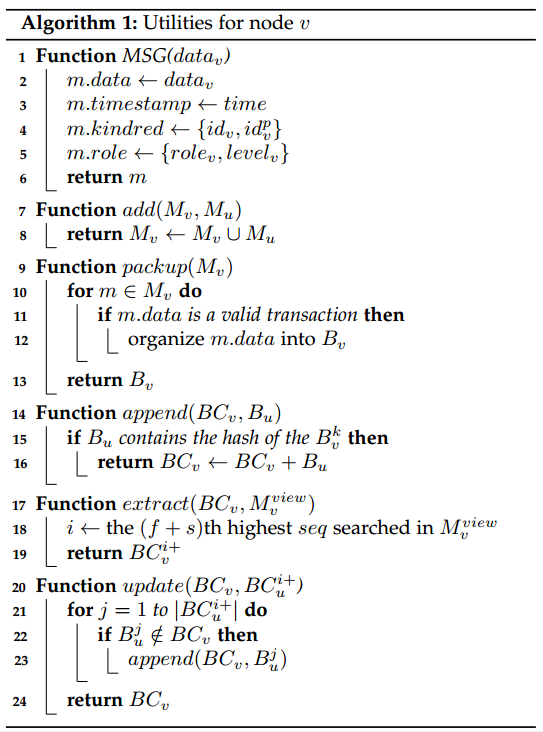
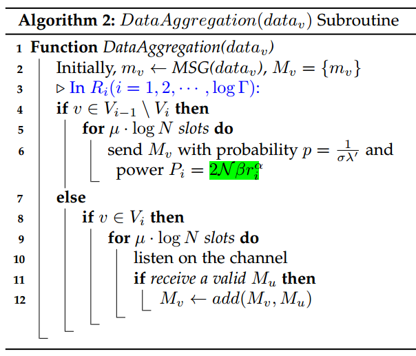
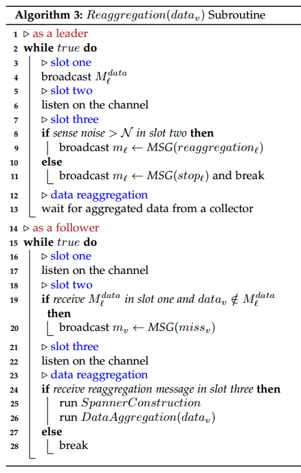
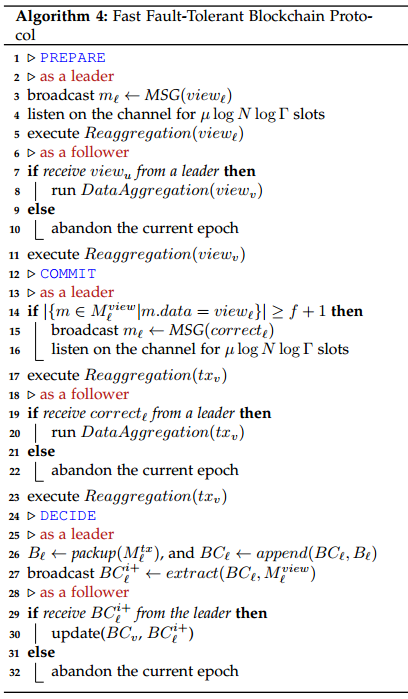

# wChain -- A Fast Fault-Tolerant Blockchain Protocol for Multihop Wireless Networks(M.Xu&etal, 2021)

主要从文章创新点、系统模型、协议框架、协议分析、仿真结果以及最终结论几个部分来介绍本文。

## 文章创新点

本文提出一种新的区块链协议wChain，适用于在实际SINR模型下的融合无线通信特性和区块链技术的多跳无线网络。本文采用了层级结构提升网络通信性能，并设计出相应的快速容错共识算法。通过数据聚合、数据重聚合以及节点恢复机制来确保协议的高效性、容错性和安全性。

## 系统模型

系统模型主要包含：区块链、网络模型、干扰和SINR模型、最大独立集和Spanner构造。
1. 区块链：
   1.1 每个节点维护局部的区块链；
   1.2 采用UTXO模型；
   1.3 节点采用非对称密码系统来确保消息的安全性；
2. 网络模型：考虑多跳无线自组织网络模型，每个节点具有唯一的ID并且除了网络大小以外并不知道其他信息，可以控制每个节点的传输功率减少干扰，假设节点可以随时崩溃，假设网络中节点的数量是奇数；
3. 干扰和SINR模型：本文采用信号干扰噪声模型；
4. 最大独立集：本文利用最大独立集来构造层级结构；
5. Spanner构造：通过构造出这种网络框架，可以减少通信，提升效率。主要是利用最大独立集来进行构造。

## 协议框架

wChain的设计主要包括节点函数功能的设计、数据聚合设计、数据重聚合设计和快速容错区块链协议设计。
1. 节点函数功能的设计，主要如下图：
   
   

2. 数据聚合与重聚合：通过快速将数据从跟随者聚合到首领，但是有可能存在节点消息丢失或者崩溃，因此重聚合算法可以解决这个问题，以确保首领可以在一个任期内聚合所有非故障节点的数据。算法如下：
   
   
   

3. 最后通过设计出一个三段式协议实现一系列区块达成共识，并控制由于节点崩溃造成的故障。算法过程如下：
   
   

## 协议分析

本文分析了协议数据聚合和重聚合的高效性以及协议本身的安全性（持久性和 活性）。
1. 数据聚合和重聚合的高效性：数据聚合运行时间的上界为$O(\log N\log \Gamma)$，重聚合运行时间的上界为$O(f\log N\log\Gamma)$.
2. 所有无故障节点维护相同的结果；
3. 当一个无故障节点提出一个交易时，所有的非故障节点将对这笔交易达成一致，部分故障节点并不能影响系统的运行过程。

## 仿真结果

为了验证wChain的性能，调查了主要影响因素：SINR模型参数、网络大小、节点最大距离与最小距离比$\Gamma$。通过吞吐量和任期长度作为衡量指标进行仿真分析。
1. 随着网络增加，任期时间也增加。网络增加，节点竞争增加，传输延时增加，因此任期将增加；
2. 网络的分布会影响吞吐量，均匀网络分布时，吞吐量比较好；
3. 任期时间随着$\Gamma$的增加而增加，层级越多，任期所需时间越长；
4. 吞吐量随着$\Gamma$的增加而降低，$Gamma$越大，任期时间越长，从而吞吐量降低；
5. 信号干扰噪声模型的参数对wChain的性能影响不明显。

## 最终结论

1. 影响wChain性能的主要因素是网络大小和$\Gamma$，同时网络节点的分布也会在一定成都上影响性能；
2. 本文考虑了SINR模型，那么设备功率是一个重要问题，这将影响到$\Gamma$的大小，进而影响到整个系统的性能。

## 问题讨论

1. 本文只考虑了节点崩溃故障，当节点出现拜占庭故障时，将会极大的影响到区块链的性能，比如若首领节点出现拜占庭故障，那么很长一串的区块将都有可能是不安全的，区块链质量会迅速下降；
2. 本文中没有讨论节点的抗攻击性，比如女巫攻击、爽滑攻击、阻塞攻击等；
3. 本文中在聚合数据时，数据到达率，排队时间等都会极大的影响到任期长度，这些因素的影响本文也没有进一步探讨。