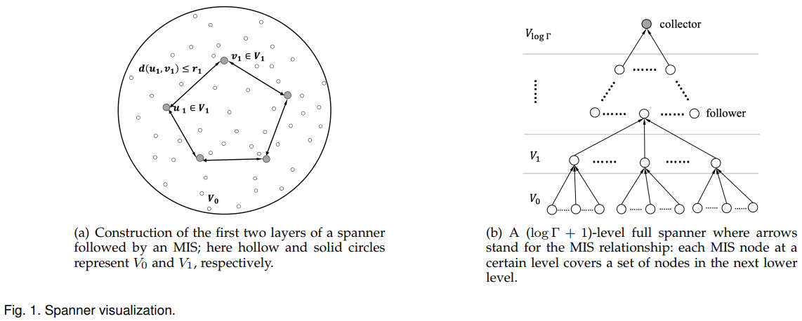

# wChain -- A Fast Fault-Tolerant Blockchain Protocol for Multihop Wireless Networks(M.Xu&etal, 2021)

[相关论文链接](../Papers/6.%20wChain_A%20Fast%20Fault-Tolerant%20Blockchain%20Protocol%20for%20Multihop%20Wireless%20Networks(M.Xu&etal,%20Jun.2021).pdf)

## 文章创新点

本文提出一种新的无线网络的区块链协议wChain。根据采用SINR模型的无线网络的特性，构建一个Spanner网络拓扑。利用无线网络多跳通信的特点，确定首领节点后生成区块并达成区块共识，最终实现区块链技术在多跳无线网络上的应用。该协议主要是通过一个三段式快速容错算法实现区块链共识，确保系统中非故障节点具有相同的全局视图。wChain协议通过数据聚合、数据重聚合以及节点恢复机制来确保协议的高效性、容错性（$\frac{1}{2}$）和安全性。

## 系统模型

系统模型主要包含：区块链基础、网络模型、干扰和SINR模型、最大独立集和Spanner构造。
1. 区块链基础：
   * 每个节点 $v$ 局部地维护区块链。记 $B_v^i$ 是 $BC_v$ 中第 $i$ 个区块，而 $BC_v^{i+}, BC_v^{i-}$ 分别是 $B_v^i$ 之前以及之后的 $BC_v$ 部分区块链。每个区块包含多个交易，而 $tx_i^j$ 表示在区块 $B_v^i$ 中的di $j$ 个交易。记 $BC_v$ 最近的区块为 $B_v^k$，那么节点 $v$ 的**视图**定义为元组 $\{seq, hash\}_v，其中 $seq, hash$$ 分别是区块 $B_v^k$ 的序列号和区块哈希。采用UTXO模型可以确保系统的安全性和可扩展性。节点采用非对称密钥机制来确保消息的安全性和完整性；
   * 网络模型：考虑多跳无线自组织网络模型，网络节点集合 $V$ 由 $N$ 个节点组成。接待你的位置采用二维地理平面记录。两个节点 $u, v$ 的距离记作 $d(u,v)$。记 $D_R(v)$ 为以 $v$ 为中心，以 $R$ 为半径的圆盘。而 $N_R(v)$ 是在圆盘 $D_R(v)$ 内包括节点 $v$ 在内的节点的集合。规范化每两个节点之间的最小距离为 $1$，并且记 $\Gamma$ 为任意两节点最大距离与最小距离的比。每个节点具有唯一的ID并且除了网络大小以外并不知道其他信息。可以控制每个节点的传输功率减少干扰。假设节点可以随时崩溃，并且网络中节点的数量是奇数，故障节点数量最大为 $f = \lfloor\frac{N}{2}\rfloor$；
   * 干扰和SINR模型：本文采用信号干扰噪声模型，能够很好的捕获无线网络的干扰。标准信号干扰噪声比模型为 $SINR = \frac{\mathcal{S}}{(\mathcal{I}+\mathcal{N})} \geq \beta$，其中 $\mathcal{S} = P\cdot d(u,v)^{-\alpha}$ 是节点 $v$ 从节点 $u$ 处接收信号功率，而 $P$ 是均匀信号发射功率；在节点 $v$ 处的干扰为 $\mathcal{I} = \sum_{w\in W\setminus{u}} P\cdot d(w,v)^{-\alpha}$，其中 $W$ 是在当前轮中传输的节点的集合。记环境噪声为 $\mathcal{N}$，路径损耗指数为 $\alpha\in(2,6]$，阈值 $\beta >1$ 取决于硬件。为了捕获细粒度噪声，定义 $\mathcal{N}$ 是由环境噪声。假设节点可以进行物理载波监听。
   * 最大独立集：集合 $W \subseteq V$ 是距离为 $r$ 的 $V$ 的**独立集**如果满足对任意节点 $u, v \in W$ 有 $d(u,v) > r$；集合 $W$ 称作**最大独立集**如果对任意节点 $s\notin W$ 存在一个节点 $x\in W$ 使得 $d(s,x)\leq r$ 成立。当节点密度为常数时，在最优时间 $O(\log N)$ 内可计算分布式的最大独立集。
   * Spanner构造：Spanner是一个具有如下性质网络拓扑：只需要维护少量链路进行全网通信。相较于其他网络拓扑，结构简单并且具有很好平衡效率。利用这中网络拓扑的优点。记 $H$ 为采用分布式Spanner构建算法以极大概率在 $O(\log N\log \Gamma)$ 时隙内构造具有最大维数界的稀疏Spanner，如下图所示：
   
   $H$ 的构建过程包含了 $\log\Gamma$ 轮，并且在第 $i \in \{1,2,\cdots, \log\Gamma\}$ 轮中，集合 $V_i$ 是运行分布式最大独立集算法从 $V_{i-1}$ 中选择的距离为 $r_i = 2^i$ 的节点的最大独立集。因此就有 $V_{\log\Gamma}\subseteq \cdots\subseteq V_1\subseteq V_0 = V$。构造的 $H$ 具有如下性质：
      * $V_i$ 中的节点是由 $V_{i-1}$ 中距离大于 $r_i$ 的节点构成；
      * 每个节点 $v\in V_{i-1}\setminus V_i$ d都有一个父节点 $u\in V_{i}$ 并且两节点的距离 $d(u,v) \leq r_i$;
      * 在集合 $V_{\log\Gamma}$ 中只包含一个节点，即根节点。在集合 $V_0\setminus V_{\log\Gamma}$ 与 集合 $V_{\log\Gamma}$ 中的节点分别为**跟随者**和**收集者**。
   * 对于任意 $c > 0$，事件 $E$ 以概率 $1 - N^c$ 发生，则称事件 $E$ 是高概率事件。

## 协议框架

wChain协议的主要包括节点函数功能部分（Utilities）、数据聚合算法（Data Aggregation Algorithm）、数据重聚合算法（Reaggregation Algorithm）和三段式快速容错区协议。
1. wChain整体架构
   * 本文中的wChain协议在每个不相交连续的事件段(Epoch)中执行，每个时期中最多有一个区块生成。诚实节点通过添加区块到局部链使得他们与全局试图保持一致。
   * 在每个任期，先建立一个用于通信的网络拓扑Spanner，随后Spanner的收集者作为整个协议wChain的在当前时期的首领。当出现奔溃故障时，通过当前时期的重聚集过程可以重构新的Spanner。此时收集者会发生变化，但首领不变。数据可以从追随者聚合到新的收集者，随后收集者将数据发给首领，从而完成当前任期的数据聚合过程。
   * wChain过程包含三个阶段：Prepare、Cimmit以及Decide：
      * **Prepare阶段：** 当前首领聚合所有追随者的**视图消息**，从而了解最新视图。如果超过 $f$ 个追随者返回相同的视图给首领，则首领进入Commit阶段聚合交易；否则首领发送消息给追随者，**放弃**当前任期；
      * **Commit阶段：** 首领从各个追随者处聚合交易；
      * **Decide阶段：** 首领验证收集到的交易，并将它们打包成区块，随后将新块与视图更新信息一起发送到整个网络。接收到区块与视图信息的网络节点可以更新其本地区块链以获得最新视图。
2. 节点功能函数
   * $MSG(data_v)$ 表示节点 $v$ 生成包含可变数据字段的消息 $m$，数据($data_v$)包括视图($view_v$)、交易($tx)v$)和区块($B_v$)。其他包括 $timestamp, kindred = \{id_v, id_v^p\}, role = \{roles, level\}$。消息 $m$ 是有效的如果具有正确的身份和角色信息。
   * 记 $M_v$ 是多个消息的队列。节点通过执行 $add(M_v, M_u)$ 将添加 $M_u$ 到节点 $v$ 的局部 $M_v$。
   * $packup(M_v)$ 可以读取所有 $M_v$ 中的所有消息，并将有效交易放在区块中；
   * $append(BC_v,B_u)$ 添加来自节点 $u$ 的区块 $B_u$ 到节点 $v$ 的局部区块链 $BC_v$ 上 如果满足 $B_u$ 包括 $BC_v$ 的最后一个区块的哈希；
   * $exact(BC_v, M_v^{view})$ 从区块链 $BC_v$ 中提取部分区块链 $B_v^{i+}$，其中 $i$ 是由在 $M_v^{view}$ 中第 $(f+s)$ 个最高序列号决定，并且 $s$ 是一个自适应常数。
   * 对于恢复更新函数 $update(BC_v, BC_u^{i+})$ 函数可以帮助节点 $v$ 根据接收到的 $BC_u^{i+}$ 更新局部区块链 $BC_v$ 中缺失的部分。具体的函数伪代码如下图所示：
      
3. 数据聚合与重聚合：
   数据聚合算法和重聚合算法的提出是为了在 $O(\log N\log\Gamma)$ 时隙内快速收集数据，并且防止由于节点崩溃故障使得消息丢失。最终首领可以在当前任期内完整的、高效的从非故障节点处聚合数据。
   * 原子广播通信：区块链在无线网络中通常使用无线媒体广播通信，而非单播或者多播。共识过程的通信模式通常分为三种：一对多、多对一以及多对多。采用广播通信可以降低通信复杂度提升效率。但对于无线网络通信中的媒体争用和包冲突的问题还需要解决。因此本文中假设传输概率为 $p_i$，传输功率为 $P_i$。
   * 数据聚合算法：利用Spanner网络拓扑，提出数据聚合算法。跟随者节点 $v$ 以数据 $data_v$ 作为输入生成消息 $m_v$，并且初始化 $M_v = \{m_v\}$。随后通过 $\log\Gamma$ 轮数据聚合，记 $R_i$ 为第 $i\in\{1, 2, \cdots, \log\Gamma\}$ 轮。节点 $v\in V_{i-1}\setminus V_i$ 存在一个父节点 $u\in V_{i-1}$ 满足 $d(u,v) \leq r_i$。因此 $R_i$ 轮是为了从 $V_{i-1}\setminus V_i$ 中收集数据到 $V_i$ 中；而 $R_{\log\Gamma}$ 是最终轮，收集者从 $V_{\log\Gamma -1}\setminus V_{\log\Gamma}$中收集数据。
      * 在一个特殊轮 $R_i$ 中， $V_{i-1}\setminus V_i$ 中的节点以概率 $p_i = \frac{1}{\sigma\lambda}$ 在 $\mu\cdot\log N$ 个时隙中发送消息 $M_v$。其中 $\mu\cdot\log N$ 是最优时隙数量可以确保在没有崩溃故障时，可以以极大概率将数据完整的从子节点收集到父节点。传输功率设为 $P_i = 2\mathcal{N}\beta r_i^{\alpha}$，每个节点的传输距离为 $2^{1/\alpha}r_i, r_i = 2^i$，这个传输距离稍大于 $r_i$ 从而避免由于信号干扰子节点无法将数据传输带父节点。此外，节点 $v\in V_i$ 作为父节点在 $R_i$ 轮中要监听信道接收来自其子节点的数据，时长为 $\mu\cdot\log N$。如果 $v$ 接收到其子节点 $u$ 的数据 $M_u$，就添加 $M_u$ 到 $M_v$。整个数据收集过程将在 $\mu\cdot\log N\log\Gamma$ 个时隙中完成，以极大概率完整接收到所有非故障节点的数据。具体算法伪代码如下图所示：
      
   * 重聚合算法：定义广播操作以 $\hat{P} = 2\mathcal{N}\beta r_{\log\Gamma}^{\alpha}$ 的功率传输消息，使得监听信道的节点要么接收到来自发送者的消息，要么监听到噪声超过 $\mathcal{N}$。
      * **三时隙完整性检查阶段：** 在第一个时隙中，首领 $\ell$ 广播当前数据集 $M_{\ell}^{data}$，跟随者节点监听信道；在第二个时隙中，跟随者节点 $V$ 接收到 $M_{\ell}^{data}$ 后检查数据 $data_v$ 是否在数据集中，如果不在，节点 $v$ 就广播消息 $m_v\leftarrow MSG(miss_v)$。首领节点监听信道发现噪声大于 $\mathcal{N}$，就知道有消息被遗漏；在第三个时隙中，首领节点广播重聚合消息 $m_\ell \leftarrow MSG(reaggregation)$ 并进入第二阶段；
      * **数据重聚合阶段：** 除了首领节点以外，所有节点执行Spanner构建算法重构无故障节点的Spanner。新的Spanner并不包括首领节点 $\ell$，并且选择一个新的收集者聚合数据到首领。直到所有无故障的节点都没有数据丢失时，首领将广播 $m_\ell \leftarrow MSG(stop_\ell)$ 结束重聚合过程。
      具体算法伪代码如下：
      

4. wChain通过一个三段式协议实现共识，并控制由于节点崩溃造成的系统故障。在每一个时期，协议主要有三个过程：Prepare阶段，Commit阶段以及Decide阶段：
   * **Prepare阶段：** 当前首领聚合所有追随者的**视图消息**，从而了解最新全局视图。首领节点 $\ell$ 广播 $m_\ell \leftarrow MSG(view_\ell)$ 到整个网络。每个跟随者 $v$ 一旦接收到来自 $\ell$ 的视图消息后，将执行 $DataAggregation(view_\ell)$。否则就**放弃**当前任期。所有节点将执行重聚合算法确保来自无故障节点的数据能够完整被聚合；
   * **Commit阶段：** 如果 $|\{m\in M_\ell^{view} | m.data = view_\ell\}| > f$，则首领接收到超过 $f$ 个来自追随者的相同的视图。那么首领广播正确的消息并监听信道接收交易，而追随者则收到正确的信号开始交易聚合。重聚合也会执行以确保交易能够全部被聚合；
   * **Decide阶段：** 首领 $\ell$ 收集到所有来自非故障节点的交易后，将交易打包成区块 $B_\ell$，并添加 $B_\ell$ 到其局部链 $BC_\ell$ 中。随后首领 $\ell$ 执行 $extract(BC_\ell, M_\ell^{view})$ 得到 $BC-\ell^{i+}$ 用于恢复至少 $s$ 个在之前任期中崩溃并且需要更新他们的区块链以成为非故障节点的节点。每个非故障的节点 $v$ 执行 $update(BC_v, BC_\ell^{i+}$ 更新其本地区块链 $BC_v$。
   具体算法未带吗如下图所示：
   

## 协议分析

本文分析了协议数据聚合和重聚合的高效性以及协议本身的安全性（持久性和 活性）。
1. 数据聚合和重聚合的高效性：
   * **定理1：** 数据聚合算法将以极大概率运行完成的时间上界为 $O(\log N\log \Gamma)$ 个时隙，重聚合以极大概率运行完成的时间上界为 $O(f\log N\log\Gamma)$ 个时隙。
   * **引理1：** 在轮 $R_i$ 中给定时隙，若 $v\in V_i$ 是节点 $u \in V_{i-1}\setminus V_i$ 的父节点。若节点 $u$ 传输消息，则节点 $v$ 将以恒定概率接收该消息。
   * 在数据聚合算法中，每轮的是由固定数量为 $\mu\cdot\log N$ 的时隙组成。在每个时隙中，子节点 $u\in V_{i-1}\setminus V_i$ 以概率 $p = \frac{1}{\sigma\lambda'}$ 恒定传输。引理1表明，在每个时隙中，节点 $u$ 可以以恒定概率 $\hat{p}$ 成功传输数据到节点 $v$。因此，在 $\mu\cdot\log N$ 个时隙之后，节点 $u$ 成功传输消息到节点 $v$ 的概率为 $1 - (1-\hat{p})^{\mu\cdot\log N} \geq 1 - e^{-\hat{p}\mu\cdot\log N} \geq 1 -N^{-2}$（若 $\mu \geq \frac{2}{\hat{p}}$）。当所有活动节点的密度界为 $\lambda' =25$ 时，所有子节点成功传输的概率为 $(1-N^{-2})^{\lambda'}$。
   * 假设所有节点有一个同步时钟。那么在每一轮 $R_i$ 中，不同独立集的节点可以同时发送消息到其父节点。那么数据被发送到在 $R_i$ 轮中所有父节点的概率至少为 $(1 - N^{-2})^{\lambda' V_{i+1}} \geq (1-N^{-1})$（当 $\lambda' V_{i+1} < N$ 时）。一轮中将以极大概率在 $O(\log N)$ 中完成数据聚合。而 $R_i \in \{1,\cdots, \log \Gamma\}$，因此数据聚合过程将极大概率在 $O(\log N\log\Gamma)$ 中完成。
   * 正常状态下数据聚合将极大概率在 $O(\log N\log\Gamma)$ 中完成。考虑系统中故障节点数量不超过 $f$，因此最多出现 $f$ 次Spanner重建和数据聚合过程。因此，给出运行时间的上界为 $O(f\log N\log\Gamma)$。
2. 一致性和活性
   * **定理2：（Persistence）** 若无故障节点 $v$ 宣布交易 $tx_v$ 的位置为 $tx_i^j$，那么其他无故障节点将返回相同的结果；
   * **定理3：（Liveness）** 当一个无故障节点生成一个交易并争相发送它。wChain可以以极大概率在 $T$ 个时隙中添加到区块链。当节点低频率出现崩溃故障时，$T$ 的上界为 $O(\log N\log\Gamma)$；并且最坏的情况时， $T$ 的上界为 $O(f\log N\log\Gamma)$。

## 仿真结果

为了验证wChain的性能，调查了主要影响因素：SINR模型参数、网络大小、节点最大距离与最小距离比 $\Gamma$。通过吞吐量和任期长度作为衡量指标进行仿真分析。
1. 随着网络增加，任期时间也增加。网络增加，节点竞争增加，传输延时增加，因此任期将增加；
2. 网络的分布会影响吞吐量，均匀网络分布时，吞吐量比较好；
3. 任期时间随着 $\Gamma$ 的增加而增加，层级越多，任期所需时间越长；
4. 吞吐量随着 $\Gamma$ 的增加而降低，$\Gamma$ 越大，任期时间越长，从而吞吐量降低；
5. 信号干扰噪声模型的参数对wChain的性能影响不明显。

## 最终结论

1. 影响wChain性能的主要因素是网络大小和 $\Gamma$，同时网络节点的分布也会在一定程度上影响性能；
2. 本文考虑了SINR模型，那么设备功率是一个重要问题，这将影响到 $\Gamma$的大小，进而影响到整个系统的性能。

## 问题讨论

1. 本文只考虑了节点崩溃故障，当节点出现拜占庭故障时，将会如何的影响到区块链的性能？
   * 本文中首领节点通过其他节点的数据不在收集的数据集中判定节点出现故障，从而执行重聚合算法重新构造Spanner并且收集数据。这主要是出现崩溃故障的节点将会不发送消息，通过比对数据集中的数据与节点发送的数据，将很容易被检查到。但拜占庭故障很难被系统检查到，首领节点无法根据数据集中的数据来判定是否需要执行重聚合算法。此外，当首领节点出现拜占庭故障时，其将不会使得这个任期由区块生成并达成共识，从而浪费了一个时期的时间。当跟随者节点或者收集者节点出现拜占庭故障，将一直发送自身数据未在数据集中，使得系统一直重聚及，从而导致无法生成区块达成共识。
2. 节点收集交易数量过大或者过小会造成什么后果？
   * 由于区块链中区块的大小一开始就是固定的，当交易数量过小，将所有交易打包成区块，并达成共识，只是影响交易吞吐量会变小；但是当交易数量超过区块能够接包含的最大交易数量，就会在成部分交易无法被确认到区块链上，使得最终交易丢失率很高。但是如果首领节点能够将所有交易都包含，在一个任期内就会生成多个区块，并添加不同的序列号，这使得当首领节点出现故障时，有可能这几个区块都是有问题的区块，从而降低区块链的质量，从而降低安全性；
3. 本文中没有讨论节点的抗攻击性，比如女巫攻击、双花攻击、阻塞攻击等；
   * 这是因为女巫攻击、双花攻击、阻塞攻击等都是节点出现拜占庭故障才会发起的攻击。比如发起女巫攻击的节点可以伪造多个假名，从而节点出现的是拜占庭故障，节点通过多个假名发送消息谎称有多个节点。此外，双花攻击通过发送具有相同输入的两笔交易，但是这样的交易在数据聚合到首领节点就会出错，首领节点验证交易的正确性之后，要么认定其中一个交易有效，要么认为两个交易都无效，因此不会出现双花攻击成功的现象。而阻塞攻击通过发送干扰信号降低接收节点的信噪比，从而打断无线通信。这个剁成会使得节点无法成功接收数据，最终该节点的发送数据不会出现在数据集中，随后首领节点将会运行重聚合算法。由于本文考虑的是信号干扰噪声模型，因此已经将阻塞攻击考虑在内了。
4. 本文中在聚合数据时，数据到达率，排队时间等都会极大的影响到任期长度，这些因素的影响本文也没有进一步探讨。
   * 本文中讨论协议性能时，重点只考虑了交易吞吐量。但是交易确认时延和交易丢失率也是在无线区块链系统需要计算的重要性能指标。而这几个指标与设交易到达率、交易传输速率以及数据发送的概率息息相关。因此网络负载的大小，将会影响这几个指标。本文通过节点传输概率和节点密度上界计算出所有子节点在一轮中将数据成功发送到父节点的概率。这样计算的前提是假设节点在一个时隙中能够成功发送所有数据到父节点，稍微有点不合理。在分析时，应该考虑不同网络负载下，节点发送数据的大小、节点交易到达率，节点发送概率以及包冲突概率等因素的对于交易确认时延、吞吐量和交易丢失率影响。以此来分析协议的性能。此外任期的长度与区块传输时间也有很大的关系，当区块非常大时，使得传输舒颜很长，进一步加长任期时长。交易排队时间主要时影响交易确认时间。