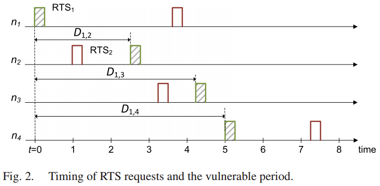
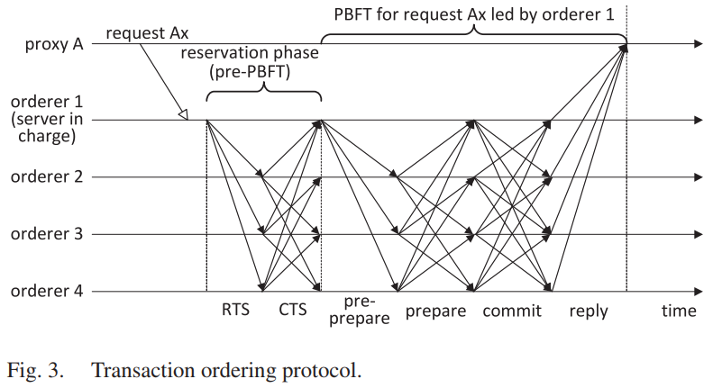
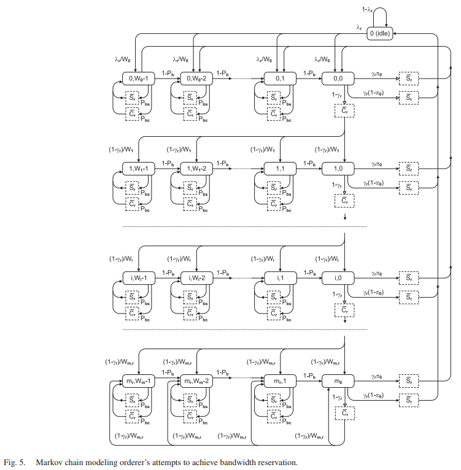

# Adapting PBFT for Use With Blockchain-Enabled IoT Systems(J.Misic&etal, 2021)

[相关论文链接](../Papers/8.%20Adapting%20PBFT%20for%20Use%20With%20Blockchain-Enabled%20IoT%20Systems(J.Misic&etal,%20Dec.2021).pdf)

## 文章创新点

本文的主要贡献是提供了一个PBFT的排序服务，可用于许可区块链的区块生成。本服务允许每个排序节点充当接入点，这些接入点可以提出并且执行分布式帐本中插入新记录的共识过程。本文开发了一个带宽预约协议，该协议利用修改的CSMA/CA协议来调节通过TCP连接的排序节点的P2P网络的广播媒体的接入。本文在一个由随机分布在笛卡尔坐标系的排序节点构成的簇中建模了记录插入服务时间，并且对账本的总请求接入时间（包括在排序节点队列中的等待时间和记录、交易插入时间）进行了建模。这些建模都可以用于在可变排序服务请求率、可变节点数量和可变物理簇纬度下评估系统的性能。最终结果表明：在给定总请求到达率时，当增加排序节点数量时，降低排队节点的队列中请求等待的时间与提升排序节点之间的争用的相互影响。因此，请求到达率、排序节点数量和物理簇的大小决定了系统的总请求到达率。这些建模也可以用于在拜占庭故障约束下，对系统的性能、排序节点的数量以及物理簇的纬度之间进行权衡。

## 系统架构

### 系统假设

1. 假设系统是由任意多个物联网域组成，这些物联网域可以分布在很大的地理区域；
2. 每个物联网域包含至少一个可以从物联网设备收集（直接或通过一个或多个物联网网关）数据（组成记录或者交易）的物联网代理；
3. 相较于普通的物联网节点，代理和网关拥有更多算力和 通信能力；
4. 网关可以在正向模式下工作也可以在反向模式下工作；
5. 系统包括多个排序服务器，用于在他们的内存池中实现记录/交易的全序；
6. 所有排序节点都通过TCP连接形成一个全连接图，每个代理使用TCP连接来连接多个排序节点，代理的主排序服务器应该是具有最小往返时间的那个排序节点，其他拥有更大往返时间的排序服务器用作备用，以防主排序服务器出现故障，或用于排序服务器之间负载均衡；
7. 每个排序服务器都保留有一个内存池，用于存放还未打包到区块中的记录/交易，这些记录/交易都有有全序的。
8. 当排序服务器中故障服务器不超过$\frac{1}{3}$时，插入服务依然可以在内存池中实现记录/交易全局排序。

### 协议

#### 广播带宽预约协议
   
物联网在PBFT协议的基础上加入了带宽预约协议，该协议用于对提出的交易/记录进行一个全局排序。该协议时基于建立在排序节点上的广播通信媒体，所有的的排序节点都要持续侦听所有其他节点对应的TCP套接字。利用CSMA/CA协议的原理使得其他排序节点不会出现冲突访问。

1. 带宽预约的自适应CSMA/CA协议
   带宽预约协议的算法步骤如下：
   * 排序节点在收到$2f + 1$条Commit消息时，确认上一轮的插入记录操作已经完成，排序节点通过所有TCP连接发送一个RTS消息（包括网络分配向量——达成共识的最长时间）给其他排序节点；
   * 当节点接收到RTS消息之后将回复CTS消息（包括源节点ID，请求ID，但节点并不是立刻回复CTS消息）。
   * 节点发送CTS消息表明在请求节点处理完当前请求之前，不会代表其他客户进行带宽预约。随后就开始当前请求的PBFT协议的运行(Pre-Prepare, Prepare, Commit)

带宽预约协议过程容易发生RTS的虚拟冲突，即两个节点在一个单向传输时间内都发出RTS请求。为了确保协议对虚拟冲突的抗性，必须要测量参数——脆弱周期长度和超时长度，多个节点的RTS请求的时间图如下：

2. 脆弱周期长
   脆弱时间长度的定义在./Notes/7.md中已经给出详细描述，具体如下：
   * 令$D_{i,\ell}$是节点$i$ 发送RTS到节点$\ell$发送时延，因此，为确定最大脆弱周期长度，假设节点$i$ 在$t_0 = 0$时刻发送了RTS后，节点$\ell$将有可能在$t = t_0 + T_\epsilon, 0\leq T_\epsilon < D_{i,\ell}$时刻发送另一个RTS。若其他节点发现信道中存在两个不同节点发送的RTS，则不会回复CTS消息。
   * 若节点$x\in(i,\ell）$是RTS消息首先到达的节点标记，则节点$\omega$的脆弱时间长度为：
      $\Delta_\omega = max_{j\neq x, \omega}(D_{i,j} + D_{j,\omega} - min(D_{i,\omega}, T_\epsilon + D_{\ell,\omega}))$。
      由于$0 < T_\epsilon < D_{i,\ell}$，因此可以计算得到两个边界值如下：
      $\lim_{T_{\epsilon} \rightarrow D_{i,\ell}} = max_{j\neq x, \omega}(D_{i,j} + D_{j,\omega} - min(D_{i,\omega}, D_{i,\ell} + D_{\ell,\omega}))$
      $\lim_{T_{\epsilon} \rightarrow 0} = max_{j\neq x, \omega}(D_{i,j} + D_{j,\omega} - min(D_{i,\omega}, D_{\ell,\omega}))$
   因此最终得到每个节点或整个网络的脆弱周期长度为 $\Delta_{\max} = 2\max(D)-\min(D)$，其中 $\max(D) \& \min(D)$分别是网络中最大和最小单向延时。

3. RTS-CTS周期超时估计
   节点接收到RTS消息之后，等待一个脆弱周期，若没有别的RTS消息发出，就组播回复CTS消息。因此当没有RTS冲突时，可以估计超时回复的最长时间。
   * 节点接收到来自节点$i$的RTS之后，并且没有RTS冲突后，节点$\omega$立即回复CTS消息，节点$i$接收到CTS消息的最大延时为：$T_{CTS_{i,\omega}} = 2D_{i, \omega}+\Delta_\omega = D_{i,\omega} + max_{j\neq i,\omega}(D_{i,j} + D_{j, \omega})$。
   * 节点$i$收集所有CTS回复消息的超时窗口为：$TO_i = max_\omega(T_{CTS_{i,\omega}}) = max_{\omega}(D_{i,\omega} + max_{j\neq{i,\omega}}(D_{i,j} + D_{j,\omega}))$。

   根据上述表达式，我们可以得到一个RTS-CTS周期的超时估计为：$TO = 3\max(D)$，其中$\max(D)$是排序节点之间的最大单项传输延时。

#### 记录/交易排序协议

在执行完贷带宽预约协议确定了请求提出者之后，开始执行PBFT算法对交易/记录进行排序后插入交易池中，融合算法执行过程的示意图如下所示：

融合带宽预约的PBFT算法执行过程如下：
   * 代理收集一批记录/交易后将提交给直接相连的排序节点（最好是往返时间最短的节点），当在规定时间未收到排序节点的回复时，新的排序节点会被重新选择作为接收请求的服务器（假设节点$i$被选中为该批次的排序服务器）；
   * 排序节点$i$会将接收到的请求按照先入先出的原则加入到其请求队列中，当请求到达队首，排序节点将会根据内存池中交易的序列号为记录/交易分配暂定序列号；
   * 排序节点$i$检查是否已经收到最近请求的$2f+1$条Commmit消息，若收到，则开始为即将进行的原子广播预约带宽，发送RTS消息给所有排序节点，否则就需要等到上一个记录/交易请求插入完成；
   * 当请求排序节点收到$2f$条关于预约带宽请求的回复消息CTS时，节点就可以开始原子广播Pre-Prepare消息给所有排序节点；
   * 要求Pre-Prepare消息在最大允许单向传输时间内到达其他排序节点，节点若接收Pre-Prepare消息将检查提出的记录/交易的序列号是否与内存池中已有的序列号冲突。若不冲突，广播Prepare消息给其他所有排序节点；
   * 每个排序节点需要接收到$2f$条Prepare消息，之后就广播Commit消息到所有其他排序节点；
   * 当每个节点接收到$2f+1$条Commit消息后将对请求的内容和序列号达成一致，并将记录/交易插入到内存池中，释放带宽预约，并开始新一轮请求的带宽预约。
  
  1. 区块形成
      * 当内存池中的记录/交易数量超过阈值时，或者区块生成的时间周期超时了，排序节点（可以时上一个完成记录/交易插入过程的节点，或者利用公式$ID = K\mod N$，其中$K$是区块链长，$N$是排序节点的总数量，计算得到的节点ID，主节点的选择可以根据实际情况进行选择）将会初始化创建一个新的区块。对于区块达成共识的算法是融合带宽预约协议的PBFT算法，执行的过程与记录/交易插入过程基本一致.随后，所有排序节点都会连接新区块，并分不到所有代理上。

   2. 在执行带宽预约协议时，当出现RTS冲突时，将声明RTS冲突，并在请求重传之前执行新的回退。在执行回退的过程中，排序节点将持续侦听TCP套接字，并在传输PBDT内容时暂停回退。

## 建模分析

### 多接入PBFT建模

记排序节点数量为$n_{ord} = 3f+1$，其中$f$是故障排序节点的最大数量。节点放在一个笛卡尔直角坐标系系统中，则排序节点$i$的横纵坐标范围表示为$0\leq d_{x_i}, d_{x_j}\leq R$。单项传输延时的概率分布可以由节点之间的距离得到，因此假设两节点之间的单向延时的横纵组成分别为$x\in\{0, S_c\}, y\in\{S_c\}$。通过这两个分量，可以从地理位置的角度计算得到两个节点的总延时。因此，单向延时的概率密度函数和累积分布函数分别为：

$D(u) = \frac{(6u^2\pi(S_c)^2 + 3u^4 -16S_cu^2)}{6(S_c)^4s_0}$
$d(u) = D'(u)$

为了对修改的PBFT的组成进行建模分析，需要对消息发布者和接收者之间的最大单向延迟的概率分布以及RTS发布者收集所有CTS响应的超时时间进行建模分析。

#### 最大单向延时估计

对于一个节点的最大单向延时的累积概率为: $P(\max(D_1) <u) = P(D_{1,2}<u)\cdot P(D_{1,3}<u)\cdots P(D_{1,n_{ord}}<u)$。由此计算得到最大单向延时的累积分布函数为 $\max(D_1(u)) = \prod_{i=2}^{n_{ord}}D_{1,i} = D(u)^{n_{ord}-1}$。当网络中的所有节点的单向传输延时遵循相同的概率分布时，网络中任意排序节点的最大单向延时都可以用上式表示，即$\mathcal{D}(u) = \max(D_1(u))$。随后可以计算得到最大单项传输延时的概率密度函数、均值以及拉普拉斯-斯蒂尔切斯变换（LST）分别为：
$\mathfrak{d}(u) = \frac{\mathcal{D}(u)}{du}$
$\overline{\mathcal{D}} = \int_{u=0}^{S_c} u\mathfrak{d}(u)du$
$\mathcal{D}^*(s) = \int_{u=0}^{\infty} e^{-su}\mathfrak{d}(u)du$

由此可以得到最大往返时间为两个最大单向延时时间，即$\mathcal{R}^*(s) = (\mathcal{D}^*(s))^2$。

#### RTS-CTS最大周期估计

节点接收CTS的最大超时时间为两个最大单向延时时间，其概率密度函数和累积分布函数分别为：
$td(x) = \int_{u = 0}^{x} d(u)d(x-u)du$
$tD(u) = \int_{x = 0}^{u} td(x)dx$

根据和的最大值计算得到两跳节点的最大延时概率为:$P(\max(tD_1) <u) = P(D_{1,2,4}<u)\cdot P(D_{1,3,4}<u)$，定义$tD(u) = P(tD <u)$，则最大两跳延时为$\max(tD(u)) = (tD(u))^{n_{ord}-2}$，因此最大两跳延时的概率密度函数和LST分别为：
$t(u) = \frac{d(\mathcal{J}(u))}{du}$
$\mathcal{J}^*(s) = \int_{u=0}^{\infty}e^{-su}t(u)du$

从而计算得到最大两跳延时和最大单跳延时和的概率密度函数和累积分布函数分别为：
$t\omega d(y) = \int_{u=0}^y d(u)td(y-u)du$
$t\omega D(u) = \int_{x=0}^u t\omega d(y)dy$

因此计算得到一个排序节点的最大延时的概率分布为：

$\mathcal{W}(u) = (twD(u))^{n_{ord{-1}}}$
$w(u) = \frac{d(\mathcal{W}(u))}{du}
$\mathcal{W}^*(s) = \int_{u=0}^{\infty} e^{-su}w(u)du$

对于LST不太好计算，可以用伽马分布近似$w(u)$，计算得到:

$\overline{\mathcal{W}} = \int_{u=0}^{\infty} uw(u)du$
$var(\mathcal{W} = \int_{u=0}^{\infty} u^2w(u)du - \overline{\mathcal{W}}^2$

最后计算得到发起一个RTS请求的超时时间估计为 $TO = \overline{\mathcal{W}} + k\sqrt{var(\mathcal{W})}$。此外运行PBFT的三个阶段所需时间的LST均等于$\mathcal{D}^*(s)$，由此计算得到在没有冲突时，插入记录所花费的总时间为
$T_{ins}^*(s) = \mathcal{W}^*(\mathcal{D}(s))^3$
平均值为: $\overline{T_{ins}} = -T_{ins}^{*'}(0)$。总插入时间（考虑到来自代理的提交时间和对代理的答复时间）的LST为：
$T_{ins,tot}^*(s) = T_{ins}^*(s)e^{-\ell_d s}(T_c^*(s))^2$

### 两节点之间单向延时概率分布

单向传输延时概率分布可由节点之间的距离导出，假设节点之间路由器数量（排队延时）与距离成正比。单项传输延时可计算为:
$D(i,j) = (\frac{1}{v} + \kappa)\sqrt{(dx_i - dx_j)^2 + (dy_i -dy_j)^2}$，其中电磁波的速度是$v \approx 2.∗ 108 m/s$，$\kappa$是表示路由器排队延迟影响的比例系数。由于排序节点$i$的横纵坐标范围表示为$0\leq d_{x_i}, d_{x_j}\leq R$，两节点之间的单向延时的横纵组成分别为$x\in\{0, S_c\}, y\in\{S_c\}$。因此就有$S_c = (\frac{1}{v} + \kappa)R$. 给定节点的笛卡尔坐标后，计算得到两节点的单向传输延时的概率密度函数的过程可以分为好几个步骤：
1. 计算得到$Z = |X_1 -X_2|$的分布：
   * 概率分布函数为$F_{Z，S_c}(z) = (1-(1-\frac{z}{S_c})^2)$
   * 概率密度函数为$f_{Z，S_c}(z) = F_{Z，S_c}'(z) = \frac{2}{S_c}(1-\frac{z}{S_c})$。
2. 计算得到$Y = (X_1 - X_2)^2$的分布:
   * 概率分布函数为$F_{Y，S_c}(y) = (1-(1-\frac{\sqrt{y}}{S_c})^2)$
   * 概率密度函数为$f_{Y，S_c}(y) = F_{Y，S_c}'(y) = \frac{1}{S_c\sqrt{y}}(1-\frac{\sqrt{y}}{S_c})$。
3. 计算得到$W = 2Y$的分布:
      $f_{W}(w) = \int_{y=0}^w f_Y(y)f_Y(w-y)dy = \pi + w -4\sqrt{w}$， $s_0 =  \int_{w=0}^{w_0} f_W(w)dw$， 且$\hat{f}_{W}(w) = \frac{f_{W}(w)}{s_0}$，概率分布函数为$F_W(w) = \int_{x=0}^w\hat{f}_{W}(x)dx = \frac{w\pi + 0.5w^2 - \frac{8}{3}w^{3/2}}{s_0}$。
   * 概率分布函数为$F_{W，S_c}(w) = \int_{x=0}^w\hat{f}_{W,S_c}(x)dx = \frac{6w\pi + 3w^2 - 16S_cw^{3/2}}{6(S_c)^4s_0}$
   * 概率密度函数为$\hat{f}_{W，S_c}(w) = \frac{f_{W,S_c}(w)}{s_0}$。其中$f_{W,S_c}(w) = \int_{y=0}^w f_{Y,S_c}(y)f_{Y,S_c}(w-y)dy = \frac{\pi(S_c)^2 + w -4S_c\sqrt{w}}{(S_c)^4}$
4. 计算得到$U = \sqrt{W}$的分布
   * 概率分布函数为$F_{U，S_c}(y) = F_{W,S_c}(u^2) = \frac{6u^2\pi (S_c)^2+ 3u^4 - 16S_cu^3}{6(S_c)^4s_0}$
   * 概率密度函数为$f_{U，S_c}(y) = F_{U，S_c}'(u)$。

### 记录插入服务的CSMA/CA建模

随后本文对记录插入服务的无冲突的CSMA/CA进行建模分析。主要根据带宽预约协议的步骤来进行分析。当节点出现RTS冲突时，节点需要回退后重传，回退窗口在$(1, W-1)$中进行均匀选择。每次重传，窗口大小会乘2，比如第$i$次重传的回退窗口大小为$W_i = \min(2^{i-1}W_{\min}, W_{\max})$，其中$W_{\min}, W_{\max}$的选择取决于系统中排序节点的数量。

####  基于CSMA/CA原理的PBFT带宽预留分析模型

假设所有的报头和请求负载都以相同的数据速率$R$进行传输，每个回退时隙为$\delta_B = R\delta$，包含所有嵌套协议数据单元的总报头大小为$H_{all}, H_{dr} = \frac{H_{all}}{\delta_B}$，RTS/CTS消息的负载为$rc$比特，在时隙中的大小为$rts = cts = \frac{H_all + rc}{\delta_B}$。数据插入请求的字节大小为$\ell_{db}$，当包含报头时，在时隙中请求的大小为$\ell_d = \frac{8\ell_{db}+H_{all}}{\delta_B}$。
* 成功的带宽预约请求传输时间的LTS为$Sr^*(s) = e^{-s(rts+cts+3)}T_{ins}^{*}(s)$，其中分离时隙也加入了表达式，均值为$\overline{Sr} = -Sr^{*'}(0)$。成功请求传输的概率母函数为$Sr(z) = z^{rts+cts+\overline{T_{ins}}}$。当出现RTS冲突包时，媒体上不成功的持续时间的概率母函数为$Cr(z) = z^{rts+cts++3+TO}$。每个节点成功接入的概率为$\tau_r$，每个排序节点请求成功传输的概率为$\gamma_r = (1-\tau_r)^{n_{ord}-1}$，失败的概率为$1 - \gamma_r$。
* 排序节点检测到由于其他$n_{ord}-1$个之间成功传输而导致媒体忙碌的概率为$P_{bs} = (n_{ord}-1)\tau_r(1-\tau_r)^{n_{ord}-1}$；
* 排序节点检测到由于其他$n_{ord}-1$个之间冲突导致媒体忙碌的概率为$P_{bc} = 1 - (1-\tau_r)^{n_{ord}-1} - P_{bs}$；
* 由于其他排序节点接入而使得目标节点回退计数暂停的概率$P_b = P_{bs}+P_{bc}$。

1. 目标节点执行两个连续的回退计数之间的持续时间的概率母函数为:$\beta(z) = z\gamma)r + (P_{bc}Cr(z) + P_{bs}Sr(z))\beta(z)$
2. 回退阶段持续时间的概率母函数为：$B_i(z) = \sum_{i=0}^{W_i -1}\frac{\beta^k(z)}{W_i} = \frac{(\beta(z))^{W_i} - 1}{W_i(\beta(z)-1)}$，其中$W_i = 2^iW_0, \text{for }i\leq m_r$，以及$W_i = 2^{m_r}W_0, \text{for }i > m_r$。
3. 请求服务时间的概率母函数为：$T_r(z) = \sum_{i=1}^{m_r+1}(\prod_{j=0}^{i-1}B_j(z))(1-\gamma_r)^{i-1}C_r(z)^{i-1}\gamma_r S_r(z) + (\prod_{j=0}^{m_r}B_j(z))\cdot\sum_{i = m_r+2}^{\infty}B_{m_r}(z)^{i-m_r}(1-\gamma_r)^{i-1}C_r(z)^{i-1}\gamma_rS_r(z)$。
4. 假设请求的zong'wai'bu到达速率为每秒$\lambda_s$，若请求时均匀分布在每个排序节点上，那么单个排序节点的每秒的请求到达速率为$\lambda_{r,s} = \frac{\lambda_s}{n_{ord}}$，每个时隙的到达速率为$\lambda_r = \lambda_{r,s}\delta$，单个排序节点的有效负载为：$\rho_r = \lambda_r\overline{T_r}$。

#### 排序节点接入概率的计算

使用CSMA/CA协议的系统中，每个排序节点的接入的概率可以使用马尔科夫链来建模分析。排序节点带宽预约的离散时间马尔科夫链如下图所示：

1. 通过为每个状态设置一个平衡方程以及对方程求解可以得到DTMC的解。接入概率是$\tau_r = \sum_{i=0}^{m_r}\sigma_{i,0}$，其中DTMC的每个状态的概率为$\sigma_{i,j}$， 其中$i = 0 \cdots m_r, j= 0, \cdots, W_i - 1$。记$\pi_0$为请求离开后排序节点队列为空的概率。空闲平衡方程的概率为$P_i = P_ie^{-\lambda_r} + \tau_r\gamma_r\pi_0$，泰勒展开前两项得到近似解为$P_i = \frac{\tau_r\gamma_r\pi_0}{\lambda_r}$。第一次回退的平衡方程为$\sigma_{0,W_i-1} = \frac{P_i\lambda_r}{W_0} + \frac{\tau_r\gamma_r(1-\pi_0)}{W_0} + \sigma_{0,W_i-1}P_b$。最后计算得到排序节点接入概率为$\tau_r = (\frac{\gamma_r\pi_0}{\lambda_r} + \sum_{j=0}^{m_r}\gamma_r(10\gamma_r)^j+ \sum_{j=0}^{m_r}\frac{(W_j-1)\gamma_r(1-\gamma_r)^j}{2(1-P_b)}(P_c\overline{C_r} + P_s\overline{S_r}) + \frac{(W_{m_r}-1)(1-\gamma_r)^{(m_r-1_)}}{1(1-P_b)}(P_c\overline{C_r} + P_s\overline{S_r}) + \gamma_r\overline{S_r} + (1-\gamma_r)\overline{C_r})^{-1}$。
2. 排序节点中的请求排队时间分析：
   * 队列服务时间概率分布等于请求服务的时间，其LTS为$T_r^*(s) = T_r(e^{-s})$，因此在请求服务时间内请求到达数量的概率分布为$A_r(z) = T_r^*(\lambda_r - \lambda_rz)$；
   * 排序节点队列请求数量的概率母函数为$\Pi_r(z) = \frac{A_r(z)(1-\rho_r)(1-z)}{A_r(z) - z} = \sum_{i=0}^{\infty}\pi_{r,i} z^i, \pi_{r,0} = \Pi_r(0) = 1 - \rho_r$；
   * 记请求回复时间的LTS为$S_r^*(s) = W_r^*(s)T_r^*(s)$，其中$W_r^*(s)$是请求在节点队列中的等待时间。离开数据包数量等于数据包在系统中到达的数据包数量：$\Pi_r(z) = W_r^*(\lambda_r - \lambda_rz)T_r^*(\lambda_r - \lambda_rz)$。请求恢复时间的LTS为$S_r^*(s) = \frac{s(1-\rho_r)T_r^*(s)}{s - \lambda_r + \lambda_rT_r^*(s)}$，其均值和方差分别为$\overline{S_r} = \overline{T_r} + \frac{\lambda_rT_r^{}(2)}{2(1-\rho_r)}, var(S_r) = T_r^{}(2) + \frac{\lambda_rT_r^{}(3)}{2(1-\rho_r)} + \frac{\lambda_rT_r^{}(2)\overline{S_r}}{(1-\rho_r)} -\overline{S_r}^2$

## 性能估计

通过前面的建模分析，本文主要关注在系统总负载不断增加的过程中，排序节点数量、地理集群覆盖率对多接口PBFT系统性能的影响。建模分析了排序系统的通信、估计了请求回复时间和系统容量。
1. 给出不同排序节点的单向延时概率分布和最大单向延时，并且用红色虚线表示伽马近似，结果表明计算出的分布与伽马近似值的拟合非常好；
2. 平均最大单向延时与平均记录插入时间都随排序节点的数量以及单向延时跨度的增加而增加；
3. 在小集群中，请求服务时间短，容量限制比较高，当中小集群中排序节点数量增加时，每个排序节点的负载会降低，这回减少队列时间，降低媒体访问概率；
4. 平均请求服务时间随着排序节点数量的增加而线性增长，这是由于RTS冲突平频率增加，接近容量限制，并且由于请求成功，回退计数终止；
5. 平均系统响应时间包括等待时间和请求服务时间。平均系统响应时间主要受到记录插入时间的影响，因此会随着排序节点数量的增加而增加。随着总负载的增加，接入访问时间增加是因为队列时间会随着负载增加而增加，等待时间主要受排序节点队列请求数量的影响。因此平均响应时间会受到总负载量和排序节点数量的影响。

## 最终结论

1. 由于排序节点之间存在争用，因此增加排序节点数量会提升容量和请求服务时间；
2. 当排序节点书来给你增加时，会减轻单个节点的负载，降低请求队列时间；
3. 排序节点的数量提升会增加RTS冲突的概率和接入访问交互的时间；
4. 增加排序节点的数量会提升每个节点的有效负载，但是也会提升最大单向延时和媒体之间争用的机会；
5. 提升节点之间的物理距离将会提升用于插入记录到分布式账本中所需要的时间。

## 问题提出与解决

1. 对于多接口的PBFT系统，排序节点一种是静态的将会不利于系统的安全性，也就是说，该系统中排序节点的数量一开始就固定了，这类节点不能随意的进出系统，并且这类节点的数量特别少，使得整个系统容易受到攻击造成系统崩溃。
   * 本文中的系统实现应该需要一个授权过程，否则系统容易被女巫攻击成功，使得恶意节点能够随意操纵系统。此外，也可以将系统设计成一个开放的系统，节点能够随意进入系统，并通过选举进入委员会（成员执行共识算法），并且共识委员会中的成员可以进行轮换，或者是采用一些防止女巫攻击的手段尽可能的避免委员会中的结果被恶意节点控制。

2. 系统的性能很大程度上受到排序节点数量以及节点的地理位置的影响，这会有什么后果？
   * 不管是最大单向延时还是平均系统响应时间都会受到节点数量的影响，当节点数量增加到非常大的时候，RTS冲突的概率会增加，系统响应时间会增加，从而降低系统的性能，这表明系统的扩展性将非常差。

3. 本文中交易插入排序与区块共识都是使用相同的算法，并且都是相同的节点承担此功能，这对于这类节点的负担是否太大了？
   * 可以通过解耦交易插入排序和区块共识过程，使得这两个过程可以同时并行实现，来提升系统性能，降低对于重要节点设备的损耗。比如，将交易插入排序过程在代理层实现，而区块打包达成共识的过程就在上层的共识节点中实现，两个过程尽可能的并行，具体的我还没想好，也许可以。