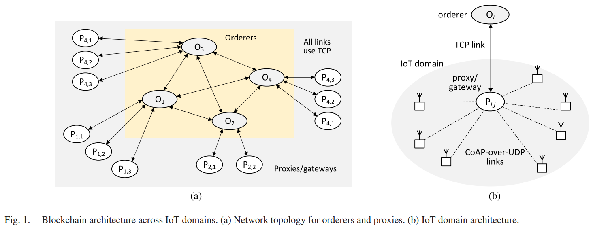

# Adapting PBFT for Use With Blockchain-Enabled IoT Systems(J.Misic&etal, 2021)

主要从文章创新点、系统架构、协议框架、协议分析、性能估计以及最终结论几个部分来介绍本文。

## 文章创新点

本文的主要贡献是提供了一个PBFT的排序服务，可用于许可区块链的区块生成。本服务允许每个排序节点充当接入点，这些接入点可以提出并且执行分布式帐本中插入新记录的共识过程。本文开发了一个带宽预约协议，该协议利用修改的CSMA/CA协议来调节通过TCP连接的排序节点的P2P网络的广播媒体的接入。本文在一个由随机分布在笛卡尔坐标系的排序节点构成的簇中建模了记录插入服务时间，并且对账本的总请求接入时间（包括在排序节点队列中的等待时间和记录、交易插入时间）进行了建模。这些建模都可以用于在可变排序服务请求率、可变节点数量和可变物理簇纬度下评估系统的性能。最终结果表明：在给定总请求到达率时，当增加排序节点数量时，降低排队节点的队列中请求等待的时间与提升排序节点之间的争用的相互影响。因此，请求到达率、排序节点数量和物理簇的大小决定了系统的总请求到达率。这些建模也可以用于在拜占庭故障约束下，对系统的性能、排序节点的数量以及物理簇的纬度之间进行权衡。

## 系统架构

### 系统假设

1. 假设系统是由任意多个物联网域组成，这些物联网域可以分布在很大的地理区域；
2. 每个物联网域包含至少一个可以从物联网设备收集（直接或通过一个或多个物联网网关）数据（组成记录或者交易）的物联网代理；
3. 相较于普通的物联网节点，代理和网关拥有更多算力和 通信能力；
4. 网关可以在正向模式下工作也可以在反向模式下工作；
5. 系统包括多个排序服务器，用于在他们的交易池中实现记录/交易的全序；
6. 所有排序节点都通过TCP连接形成一个全连接图，每个代理使用TCP连接来连接多个排序节点，代理的主排序服务器应该是具有最小往返时间的那个排序节点，其他拥有更大往返时间的排序服务器用作备用，以防主排序服务器出现故障，或用于排序服务器之间负载均衡；
7. 每个排序服务器都保留有一个交易池，用于存放还未打包到区块中的记录/交易，这些记录/交易都有有全序的。
8. 当排序服务器中故障服务器不超过$\frac{1}{3}$时，插入服务依然可以在交易池中实现记录/交易全局排序。

### 协议

#### 广播带宽预约协议
   
物联网在PBFT协议的基础上加入了带宽预约协议，该协议用于对提出的交易/记录进行一个全局排序。该协议时基于建立在排序节点上的广播通信媒体，所有的的排序节点都要持续侦听所有其他节点对应的TCP套接字。利用CSMA/CA协议的原理使得其他排序节点不会出现冲突访问。

1. 带宽预约的自适应CSMA/CA协议
   带宽预约协议的过程
2. 脆弱周期长

3. RTS-CTS周期超时估计

#### 记录/交易排序协议

## 建模分析

### 多接入PBFT建模

### 两节点单向延时概率分布

### 记录插入服务的CSMA/CA建模

## 性能估计

## 最终结论

## 问题提出与解决