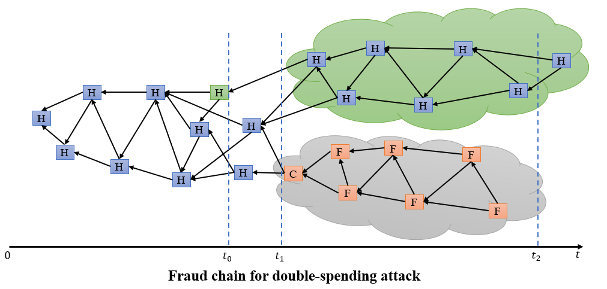
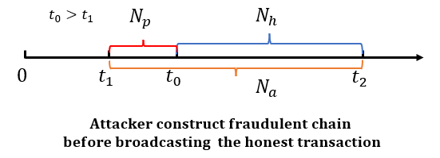

# DAG-Based Blockchain in Wireless Network

## DAG-based Blockchain Definitions

* **Block:** the storage unit to records information including transaction, digital signature, and hash value. In tangle, a block just records one transaction;
* **Tip:** the transaction(or block) that has not been approved by any other trasnaction(or block). That is, tips are unapproved transactions in tangle graph;
* **Direct Approval:** two transactions(or blocks) is connected by a direct edge, we can say one transaction is directly approved by another transaction.
* **Indirect Approval:** two transactions are not connected by a direct edge, but there is a directed path of lenth at least two between the two transactions, then we can say the two transactions are indirectly approved.
* **Own Weight:** trasnation's own weight is propotional to the amount of work(computational power or stakes) that issuing node conssumes on proposing a trasnaction(or block);
* **Cumulative Weight:** the sum of the transaction's own weight  and the overall own weight of all transactions that directly or indirectly approve this transaction.
* **Confirmation Weight:** the threshold value of trasnaction's cumulative weight, when the cumulative weight meet this value, the transaction should be confirmed.

## Network Load

* Definitions:
  * Let $\lambda$ be the arrival rate of the new transaction.
  * Let the average duration time in reveal stage be $h_r$, which is determined by the computation and transsmission time.
  * Let $L(t) = 2\lambda h_r$ be the number of tips in the heaviest DAG at time $t$.
      * When the network load is stable, we have $L(t) = L(t-h_r) = L$, where $L$ is a consistant value. There are $\lambda h_r$ new transactions between $t - h_r$ and $t$ on average. Therefore, we can write $L(t) = r + \lambda h_r$, where $r$ is the number of old tips and $\lambda h_r$ is the number of tips chosen by new transactions during $t-h_r$ to $t$(they are not tips anymore, but othere nodes do not know).
      * When a new transaction arrives at time $t$, two tips from $L(t)$ will be chonsen randomly by the transaction. Since $\lambda h_r$ are not tips anymore, tips selection from $r$ or $\lambda h_r$ will affect the value of $L(t)$. If new transaction selects two tips both from $\lambda h_r$, then $L(t)$ will increase by $1$; else if it selects one tip from both $r$ and $\lambda h_r$, $L(t)$ will unchange; else it selects two tips from $r$, then $L(t)$ will decrease by $1$. The expected number of selected tips in $r$ can be computed as $$\frac{\lambda h_r(\lambda h_r - 1)}{(r + \lambda h_r)(r + \lambda h_r -1)}\times 0 + \frac{2r\lambda h_r}{(r + \lambda h_r)(r + \lambda h_r - 1)}\times 1 + \frac{r(r - 1)}{(r + \lambda h_r)(r + \lambda h_r - 1)} \times 2 = \frac{2r}{r + \lambda h_r}$$
        Because of the stability of $L(t)$, value $\frac{2r}{r + \lambda h_r} = 1$. Therefore, $r = \lambda h_r, L = L(t) = 2\lambda h_r$.
  * Let $W(t)$ be the cumulative weight of an observed transaction at time $t$.

* **Stable Network Load**
    * Low Load: 
      * The typical number of tips is small, and frequently becomes $1$;
      * Assume the network is lightly loaded with $\lambda = \lambda_l$,  since each user has the equal probability $(\frac{1}{n})$ to broadcast due to the fairness of CSMA/CA, the average time to compete the broadcasting on each user is $nh$, the  cumulative transactions waiting for broadcasting on each user is $nh\lambda_l$.
      * Let $h_l = \frac{1}{\lambda_l}$ be the average interarrival time between two transactions. when $h_l > h_r$, the load of network is Low. In this case, the number of tips will reduced to $1$ gradually. If $L(0) = 1$, then the DAG-based blockchain will be a single chain.
    * High Load: 
      * The typical number of tips is large.
      * Network becomes heavily loaded with $\lambda = \lambda_h$, the cumulative transactions on each user is $nh\lambda_h$.
      * Let $h_h = \frac{1}{\lambda_h}$ be the average interarrival time between two transactions. when $h_h \leq h_r$, the load of network is high. In this case, the number of tips is randomly determined by the approval tips selection algorithm of system.
* **Unstable Network Load**
  The load of network will not still keep consistent. 
    * High-to-Low Load: 
      * A regime is defined as High-to-Low load when the transaction arrival rate changes frome $\lambda_h$ to $\lambda_l$ suddenly. 
      * The initial state of an observed transaction under H2LR is that cumulative weight $W(0) = 1$ and the number of tips id $L(0) = 2\lambda_hh_r$. And the transaction arrival rate in this regime changes to $\lambda_l$.
      * When a new transaction arriving, two tips in $L(k)$ will be chosen to approval. An observed transaction's cumulative weight either increase $1$ or not change. The probability to select the observed transaction for $W(k+1) = W(k) + 1$ is $\frac{2}{L(k)}$. And the probability of  $W(k + 1) = W(k)$ is $1 - \frac{2}{L(k)} = \frac{L(k) - 2}{L(k)}$.
      * 每一步不同的状态的概率：
         $$\left\{
          \begin{aligned}
          P\{i+1,j-1 | i,j\} = \frac{2}{j}, &  & i = 1, 2, \cdots, L_h - 1, j = 2,3,\cdots, L_h, \\
          P\{i,j-1 |i,j\} = 1 - \frac{2}{j}, &  & i = 1, 2, \cdots, L_h - 1, j = 2,3,\cdots, L_h, \\
          P\{i+1, 1 | i,j\} = 1, & & i = 2, \cdots, \infty, j = 1.
          \end{aligned}
          \right.$$
      * The best case of upper performance bound in H2LR is that transaction arrival rate changes from $\lambda_h$ to $\lambda_l$ when $W(0) = m$. In this case, the consensus process is similar to HR regime. The worst case for lower performance bound in H2LR is that transaction arrival rate changes from $\lambda_h$ to $\lambda_l$ when $W(0) = 1$.
    * Low-to-High Load:
      * A regime is defined as Low-to-High load when the transaction arrival rate changes frome $\lambda_l$ to $\lambda_h$ suddenly. The number of tips will increase to $2\lambda_h h_r$ gradually.
      * The initial state of an observed transaction under L2HR is that cumulative weight $L(0) = 1$ and the transaction will be covered by all new transactions that are directly or indirectly approve the observed transaction. In this case, the cumulative weight of the observed transaction $W(k)$ will increase linearly with speed $\lambda_h$. The transition probabilityies under L2HR are $$P\{W(k+1) = i+1 | W(k) = i\} = 1.$$
      * The best case of upper performance bound in L2HR is that transaction arrival rate changes from $\lambda_l$ to $\lambda_h$ when $W(0) = 1$. The worst case for lower performance bound in L2HR is that transaction arrival rate changes from $\lambda_l$ to $\lambda_h$ when $W(0) = m$.

## Consensus Process

The main procedures that a node wants to issue a new transaction and let other nodes accept it are shown as follows:
* A node finds a nonce to solve a cryptographic puzzle to meet the difficult target;
* The node issues a new transaction and stores in a created storage unit;
* The node select two collision-free tips according to tips selcetion algorithm, and adds the hash of the two selected tips into thr transaction's storage units;
* The node uses it private key to sign the new transaction and broadcasts to other nodes;
* Other nodes will check the legal of the new transaction (based on the digital signature and nonce) when receiving it.

The main procedures that consensus process in wireless network are as follows:
* When a new transaction comes at a user, it should select two nonconflicting tips to approval based on ocal information;
* The user uses its private key to sign this new transaction. The new transaction will enter into cache waiting for broadcasting through wireless cahnnel;
* The user competes for wireless channel following CSMA/CA while the new transaction queues in cache foloowing first in first out(FIFO);
* The user either broadcasts the transaction successfully or rebroadcasts with backoff;
* Other users receive the new transaction and check it to confirm legality. If the new transaction is legal, then it will become a new tip and wait for the direct or indirect approvement for confirmation. 

As we can see that communication may cause a serious delay when user competes for wireless channel to broadcast the new transaction. Thid delay is depends on the network trasffic load.

## System Model 

**Wireless Blockchain Network**

We can divide the consensus process of a new transaction in wireless blockchain network into two periods: **the queueing period**(based on CSMA/CA network communication protocol) and **the weight accumulating preiod**(based on DAG-based blockchain consensus protocol).
* Assuming that there are $n$ users running tangle, and communicating with each other directly throught wireless channel;
* Assuming that the transaction arrical of each user follows the Poisson point process;
* Assuming that the transaction arrival rate of honest user is $\lambda$, and the transaction arrival rate of malicious attacker is $\mu$;
* Assuming that each transaction should have same own weigh, that is one;
* The average transmission delay to broadcast a packet through CSMA/CA is denoted as $h$. That is the time interval between two broadcasted transactions. We can caculate $h$ by the correspongding setting of wireless network. Therefore, $h$ is the reveal time to update the new transactions;
* Assuming that the max number of transactions at one broadcast is $m$. Due to the constrain of broadcast capacity, each user can broadcast a maximum packet of $m$ transactions in each time;
* Assuming that the cache lenth of each user is $Q = km$, and the cumulative weight of  an observed transaction at time $t$ is $W(t)$, the total number of tips at time $t$ is $L(t)$.

**General Network**

* The consensus process is ddivided into two stages: reveal stage and weight accumulating stage.
  * **Reveal Stage:** appending the observed transaction to the DAG-based blockchain, that is all nodes can see the transaction.
  * **Weight Accumulating Stage:** the cumulative weight of the observed transaction increases from its own weight to confirmation threshold gradually.
* Assuming that the average duration time in reveal stage $h$ is determined by the computation and transmission time;
* Assuming that the average own weight of each transaction is setted to  $1$. And the cumulative weight of the observed transaction is its own weight plus the overall number of transactions that directly or indirectly approve it;
* Assuming that the nodes of a DAG-based blockchain are roughly independently distributed in a large scale IoT network;
* Assuming that the new transaction arrival follows Poisson process.;
* Assuming that the new transactions' arrival rate of honest nodes is denoted as $\lambda$;
* The new transaction selects two tips according to MCMC algorithm. 

## Performance Ananlysis

When analyzing the performance of DAG-based blockchain, we usually discuss two metrics: transaction confirmation delay and transaction cumulative weight.

### Cumulative Weight

In this section, we discuss the weight accumulating of an observed transaction in different regimes. 

#### Steady Regime

In these regimes, the transaction arrival rate keeps steady. Let $\lambda_l, \lambda_h$ be the transaction arrival rates in low network load and high network load, and $h$ is the during time between two transactions.

* **Light Load Regime:** In this regime, the earlier transaction is revealed to the DAG-based blockchain before a new transaction arriving. The total number of tips is denoted as $L = 2\lambda_lh$, and will gradually decrease to $1$. Thus, it is available to represent the number of tips in LR as $L = 2\lambda_lh \approx 1$. When the $L_0 > 1$, the cumulative weight of of an observed will grow with speed $\lambda_l$ after it getting approved seral times. Therefore, we can roughly thought that the weight of an abserved transaction should be increased linearly. More over, all newcoming transactions will approve this observed transaction. We can define the weight accumulating function with variable time $t$ as $$W_\ell(t) = 1 + \lambda_lt.$$

* **High Load Regime:** As analyzed in [The Tangle](../References/33.%20The%20Tangle(S.Popov,%20Apr.2018).pdf), the weight accumulation in HR consists with two periods: adaption priod and linear increasing period.
  * Adaption period: The time from observed transaction is rwveal to DAG-based blockchain to the time that almost all tips become the indirected approval of the transaction. Thus, the weight grows with $W_h(t) = 2\exp(\frac{0.352t}{h})$. 
  * Linear increasing period: All incoming trancsactions are indirectly approve the observed transaction. The weight grows with speed $\lambda_h$.
  * Let $L_h = 2n\lambda_hh$ be the number of tips in DAG-based blockchain at any time, and $t_0$ is the duration time of adaption period. The cumulative weight in adaption period increases exponentially, while in linear increasing period increasing linearly. Thus, the gradient at the end of adaption period is same with the gradient in linear increasing period, i.e. $\frac{dW_h(t)}{dt} = \lambda_h$. We can compute the value of $t_0 = \frac{h}{0.352}\cdot\ln(\frac{n\lambda_hh}{0.704}), W_h(t_0) = \frac{n\lambda_hh}{0.704}$. The cumulative weight of an observed transaction in high load is 
  $$W_h(t)) = \left\{
  \begin{aligned}
    2\exp(\frac{0.352t}{h}), &  & t \leq t_0\\
   \frac{n\lambda_hh}{0.704} + \lambda_h(t-t_0), & & t > t_0.
    \end{aligned}
  \right.$$

#### Unsteady Regime

In unsteady regimes, transction arrival rate will be changed suddenly. We will discuss two special unsteady regimes: light-to-high load and high-to-light load.

* **Light-to-High Load Regime:** 
  Due to $L_0 = 2n\lambda_lh \approx 1$, we can thought that all new incoming transctions will approve an observed transction. However, the time of the transaction that has been observed will impact the weight accumulation. 
  * If the transaction is observed in LR phase, the cumulative weight of the transaction at time $t$ should be $$W_{l2h}(t) = 1 + \lambda_ht.$$
  * If transaction is observed after the network load is modified, then the cumulative weight of the transaction is
  $$W_{l2h}(t)) = \left\{
  \begin{aligned}
    2\exp(\frac{0.352t}{h}), &  & t \leq t_0\\
   \frac{n\lambda_hh}{0.704} + \lambda_h(t-t_0), & & t > t_0.
    \end{aligned}
  \right.$$

* **High-to-Light Load Regime:**
  The initial tips of H2L regime is $L_0 = 2n\lambda_hh > 1$. Before the network load is changed, the weight accumulation of an observed transaction is same with high load regime. While transaction arrival rate decreasing to $\lambda_l$, transaction weight accumulating of H2L regime should be 
  $$W_{h2l}(t)) = \left\{
  \begin{aligned}
    2\exp(\frac{0.352t}{h}), &  & t \leq t_0\\
   \frac{n\lambda_lh}{0.704} + \lambda_l(t-t_0), & & t > t_0.
    \end{aligned}
  \right.$$
  while the number of tips for an observed transaction is $L_0 = 2n\lambda_lh \approx 1$, all new incoming transactions would become the approvement of the transaction. In this case, the cumulative weight of the observed transaction is $W_{h2l}(t) = 1 + \lambda_lt$.

### Transaction Confirmation Delay

In order to confirm a new transaction, two periods of delay may happens in both **queuing in communication network** and **blockchain weight accumulating in consensus process**. Weight accumulating of a new transaction is composed of two subperiods: **adaptation subperiod** and **linear increasing subperiod**. Therefore, transaction confirmation delay consists of the queuing delay(counting  from the time that the transaction arrives into cache to the time that it is broadcast) and the weight accumulating delay(adaptive duration time and linear incrase duration time). In this case, we can express the confirmation delay $T_d$ as follows:
$$T_d = T_q + T_a + T_l.$$
where $T_q, T_a, T_l$ are transaction queuing delay, cumulative weight adapting delay and cumulative weight linear increasing delay respectively. Both transaction queuing delay and weight accumulating delay are closely related to the during time between two neiboring transactions $h$. 

**The Average Transmission Delay $h$**

In CSMA/CA, all nodes will compete to send messages. We always split time into multiple slots, and let the probability of each node sending messages in a slot be $\tau$. If there are $n$ nodes in wireless blockchain network, the probability of at least one node broadcasting in a slot time  is 
$$P_{tr} = 1 - (1 - \tau)^{n}.$$

The probability of one node broadcasts successfully in a slot time is 
$$P_s = C_n^1 \tau(1 - \tau)^{n-1} = n\cdot\tau\cdot(1 - \tau)^{n-1}$$
 
 The probability of broadcast collision occuring in a slot time is 
 $$P_c = 1 - (1 - \tau)^{n} - P_s.$$

Let $T_s$ be the average time that channel is detected busy due to a successful broadcasting, and its probability is $P_s$. Denoting $T_c$ is the average time that channel is collision, the probability of broadcast collision is $P_c$. Besides, when the channel is free that no node broadcast in a slot time, let $\sigma$ be the duration time of the empty slot time, the probability of this regime is $1 - P_{tr}$. Therefore, the average transmission delay $h$ is the expected value of the above three situations:
$$h = (1 - P_{tr})\cdot\sigma + P_s\cdot T_s + P_c\cdot T_c.$$

The RTS/CTS exchange in the CSMA/CA protocol are shown as follows:

In order to  ensure the fairness of CSMA/CA, each node has same probability $\tau$ to access the wireless channel to broadcast. We first analyze the average queuing time of a new transaction in different network load regimes.
* **Light Regime:** When the network load is light, the cache on each node may has less than $m$ transactions(where $m$ is the maximum number of transaction that one packet containning). 
  * **Queuing Time:** If $n\lambda_lh \leq m$, the average queuing delay of a transaction is 
  $$T_q = \frac{n\lambda_lh}{2\lambda_l} = \frac{nh}{2}.$$
  If $n\lambda_lh > m$, the average queuing delay of a transaction is 
  $$T_q = knh - \frac{m}{2\lambda_l}.$$
   Where $k$ is competition times for broadcasting because of FIFO(all new incoming transaction should wait in cache until the previous transactions have been sent), and $\frac{m}{2\lambda_l}$ is the average time of a new transaction from the time that it is stored in cache to the time that it becomes the first transaction in cache. 

  * **Weight Accumulating Time:** While  $n\lambda_lh \leq m$, the cumulative weight of an observed transaction grows with speed $\lambda_l$. Thus, the weight accumulating delay is $$T_w = \frac{w-1}{\lambda_l},$$
  where $w$ is the cumulative weight threshold. In this case, the transaction confirmation delay is 
  $$T_d = T_q + T_w = \frac{nh}{2} + \frac{w-1}{\lambda_l}.$$
  If $n\lambda_lh > m$, and a transaction is confirmed in adaption period, the weight accumulating delay is the adaption delay $T_a = \frac{h}{0.352}\cdot \ln(\frac{w}{2})$. If a transaction cannot be confirmed in adaption period, the cumulative weight of a new transaction grows with $W_a(t) = 2\exp(\frac{0.352t}{h})$. Therefore, the duration time of adaption period in light load is $T_a = \frac{h}{0.352}\cdot\ln(\frac{n\lambda_lh}{0.704})$. The cumulative weight of the transaction at the end of adaption period is $w_a = 2\exp(\frac{0.352}{h}\cdot\frac{h}{0.352}\cdot\ln(\frac{n\lambda_lh}{0.704}))$. When the transaction is confirmed in linear increasing period, we can compute the linear increasing duration time is $T_l = \frac{w - w_a}{\lambda_l}$. Thus, we summarize that the transaction confirmation delay in light network load is
  $$T_d = \left\{
  \begin{aligned}
    knh - \frac{m}{2\lambda_l} + \frac{h}{0.352}\cdot\ln(\frac{n\lambda_lh}{0.704}) + \frac{w - w_a}{\lambda_l}, &  & w > w_a\\
    knh - \frac{m}{2\lambda_l} + \frac{h}{0.352}\cdot\ln(\frac{w}{2}), & & w \leq w_a,
    \end{aligned}
  \right.$$
  where $w_a$ is thecum,ulative weight at time $t_0$.

* **Heavy Regime:** 
  * **Queuing Time:** When the network load is heavy, the cache on each node is always full. If a node compete successfully, it will broadcast $m$ transactions, and $m$ new transactions can be stored in cache accordingly. In this case, the average queuing time for new transaction in HR is 
  $$T_q = \frac{kn\lambda_hh - m}{2\lambda_h} = knh - \frac{m}{2\lambda_h}.$$
  * **Weight Accumulating Time:** Similar to light regime, we can calculate the adaption duration time of heavy regime. The cumulative growth rate in adaption period is defined as $\lambda_h$. Therefore, we have $\frac{dW_a(t)}{dt} = n\lambda_h$. The adapton during time is $T_a = \frac{h}{0.352}\cdot\ln(\frac{w}{2})$ when transaction is confirmed in adaption period, where $w$ is the transaction confirmation weight threshold. When the transaction is confirmed during linear increasing period, the adaption delay in heavy load should be $T_a = \frac{h}{0.352}\cdot\ln(\frac{n\lambda_hh}{0.704})$. The cumulative weight of the transaction at the end of adaption period is $w_a = 2\exp(\frac{0.352}{h}\cdot\frac{h}{0.352}\cdot\ln(\frac{n\lambda_hh}{0.704}))$. When the transaction is confirmed in linear increasing period, we can compute the linear increasing duration time is $T_l = \frac{w - w_a}{\lambda_h}$. Thus, we summarize that the transaction confirmation delay in heavy network load is
  $$T_d = \left\{
  \begin{aligned}
    knh - \frac{m}{2\lambda_h} + \frac{h}{0.352}\cdot\ln(\frac{n\lambda_hh}{0.704}) + \frac{w - w_a}{\lambda_h}, &  & w > w_a\\
   knh - \frac{m}{2\lambda_h} + \frac{h}{0.352}\cdot\ln(\frac{w}{2}), & & w \leq w_a,
    \end{aligned}
  \right.$$
  where $w_a$ is thecum,ulative weight at time $t_0$.
 
* **Light to Heavy Regime:** 
  * **Queuing Time:** If a transaction is observed before network load is changed, the average transaction queuing delay may be $T_q = \frac{nh}{2}$ or $T_q = knh - \frac{m}{2\lambda_l}$. While a transaction is observed after the network load modified, the queuing delay of the trasnaction will be changed. Because the transaction arrival rate is increasing from $\lambda_l$ to $\lambda_h$ suddenly, the cache of a node can quickly be full. Thus, the average queuing time in L2HR is 
    $$T_q = knh - \frac{m}{2\lambda_h}.$$
  
  * **Weight Accumulating Delay:** If a transaction in this regime is confirmed before network is changed, the weigit accumulating delay is same with LR. If a transaction is observed before network load is changed, which means the transaction arrival rate increases to $\lambda_h$ suddenly. The transaction confirmation delay is 
  $$T_d = \left\{
  \begin{aligned}
    \frac{nh}{2} + \frac{w-1}{\lambda_h}, &  & m > n\lambda_lh\\
   knh - \frac{m}{2\lambda_l} + \frac{h}{0.352}\cdot\ln(\frac{w}{2}), & & m \leq n\lambda_lh\ \&\ w \leq w_a,\\
   knh - \frac{m}{2\lambda_l} + \frac{h}{0.352}\cdot\ln(\frac{n\lambda_hh}{0.704}) + \frac{w - w_a}{\lambda_h}, &  & m \leq n\lambda_lh\ \&\ w > w_a.
    \end{aligned}
  \right.$$ 

  If a transaction is observed after network changed, the computation of transaction confirmation delay in this regime is identical to high load regime.

* **Heavy to Light Regime:** The  cache of each node in this regime is full before the network load is changed. 
  * **Queuing Delay:** If transaction is observed before network load is changed, the queuing delay of this trasnaction is $T_q = knh - \frac{m}{2\lambda_h}$. If a trasnaction is observed after network load is changed, the average queuing delay of this regime should be
  $$T_q = \left\{
  \begin{aligned}
    knh - \frac{m}{2\lambda_l}, &  & m \leq n\lambda_lh,\\
    \frac{nh}{2\lambda_l}, & & m > n\lambda_lh,
    \end{aligned}
  \right.$$
  * **Weight Accumulating Delay:** If a transaction is confirmed before network load is changed, the computation of transaction confirmation delay in this regime is same with that in high regime. If a trasnaction is observed before network load is changed, the weight accumulating delay is 
   $$T_w = \left\{
  \begin{aligned}
    \frac{h}{0.352}\cdot\ln(\frac{w}{2}), & & w \leq w_a,\\
    \frac{h}{0.352}\cdot\ln(\frac{n\lambda_lh}{0.704}) + \frac{w - w_a}{\lambda_l}, &  & w > w_a.
    \end{aligned}
  \right.$$ 
  In this case, the average transaction confirmation delay is 
   $$T_d = \left\{
  \begin{aligned}
   knh - \frac{m}{2\lambda_l} + \frac{h}{0.352}\cdot\ln(\frac{w}{2}), & & m \leq n\lambda_lh\ \&\ w \leq w_a,\\
   knh - \frac{m}{2\lambda_l} + \frac{h}{0.352}\cdot\ln(\frac{n\lambda_lh}{0.704}) + \frac{w - w_a}{\lambda_l}, &  & m \leq n\lambda_lh\ \&\ w > w_a.
    \end{aligned}
  \right.$$ 

### Throughput of DAG-based Blockchain 

Throughput is an improtant metric that used to measure the performance of blockchain. Throughput of blockchain is the number of confirmed transactions per second. The computation of throughput in these four regimes are shown as follows:
* **LR:** 
  $$TPS_{lr} = \left\{
  \begin{aligned}
   \frac{m}{T_d^{lr}}, & & m \leq n\lambda_lh,\\
   \frac{n\lambda_lh}{T_d^{lr}}, &  & m > n\lambda_lh.
    \end{aligned}
  \right.$$ 
* **HR:** 
  $$TPS_{hr} = \frac{m}{T_d^{hr}}.$$ 
* **L2HR:** 
  $$TPS_{l2hr} = \left\{
  \begin{aligned}
   \frac{m}{T_d^{l2hr}}, & & m \leq n\lambda_lh,\\
   \frac{n\lambda_lh}{T_d^{l2hr}}, &  & m > n\lambda_lh,\\
   \frac{n\lambda_hh}{T_d^{l2hr}}, &  & m \leq n\lambda_hh.
    \end{aligned}
  \right.$$ 
* **H2LR:** 
  $$TPS_{h2lr} = \left\{
  \begin{aligned}
   \frac{m}{T_d^{h2lr}}, & & m \leq n\lambda_lh,\\
   \frac{n\lambda_lh}{T_d^{h2lr}}, &  & m > n\lambda_lh,\\
   \frac{n\lambda_hh}{T_d^{h2lr}}, &  & m \leq n\lambda_hh.
    \end{aligned}
    \right.$$ 

### Transaction Loss Probability

In order to measure the quality of service of the DAG-based blockchain, we define the transaction loss probability recording the ratio that a new transaction cannot be insert into blockchain.
  $$P_{TLP} = \left\{
  \begin{aligned}
   1 - \frac{m}{n\lambda_lh}, & & m \leq n\lambda_lh,\\
   0, &  & m > n\lambda_lh,\\
   1 - \frac{m}{n\lambda_hh}, &  & m \leq n\lambda_hh.
    \end{aligned}
  \right.$$ 

## Security Analysis

In this section, we introduce the most typical double-spending attack model in DAG-based blockchain. Then, we analyze the successful attack probability for double-spending considering CSMA/CA protocols in qireless blockchain network.

### Attack Process and Model

The typical way that a malicious attacker lunches double spending attack is to construct a fraudulent chain in blockchain system, the main procedures are shown as follows:
* At time $t_0$, attacker broadcasts an honest transaction, and honest nodes will approve it.
* At time $t_1$, the attacker builds a fraud chain in offchain to approve a fraudulent transaction that is conflicted with the honest transaction.
* After time $t_1$, the attacker will continually issue trasnactions to grow the cumulative weight of the fraudulent transaction. The time $t_1$ should be earlier than the end of adaption periof of the honest transaction.
* At time $t_2$, the honest transaction has been confirmed while its cumulative weight attaches $w$. In this case, the victim will send goods or services to the attacker.
* While the cumulative weight of the fraudulent transaction overweights the confirmed honest transaction after time $t_2$, the attacker will broadcast the fraudulent chain to the whole wireless blockchain network.
* Once the attacker contending for wireless channel to broadcast fraudulent branch updating the DAG-based blockchain, the fraud transaction will be accepted by other honest nodes based on the MCMC algorithm due to the higher cumulative weight. The confirmed honest transaction will be orphened in DAG-based blockchain, the victim cannot receive the payment even though it has provided goods or services. In this case, the attacker issues double-spending attack successfully.

We now present some assumptions for double-spending attack analysis.
* Assuming that there are $n-1$ honest nodes and one attacker;
* Let $\lambda, \mu$ be the arrival rate of new trasnactions on a honest node and a malicious attacker respectively.
* let the own weight of each transaction be one.

### Successfull Attack Probability

In this subsection, we analyze the successful attack probability from the perspective of wireless communication. In this case, attacker should win the transaction competition and broadcast the fraudulent chain successfully. I CSMA/CA, the maximum number of broadcast transactions is limited to $m$, thus, the maximum new transaction arrival rate is $\frac{m}{nh}$. 

Recall that we assume there are $n-1$ honest nodes and $1$ attacker in a one-hop wireless blockchain network, the arrival rates of new trasnactions on a honest node and a malicious attacker shold be 
$$\left\{
  \begin{aligned}
   \lambda' = \min\{\lambda, \frac{m}{nh}\},\\
   \mu' = \min\{\mu, \frac{m}{nh}\}.
    \end{aligned}
  \right.$$ 
Thus, we can define the broadcast trasnaction issued by honest nodes and attacker respectively as follows:
$$\left\{
  \begin{aligned}
   p = \frac{(n-1)\lambda'}{(n-1)\lambda' + \mu'},\\
   q = \frac{\mu'}{(n-1)\lambda' + \mu'}.
    \end{aligned}
  \right.$$ 

We can describe the abovementioned attack process as a Markov chain. Let $N_h, N_a$ be the number of transactions issued by honest nodes and attacker frome time $t_1$ to time $t_2$. Because the number of trasnactions that issued by attacker follows negative binomial distribution, the propability mass function of $N_a$ is 

$$P\{N_a = n\} = C_{n + N_h - 1}^{N_h - 1}p^{N_h}q^n.$$ 

If $N_a > N_h$, the attacker issues the double-spending attack successfully at time $t_2$. Otherwise, the attacker requires to catch up the difference of transactions that issued by honest node and attacker until the cumulative weight of fraudulent transaction outnumbers that of honest transaction after time $t_2$. This process can be thought as a Gambler’s Ruin problem, and The attacker needs to catch up the difference of $N_h - N_a + 1$ transactions at least. If $p \leq q$, the attacker will eventually catch up successfully with probability $1$. Otherwise, the attacker will catch up successfully with probability 

$$P_c(N_h - N_a) = (\frac{q}{p})^{N_h - N_a + 1}.$$

Thus, the successful attack probability is
$$\begin{align*}
  P\{\text{attack succeed}\} &= P\{N_a > N_h\}\cdot 1 + P\{N_a \leq N_h\}\cdot P_c(N_h - N_a) \\
   &= \sum_{N_a = N_h + 1}^\infty C_{N_a + N_h -1}^{N_h-1}p^{N_h}p^{N_a} + \sum_{N_a = 0}^{N_h} C_{N_a + N_h -1}^{N_h-1}p^{N_h}p^{N_a}(\frac{p}{p})^{N_h - N_a +1} \\
   &= 1 - \sum_{N_a = 0}^{N_h} C_{N_a + N_h -1}^{N_h-1}(p^{N_h}p^{N_a} - p^{N_a - 1}p^{N_h + 1}), p > q.
   \end{align*}$$

At time $t_1$, the number of transactions approcving the honest trasnactionis $W(t_1) - 1$. Therefore, we can have $N_h = w - W(t_1) + 1$ transactions from $t_1$ to $t_2$. The successful attack probability can be expressed as 
$$P\{\text{attack succeed}\} =  1 - \sum_{N_a = 0}^{w - W(t_1) + 1} C_{N_a + w - W(t_1)}^{w - W(t_1)}(p^{w - W(t_1) + 1}q^{N_a} - p^{N_a - 1}q^{w - W(t_1) + 2}), p > q,$$
where $W(t_1)$ is the cumulative weight of the honest transaction at the end of adaption period. And $p = \frac{(n-1)\lambda'}{(n-1)\lambda' + \mu'}, q = \frac{\mu'}{(n-1)\lambda' + \mu'}$, where $\lambda' = \min\{\lambda, \frac{m}{nh}\},
   \mu' = \min\{\mu, \frac{m}{nh}\}$.

We use $\lambda, \mu$ representing the transaction arrival rates of honest nodes and attacker to model double-spending attack. Besides, our analysis depends on wireless communication protocol, we use $m$ presenting the number of broadcast trasnactions in wireless blockchain network.

### Attack Strategy

In this subsection, we analyze the strategy that can increase the successful attack probability on the perspective of attacker. Because the probability of a successful attack is identically equal to $1$ when $p\leq q$, we only need to analyze the case that $p > q$.

In order to increase successful attack probability, attacker can adopt a strategy that constructing the fraudulent branch before broadcasting the honest transaction. In this case, there are $N_p$ transactions belongs to honest chain from time $t_1$ to $t_0$. To ensure the success of attack, the number of transactions issued by attacker $N_a$ should be bigger than the number of transactions issued by honest nodes $N_h + N_p$. If $N_a > N_p + N_h$ at time $t_2$, attacker will broadcast fraudulent chain due to attack successfully. Otherwise, attacker should catch up the difference of $N_h + N_p - N_a$. If $p > q$, the successful attack probability of this situation is 
$$P_c(N_h + N_p - N_a) = 1 - \sum_{N_a = 0}^{N_h + N_p}C_{N_h + N_a - 1}^{N_h - 1}(p^{N_h}q^{N_a}-p^{N_a - N_p - 1}q^{N_h + N_p + 1}).$$
随后可以通过试验来分析$N_p, N_h$对于双花攻击成功概率的影响。最后得出结论攻击者想要提高攻击成功的概率就要最小化$N_p, N_h$的值。攻击者无法影响诚实链上的tips选择过程，但是攻击者可以在诚实交易的权重累积过程处于适应期结束之前选择tips创建欺诈链分支。否则一旦诚实交易的权重累积过程进入线性增长时期，所有的tips都将是诚实交易的间接支持，此时发起攻击必定失败。攻击者发起攻击时生成的欺诈交易选择的tips不能直接或者间接支持诚实交易，这样攻击将会无效，最终必然是诚实交易被确认，欺诈交易被孤立。

### Successful Attack Probability in Different Load Regimes

In this paper, we consider four network load regimes: heavy load regime, light load regime, heavy to light load regime and light to heavy load regime. According to the mentioned analysis of double-spending attack, We will discuss the successful attack probability in different network load. To distinguish the impact of network load on $p, q$, we denote $p_h, q_h$ in heavy load and $p_l, q_l$ in light load. Assume that attacker issues attack immediately after broadcasting honest transaction.

* **Heavy Load Regime:** In this regime, transaction arrival rate is very high, and a transaction may be confirmed in adaption period or in linear increasing period. Due to the attacker issuing attack before the end of adaptive period, the cumulative weight of the honest transaction should be $W(t_1)$. Thus, the number of transactions approving the honest transaction at time $t_1$ is $W(t_1) - 1$. At time $t_2$, we have $N_h = w - W(t_1) + 1$, where $w$ is the transaction confirmation weight threshold. Therefore, the successfull attack probability in heavy load can be expressed as 
  $$P_h\{\text{Attack Succeeds}\} = 1 - \sum_{N_a = 0}^{w - W(t_1) + 1} C_{N_a + w - W(t_1)}^{w - W(t_1)}(p_h^{w - W(t_1) + 1}q_h^{N_a} - p_h^{N_a - 1}q_h^{w - W(t_1) + 2})$$
  where $p_h = \frac{(n-1)\cdot\min\{\lambda_h, \frac{m}{nh}\}}{(n-1)\cdot\min\{\lambda_h, \frac{m}{nh}\} + \min\{\mu_h, \frac{m}{nh}\}}, q_h = \frac{\min\{\mu_h, \frac{m}{nh}\}}{(n-1)\cdot\min\{\lambda_h, \frac{m}{nh}\} + \min\{\mu_h, \frac{m}{nh}\}}$.

* **Light Load Regime:** In this regime, the DAG-based blockchain can be considered as a single chain since $L_0 = 1$.The honest transaction is indirectly approved by all tips at time $t_0$. Attacker issues attack immediately after broadcasting the honest transaction. Because the own weight of the honest transaction is $1$, we can know that $N_h = w-1$. The successful attack probability in light load regime is 
  $$P_l\{\text{Attack Succeeds}\} = 1 - \sum_{N_a = 0}^{w} C_{N_a + w - 2}^{w - 2)}(p_l^{w - 1}q_l^{N_a} - p_l^{N_a - 2}q_l^{w + 1})$$
  where $p_l = \frac{(n-1)\cdot\min\{\lambda_l, \frac{m}{nh}\}}{(n-1)\cdot\min\{\lambda_l, \frac{m}{nh}\} + \min\{\mu_l, \frac{m}{nh}\}}, q_l = \frac{\min\{\mu_l, \frac{m}{nh}\}}{(n-1)\cdot\min\{\lambda_l, \frac{m}{nh}\} + \min\{\mu_l, \frac{m}{nh}\}}$.

* **Heavy to Light Load Regime:** In this regime, transaction arrival rate would decrease from $\lambda_h$ to $\lambda_l$ suddenly, which will result the number of tips $L_0 = 2n\lambda_hh$ reducing to $L_0 = 1$.
  * If the honest transaction is confirmed before network change, the attack process in this regime is same with heavy load regime. The probability that attacker launches double-spending attack successfully is 
    $$P_{h2l}\{\text{Attack Succeeds}\} = 1 - \sum_{N_a = 0}^{w - W(t_1) + 1} C_{N_a + w - W(t_1)}^{w - W(t_1)}(p_h^{w - W(t_1) + 1}q_h^{N_a} - p_h^{N_a - 1}q_h^{w - W(t_1) + 2})$$
  where $p_h = \frac{(n-1)\cdot\min\{\lambda_h, \frac{m}{nh}\}}{(n-1)\cdot\min\{\lambda_h, \frac{m}{nh}\} + \min\{\mu_h, \frac{m}{nh}\}}, q_h = \frac{\min\{\mu_h, \frac{m}{nh}\}}{(n-1)\cdot\min\{\lambda_h, \frac{m}{nh}\} + \min\{\mu_h, \frac{m}{nh}\}}$.
  * If network load is changed while revealing the honest transaction, DAG-based blockchain will quickly be a single chain. The probability that attacker launches double-spending attack successfully is 
    $$P_{h2l}\{\text{Attack Succeeds}\} = 1 - \sum_{N_a = 0}^{w - W(t_1) + 1} C_{N_a + w - W(t_1)}^{w - W(t_1)}(p_l^{w - W(t_1) + 1}q_l^{N_a} - p_l^{N_a - 1}q_l^{w - W(t_1) + 2})$$
    where $p_l = \frac{(n-1)\cdot\min\{\lambda_l, \frac{m}{nh}\}}{(n-1)\cdot\min\{\lambda_l, \frac{m}{nh}\} + \min\{\mu_l, \frac{m}{nh}\}}, q_l = \frac{\min\{\mu_l, \frac{m}{nh}\}}{(n-1)\cdot\min\{\lambda_l, \frac{m}{nh}\} + \min\{\mu_l, \frac{m}{nh}\}}$.
  * If the honest transaction is revealed after modifying network load, the probability of successful attack in this case is same with light load regime. Therefore, the successfull attack probability in heavy to light load regime can be expressed as 
  $$P_{h2l}\{\text{Attack Succeeds}\} = 1 - \sum_{N_a = 0}^{w} C_{N_a + w - 2}^{w - 2}(p_l^{w - 1}q_l^{N_a} - p_l^{N_a - 2}q_l^{w + 1})$$
  where $p_h = \frac{(n-1)\cdot\min\{\lambda_h, \frac{m}{nh}\}}{(n-1)\cdot\min\{\lambda_h, \frac{m}{nh}\} + \min\{\mu_h, \frac{m}{nh}\}}, q_h = \frac{\min\{\mu_h, \frac{m}{nh}\}}{(n-1)\cdot\min\{\lambda_h, \frac{m}{nh}\} + \min\{\mu_h, \frac{m}{nh}\}}$.

* **Light to Heavy Load Regime:** 
  * If the honest transaction is confirmed before network change, all new incoming transactions will indirectly approve the honest transaction. The probability that attacker launches double-spending attack successfully is 
    $$P_{l2h}\{\text{Attack Succeeds}\} = 1 - \sum_{N_a = 0}^{w} C_{N_a + w - 2}^{w - 2}(p_l^{w - 1}q_l^{N_a} - p_l^{N_a - 2}q_l^{w + 1})$$
    where $p_l = \frac{(n-1)\cdot\min\{\lambda_l, \frac{m}{nh}\}}{(n-1)\cdot\min\{\lambda_l, \frac{m}{nh}\} + \min\{\mu_l, \frac{m}{nh}\}}, q_l = \frac{\min\{\mu_l, \frac{m}{nh}\}}{(n-1)\cdot\min\{\lambda_l, \frac{m}{nh}\} + \min\{\mu_l, \frac{m}{nh}\}}$.
  * If network load is changed while revealing the honest transaction, all new incoming transactions will indirectly approve the honest transaction. The probability that attacker launches double-spending attack successfully is 
    $$P_{l2h}\{\text{Attack Succeeds}\} = 1 - \sum_{N_a = 0}^{w} C_{N_a + w - 2}^{w - 2}(p_h^{w - 1}q_h^{N_a} - p_h^{N_a - 2}q_h^{w + 1})$$
    where $p_h = \frac{(n-1)\cdot\min\{\lambda_h, \frac{m}{nh}\}}{(n-1)\cdot\min\{\lambda_h, \frac{m}{nh}\} + \min\{\mu_h, \frac{m}{nh}\}}, q_h = \frac{\min\{\mu_h, \frac{m}{nh}\}}{(n-1)\cdot\min\{\lambda_h, \frac{m}{nh}\} + \min\{\mu_h, \frac{m}{nh}\}}$.
  * If the honest transaction is revealed after modifying network load, the probability of successful attack in this case is same with heavy load regime. Therefore, the successfull attack probability in light to heavy load regime can be expressed as 
  $$P_{l2h}\{\text{Attack Succeeds}\} = 1 - \sum_{N_a = 0}^{w - W(t_1) + 1} C_{N_a + w - W(t_1)}^{w - W(t_1)}(p_h^{w - W(t_1) + 1}q_h^{N_a} - p_h^{N_a - 1}q_h^{w - W(t_1) + 2})$$
  where $p_h = \frac{(n-1)\cdot\min\{\lambda_h, \frac{m}{nh}\}}{(n-1)\cdot\min\{\lambda_h, \frac{m}{nh}\} + \min\{\mu_h, \frac{m}{nh}\}}, q_h = \frac{\min\{\mu_h, \frac{m}{nh}\}}{(n-1)\cdot\min\{\lambda_h, \frac{m}{nh}\} + \min\{\mu_h, \frac{m}{nh}\}}$.
