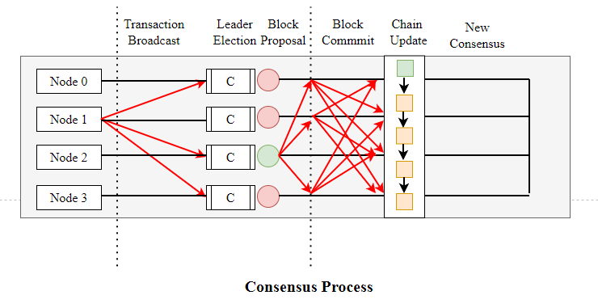
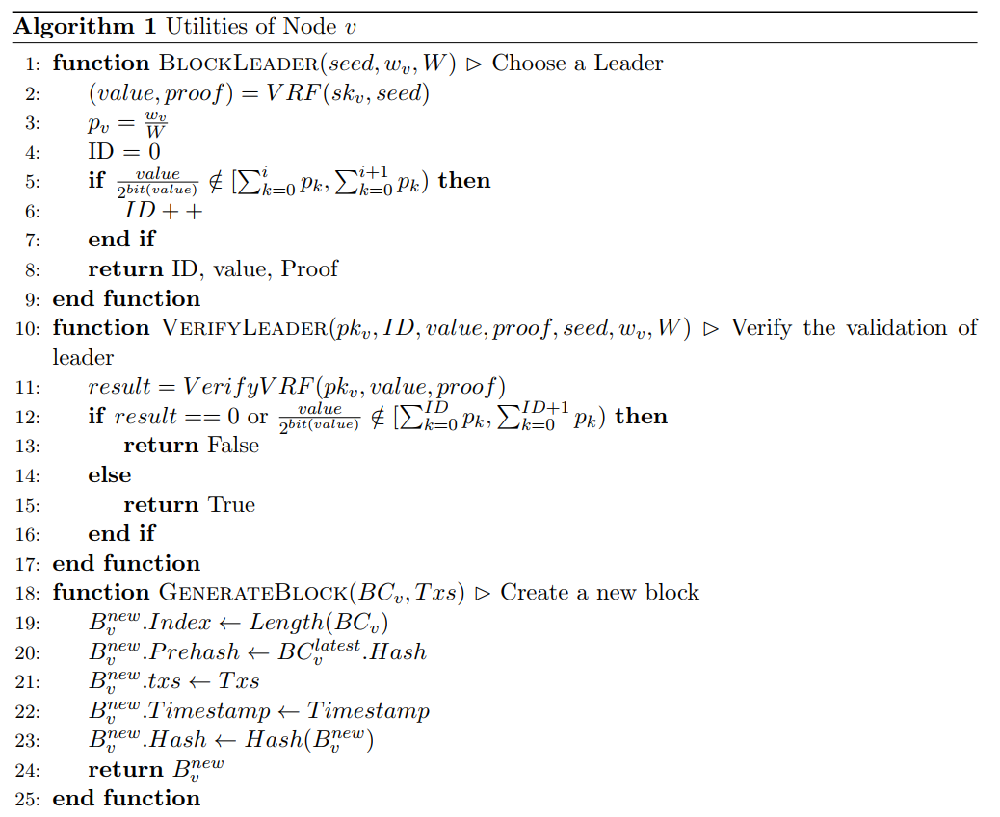
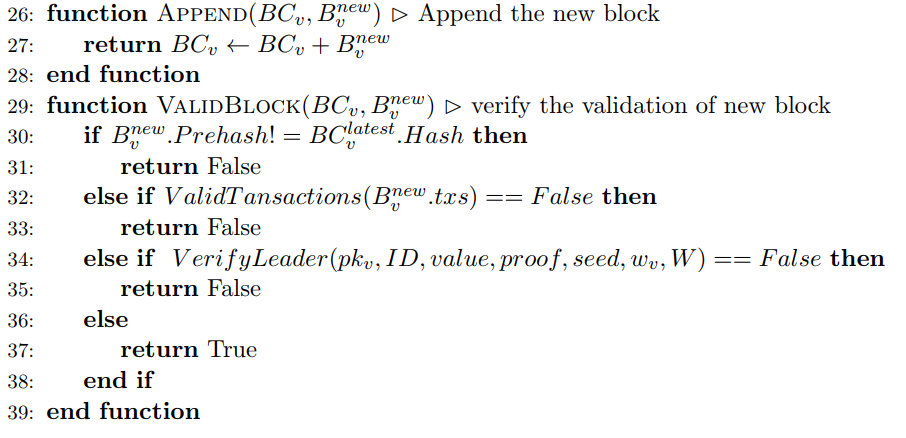
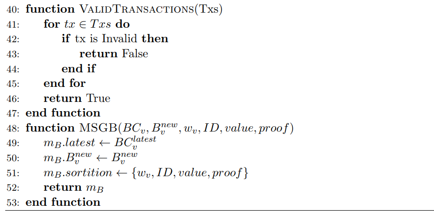
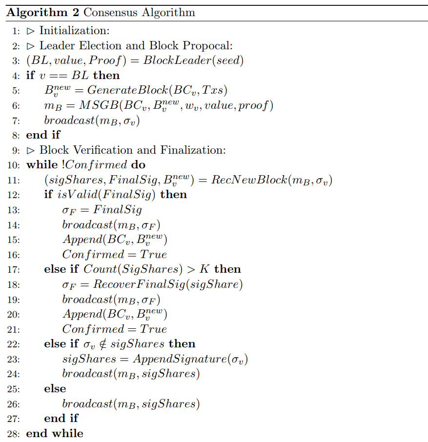
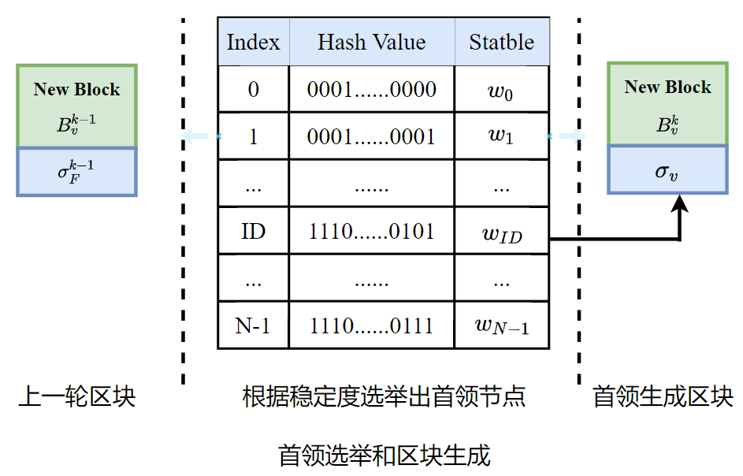
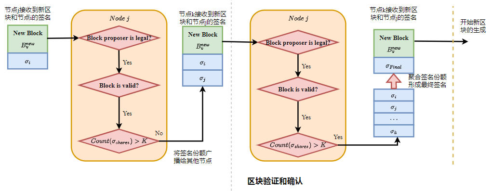

# A Stable Consensus protoccol in Wireless Blockchain System

## Introduction

随着无线通信技术和区块链技术的高速发展，许多研究倾向于将区块链技术用于无线应用，如移动边缘计算、智能5G、车联网、物联网等。区块链技术可以在分布式环境下提供可信赖和安全的资源共享服务，受到了学术界和工业界的高度关注。区块链及其关键特性，如去中心化、持久性、匿名性和可审计性，为克服无线网络应用中存在的问题提供了新的方向，特别是当它与智能合约技术相结合时（即自动执行部署在区块链上的不可更改的数字合约）。将区块链技术融入无线网络可以促进资源共享、可信数据交互、安全接入控制与隐私保护、数据溯源、身份认证和信息监控等。

目前，大部分与无线网络相关的区块链研究都是在经典的区块链共识算法的之上提出架构或构建系统。文献[1]，作者提出了区块链的可信移动自组织云架构，并在区块链层设计了一个稳定感知的共识协议提高系统性能。在文献[2]中，作者提出了一种面向未来无线通信的区块链无线接入网架构，并研究了区块链在资源管理和网络接入中的潜在融合应用。文献[3]调研了区块链在智慧城市中的信息通信应用；文献[4]调研了将区块链和机器学习结合应用于移动通信网络系统的一些研究成果，并讨论了潜在问题及挑战。文献[5]利用通过修改无线网络的CSMA/CA协议，设计和部署适用于物联网的区块链PBFT共识算法。

许多的研究工作将区块链简单地套用于无线网络中，实质上无法完全解决其中的信任和安全问题。考虑到无线网络具有节点设备资源有限、节点可移动、网络拓扑动态变化和网络通信质量不稳定等特征，一些关于无线区块链共识算法的研究工作已经展开。文献[6]中，作者利用无线网络的通信特性设计适用于无线网络的区块链共识协议。此外文献[7]作者利用无线通信特性提出信道证明的共识算法，设计了单跳无线区块链网络协议并采用正式通用组合框架分析协议的性能。文献[8]中，作者提出了融合无线通信特性和区块链技术的适用于多跳无线网络的区块链协议。文献[9]利用无线通信协议CSMA/CA的争用机制，提出能够抵御女巫攻击的基于协作的拜占庭共识协议，适用于建立在开放无线网络中实时性要求高的物联网应用。

在本文中，我们设计一个适用于无线网络的基于竞争的区块链协议。根据无线节点生命周期短和区块链存储结构的特征，提出一种基于节点稳定性的类PoS共识算法。在这个共识算法中，拥有更高稳定性的节点将有更大概率获得出块权限，生成区块并且获得系统奖励。这样的设计可以降低共识过程的算力消耗，提高系统共识过程的稳定性和处理交易效率。此外，我们考虑敌手可以干扰节点，但是不能控制所有节点持有总财富的 $50/%$ 的财富。由于满足持久性和活性，因此该协议是安全的。持久性意味着，如果一个诚实节点宣布一个交易是有效的，那么其他诚实节点要么报告相同的结果要么报告错误信息。活性则是诚实节点提出的有效交易最终都会被添加到各诚实节点的区块链上。通过分析共识算法的通信消耗和算力消耗来进一步分析无线区块链共识算法的性能。

我们的主要贡献总结如下：
* 我们提出一种新的基于节点稳定性的适用于无线网络环境的类PoS区块链共识算法。
* 根据无线网络节点的特性和区块链存储结构的特性，我们定义了节点的稳定性。我们提出的共识算法将根据节点的稳定性来确定出块权限。
* 我们详细分析了所提出无线区块链共识算法的通信开销和算力开销，进一步分析无线区块链的性能。
* 最终，我们通过大量的仿真研究验证我们的理论分析。

本文剩余部分组成如下。下一节介绍移动无线自组织网络中最新区块链协议和共识算法最相关的工作。第三节提出我们的模型和假设。第四节详细介绍基于节点稳定性的共识协议。第五节会理论性地分析协议的正确性、活性以及高效性。第六节会给出共识协议相关的仿真结果。最后，在第七节给出相应的结论。

## Related Work

### 区块链共识协议

我们将当前的区块链共识协议可以分为几种：竞争类共识协议和协同类共识协议，在之后将简要介绍。更详细全面的区块链分类的综述可详见[10]。

竞争类共识算法中所有节点通过资源、能力、名誉、权益等证明方式来竞争获取每一轮的出块权限。工作量证明(Proof of Work)在区块链中使用最广泛的竞争类共识算法，节点通过计算资源证明来获得出块权限。众所周知的采用工作量证明作为共识算法的有比特币和以太坊。此外，典型的竞争类共识算法还有Peercoin 项目[11]中的权益证明(Proof of Stake, PoS)、 Parity 项目[12]中的权威证明(Proof of Authority, PoA)、 Burstcoin项目[13]中的空间证明 (Proof of Sapce, PoSpace)、GoChain项目[14]中的信誉证明(Proof of Reputation,PoR)等[15]。竞争类共识算法在每一轮出块节点的选择中，会设置一个竞争成功的标准，最先达到标准的共识节点获取出块权限生成区块，其他诚实的共识节点会认可这个新区块的有效性。竞争类的共识算法通常具有弱一致性，出现分叉的概率会比较高。
协同类共识算法中所有参与共识的节点通过执行局部计算和广播消息与其他节点通信协同生成每一轮的区块并达成共识。这种方法在确保活跃性和安全性的同时，为区块链提供了对拜占庭式故障的鲁棒性。典型的协同类共识算法是Fabric v0.6.0[16]中实现的拜占庭容错算法(Practical Byzantine Fault Tolerant, PBFT)。该共识算法从全网节点中选出出块节点负责创建区块，其他节点通过投票协同对区块达成全网共识。实际拜占庭容错协议无权益抵押或者资源的消耗会降低恶意节点的作恶成本，但是通过节点协作机制可以排除恶意行为对共识的影响。典型的协同类共识算法还有NEO项目[17]中提出DBFT算法、Ripple联盟链[18]项目的RPCA共识算法、Cosmos[19]中所采用的Tendermint共识算法、Algorand共识算法[20]、ELASTICO共识算法[21]、Omniledger共识算法[22]和RipidChain共识算法[23]等。协同类的共识算法通常具有强一致性，出现链分叉的概率比较小。

### 物联网中的区块链

物联网的设备通常是通过无线网络连接的，因此会面临无线网络中存在的安全和信任问题。区块链技术的出现为物联网应用，比如数据管理、访问控制、隐私保护、身份认证等，提供了新的信任和安全体系。文献[24]将区块链的技术和智能设备节点映射技术相结合，实现分布式网络中智能的设备分散自治。文献[25]提出基于雾计算、软件定义网络(SDN)和区块链的分布式云架构，实现安全、高效和低成本的大型数据流的数据管理。文献[26]开发了包含六个组件的架构，用于基于区块链的物联网访问管理。文献[27]在许可的区块链环境中使用零知识证明引入了一种基于区块链的隐私保护身份解决方案——ChainAnchor，为用户提供隐私保护服务。文献[28]将其与监管框架规定联系起来, 提供了区块链的隐私和数据保护方面的解决方案。文献[29]提出了物联
网系统中身份管理系统的要求，并研究了区块链主权身份解决方案，阐述了物联网构建完整身份管理系统的挑战。文献[30]设计了一个非中心化的身份框架——NEXTLEAP，具有使用盲签名的隐
私保护功能，并且使用身份解决方案提供的身份验证服务构建更安全的消息传递应用。

### 无线网络中的共识算法

共识算法是区块链技术的核心，我们的研究与无线网络密切相关，因此我们简要介绍无线网络共识算法的研究。文献[31,32]利用无线信道的干扰特性，提出了一种在无线通信场景中更有效地达成共识的策略。文献[33,34]利用衰落无线信道的干扰特性，提出了实现平均一致性和最大一致性的协议。文献[35]利用MAC层和多径和频率选择性信道的网络模型，为无线传感器网络设计了一种分布式一致性算法。文献[36]研究了概率广播的平均共识问题，探索了无线媒体对共识过程的影响，并扩展了非和保持算法以加速收敛。文献[37]在无线自组织网络中给出了一个抽线的物理层并且直接使用高级广播原语，提出了一个专为资源受限的无线自组织网络设计的异步拜占庭共识协议。

## Models And Assumptions

### 区块链基本定义

在无线区块链系统中，每个节点 $v$ 局部地维护一个通过区块哈希链接形成的区块链 $BC_v$。记 $B_v^i$ 是节点 $v$ 维护的区块链中的第 $i$ 个区块，而 $BC_v^{i+}$ 表示包括第 $i$ 个区块之前的区块链。每个区块中会包含多个交易，记 $Tx_i^j$ 为在区块 $B_v^i$ 中的第 $j$ 个交易，节点维护区块链的最新区块记作 $B_v^{new}$。类似于比特币，交易由一组引用其他交易的输入和输出组成，以及由其发行者生成的签名以证明其有效性。 

### 系统模型

我们考虑是一个由 $N$ 个全连接的随机分布在一个二维地理平面的节点构成的无线网络，即网络中任意两个节点在彼此的通信范围之内。系统是开放的，任意节点都不需要事先的身份授权就加入系统。每个节点配有半双工收发器，可以发送或接收消息，或感知信道，但不能同时发送和接收或发送和感知。记 $d_{ij}$ 是节点 $i,j$ 之间的欧式距离，而 $D_i(R)$ 是以节点 $i$ 为圆心 $R$ 为通信半径的圆形区域，$N_i(R)$ 表示在节点 $i$ 的通信范围中的所有节点。我们假设每个节点拥有唯一的ID，并且知道所有其他节点的身份和公钥。每个节点的传输功率可以被控制以降低干扰对通信的影响。假设节点可以在网络区域中随意移动，并且节点可以随意进入和离开这个区域。此外，我们假设每个节点在一个区域中的活动时间是有限的。

无线网络中节点之间的通信会受到环境和干扰的影响，我们假设消息是在瑞利信道中传输。根据无线通信中小尺度衰落的特性，接收节点处的信噪比可以表示为
$$SNR = \frac{P_i hd_{ij}^{-\alpha}}{\sigma^2}$$
其中 $P_i$ 是节点 $i$ 的发射功率； $h$ 表示瑞利衰落中非负功率增益随机变量，服从指数为 $1$ 的负指数分布；$d_{i,j}$ 是节点 $i$ 到节点 $j$ 的距离；$\alpha$ 是路径损耗分数；$是\sigma^2$ 是干扰噪声功率。设定无线网络的信噪比阈值 $\beta$ 是由节点的硬件设备决定的。我们假设每个节点都能够进行物理载波监听。在一个半径为 $R$ 的圆形网络区域中，发送节点到接收节点的距离 $r$ 的密度函数为 $f(r) = \frac{2r}{R^2}$，节点传输消息平均成功的概率为 
$P_s = \int_0^R P\{SNR >\beta\}f(r)dr = \frac{2\pi\gamma}{N}\int_0^{\sqrt{\frac{N}{\pi\cdot\gamma}}}\exp\{\frac{-N\cdot r^\alpha\cdot \beta}{P_u}\}rd$。

### 敌手模型

假设存在攻击者可以自由地进出网络，且攻击者最多能够控制网络中不超过 $50\%$ 的金额。被敌手控制的恶意节点的恶意行为如下：
* 恶意节点的目标是操纵共识过程使自己获益，而不是阻止共识的达成；
* 恶意节点可能不遵循系统的协议任意行事，比如，拒绝参与共识或者合作攻击系统；
* 恶意节点可以发起女巫攻击，即伪造多个身份在共识过程中获益；
* 假设恶意节点可以在某些时刻制造噪声干扰其他诚实节点的消息传输，从而影响诚实节点的共识过程。
除此之外，我们假设网络可能会出现分区现象，即一个大网络会分成几个小网络。

## The Stable Consensus Protocol

在本小节，我们首先介绍稳定共识协议的概览以及其节点功能，之后介绍协议的细节。

### 共识协议概览和功能

在本小节中，我们主要提出稳定共识协议的概述，并且通过描述节点功能更加简洁的表述稳定协议。

#### 稳定共识协议概览

我们设计的共识协议的共识过程是由四个阶段组成：出块节点选举阶段、区块生成阶段、区块验证阶段和链更新节点，具体如下：
* 出块节点选举阶段：在这个阶段有一个共识节点将被选举为出块节点；
* 区块生成阶段：被选中的出块节点将会将近期的交易打包并创建一个新区块。随后，该区块会被广播给所有验证节点；
* 区块验证阶段：接收到新区块之后，节点会验证出块节点和区块的有效性。新区块采用多方签名的方式，签名节点会将签名添加到区块中表示同意，并将区块广播到网络；
* 链更新阶段：所有共识节点对新区块是否被添加到主链上达成共识。
流程图如下图所示：

我们的共识算法具有一个四段式共识框架。通过设计一个分布式的、随机的算法，我们可以确保在出块节点选举阶段只有一个节点被选中。共识节点只能知道自己是否被选中并不能知道是哪个节点被选中，但可以验证被选中节点的有效性。在区块生成阶段，确定自己获得出块权限的节点会打包最近的交易并且创建区块，并将区块发送给区块的签名者。在区块验证阶段，验证节点在验证区块和出块节点的有效性成功之后，会将签名添加到区块中。在链更新阶段，当发现区块的签名的数量达到系统的安全阈值之后，所有的会将区块写入本地区块链上。否则，这个区块将会被丢弃。

#### 节点功能函数

在介绍协议的具体细节之前，我们先介绍协议中节点的功能函数：
* 抽签函数：Sortition()是从所有参与共识的节点冲随机抽取一个出块节点；
* 验证抽签函数：VerifyFortition()其他节点可以验证这个出块节点的有效性；
* 交易消息函数：MSGT()节点生成交易之后，需要将交易消息发送给其他节点；
* 区块消息函数：MSGB()节点创建区块之后需要将区块发送给其他节点；
* 交易打包函数：Pack()节点获取出块权限之后，需要将交易集合中的交易打包创建新区块；
* 添加区块函数：Append()节点将新区块添加到本地区块链上。

在这些功能函数中也包含了一些交易和区块的数据结构：
* 交易:$tx$
* 交易集：$Txs_v$
* 区块：$B_v^{new}$
* 区块链：$BC_v$
* 交易消息：$m_T$
* 区块消息：$m_B$

#### 稳定共识协议细节

我们的区块链共识协议是考虑在无线区块链网络中快速达成共识，提高交易处理效率。针对共识算法的四个过程，我们设计了相应的共识算法如下：

**首领节点选举和区块生成**

在稳定区块链协议中，主要是根据节点的稳定度来随机选举出块节点。新节点加入系统要质押金钱获得有限的活动时间。活动的时长与交付的押金成正比。记 $T_{v}$ 为无线网络节点 $v$ 在区块链系统中的活跃时间，记 $r_{v}=\frac{N_{v}}{K}$ 为节点在最近 $K$ 个确认区块中参与共识比值，其中，$N_{v}$ 是节点 $v$ 生成区块的数量。定义无线网络节点 $v$ 的稳定度为 
$$S_{v}=\alpha\times T_{v}+\beta\times r_{v}$$
其中，权重系数 $\alpha, \beta$ 可根据偏好设置。在区块链系统运行初期，确认区块数量不足 $K$ 个时记节点的共识比 $r_{v}=0$，此时节点的稳定度主要受节点的活动时间的影响。

在共识协议中，我们根据节点的稳定度采用随机的方式选举出块节点需要满足几点：一是选择的概率与节点的稳定度相关且必须是随机的，二是随机选择是唯一的，三是随机计算的结果必须可以被其他节点验证。首领选举函数是基于随机可验证函数，将上一个区块的哈希和最终签名作为随机种子计算得到结果和证明，其他节点可以根据证明验证该节点的合法性。
* **轮盘赌抽签**
    轮盘赌的方式根据节点的稳定度决定节点被选中的概率。记 $w_{i}$ 是节点 $i$（$i=1,\dots,N$）的稳定度，所有节点的稳定度之和为 $W=\sum_{i=1}^{N}w_{i}$ ，那么节点 $i$ 被选中的概率为 $p_{i}=\frac{w_{i}}{W}$ 且有 $\sum_{i=1}^{N}p_{i}=1$。为了确定被选中的节点，将区间 $[0, 1)$ 分为连续的多个区间
    $$[\sum_{k=1}^{i}p_{k}, \sum_{k=1}^{i+1}p_{k}),\ i=0,\dots,N.$$
    随机可验证函数将区块的哈希和最终签名作为输入计算得到一个值和证明
    $$(value, proof)=BlockLeader(sk, Block||Signature_{group})$$
    若 $\frac{value}{2^{bits(value)}}$ 落在某个节点所属的区间之内，则该节点被选举为出块节点。

* **验证抽签结果**
    根据随机可验证函数输出的值和证明，其他节点也可以验证出块节点选举结果的合法性。
    $$result=VerifyLeader(pk, value, proof, Block, Signature_{group})$$
    如果验证结果为 $result= 1$，则出块节点的验证成功，该节点是合法的；如果结果为 $result= 0$，则出块节点的合法性将不被承认。

节点发现自己在当前轮被选中为合法的出块节点后，该节点会将近期的交易排序并生成区块 $B_v^{new}$，并广播区块消息 $m_B = (B_v^{new}, \sigma_v)$。其中 $\sigma_v$ 是节点的签名份额，其他节点在验证了区块和首领的有效性成功之后，也会广播签名份额给其他节点。区块的生成过程如下：

**区块的验证和确认**

我们通过无线广播的方式将区块和签名传输到网络。在生成区块之后，出块节点会广播区块及其对区块的签名给其他网络节点。当节点接收到新的区块消息时，会检查签名份额和区块的有效性以及出块节点的合法性。节点要通过验证以下组件的有效性来决定区块的有效性：
*父区块哈希：新区块的父区块哈希必须与当前最新区块链的最后一个区块的哈希相同；
* 交易：检查区块中的所有交易是否都是有效的，如果存在无效交易，则认为区块是无效的
* 签名份额：区块消息中包含一个签名份额表，表示这些节点都是认为区块是有效的。每个签名份额在被接收之后都能通过其公钥来确定签名份额的有效性。

如果节点验证签名、区块以及出块节点的有效性都成功之后，则会广播其区块消息和其本身的签名份额给其他节点。每个节点都会验证区块消息的有效性，直到区块收集到足够多的有效支持（有效签名份额）。当节点收集到 $K$ 个有效签名份额之后，这个区块被验证成功。这些签名份额可以最终组合形成一个最终签名，此时区块将被确认。区块的验证和确认如下图所示：

如前所述，节点只需要单向传输签名份额，并不需要其他节点的回复，这极大地提高了通信地效率。此外，组合签名份额生成最终签名可以由任意共识节点完成，即区块的确认过程是完全区中心化的、无首领的，这极大地降低了单点故障地概率。最终签名可以证明区块被确认，并不需要更多的消息通信。当一个有效的最终签名出现，说明已经有足够多的节点认为这个区块是有效的，这个签名可以通过最终公钥快速验证。一旦有一个节点广播了最终签名，所有诚实的节点都会在 $Delta$ 时间内接收到最终签名。因此，最终签名作为区块确认的标志是可行的。由于诚实的节点在一轮中最多只会为一个有效区块签名，最终只有一个区块完成验证和确认过程。这意味着共识协议确保系统在同一轮中不会出现多个区块同时被确认，防止了链分叉的出现。

**分区和故障下的协议操作**

为了确保共识协议的持续运行，如果被选中的首领出现故障，我们的共识协议将会通过门限签名机制强制更换首领。协议中一轮共识进程结束之后，会出现两种输出：输出一个有效的被确认的区块和一个空区块（与一般的区块数据结构相同，但是区块中没有任何交易）。一个有效区块被确认需要满足以下条件：
* 首领节点创建一个有效区块；
* 该有效区块被足够多的共识节点接收并且为其签名。

如果一个合法的首领创建一个无效区块，则其他节点会为一个空区块签名并广播表明当前出块节点的无效行为，最终确定当前轮是无效的。如果一个有效区块没有被足够多的共识节点接收并签名，要么出现了网络问题，要么部分共识节点拒绝在区块上签名。这种情况，我们设置一个超时机制，所有共识节点会在一个空区块上签名，最终确认该区块并开始新一轮的共识进程。只有出现超时或者出块节点创建一个无效区块时，共识节点才在一个空区块上签名。我们的协议可以确保为空快挥着有效块收集到足够多的签名份额时，之后将所有的份额组成一个最终签名，将区块和最终签名作为新一轮的随机种子。从而，协议可以确保敌手无法干扰新区块的出块节点的选举过程 ，提高系统的安全性。

当网络出现分区时，系统有可能最终确认有效区块或者让一个空块，也有可能不会确认任何区块。由于分区中节点数量的不同，会出现两种情况：一种是存在网络分区包含了节点的数量超过区块确认阈值，一种是不存在网络分区包含节点的数量超过区块确认阈值。当出块节点在分区之前提出有效区块或者出块节点所在分区数量超过区块确认阈值时，小网络分区会进入分区等待而大网络分区中会正常运行共识协议，最终确认该有效的区块并添加区块到本地链上。若出块节点没有在大网络分区中或者每个分区中节点的数量都没有达到区块确认阈值，则系统直接进入分区等待不会确认任何区块。我们需要设置一个超时机制确定分区等待时间。如果系统中在这个时间内分区恢复，系统所有节点会同步最新区块链，并开始新一轮共识。若系统中分区超时未恢复，则系统会出现硬分叉，但是这种情况不是本文要深入研究的。我们考虑的场景是网络会出现分区，但是在一定时间内会恢复分区的情况。

## 协议分析

在本小节，我们主要分析系统的安全性和性能。通过分析系统的安全性来证明我们的协议能够为无线区块链系统提供持续性和活性，通过对系统达成共识的开销分析系统的性能，可以证明我们的协议的高效性和适用于预先区块链网络环境。

### 安全性分析

区块链的共识算法需要确保确保所有的共识节点对系统中的交易历史达成共识。当系统中绝大多数节点是诚实的，我们的协议可以保证持续性和活性。

* **定理一（持续性）**：诚实节点 $v$ 声明交易 $tx$ 在区块链第 $i$ 个区块的第 $j$ 个位置上, 则最终所有诚实节点的区块链的第 $i$ 个区块的第 $j$ 个位置的交易一定是 $tx$。
**证明**：要证明持续性，我们需要证明任意两节点维护的本地区块链在相同的位置上拥有相同的交易。我们采用反证法证明，假设 $tx_u\in BC_u, tx_v\in BC_v$ 分别是相同位置的两个节点区块链的交易，且 $tx_u\neq tx_v$。那么会有两种情况出现：
  * $tx_u, tx_v$ 在同一轮分别被添加到两个节点的本地区块链 $BC_u, BC_v$。这表明首领节点在同一轮中创建了不同的两个区块，这在我们的协议中是不允许的，因此与假设相矛盾。
  * $tx_u, tx_v$ 在不同轮被添加到两个节点的本地区块链 $BC_u, BC_v$。令 $tx_u$ 是第一轮被添加到被添加到 $BC_u$ 中第 $i$ 个区块中第 $j$ 个交易。这一轮中首领节点生成的区块将会获取大部分人的认可

* **定理二（活性）**：在某个时间, 诚实节点上传了交易 $tx$ 至区块链, 则在等待时间 $t$ 之后, 交易 $tx$ 一定出现在每个诚实矿工维护的区块链中。
**证明**：

### 性能分析

#### 算力开销分析

#### 通信开销分析

## 仿真结果
测试不同区块大小时，固定网络大小时，区块确认时延
测试吞吐量

## 结论

得出结论

## References

[1] Z. Jiao, B. Zhang, L. Zhang, M. Liu, W. Gong and C. Li. A Blockchain-Based Computing Architecture for Mobile Ad Hoc Cloud, in IEEE Network, vol. 34, no. 4, pp. 140-149, July/August 2020.
[2] X. Ling, J. Wang and T. Bouchoucha et al. Blockchain radio access network (B-RAN): Towards decentralized secure radio access paradigm. IEEE Access 2019; 7: 9714–23.
[3] J. Xie, H. Tang and T. Huanget al. A survey of blockchain technology applied to smart cities: Research issues and challenges. IEEE Commun Surv Tutorials 2019; 21: 2794–830.
[4] Y. Liu, F.R. Yu and X. Li et al. Blockchain and machine learning for communications and networking systems. IEEE Commun Surv Tutorials 2020; 22: 1392–431.
[5] J. Mišić, V. B. Mišić, X. Chang and H. Qushtom, "Adapting PBFT for Use With Blockchain-Enabled IoT Systems," in IEEE Transactions on Vehicular Technology, vol. 70, no. 1, pp. 33-48, Jan. 2021
[6] Q. Xu, Y. Zou, D. Yu, M. Xu, S. Shen, F. Li. Consensus in Wireless Blockchain System, in WASA, 2020.
[7]	M. Xu, F. Zhao, Y. Zou, C. Liu, X. Cheng, F. Dressler. BLOWN:A Blockchain Protocol for Single-Hop Wireless Networks under Adversarial SINR, in CoRR abs/2103.08361, 2021.
[8] M. Xu, C. Liu, Y. Zou, F. Zhao, J. Yu and X. Cheng, "wChain: A Fast Fault-Tolerant Blockchain Protocol for Multihop Wireless Networks," in IEEE Transactions on Wireless Communications, vol. 20, no. 10, pp. 6915-6926, Oct. 2021, doi: 10.1109/TWC.2021.3078639.
[9] Z. Jiang, Z. Cao, B. Krishnamachari, S. Zhou and Z. Niu, "SENATE: A Permissionless Byzantine Consensus Protocol in Wireless Networks for Real-Time Internet-of-Things Applications," in IEEE Internet of Things Journal, vol. 7, no. 7, pp. 6576-6588, July 2020.
[10] Y. Xiao, N. Zhang, W. Lou, and Y. T. Hou, “A survey of distributed consensus protocols for blockchain networks,” IEEE Commun.Surv. Tutorials, vol. 22, no. 2, pp. 1432–1465, 2020.

[11] Peercoin official website. https://peercoin.net/. Jan. 2019.
[12] Parity official website. https://www.parity.io/. Jan. 2019.
[13] Burstcoin official website. https://www.burst-coin.org/. May. 2019.
[14] Gochain official website. https://gochain.io/. Jan. 2019.
[15] Proof of Reputation: A Reputation-Based Consensus Protocol for Peer-to-Peer Network. https://link.springer.com/content/pdf/10.1007%2F978-3-319-91458-9_41.pdf. Jan. 2019.
[16] Fabric official website. https://get.fabric.io/. Jan. 2019.
[17] NEO offical website. https://neo.org/. Sept. 2019.
[18] Ripple official website. https://ripple.com/. Jan. 2019.
[19] J. Kwon. Tendermint: Consensus without mining.
https://tendermint.com/static/docs/tendermint.pdf (21 August 2021, date last accessed).
[20] Y.Gilad, R. Hemo, S. Micali, et al. Algorand: Scaling Byzantine agreements for cryptocurrencies[C]. In: Proceedings of the 26th Symposium on Operating Systems Principles, Shanghai, China, October 28–31, 2017: 51–68.
[21] L.Luu, V. Narayanan, C. Zheng, et al. A secure sharding protocol for open Blockchains[C]. In: Proceedings of the 2016 ACM SIGSAC Conference on Computer and Communications Security. ACM, 2016: 17–30.
[22] E. Kokoris- Kogias, P. Jovanovic, L. Gasser, et al. OmniLedger: A secure, scale-out, decentralized ledger via sharding[C]. In: Proceedings of 2018 IEEE Symposium on Security and Privacy (SP 2018). IEEE, 2018: 583–598.
[23] M. Zamani, M. Movahedi, M. Raykova. RapidChain: Scaling Blockchain via full sharding[C]. In: Proceed ings of the 2018 ACM SIGSAC Conference on Computer and Communications Security (CCS 2018). Toronto, ON, Canada, October 15–19, 2018: 931–948.

[24] S. Yu, L. Kun, S. Zhou, Y. Guo, J. Zhou and B. Zhang, “A High Performance Blockchain Platform for Intelligent Devices,” In Proc.IEEE International Conference on Hot Information-Centric Networking (HotICN’18), pp.260-261, 2018. 
[25] P. Kumar, M. Chen and J. Park, “A Software Defined Fog Node Based Distributed Blockchain Cloud Architecture for IoT,” IEEE Access, vol.6, pp.115-124, 2018. 
[26] O. Novo, “Blockchain meets iot: An architecture for scalable access management in iot,” IEEE Internet of Things Journal, vol. 5, no. 2,
pp. 1184–1195, 2018.
[27] T. Hardjono, A. Pentland, “Verifiable Anonymous Identities and Access Control in Permissioned Blockchains,” pp. 9, 2016. 
[28] M. Conoscenti, A. Vetro and J. Martin, “Peer to Peer for Privacy 
and Decentralization in the Internet of Things,” In Proc. IEEE/ACM 39th International Conference on Software Engineering Companion (ICSE-C’17), pp.288-290, 2017.
[29] X. Zhu and Y. Badr, “Identity Management Systems for the Internet of Things: A Survey Towards Blockchain Solutions,” Sensors, 
vol.18, no.12, pp.4215-4215, 2018.
[30] H. Halpin, “NEXTLEAP: Decentralizing Identity with Privacy for Secure Messaging,” In Proc.International Conference on Availability,Reliability and Security (ARES’17), 2017. 
[31]M. Zheng, M. Goldenbaum, S. Stańczak and H. Yu, "Fast average consensus in clustered wireless sensor networks by superposition gossiping", Proc. IEEE Wireless Commun. Netw. Conf., pp. 1982-1987, 2012.
[32] M. Goldenbaum, H. Boche and S. Stańczak, "Nomographic gossiping for f-consensus", Proc. 10th Int. Symp. Model. Optimiz. Mobile Ad Hoc Wireless Netw., pp. 130-137, 2012.
[33] F. Molinari, S. Stańczak and J. Raisch, "Exploiting the superposition property of wireless communication for average consensus problems in multi-agent systems", Proc. Eur. Control Conf., pp. 1766-1772, 2018.
[34] F. Molinari, N. Agrawal, S. Stańczak and J. Raisch, "Max-Consensus Over Fading Wireless Channels," in IEEE Transactions on Control of Network Systems, vol. 8, no. 2, pp. 791-802, June 2021.
[35] G. Scutari and S. Barbarossa, “Distributed consensus over wireless sensor networks affected by multipath fading,” IEEE Transactions on Signal Processing, vol. 56, no. 8, pp. 4100–4106, 2008.
[36] T. C. Aysal, A. D. Sarwate, and A. G. Dimakis, “Reaching consensus in wireless networks with probabilistic broadcast,” in 2009 47th Annual Allerton Conference on Communication, Control, and
Computing (Allerton). IEEE, 2009, pp. 732–739.
[37] H. Moniz, N. F. Neves and M. Correia, "Byzantine Fault-Tolerant Consensus in Wireless Ad Hoc Networks," in IEEE Transactions on Mobile Computing, vol. 12, no. 12, pp. 2441-2454, Dec. 2013, doi: 10.1109/TMC.2012.225.

