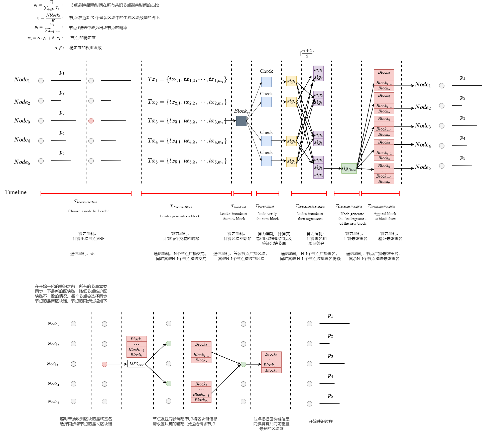

# 共识过程

## 问题

当前互联网中区块链共识算法通常具有能耗高、依赖代币和可靠通信等。无线区块链网络的节点具有资源有限、移动性和网络拓扑动态变化不可预测等特征，节点可能会突然离开系统影响共识过程。因此，无线区块链网络的共识算法需要确保共识过程稳定且能耗低。我们的共识协议将无线节点的稳定度作为出块节点选举的依据，选举出比较稳定和可信的节点确保出块节点短期内不会离开系统影响共识，最终所有节点能够快速、安全地对新区块达成一致。

## 网络模型

我们的共识协议是运行在一个由 $N$ 个全连接的随机分布在一个二维地理平面的节点构成的无线网络，即网络中任意两个节点在彼此的通信范围之内。系统是开放的，任意节点都不需要事先的身份授权就加入系统。每个节点配有半双工收发器，可以发送或接收消息，或感知信道，但不能同时发送和接收或发送和感知。我们假设每个节点拥有唯一的ID，并且知道所有其他节点的身份和公钥。假设节点可以在网络区域中随意移动，并且节点可以随意进入和离开这个区域。此外，我们假设每个节点在一个区域中的活动时间是有限的。

## 共识过程

我们设计的共识协议的共识过程是由四个阶段组成：出块节点选举阶段、区块生成阶段、区块验证阶段和链更新节点，具体如下：
* 出块节点选举阶段：在这个阶段有一个共识节点将被选举为出块节点；
* 区块生成阶段：被选中的出块节点将会将近期的交易打包并创建一个新区块。随后，该区块会被广播给所有共识节点；
* 区块验证阶段：接收到新区块之后，节点会验证出块节点和区块的有效性。一旦新区块被确认有效，节点会广播签名给所有共识节点，其他共识节点会收集并验证接收的签名。
* 链更新阶段：当节点接收到有效签名数量超过阈值形成最终签名时确认区块，将区块添加到本地链上并广播最终签名给其他共识节点。其他节点接收到最终签名后，也会将区块添加到本地区块链上。至此，所有共识节点对新区块达成共识，开始新一轮的共识过程。

区块链共识具体过程可见下图：

在稳定区块链协议中，主要是根据节点的稳定度来随机选举出块节点。新节点加入系统要质押金钱获得有限的活动时间。活动的时长与交付的押金成正比。记 $T_{v}$ 为无线网络节点 $v$ 在区块链系统中的活跃时间，所有共识节点的剩余活动时间之和为 $\sum_{i \in N}T_{i}$，定义节点的活动时间比为 $\rho_{v} = \frac{T_{v}}{\sum_{i \in N}T_{i}}$。记 $r_{v}=\frac{N_{v}}{K}$ 为节点在最近 $K$ 个确认区块中参与共识比值，其中，$N_{v}$ 是节点 $v$ 生成区块的数量。定义无线网络节点 $v$ 的稳定度为 
$$S_{v}=\alpha\times \rho_{v}+\beta\times r_{v}$$
其中，权重系数 $\alpha, \beta$ 可根据偏好设置。在区块链系统运行初期，确认区块数量不足 $K$ 个时记节点的共识比 $r_{v}=0$，此时节点的稳定度主要受节点的活动时间的影响。协议根据节点的稳定度决定节点被选中的概率，稳定度越高的节点越容易被选中。

为了尽可能使系统中节点维护相同的区块链，在每次同时开始之前，节点会执行一次区块链同步操作。节点会随机请求几个邻节点的区块链信息，最终同步拥有共同链前驱且有最长有效区块链。

## 符号表

* $N$：网络区域中节点的数量；
* $T_{i}$：无线网络节点 $i$ 在区块链系统中的活跃时间;
* $\rho_{i}$：节点 $i$ 的活动时间比；
* $N_{i}$：节点 $i$ 在最近 $K$ 个区块生成区块的数量；
* $r_{i}$：节点 $i$ 在最近 $K$ 个确认区块中参与共识比值；
* $S_{i}$：节点 $i$ 的稳定度；
* $\alpha$：节点活动时间比权重系数；
* $\beta$：节点共识比权重系数:

## 测试指标

### 稳定度

影响稳定度主要因素有：节点活动时间比和共识比。这两者会对所选节点的稳定度产生影响，但是所占的权重还不能确定。节点的剩余活动时间会逐渐减少，如果节点的活动时间不曾延长，选举剩余活动时间比小的节点可能会导致生成空区块，降低交易处理的效率。出块节点的选举算法的思想，出块节点应该尽可能是稳定和可信的，确保能够生成有效区块，并在完成区块确认之前不会出现故障。所以选择一个优质的节点作为出块节点是非常重要的。为了确定权重系数，需要对不同的权重系数做多次对比实验。

实验场景设置：区块链网络中有 $N$ 个节点，其中 $\frac{N}{4}$ 个节点具有较大的活动时间占比和较小共识比；$\frac{N}{4}$ 个节点具有较小的活动时间占比和较大共识比；$\frac{N}{4}$ 个节点具有较小的活动时间占比和较小共识比；$\frac{N}{4}$ 个节点具有较大的活动时间占比和较大共识比。每个共识结束之后都需要更换出块节点。

对于权重系数 $\alpha, \beta$ 的实验我们分别测试了以下几种情况进行实验：我们通过多次共识中，测试不同权重系数时优质节点（活动时间占比高且共识比高）被选中的次数来确定比较合理的权重系数。
* $\alpha = 1, \beta = 0$:只考虑活动时间比影响稳定度时，优质节点被选中的次数；
* $\alpha = 0, \beta = 1$:只考虑共识比影响稳定度时，优质节点被选中的次数；
* $\alpha = 0.9, \beta = 0.1$:
* $\alpha = 0.8, \beta = 0.2$:
* $\alpha = 0.7, \beta = 0.3$:
* $\alpha = 0.6, \beta = 0.4$:
* $\alpha = 0.5, \beta = 0.5$:
* $\alpha = 0.4, \beta = 0.6$:
* $\alpha = 0.3, \beta = 0.7$:
* $\alpha = 0.2, \beta = 0.8$:
* $\alpha = 0.1, \beta = 0.9$:

### 协议性能

共识协议性能的主要度量指标共识时延和交易吞吐量。我们主要测量不同情况下两个指标的变化情况来分析协议的性能。此外，我们还测试女巫攻击时两个指标的情况来分析其对性能的影响。

#### 时延测试

测试不同节点数量下区块的确认时间。为了方便对照，需要对条件和变量进行控制。
* 每个区块设置相同的大小；
* 每个节点除了稳定度的指标不同，其他指标都相同；

通过实验测试在不同节点数量时的共识的时延，并将多次实验的结果取平均值。测量不同网络节点数量时时延的变化趋势分析协议的性能：
* 网络大小 $N = 100$
* 网络大小 $N = 200$
* 网络大小 $N = 300$
* 网络大小 $N = 400$
* 网络大小 $N = 500$

#### 吞吐量测试

测试不同节点数量下交易处理的效率，对条件和变量进行控制。
* 每个区块设置相同的大小，区块中交易的数量也相同；
* 每个节点除了稳定度的指标不同，其他都相同；
* 不考虑生成空区块的情形。

实验测试在不同节点数量时的共识的时延和交易数量，计算得到交易吞吐量，并将多次实验的结果取平均值。通过分析不同网络大小时交易吞吐量的变化趋势分析性能。
* 网络大小 $N = 100$
* 网络大小 $N = 200$
* 网络大小 $N = 400$
* 网络大小 $N = 600$
* 网络大小 $N = 800$
* 网络大小 $N = 1000$

#### 女巫攻击

测试节点发起女巫攻击时，共识时延和交易吞吐量的变化情况。测试节点数量固定时，不同数量的女巫节点对于协议性能指标共识时延和交易吞吐量的情况，进一步分析女巫攻击对系统性能的影响。
* 女巫节点占比 $10\%$:
* 女巫节点占比 $20\%$:
* 女巫节点占比 $30\%$:
* 女巫节点占比 $40\%$:
* 女巫节点占比 $50\%$:

## 现存问题

* 关用户购买活动时间应该如何定价比较合理？
* 区块奖励给多少比较合理？
* 用户购买活动时间的钱通常应该怎么处理？
