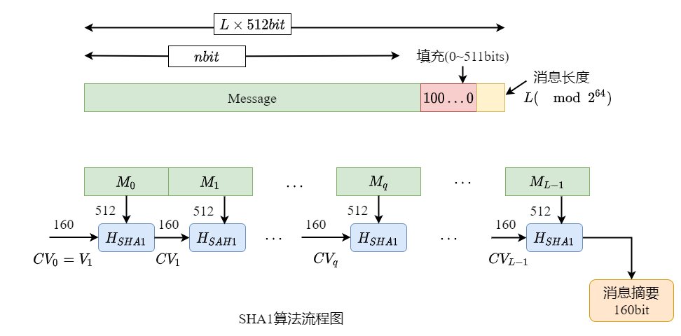

# 密码学签名

## 1. hash函数

### 1.1 定义

一个**Hash族**是满足下列条件的四元组 $(X,Y,K,H)$:
* **X**：是所有可能的消息的集合。
* **Y**：是由所有可能的消息摘要或认证标签构成的有限集。
* **K**：是密钥空间，是所有可能的密钥构成的有限集。
* 对每个$k\in K$，存在一个Hash函数 $h(x)\in H: h(k):X\rightarrow Y$。

在上面的定义中，$X$ 可以是有限或无限集; $Y$ 总是有限集。如果 $X$ 是有限集，则**Hash函数**常常称为**压缩函数**。这时，我们总是假定 $|X|\geq|Y|$，并且还经常假定更强的条件$|X|\geq 2|Y|$。

### 1.2 Hash函数的应用

Hash函数将可变长度的数据块作为输入，产生固定长度的Hash值 
$$hash_{value} = Hash(Data)$$
我们称数据 $Data$ 是Hash函数的原像，由于 $Hash$ 是**多对一**的映射，所以对于任意给定的Hash值可以对应有多个原像。如果出现 $x\neq y$ 且 $Hash(x) = Hash(y)$，则称为碰撞。Hash函数的一般结构如下图：

* **确保数据的完整性**：即判断数据是否被篡改过，比如生成程序或文档的“数字指纹”。通过Hash函数变换得到程序或文档的散列值，即数字指纹，并存放在安全地方；然后在一定时间后定时岁文档或程序求其散列值，与原数据对比，进而检测程序或文档是否被修改或中毒。
* **数字签名**：由于消息散列值比消息短得多，用于签名笔直接对消息本身签名高效得多。由于Hash值有较好的抗碰撞性，所以使用Hash函数进行签名，能满足消息的完整性、防伪造性以及不可否认性等特点。
* **防止信息泄露**：通过Hash函数生成口令的散列值，然后在系统中保存账号的散列值，这样能有限的防止系统在被入侵后，用户信息不会被直接泄露。同时，通过传输Hash函数生成的消息，也可以确保消息在传输过程中不会直接泄露信息。

#### 1.3 Hash算法

#### 1.3.1 MD5算法

MD5将任意长的消息压缩成为一个128bit的输出。
* **MD5算法原理**：MD5以512位分组来处理输入的消息，且每一分组又被划分为16个32位子分组，经过了一系列的处理后，算法的输出由四个32位分组组成，经过这四个32位分组将生成一个128位散列值。
* **算法描述**：（输入：长度小于 $2^{62}$比特消息；输出：128比特的消息摘要）

  * **附加填充位**：填充一个“1”和若干个“0”，使消息长度模512与448同余，再将原始消息长度以62比特表示填充到末尾。这样消息长度即变成了512比特的整数倍。
  * **初始化链接变量**：MD5运算要用到一个128位的MD5缓存器，用来保存中间变量和最终结果。该缓存器可以看作四个32位的寄存器A、B、C、D。最开始存放4个固定的32位参数，即初始链接变量。
  * **处理分组数据**：每一分组的算法流程如下：
    * 第一分组需要将上面四个链接变量复制到另外四个变量中：A到a，B到b，C到c，D到d。
    * 从第二分组开始的变量为上一分组的运算结果，即A = a， B = b， C = c， D = d。
    主循环有四轮（MD4只有三轮），每轮循环都很相似。第一轮进行16次操作。每次操作对a、b、c和d中的其中三个作一次非线性函数运算，然后将所得结果加上第四个变量，文本的一个子分组和一个常数。再将所得结果向左环移一个不定的数，并加上a、b、c或d中之一。最后用该结果取代a、b、c或d中之一。
    * 一个MD5运算由类似的64次循环构成，分成4组16次。
      * $F$ ：一个非线性函数，一个函数运算一次；
      * $M_i$ ：表示一个 32-bits 的输入数据；
      * $K_i$：表示一个 32-bits 常数，用来完成每次不同的计算。
        
  * **第四轮完成后**：做如下运算：$A=(A+AA)\mod 2^{32},B=(B+BB)\mod 2^{32},C=(C+CC)\mod 2^{32},D=(D+DD)\mod 2^{32}$。最后将四个寄存器的值做下一次迭代压缩时 的输入变量，直到最后一个消息分组输出128位的散列值。

#### 1.3.2 SHA1算法
* 算法原理：
  * **step 1**：添加填充位，使数据长度满足 $L_{data} = 448 (\mod 512)$；
  * **step 2**：添加消息长度，一个62 位块，表示原始消息长度；
  * **step 3**：初始化缓冲区。160位，表示5个32位寄存器（A,B,C,D,E)
  * **step 4**：以512位数据为单位处理消息，四轮，每轮20步，共有四个基本逻辑函数 $f_1,f_2,f_3,f_4$；
  * **step 5**：输出，全部L个512数据块处理完后，输出160位消息散列值。

SHA1算法流程图如下所示：

## 2. 数字签名

消息验证码(MAC)算法能够保证传递**消息是经过验证**的，但不能对消息发送者的身份进行验证。因为消息发送方和接收方拥有同样的密钥，所以双方可以抵赖，否认消息是他发送的。数字签名技术能够进行**身份验证**，同时也具备MAC算法拥有的防止数据篡改和发送消息不能伪造的特性。

**数字签名**是指发送方用自己的**私钥**对**数字指纹**进行加密后所得的数据，其中包括**非对称密钥加密**和**数字签名**两个过程。在给数据加密的同时，也可用于接收方验证发送方身份的合法性。采用数字签名时，接收方需要使用发送方的公钥才能解开数字签名得到数字指纹。
* **数字指纹（信息摘要）**：是指发送方通过HASH算法对明文信息计算后得出的数据。

采用数字指纹时，发送方会将本端对明文进哈希运算后生成的数字指纹（还要经过数字签名），以及采用对端公钥对明文进行加密后生成的密文一起发送给接收方，接收方用同样的HASH算法对明文计算生成的数据指纹，与收到的数字指纹进行匹配，如果一致，便可确定明文信息没有被篡改。数字签名的加解密过程如下图所示：

* step 1: A使用B的公钥对明文进行加密，生成密文信息。
* step 2: A使用HASH算法对明文进行HASH运算，生成数字指纹。
* step 3: A使用自己的私钥对数字指纹进行加密，生成数字签名。
* step 4: A将密文信息和数字签名一起发送给B。
* step 5: B使用甲的公钥对数字签名进行解密，得到数字指纹。
* step 6: B接收到甲的加密信息后，使用自己的私钥对密文信息进行解密，得到最初的明文。
* step 7: B使用HASH算法对还原出的明文用与A所使用的相同HASH算法进行HASH运算，生成数字指纹。然后B将生成的数字指纹与从A得到的数字指纹进行比较，如果一致，B接受明文；如果不一致，B丢弃明文。

数字签名技术不但证明了信息未被篡改，还证明了发送方的身份。但是，数字签名技术也还有一个问题，**获取到对方的公钥可能被篡改，并且无法发现**。

### 2.1. 签名机制

数字签名主要分为签名生成和签名验证两个过程。

* **签名生成流程**：
  * 发送者对消息计算摘要值;
  * 发送者用私钥对摘要值进行签名得到签名值;
  * 发送者将原始消息和签名值一同发给接收者。

* **签名验证流程**：
  * 接收者接收到消息后，拆分出消息和消息签名值A;
  * 接收者使用公钥对消息进行运算得到摘要值B;
  * 接收者对摘要值B和签名值A进行比较，如果相同表示签名验证成功，否则就是验证失败。

### 2.2.实验

常用的数字签名算法有RSA数字签名算法和DSA数字签名算法。
* RSA签名算法是私钥签名，公钥验证签名。
* DSA签名算法生成签名、验证签名的机制和RSA数字签名算法是一样的。

我们将使用python语言实现RSA签名算法，实现数字签名的产生和验证过程。

### 2.2.1 实验内容

利用python的标准库实现数字签名生成和验证过程：
* step 1: 准备私钥文件、公钥文件和数据文件；
* step 2: 定义签名函数（能够使用指定的私钥对数据文件进行签 名，并将签名结果输出到文件返回）；
* step 3: 定义签名验证函数（能够使用指定的公钥对 step 2 中的签名文件进行验证，返回验证结果）；
* step 4: 利用 step 1 中的文件对 step 2和step 3中的函数进行测试。

### 2.2.2 实验环境

* python 版本： Python 3.10.0
* 处理器： Intel(R) Core(TM) i7-10700F CPU @ 2.90GHz   2.90 GHz
* 机带 RAM: 8.00 GB
* 系统类型	64 位操作系统, 基于 x64 的处理器

### 2.2.3 实验原理和步骤

Python标准库hashlib实现了SHA1,SHA224以及MD5等多个安全哈希算法，Python扩展库pycryptodome和cryptography提供了SHA系列算法和其他哈希算法，以及DES,AES,RSA等多个加密算法和数字签名算法的实现。我们使用第三方模块pycryptodome中的Crypto.PublicKey.RSA实现 RSA 秘钥对生成、加密/解密、签名/验签。

安装pycryptodome模块:

详细代码见[Signature_test](./Blockchain/../../../../../Sources/实验代码/Signature_test/ReadME.md)

