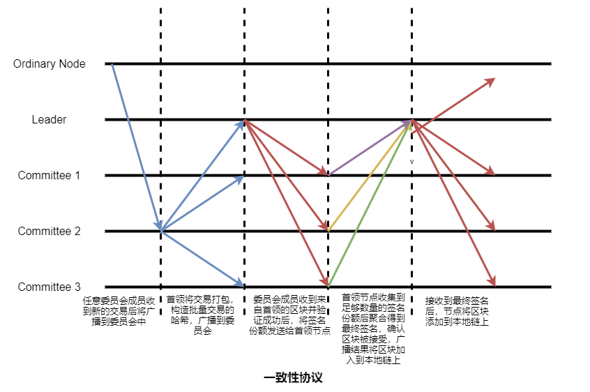

# 研究技术点

## 节点自启机制

无线区块链网络中，新节点自启机制包括几个部分：节点身份广播、其他节点身份信息获取、同步最新区块链。
* **节点身份广播**：新节点进入系统之后广播自身ID(IP地址)给单跳邻居节点。接收到新节点信息的节点会将新的节点信息广播给它的单跳邻居节点。最终全网都会知道新节点的ID（IP地址）。
* **获取其他节点信息**：节点会向邻居节点索取他们已知的其他节点的ID(IP地址)，可以获取其他节点的信息，方便之后建立与其他节点的通信连接。
* **同步区块链**：之前节点接入网络后会选择与最近的邻居节点同步区块链。为了防止节点同步到错误或者陈旧的区块链，需要一个安全的的节点自启机制。

新节点进入系统后随机移动到网络区域的某一个位置，在广播自身信息到网络之后，获取单跳邻居节点的信息并请求各邻居的区块链信息。
* 【方案一】根据区块链公共前缀性质，新节点会比对所有单跳邻居节点的区块链信息（区块链高度和区块链哈希），最终选择同步具有公共前缀的最长链。
* 【方案二】为了快速同步区块链，新节点也可以随机选择 $C$ 个单跳邻居节点的区块链比对同步最长区块链。
* 【方案三】新节点根据单跳邻居节点的活动时间选择同步区块链。将所有单跳邻居节点活动时间时间排序，最终选择同步活动时间是中位数的节点的区块链信息。这样可以确保节点必定是在系统中活动了一定时间，并且极有可能维护的区块链是最新的区块链。

## 共识算法

单链区块链共识算法通常包括出块节点的选举、生成区块、验证区块、达成共识以及更新区块链。
* **选举出块节点**：未避免敌手的偏置，我们采用随机的方式选举出块节点。在本研究课题中，考虑无限自组织网络的自然特性，为了确保区块链的安全和共识的稳定，我们采用基于节点稳定度的方式选举出块节点。这个方式可以确保出块节点不会在共识过程中离开系统，也会在生成区块后诚实维护区块链。
* **生成区块**：出块节点在确认出块权限之后会将节点中的交易按照顺序达到进入区块，随后将区块广播到网络中。在本课题中，考虑无线自组织网络是通过多跳无线节点传输区块，因此区块在网络中的传输具有较大的延时。需要考虑无线网络通信协议对于消息和数据传输的延时对性能的影响。因此，需要快速确认系统中没有同时生成多个区块，并且计算需要多长时间区块可以传输到绝大部分无线网络节点中。
* **验证区块**：节点接收到出块节点生成的区块后，会验证区块中交易的有效性。要检查是否有双花交易、交易是否合法有效。交易的顺序是否合理。
* **达成共识**：大部分诚实节点都认可区块的有效性，则系统对区块达成共识。考虑到无线网络通信消息传输的不稳定性和不安全性，采取计算多方签名计的方式得到共识结果。因此，本课题采取多门限签名的方式避免二次通信影响共识结果。需要设计一个快速聚集签名的方式提高达成共识的效率。
* **更新区块链**：当节点确认系统对区块达成共识之后，会将区块添加到本地区块链上，确保节点维护的区块链的一致性。

## 定义移动无线网络节点的稳定度

无线区块链系统中，每个节点只能在有限的时间内为一个网络区域的系统提供区块链服务。根据无线网络的服务时间和可信性。我们可以定义该节点在系统中得分稳定度。新节点加入后要质押金钱获得在系统中活动的时间，活动的时长与交付的押金成正比。在单链区块链中，无线网络节点的稳定度的具体定义如下：

记$T_v$ 为无线网络节点 $v$ 在区块链系统中的活跃时间，记 $r_v = \frac{N_v}{K}$ 为节点在最近$K$个确认区块中参与共识比值，其中 $N_v$ 是节点 $v$ 生成区块的数量。定义无线网络节点 $v$ 的稳定度为 
$$S_v= \alpha\times T_v+ \beta\times r_v$$
其中，权重系数 $\alpha, \beta$ 可根据偏好设置。在区块链系统运行初期，确认区块数量不足 $K$个时记节点的共识比 $r_v = 0$，此时节点的稳定度主要受节点的活动时间的影响。

DAG区块链系统维护的是一个有向无环图形式的区块链，无法直接使用类似于单链共识比来定义节点的稳定度。我们使用的DAG区块链共识算法通过构建主链来确认交易并且主链全局排序来解决交易双花的问题。因此，我们可以通过在主链上两个最近稳定点之间的主链交易来给出节点的可信度。在DAG区块链系统中，无线网络节点的稳定度的具体定义如下：

记$T_v$ 为无线网络节点 $v$ 在区块链系统中的活跃时间，记 $r_v = \frac{N_v}{N_{all}}$ 为无线节点在最近两个稳定点之间的共识比，其中 $N_v, N_{all}$ 分别是两个稳定点之间节点 $v$ 交易的数量和总数量。定义无线网络节点的稳定度为 
$$S_v= \alpha\times T_v+ \beta\times r_v$$
其中，权重系数 $\alpha, \beta$ 可根据偏好设置。在区块链系统运行初期，只有创世交易单元是稳定点时记节点的共识比 $r_v = 0$，此时节点的稳定度主要受节点的活动时间的影响。

重点：

快速获取其他节点的活动时间和共识比计算其他节点的稳定度。设置影响稳定度的两个度量的权重系数。
难点：计算系统中所有节点的实时稳定度、计算权重系数、所有诚实节点关于稳定度的计算结果一致。

## 轮盘赌选举出块节点

本课题采用轮盘赌的方式选举出块节点。根据无线网络节点的稳定度决定被选中的概率。记$w_i$ 是节点 $i (i = 1, \cdots N)$ 的稳定度，所有节点的稳定度之和为 $W= ∑_i^N w_i$ ，那么节点i被选中的概率为 $p_i=  \frac{w_i}{W}$ 且有 $∑_{i=1}^Np_i=1$。为了确定被选中的节点，将区间[0,1]分为连续的多个区间
$$[0,∑_{k=0}^i p_k],i=1],(∑_{k=0}^{i-1} p_k ,∑_{k=0}^i p_k],i=2,…, N.$$

将区块的哈希和最终签名作为随机种子通过随即可验证函数计算得到一个随机值和证明
$$(value,proof)=VRF(sk,Block||Signature_{group})$$

若出块节点只有一个，则 $\frac{value}{2^{bits(value)}}$ 落在所属的区间之内节点被选举为出块节点。若需要选举多个出块节点，则将大于 $\frac{value}{2^{bits(value)}}$的 $C$ 个节点选举为出块节点。

根据随即可验证函数输出的值和证明，其他节点虽然不会提前知道哪个节点会被选中，但是可以验证出块节点选举结果的合法性。
$$result=VerifyVRF(pk, value, proof, Height,Signature_{group})$$

如果验证结果为 $result= 1$，则出块节点的合法性验证成功，否则若结果为 $result= 0$，则出块节点的合法性将不被承认。

## 首领节点选举

基于委员会的区块链共识算法在每一轮都需要重新选举首领来生成区块。无线自组织网络中节点之间通信信道不稳定并且通信时延高。因此，为了降低共识时延可以选择委员会中相互之间通信少的节点作为首领，降低网络资源消耗的同时提高委员会达成一致的效率。
    * **【方案一】** 通过路由算法委员会成员可以得知到其他成员节点的跳数，最终选择最小平均跳数的节点作为首领。记委员会成员数量为$C$，则委员会节点到其他节点跳数的矩阵记为
    $$H = \begin{bmatrix}
    h_{11}  &   h_{12}  &   \cdots  &  h_{1C}\\
    h_{21}  &   h_{22}  &   \cdots  &  h_{2C}\\
    \vdots  &   \vdots  &   \vdots  &  \vdots\\
    h_{C1}  &   h_{C2}  &   \cdots  &  h_{CC}\\
    \end{bmatrix}$$
    其中 $h_{ij}$ 表示节点 $i$ 到节点 $j$ 之间的最小路由跳数，当 $i=j$ 时 $h_{ij}=0$，表示节点到其自身的跳数为零。
    * **【方案二】** 在无线网络通信中，节点的欧式距离会反映节点之间的通信情况。因此可以根据节点之间的欧式距离来选举出到其他节点平均欧式距离最短的节点作为首领节点。记委员会成员数量为$C$，则委员会节点到其他节点的欧式距离矩阵记为
    $$D = \begin{bmatrix}
    d_{11}  &   d_{12}  &   \cdots  &  d_{1C}\\
    d_{21}  &   d_{22}  &   \cdots  &  d_{2C}\\
    \vdots  &   \vdots  &   \vdots  &  \vdots\\
    d_{C1}  &   d_{C2}  &   \cdots  &  d_{CC}\\
    \end{bmatrix}$$
    其中 $d_{ij}$ 表示节点 $i$ 和节点 $j$ 之间的欧式距离，当 $i=j$ 时 $d_{ij}=0$，表示节点到其自身的欧式距离为零。
    * **【方案三】**：将节点之间的欧式距离（或跳数）和节点的活动时间作为首领选举的影响参数。记 $T_a$ 为节点的活动时间，节点之间平均欧式距离（跳数）记为 $\mathbf{\hat{d}}$。节点根据公式  $\gamma_1\cdot T_a + \gamma_2\cdot \mathbf{\hat{d}}$ 对委员会内成员进行排序，选择值最大的节点作为首领。

## 一致性协议

区块链系统中的一致性协议通常是为了确保节点维护区块链(相同顺序的交易)的一致性。考虑到无线网络节点容易出现由于硬件错误、网络通信信道不稳定以及恶意攻击等出现不可预料的行为，一致性协议需要能够容忍拜占庭故障。

单链区块链中，在一个由 $C$ 个移动无线网络节点组成的委员会中，能够容忍 $f = \lfloor\frac{C-1}{3}\rfloor$ 个节点发生拜占庭故障，能够保证达成共识的节点数量为 $Quorum = \lceil\frac{C+f+1}{2}\rceil$。

委员会首领负责将未处理的交易进行排序打包，所有成员执行交易的逻辑顺序相同。
* **交易广播阶段**：任意节点生成交易之后都将提交给任意当前委员会成员；委员会内成员接收到交易之后广播给其他委员会成员。
* **准备阶段**：首领节点将交易排序并打包到区块，将区块消息作为提案广播到委员会。
* **确认阶段**：委员会成员接收到来自首领的区块提案后，对区块和首领节点验证合法性。一旦验证成功就发送签名份额到首领节点。首领节点收集到一定数量的签名份额后聚合成最终签名，将区块放入本地链并广播最终签名到全网。
* **更新区块链**：一旦接收到最终签名，节点将区块链接到本地链上，更新区块链。

DAG区块链中，见证委员会首领将生成的见证交易作为提案，在委员会内达成一致。在一个由 $C$ 个移动无线网络节点组成的委员会中，能够容忍 $f = \lfloor\frac{C-1}{3}\rfloor$ 个节点发生拜占庭故障，能够保证达成共识的节点数量为 $Quorum = \lceil\frac{C+f+1}{2}\rceil$。
见证委员会首领负责将见证交易作为提案发送给委员会其他成员。
  * **准备阶段**：首领节点将见证交易消息作为提案广播到委员会。
  * **确认阶段**：委员会成员接收到来自首领的提案后，对交易和首领节点验证合法性。一旦验证成功就发送签名份额到首领节点。首领节点收集到一定数量的签名份额后聚合成最终签名，将交易放入本地DAG链并广播最终签名到全网。
  * **更新区块链**：一旦接收到见证交易或者普通交易，节点将交易链接到本地链上，更新区块链。

## 委员会重置

为了确保委员会的稳定性和防止敌手腐蚀委员会成员，委员会任期结束之后需要更换部分委员会成员。
* 【方案一】采用随机的方式更换委员会成员。委员会中能够容忍拜占庭故障节点的数量为 $f = \frac{C-1}{3}$，为了确保系统的安全性，委员会成员每次最多只随机更换 $\lfloor\frac{C-1}{3}\rfloor$ 个委员会节点。
* 【方案二】采用排序的方式更换委员会成员。对委员会中成员的稳定性排序，最多更换稳定度最低的 $\lfloor\frac{C-1}{3}\rfloor$ 个委员会节点。
* 【方案三】采用轮循的方式更换委员会成员。新选举的委员会节点会替换委员会任期开始之后生成区块的前 $\lfloor\frac{C-1}{3}\rfloor$ （最多）个节点。

## 跨分片交易防死锁

多委员会区块链共识算法面临着跨分片交易死锁问题和跨分片交易处理缓慢的问题。考虑无线网络通信不稳定和跨分片交易通信时延高等问题，需要一个安全高效的跨分片交易处理方式。
* 【方案一】采取一个原子提交协议提交协议。当出现跨分片交易时，与该交易相关的分片中的交易将被锁住。如果与该跨分片交易相关的交易都是合法有效的，确认该交易的有效性。否则该跨分片交易将被拒绝，随后分片中的交易被解锁。原子提交协议确保跨分片交易处理的安全性问题，防止交易死锁。
* 【方案二】采取交易分离的方式。将跨分片交易分割为几个不同分片的交易，并将交易发送到所属分片中处理。这种方式可以极大的降低跨分片交易处理是网络通信，提高交易处理的性能。
* 【方案三】采用分片临时融合的方式。如果两个分片频繁出现跨分片交易，则将两个分片融合为一个分片。这种方式会直接将跨分片交易转变为分片内部的交易，降低跨分片交易处理所需的节点之间的网络通信。但是分片融合的时候会出现分片委员会重新确定的问题。针对这个问题可以直接选取其中一个委员会作为新分片的委员会，也可以从两个原来的委员会中随机选举或者排序选举新的委员会成员。

## 构造主链

DAG区块链中交易单元的确认是根据见证委员会发布的见证交易单元来构建系统主链和稳定点。主链中稳定点之前的交易单元是完全相同的，因此可以为主链上的交易单元分配主链号，即稳定点之前的所有交易可以被确定全序。对于冲突交易则只承认主链号最早的交易单元的合法性，解决了交易双花的问题。见证交易单元只能由见证委员会发出，并且每个见证交易单元必须引用前一个见证交易单元。见证交易单元确保DAG区块链将沿着一个方向增长。