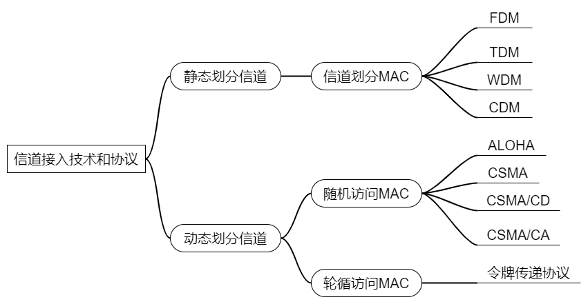

# 信道接入技术及协议——学习笔记

## 1. 信道共享方式

在普通的通信系统中，信道共享方式有3种：点对点、点对多点和多点共享。
* **点对点**：点对点是最简单的信道共享方式。其特点是只有两个节点共享无线信道。在单信道时，两个节点可以通过半双工方式实现共享，在双信道时，可实现全双工通信。
* **点对多点**：点对多点一般用于有固定基础设施控制的无线信道，例如蜂窝移动系统的无线信道。这时，终端在中心站的控制下共享一个或多个无线信道。
* **多点共享**：多点共享是指多个终端共享一个广播信道。以太网就是最典型的多点共享方式(仅指HUB的应用，对交换机来说就不是了)。在多点共享方式中，一个终端发送信号，所有的终端都可以听到，即相当于一个全互连的网络.因此这种共享方式下的信道也称为一跳共享广播信道。

## 2. 多点共享使用的信道共享技术

多点共享使用的信道共享技术，又可以分为三种，即信道复用（静态）、随机接入（动态）和受控接入（动态）。如下图：

## 2.1 静态多点接入技术

* **信道复用**：指**多个用户通过复用器(multiplexer)和分用器(demultiplexer)来共享信道**，信道复用主要用于将多个低速信号组合为一个混合的高速信号后，在高速信道上传输。其特点是需要附加设备，并集中控制，其接入方法是顺序扫描各个端口，或使用中断技术。信道复用技术分为频分复用，时分复用，波分复用，码分复用，空分复用，统计复用，极化波复用。
  * TDMA:为每个用户分配一个固定的时隙。**时分复用**TDM－Time Division Multiplexing;
  * FDMA:为每个用户分配一个固定的频段。**FDM/频分复用**：当信道带宽大于各路信号的总带宽时，可以将信道分割成若干个子信道，每个子信道用来传输一路信号，这就是频分多路复用（Frequency Division Multiplexing, FDM)

这些静态的方法，在用户数较少而固定，且每个用户通信量较大的情况下，是简单有效的接入方案。但是，当用户数目较多且通信量具有突发特征时，就不适用。必须采用动态多点接入技术。

## 2.2 动态多点接入技术

动态多点接入技术，可分为受控接入和随机接入两类。

### 2.2.1 随机接入

**随机接入的特点**是所有的用户都可以根据自己的意愿随机地向信道上发送信息。当两个或两个以上的用户都在共享的信道上发送信息的时候，就产生了冲突(collision)，它导致用户的发送失败。**随机接入技术主要就是研究解决冲突的网络协议**。随机接入实际上就是**争用接入**，争用胜利者可以暂时占用共享信道来发送信息。
* **随机接入的特点**：站点可随时发送数据，争用信道，易冲突，但能够灵活适应站点数目及其通信量的变化。
* 有线网络典型的随机接入技术有ALOHA、CSMA、CSMA/CD

数据链路层动态随机分配信道时对随机访问MAC协议：ALOHA，CSMA，CSMA/CD，CSMA/CA。ALOHA，CSMA，CSMA/CD的区别仅在于是否对信道进行监听和是否有碰撞检测：
* ALOHA：不监听，无碰撞检测；
* CSMA：有监听，无碰撞检测；
* CSMA/CD：有监听，有碰撞检测。（有线网络）
* CSMA/CA：有监听，尽量避免冲突。（无线网络）

**监听（CS）**：发送时先判断其他站点是否正在发送数据，监听到有数据正在发送就不发了，根据不同策略等待一段时间（即CSMA的三种退避算法）后再进行发送。但由于通道的传播延迟，仍然可能出现发送端发送完毕，数据帧正在传输中，接收端未接受到的情况，这种情况不会被监听到，此时发送数据依然有可能发生碰撞。

**碰撞检测（CD）**：在无碰撞检测的情况下，发送方不知道信道上是否发生了碰撞。就算信道上发生了数据帧的碰撞，被破坏掉的帧依旧会持续发送到接收方，然后接受方提供反馈之后发送方才能发现产生了碰撞，浪费了时间。有碰撞检测即发生碰撞就立刻从碰撞点返回消息，发送方收到消息后立刻停止发送，等待一段时间后再重传，提高了信道利用率。碰撞检测需要对信道持续监听。

**冲突避免（CA）**：发送包的同时不能检测到信道上有无冲突，只能尽量“避免”。

#### 2.2.1.1 CSMA vs. ALOHA

* **Aloha**是一种简单的通信方案，最初由夏威夷大学开发，用于卫星通信。在Aloha方法中，通信网络中的每个源在每次有帧要发送时发送数据。如果帧成功到达目的地，则传输下一帧。如果目的地没有接收到帧，则会再次发送该帧。
* **CSMA**（Carrier Sense Multiple Access）是一种媒体访问控制（MAC）协议，其中节点只有在验证没有其他通信量之后才能在共享传输媒体上传输数据。

#### 2.2.1.2 ALOHA协议

Aloha是一个简单的通信协议，网络中的**每个源只要有一个帧要发送，就发送数据**。如果帧传输成功，则将发送下一帧。如果传输失败，源将再次发送相同的帧。

**半双工无线链路**或**两个无线广播系统**都能很好地工作。但是，当网络变得更复杂时，例如**具有多个源和目的地的以太网使用一个公共数据路径时，就会出现由于数据帧冲突而导致的问题**。**当通信量增大时，碰撞问题变得更严重**。这会降低网络的效率，因为帧碰撞会导致两个帧中的数据丢失。**时隙Aloha**是对**原始Aloha协议**的改进，其中引入了**离散时隙来提高最大吞吐量**，同时减少冲突。这是通过只允许信源在时隙开始时传输来实现的。

ALOHA分为纯ALOHA协议和时隙ALOHA两种，无监听，直接发，检测到碰撞后等待一段随机时间后再重传。
* 纯ALOHA：
  * **工作原理**：站点只要产生帧，就立即发送到信道上；规定时间内若收到应答，表示发送成功，否则重发。
  * **重发策略**：等待一段随机的时间，然后重发；如再次冲突，则再等待一段随机的时间，直到重发成功为止。
  * **优缺点**：优点：简单易行；缺点：极容易冲突。
  * **竞争系统**：多个用户以某种可能导致冲突的方式共享公用信道的系统
* 时隙ALOHA（S-ALOHA）
  * **基本思想**：把信道时间分成离散的时间槽，槽长为一个帧所需的发送时间。每个站点只能在时槽开始时才允许发送。其他过程与纯ALOHA协议相同。
  * **优缺点**：可以避免冲撞到发送了一半的帧，但依然有可能多个帧同时在在一个时间槽开始时进行发送，然后再在信道中产生碰撞。比纯ALOHA的信道利用率提升一倍。

#### 2.2.1.3 CSMA协议

CSMA协议是一种概率MAC协议，其中节点在共享信道（如电气总线）上**传输之前验证信道是否空闲**。在发送之前，发送器尝试检测通道中是否有来自另一个站的信号。如果检测到信号，则发射器等待持续传输完成，然后再开始传输。这是协议的“**载波感知**”部分。**“多址”**定义**多个站点在信道上发送和接收信号，并且由单个节点发送的信号通常由使用该信道的所有其他站点接收**。载波感知多址碰撞检测（CSMA/CD）和载波感知多址避碰（CSMA/CA）是CSMA协议的两种改进。**CSMA/CD通过在检测到碰撞时立即停止传输，从而提高CSMA的性能**，**CSMA/CA通过在信道被检测到繁忙时将传输延迟一个随机间隔来改善CSMA的性能**。

载波监听多路访问CSMA的技术，也称做**先听后说**LBT(Listen Before Talk）。要传输数据的站点首先对媒体上有无载波进行监听，以确定是否有别的站点在传输数据。假如媒体空闲，该站点便可传输数据；否则，该站点将避让一段时间后再做尝试。这就需要有一种退避算法来决定避让的时间，常用的退避算法有**非坚持、1－坚持、P－坚持**三种。
* **非坚持算法**：
  * **算法规则**：⑴假如媒本是空闲的，则可以立即发送。⑵假如媒体是忙的，则等待一个随机时间后，再次监听进行发送。采用**随机的重发延迟时间**可以减少冲突发生的可能性。
  * **优缺点**：优点：减少冲突；缺点：即使有几个站点都有数据要发送，但有可能大家可能等待时延都比较长，致使媒体仍可能处于空闲状态，使用率降低。
  * **1-坚持算法**：
    * **算法规则**：⑴假如媒体空闲的，则可以立即发送。⑵假如媒体是忙的，则继续监听，直至检测到媒体是空闲，立即发送。
    * **优缺点**：优点：只要媒体空闲，站点就立即可发送，避免了白白浪费空闲时间，减少媒体空闲时间；缺点是：假若有两个或两个以上的站点有数据要发送，那么检测到媒体是空闲时候这些站点会同时发送数据，一定会产生冲突。
  * **P-坚持算法**：
    * **算法规则**：⑴监听总线，假如媒体是空闲的，则以P的概率直接发送，而以（1-P）的概率延迟一个时间单位再次监听进行发送。一个时间单位通常等于**最大传播时延的2倍**。
    * **优缺点**：P-坚持算法是一种既能像非坚持算法那样减少冲突，又能像1-坚持算法那样减少媒体空闲时间的折中方案，P取1时就是1-坚持，P取0时就是非坚持。系统忙的时候可以选择P小一些，闲的时候选择P大一些。

CSMA的三种算法是监听时的退避算法，与碰撞时的不同，发生碰撞时都是等待一段随机时间再重传。

#### 2.2.1.4 载波监听多路访问/冲突检测（CSMA/CD）

由于CSMA在产生碰撞后会依然传送被破坏掉的帧，这样会白白浪费信道容量，一种改进方法是增加碰撞检测。

CSMA/CD比CSMA增加了**碰撞检测**，在传输时间继续监听媒体，一旦检测到冲突，就立即停止发送，并向总线上发一串短的阻塞报文(Jam），通知总线上各站冲突己发生，停止发送数据，可以提高总线的利用率，这就称作**载波监听多路访问/冲突检测协议，简写为CSMA/CD**。

CSMA/CD的代价是用于**检测冲突所花费的时间**。对于基带总线而言，最坏情况下用于检测一个冲突的时间等于任意两个站之间传播时延的两倍（即快要发送到终点时发生碰撞再折回，花了两倍时间）。
* **二进制指数回退算法**：二进制指数回退算法是CSMA/CD检测到碰撞后需要重传时的回退算法，独有的，与前面不一样：二进制指数回退算法原理：
  * 1. 从离散的整数集合 $[0,1,2, \cdots, (2k-1)]$ 中随机的取出一个数 $r$，等待的时延为 $r$ 倍的基本退避时间，$k$ 为碰撞的次数，最大取10，基本退避时间为2倍的传播时延（即争用期）。
  * 2. 当冲突次数超过16次后，发送失败，认为网络过于拥挤，无法发送，丢弃传输的帧，发送错误报告。
* **最小帧长**：如果帧长过小，信道上就可能存在多个数据帧，当发生冲撞时收到返回时不知道究竟是哪个发生了冲撞，所以规定了最小帧长。**最小帧长等于：2倍的传播时延*传播速率**。这样可以在发现碰撞时保证信道上只发出了一条数据。为什么取2倍的传播时延2t，是因为如果发生碰撞，碰撞反馈信息会最晚在2t时间内返回。收到反馈消息后最多只需要判断2t时间内发出的是哪一条帧进行重发就可以了。**换个说法**：现在正在发送一条帧，还没从发送端发完时收到了一条碰撞反馈，此时从前找2t个时间内只可能存在一个数据帧，就知道是哪个帧出现了问题。假如帧长过短的话，2t时间内可能存在好多帧，就不知道是哪个出现问题了。10MB/S以太网以51.2us为争用期，一秒可发送512bit数据，即64Byte，所以一般选择64B作为最小帧长。

#### 2.2.1.5 CSMA/CA 协议

在大规模无线局域网中由于碰撞过多并不适用，由此可以采用避免碰撞的CA协议。

CSMA/CA（Carrier Sense Multiple Access with Collision Avoid，即**带有冲突避免的载波侦听多路访问**）是一种数据传输是避免各站点之间数据传输冲突的算法，其特点是发送包的同时不能检测到信道上有无冲突，只能尽量“避免”。
* **协议原理**：先向信道发送一个RTS帧，承载地址、大概传输时间等信息，接收方会响应一个CTS帧，与发送方预约信道，此时信道就只允许这两方之间进行数据传输，避免了冲突。接收方收到数据后进行CRC循环冗余检验，没有问题返回ACK确认帧，有问题重传。
* **协议特点**：CA协议无法完全避免冲突，只是预约好信道后不会产生冲突。因为发送RST帧时也有可能与其他的RST帧产生冲突，不过控制消息要比数据短的多，冲突后等待随机重发，二次冲突的概率也小很多。

随机控制访问协议优点是负载轻的时候效率高，负载重的时候冲突开销大，其他协议还有：
* 同为动态分配信道协议的轮询访问协议，优点是动态划分，没有冲突，缺点是有轮询开销或令牌开销、等待延迟、单点故障。
* 基于多路复用技术的静态信道划分协议，有FDM，TDM，WDM，CDM，优点是没有冲突，负载时都得到利用效率高，缺点是负载低时无法利用全部带宽效率低。

### 2.2.2 受控接入

**受控接入**特点是各个用户不能随意接入信道而必须服从一定的控制规则；可以分为**集中式控制和分布式控制**。典型的有**多点线路轮询**和**令牌传递**。
* **轮询属于集中式控制**，控制节点按一定顺序逐一询问各用户节点是否有信息发送。如果有，则被询问的用户节点就立即将信息发送给控制节点；如没有，则控制节点依次询问下一节点。
* **令牌环属于分布式控制**，在环路中通过特殊的令牌环帧沿着环路逐站传递，只有获得令牌的节点才有权发送信息。当信息发送完毕，就将令牌传递给下一站。

