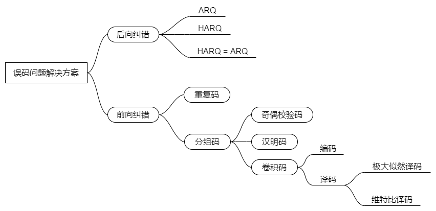
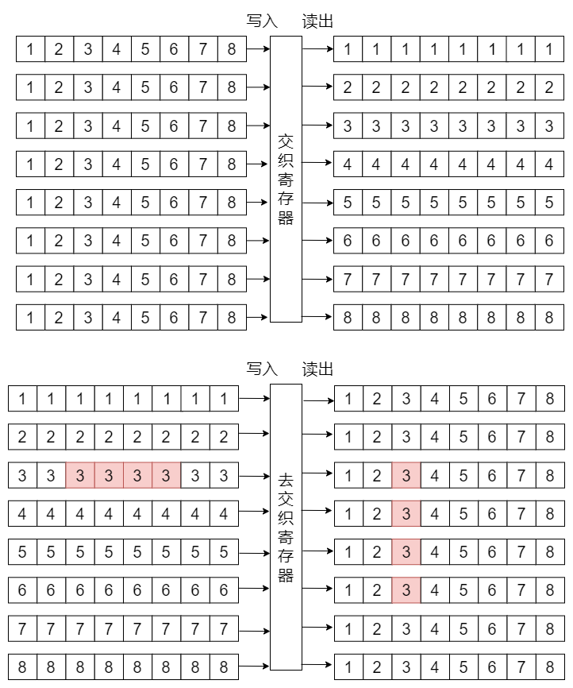

# 信道编码与交织——学习笔记

信道编码与交织在通信系统模型中的位置如下图所示：

信道编码主要是为了解决数据在信道中传输时引入的误码问题。解决误码问题有两个办法：
* **后向纠错**：对错误数据进行重传
* **前向纠错**：在发送端发送数据时加入一定的冗余信息，以便在接收端可以直接进行纠错。

## 1. 信道编码

FEC，全称Forward Erro Correction就是前向纠错码。
* **重复码**：在数据中增加冗余信息的最简单方法，就是将同一数据重复多次发送。例如，将每一个信息比特重复3次编码：$0\rightarrow 000，1\rightarrow 111$，在接收端根据少数服从多数的原则进行译码，按照这种方法进行编译码，如果错2位就会导致译码出错，且传输效率很低。
* **分组码**：为了提高传输效率，将 $k$位信息比特分为一组，增加少量多余码元，共计 $n$ 位，计为 $(n，k)$。例如:一个 $(n，k)$ 分组码 $(\text{a a }\cdots \text{a a }\text{b }\cdots\text{b})$ 前 $k$ 位是信息码元， 后 $n-k$ 位是监督码元。其中的监督码元是用于检错和纠错的，也可以叫做**校验码元**。
  * **奇偶效验码**：最简单的分组码，**偶效验码**：通过添加1位监督码元使整个码字中的1的个数为偶数，在检错时，对所有位做异或，如果为0，正确，如果为1，错误。**奇偶效验码只能检测奇数个错误，不能纠正错误。**
  * **汉明码**：可以检测2位错误，纠正1位错误。
  * **卷积码**：一般用 $(n，k，K)$ 来表示卷积码，其中参数 $K$为约束长度，表示编码器的输出与本次及之前输入的 $K$ 个码元相关。例如（2，1，3）卷积码：编码器每次输入1个码元，输出2个码元，这2个码元与本次及之前输入的3个码元相关。
  * **最大似然译码**：最大似然译码往往要遍历 $2^{L}$ 种可能码字序列计算概率才能完成译码，计算量随着 $L$ 逐级上升，难以实现。
  * **维特比译码**：译码的过程就是在译码器网格图种寻找一条汉明距离之和最小的路径。

## 2. 交织

交织和去交织是通过对寄存器按行写入按列读出实现的，如果在信道传输过程中如果出现了连续误码，去交织后会转变为单个误码，让信道译码更方便纠错。如下图：

FEC结合交织可以在一定程度上解决误码问题，想要彻底解决，还要借助反馈重传技术——**后向纠错**。
* **自动请求重传（ARQ）**：发送端发送具有一定检错能力的码，接收端发现出错后，立即通知发送端重传，如果还是错，再次请求重传，直至接收正确为止。
* **混合ARQ（HARQ）**：是FEC和ARQ的结合，接收端发现出错后，尽其所能进行纠错，纠正不了，则立即通知发送端重传，如果还是接收错误，再次请求重传，直至接受正确为止。

显然HARQ的性能是优于ARQ的，但HARQ会导致解调门限大大提高，一般重传次数要满足最恶劣信道条件下在达到最大重传次数之前能将数据传输正确，为了降低对解调门限的要求，移动通信系统中一般将二者结合起来使用。利用**HARQ重传将误码控制在一定水平，残留一部分误码给ARQ进行重传，这样系统性能可以达到最优**。
