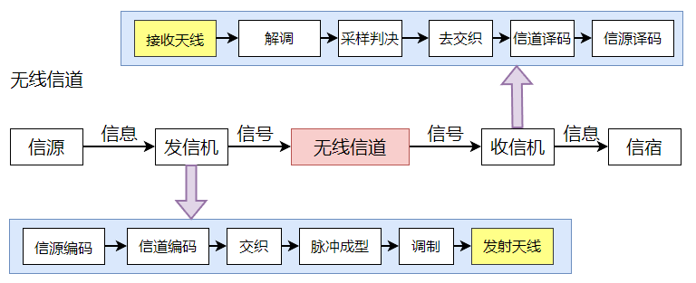

# 天线技术——学习笔记

无线通信系统中，需要天线来完成**射频电信号和电磁波**之间的转换。天线在通信系统模型中的位置如图所示：

* **功能**：：在发送端通过发射天线将射频电信号转换成电磁波，以在自由空间中进行传输，在接收端通过接收天线将电磁波转换回射频电信号。
* **电磁波辐射原理**：如果两个导线平行而且距离很近，电场会被束缚在两道线之间，此时辐射很微弱。如果两导线张开，电场就会被散播到周围空间，因而辐射增强。当导线长度L远小于波长时，辐射很微弱，当导线长度L增大到可与波长相比拟时，导线上的电流将大大增大，形成较强的辐射。
* **半波对称阵子**：是指两臂长度均为1/4波长，全长为1/2波长的振子。
* 半波对称振子本身是一个**全向天线**，但其波瓣宽度比较大，增益较小，为了提高增益，可以使用多个半波对称振子组成一个阵列。在全向天线的基础上，利用反射板把辐射控制到单侧方向，构成一个覆盖扇形区域的**定向天线**。

采用多天线，可以实现一些单根天线做不到的功能。比如MIMO（多入多出系统）、分集技术，分集就是“分开传输，集中处理”，发射机将同一个信号分成多路进行传输，到了接收机再集中进行合并。常用的合并算法包括：选择合并、最大比合并、等增益合并等。

**多天线**可以利用波束赋形技术将天线方向图的主瓣对准目标，改善无线覆盖和无线信道传输质量，提高频谱利用率。

**波束赋形**顾名思义就是赋予波束一定的形状，让波束的主瓣方向对准目标。通过控制天线阵列各天线发射信号或接收信号的相位，就可以增强电波传播方向上的信号强度，实现波束赋形，利用这种方法实现波束赋形的阵列称为**相控阵列**。

