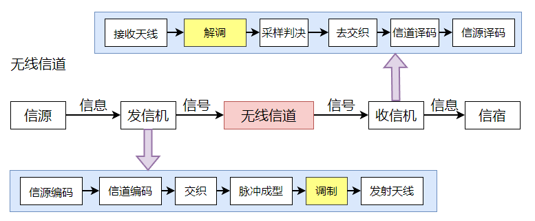
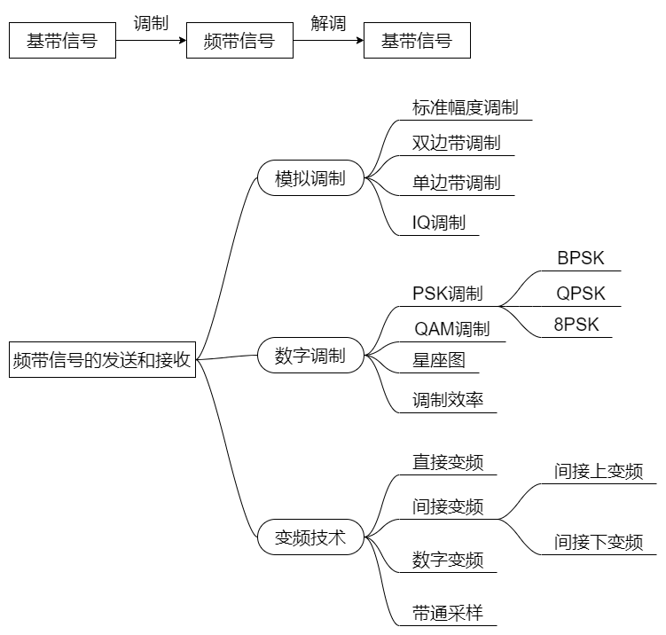
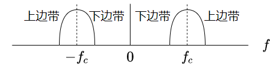
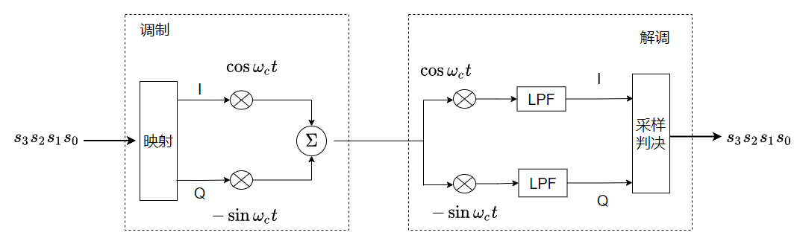

# 频带信号的发送和接收——学习笔记

频带信号的发送和接收在通信系统模型中的位置如图所示：

基带信号通过调制转换成频带信号，基本思路是发送端产生高频载波信号，让高频载波的幅度、频率或相位随着调制信号变化，接收端收到后，从中将调制信号恢复出来。根据要调制的信号是模拟信号还是数字信号，调制分为模拟调制和数字调制。

## 1. 模拟调制

指要调制的信号是模拟信号，一般分为幅度调制（调幅）、频率调制（调频）和相位调制（调相）。在移动通信系统中调幅用的比较多。**直接将低频电信号与高频载波信号相乘即可得到高频已调信号**，需注意，低频电信号的幅值必须恒大于0，否则高频载波信号的幅度不会完全按照低频信号来变化。
* **标准幅度调制**：为了保证低频信号 $f(t)$的幅值恒大于$0$，将 $f(t)$ 的电平抬高 $A_{0}$，使得 $f(t)+A_{0}$ 恒大于$0$，再与高频载波相乘。设载波信号为 $\cos\omega _{c}t$，则已调信号表示为 $s(t) = [f(t)+A_{0}]\cos\omega _{c}t$。利用二极管的单向导通性和电容的高频旁路（包络检波）和隔直特性就可以实现解调。标准幅度调制的问题在于效率很低，在双向无线电通信小中很少采用，被广泛用于无线电广播中。
* **双边带调制**：已调信号表示为 $s(t) = f(t)\cos\omega _{c}t$。在解调时若仍采用包络检波会发生严重失真，所以双边带调制采用相干解调，即在接收端提取同步信息，产生一个与高频载波信号同频同相的本地载波，与接收信号相乘，再通过低通滤波，即可恢复出调制信号，表示为 $f(t)\cos\omega _{c}t\cos\omega _{c}t = f(t)\cos^{2}\omega _{c}t = \frac{1}{2}f(t) + \frac{1}{2}\cos2\omega _{c}t$。因为 $cos2\omega _{c}t$ 的频率远高于 $f(t)$，所以可以利用**低通滤波器**LPF将 $f(t)$ 恢复出来。
* **单边带调制**：上边带和下边带都来源于基带频谱，各自携带了基带信号的全部信息。故上边带和下边带携带了相同的信息，应该只发送其中一个边带就可以了，可以节省一半的带宽。用理想低通滤波器截取下边带信号发射出去，就是下边带调制，用理想高通滤波器截取上边带信号发射出去，就是上边带调制，解调采用相干解调。上、下边带的定义如下图：
  

* **IQ调制（正交调制）**：双边带调制和单边带调制都是利用一路载波来传输一路信号，若采用两路载波，一路载波为 $cos\omega _{c}t$，另外一路载波为 $-sin\omega _{c}t$，则可以并行传输两路信号。已调信号表示为 $s(t) = x(t)cos\omega _{c}t - y(t)sin\omega _{c}t$

## 2. 数字调制

如果要传输0110001这样的二进制数据，就要用到数字调制，思路与模拟调制类似，通过控制高频载波的幅度、频率或相位来实现数字信号的传输。PSK调制和QAM调制是移动通信系统中最常见的两种数字调制：
* **PSK**：相移键控，让高频载波的相位随着输入的数字信号变化。
* **BPSK二相相移键控**：载波的相位有两种，分别代表0和1。0对应载波相位为0，已调信号为 $cos\omega _{c}t$，1对应载波相位相位为 $\pi$，已调信号为 $-cos\omega _{c}t$，两个已调信号中都有 $cos\omega _{c}t$，只要在幅度调制之前增加一个映射（$0\rightarrow+1,1\rightarrow-1$）即可。解调时，低通滤波后，在每个码元的中间时刻进行采样判决，就可以恢复出数据。
* **QPSK，四相相移键控**，载波的相位有4种，分别代表00、01、11、10（格雷码）。00对应载波相位 $\frac{\pi }{4}$，01对应 $\frac{3\pi }{4}$，11对应 $\frac{5\pi }{4}$，10对应 $\frac{7\pi }{4}$，已调信号中均同时含有 $cos\omega _{c}t$ 和 $sin\omega _{c}t$，故只要在IQ调制之前增加一个映射即可实现QPSK。
* **8PSK，8相相移键控*：载波的相位有8种，分别代表000、001、011、010、110、111、101、100（格雷码）。
* 16QAM：幅度和相位的组合共16种。

数字调制和解调原理可以总结为下图：

* BPSK：调制时，1bit映射为1个I路数据，Q路数据恒为0电平，解调时，采样得到的1个I路数据映射为1bit。
* QPSK：调制时，2bit映射为1对IQ数据，解调时，采样得到的1对IQ数据映射为2bit。
* 8PSK：调制时，3bit映射为1对IQ数据，解调时，采样得到的1对IQ数据映射为3bit。
* 16QAM：调制时，4bit映射为1对IQ数据，解调时，采样得到的1对IQ数据映射为4bit。
* 输入数据。IQ数据和载波相位/幅度三者之间的映射关系可以画到一张图中，就是星座图。数字调制也因此而经常被称为**星座调制**。

相同码元速率的情况下，**数字调制的阶数越高，每个码元承载的比特数越多，调制效率越高，比特速率也就越高**，设某数字调制对应的码元有N种，则每个码元承载的比特数为 $\log_{2}N$

码元又称为**符号**。在通信信道种持续固定时间，具有一定相位或幅值的一段余弦载波，就是码元。BPSK有2种码元，对应2种相位的余弦波。QPSK有4种码元，对应4种相位的余弦波。

单位时间内传输的码元个数称为**波特率**，单位为Baud。采用16QAM时，每个码元可以传输4bit，若波特率为100Baud，则比特速率为400bit/s。

# 3. 变频技术

* **直接变频**：直接利用IQ调制将基带信号变换为频带信号，称为直接上变频；解调时，直接利用IQ解调，将频带信号变换回基带信号，称为直接下变频。
* **间接变频**：不将基带信号直接变换为射频信号，或将射频信号直接变换为基带信号，而是先将**基带信号变换到中频，再从中频变换到射频**，这叫**间接上变频**。反之，叫**间接下变频**。
* **数字变频**：一般基带信号都是数字信号，中频处理也是数字化的，因此，基带和中频间的上变频和下变频一般都是通过数字信号处理实现。
* **带通采样定理**：设采样频率为 $f_{s}$，从采样值中无失真地恢复出带通信号地充要条件是采样频率 $f_{s}$ 满足 $\frac{2f_{H}}{m}\leq f_{s} \leq \frac{2f_{L}}{m-1}$，其中 $m=1，2，...，m_{max}，m_{max}$ 指不大于 $\frac{f_{H}}{B}$ 的最大整数。

m去最值时，能取到的最低采样频率是2B，为了能用最低的采样频率对带通信号进行采样，在设计带通信号时，一般将带通信号的最高频率设为带宽的整数倍（$f_{H} = kB$）。当带通采样定理中的信号最高频率时，这种信号一般称为**低通信号**，此时的带通采样定理就是奈奎斯特采样定理。采样频率高于信号最高频率两倍称为**过采样**，采样频率低于信号最高频率两倍称为**欠采样**，故对基带信号的采样都是过采样，对带通（频带）信号的采样可以是过采样，也可以是欠采样。