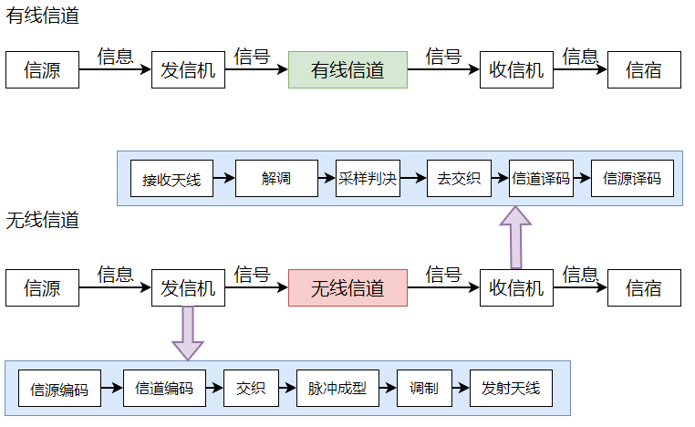
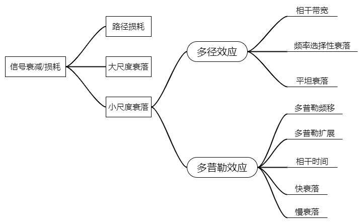
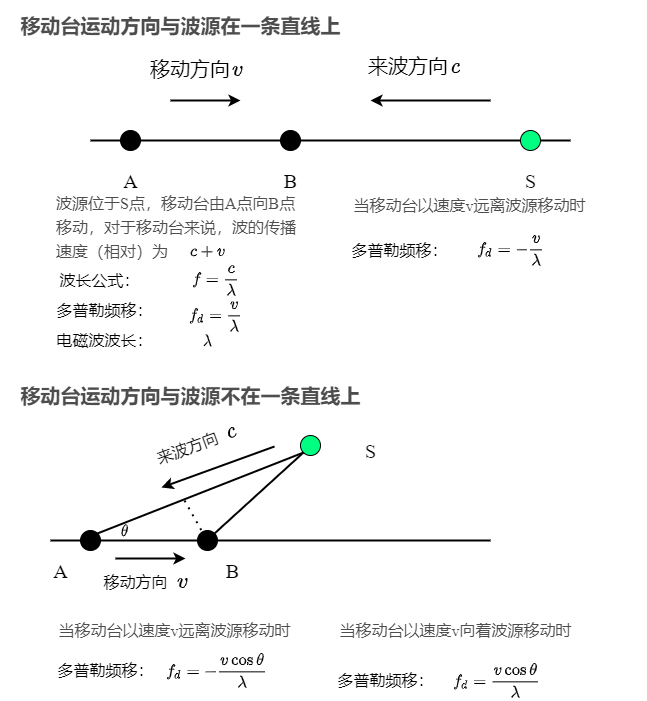

# 信道学习笔记

## 1. 无线信道

无限信道是将信号加载到电磁波上进行传输，按照电磁波频率的不同，电磁波传播分为多种。
地球大气 ：地面，对流层，平流层，电离层。

信道在通信系统模型如图所示

无线信道中存在各种**噪声**和**干扰**，比如接收机中产生的热噪声、进入天线的自然噪声和认为噪声等，噪声和干扰可能会使信号失真并导致误码。

信道的**频率响应**决定了哪些频率的信号可以通过信道，哪些频率的信号不能通过信道
* **信道带宽**：可以通过信道传输的信号频率范围大小。信号带宽不能超过信道带宽，否则会发生失真。

## 2. 信道容量

**信道容量**指在信道上进行无差错传输所能达到的最大传输速率，可以用香农公式计算得到:
$$C = B\log_{2}(1 + \frac{S}{\mathcal{N}})$$
其中 $C$ 是信道容量（bit/s）， $B$ 是信道带宽（Hz），$S$ 是信号平均功率（W），$\mathcal{N}$ 是噪声平均功率（W）。
信噪比公式：$I$ 是干扰平均功率（W)
$$SNR = 10\log_{10}\frac{S}{\mathcal{N}}, SINR = \frac{S}{I + \mathcal{N}}$$

无线电波在传播过程中会受到环境因素的影响，遭受不同途径的衰减或损耗，关于信道对信号造成的衰落和损耗，如图所示

* **路径损耗**：无线电波在自由空间中传播时产生的损耗，反映了在大范围空间距离上接收信号电平的平均值变化趋势。
* **阴影衰落/大尺度衰落**：无线电波在传播路径上受到建筑物及山丘等遮挡所产生的损耗，反映了在几百倍波长量级的中等范围内接收信号电平的平均值变化趋势。
* **多径衰落/小尺度衰落**： 由**多径传播**而产生的损耗，反映了在几十倍波长量级的小范围内接收信号电平的平均值变化趋势。
* **多径**：无线电波从发射天线经过多个路径抵达接收天线的传播现象，导致接收机收到的信号是直达波和多个反射波的合成。一般将多径信道最大时延 $\tau_{m}$ 的倒数定义为**多径信道的相干带宽**：$B_{c} = \frac{1}{\tau_{m}}$。一般的信号都不是单一频率，而是具有一定带宽，如果信号带宽 $B \gg B_{c}$，则信号中不同频率成分经多径传输后到达接收机的幅度增益差别很大，从而造成频率选择性衰落，信号会发生严重失真。若信号带宽 $B < B_{c}$，则到达接收机的不同频率的信号的幅度增益差别不大，形成平坦衰落。

* **多普勒效应**：当声源逐渐远离观察者时，声波的波长增加，频率降低，音调变得低沉，当声源逐渐接近观察者时，声波的波长减小，频率升高，音调变高。以移动通信为例，当移动台向基站移动时，基站接收到的电磁波信号频率会变高，当移动台远离基站时，基站接收到的电磁波信号频率会变低。例如：在移动通信中，无线电波的**多径传播**会导致**衰落**：对于到达接收机的多径信号，如果相同，叠加后信号会增强，如果相反，叠加后信号会减弱，由此造成接收信号的幅度变化。
* **多普勒频移**：多普勒效应造成的接收信号频率和发射信号频率之差。
  
* **多普勒扩展**：在多径传播场景下，频率为f的信号经不同传播路径到达接收机，不同传播路径的多普勒频移不同，导致接收信号频率扩展到 $[f - f_{d}, f+f_{d}]$ 范围内。
* **相干时间**：将最大多普勒频移 $f_{d}$ 的倒数定义为多径信道的相干时间，即 $T_{c} = \frac{1}{f_{d}}$。
* **快衰落**：**符号持续时间远大于信道的相干时间**，符号持续期间的信号幅度波动很大。
* **慢衰落**：为了避免符号持续期间信号幅度的大幅波动，一般要求**符号持续时常小于信道的相干时间**，以保证较小的信号幅度变化。

