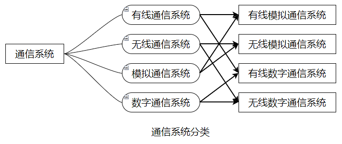
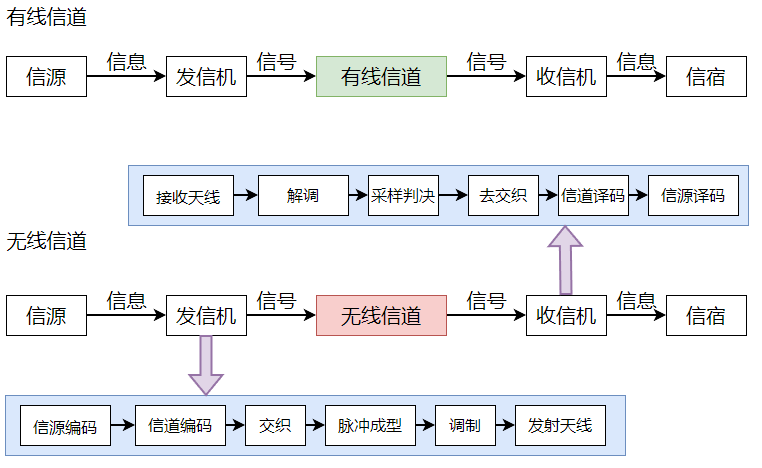

# 无线网络通信原理学习笔记——

## 1. 通信系统概述

通信系统可以根据有线/无线、模拟/数字划分，根据排列组合共有4类通信系统。

有线和无线的主要区别在于**信号的传输媒介**不同，不同的传输媒介就会反过来要求**通信系统对信号做出相应处理**，处理后的信号能够在媒介中正常传输。比如，在无线电话通信系统中，为了让话音信号能够在自由空间中传输，设计了调制/解调器和发射/接收天线对信号进行处理。

模拟信号和数字信号相比，数字信号在**抗干扰、复用传输、时隙交换、加密解密、存储、电路**方面更占优势。

基本的有线和无线通信系统模型如下图：

其中，信道可以分为有线信道（电话线，网线，光纤等）和无线信道（无线电波，光波等）。

在发信机中：
* **信源编码**：类似对信号的精简行为，目的是减少信号对传输带宽的占用；
* **信道编码**：类似一种纠错行为，目的是减少误码，降低噪声、干扰对信号的影响；
* **交织**：类似一种辅助纠错行为，目的是为了防止信道编码无法纠正的、连续误码情况的发生；
* **脉冲成形**：目的是为了让信号能够在信道中正常传输；调制通过改变信号的频率，让信号能够在合适的信道中传输，频分复用（FDM）就可以通过调制实现；
* **发射天线**：将已调信号转换为电磁波，让信号得以在自由空间中传输，这里涉及到一个重要公式：电磁波波长（$\lambda$）与传播速度（$v$）成正比，与电磁波频率（$f$）成反比。
  $$\lambda = \frac{v}{f}$$

在**收信机**中的信号变换操作与发信机一一对应。

在一条信道中同时传输多路数据，会涉及复用和多址：
* **复用**：同时传输多路数据；
* **多址**：同时传输多个用户的数据，多址还会考虑信道资源分配的问题。

## 2. 信号与频谱

### 2.1 信号与频谱概述

任何复杂信号都可以分解为一系列不同频率的基本信号之和，一般用频谱来反映构成信号的所有频率成分。

 **正弦信号是最常见的信号，对其求积分就相当于求信号波形与时间轴所围出的封闭图形面积的代数和**（积分特性）。使用正弦信号作为基本信号进行频谱分析时会涉及三角函数运算，较为繁琐。为了简洁，使用**复指数信号**作为基本信号，频谱分析时使用复指数运算，由此引出著名的欧拉公式：
 $$e^{j\theta} = \cos\theta + j\sin\theta$$

左侧是一个复指数，等号右侧是一个复数，实部为 $\cos\theta$，虚部为 $\sin\theta$，在**复平面上对应单位圆上的一个点，在单位圆与实轴右半轴的交点处，以1为半径，逆时针旋转θ角度，即得到该点位置。** 复数和复指数 $e^{j\theta }$相乘可以用向量旋转理解：相当于复数对应的向量旋转角度$\theta$，$\theta$ 大于0时，逆时针旋转，$\theta$ 小于0时，顺时针旋转。

对于复指数 $e^{j\theta }$，当$\theta$ 以角速度 $\omega _{0}$ 随时间 $t$ 变化时，复指数就变成了复指数信号（复信号），形式如下：
$$s(t) = Ae^{j(\omega_{0}t + \phi)}$$

其中 $A$ 为幅度，$\phi$ 为初相。复平面上的一个长度为A的旋转向量，始端位于原点，从角度 $\phi$ 开始，以角速度 $\omega _{0}$ 围绕原点旋转，其末端在复平面上的轨迹就是复指数信号。由于复指数信号是随时间 $t$ 变化的，故其轨迹实际上是三维的，前文讨论的‘复平面上的轨迹’，指的是复指数信号以时间轴t的方向、在复平面上的投影。

**复指数信号**（复信号）在复平面上的投影均为**圆或类圆形**：**复信号的本质**就是**并行传输的2路实信号，由于这个信号可以用复数来表示，所以称为复信号**，也就是说，引入复信号是为了便于描述和处理信号，在实际通信系统中都是并行传输2路实信号，并没有传输虚数 $j$。

### 2.2 信号相位

* **相位**：指**从指定参考点开始测量的完整周期已经过去的部分，通常用角表示，被称为相角**。通信系统中使用‘相’来描述正弦波在特定时刻所处的特定状态，例如幅值的正负、增大/较小的趋势。对于一个正弦波，其起始点离 $t=0$ 时刻最近的那个完整周期的起始点相位为零（**零相位**）。相位的正负取决于该点所在图形的上升/下降趋势，该点所在图形从左至右为递增趋势时，该点相位为正，否则为负。**相位的取值取决于该点和零相位点之间的距离**。初始相位是指 $t=0$ 时刻的相位。
* **相位差**：**两个同频信号的相位之差，即两个同频信号的初始相位之差**。相位差为**0**时，称这两个信号‘**同相**’，指任意时刻两个信号的状态（正/负，升/降等）都是相同的。相位差为 $\pm \pi$ 时，称这两个信号‘**反相**’，表示这两个信号对应的旋转向量每时每刻方向都相反（若一个为正，则另一个必为负，若一个处于上升过程，则另一个必处于下降过程）。相位差为 $\pm\frac{\pi}{2}$ 时，称这两个信号‘**正交**’（当其中一个取值达到正/负最大值时，另一个取值必为0）。其余的相位差情况，归结为**超前**和**滞后**关系。

 两个**同频**且具有**恒定相位差**的正弦波信号在同一点相遇，会发生**波的干涉**（在各个位置合成信号的幅度各不相同，且合成信号幅度大的区域和幅度小的区域相互隔开），**产生相干现象的波叫相干波，相干条件：频率相同，相位差恒定，振动方向相同**。若接收到的两个波源信号**同相**，合成信号幅度等于二者幅度之和，这种情况称为相长干涉。若接收到的两个**波源信号正好相反**，合成信号幅度等于二者幅度之差，这种情况称为**相消干涉**。

### 2.3 信号的分解与合成

* **正弦信号**作为基本信号时，一个方波信号可以分解为一个**直流分量**和**一系列余弦波分量之和**。
* **复指数信号**作为基本信号时，一个方波信号可以分解为**一个直流分量**和**一系列复指数信号分量之和**。

将一个周期信号分解为一个直流分量和一系列复指数信号分量之和的过程，就是**傅里叶级数展开**:
$$f(t) = \sum_{k = -\infty}^{\infty} c_{k}e^{jk\omega_{0}t}$$

其中 $c_{k}$ 是傅里叶系数，$c_{0}$是直流分量。傅里叶级数展开的**本质**是用一系列角速度为 $k\omega _{0}$ 的旋转向量 $c_{k}e^{jk\omega _{0}t}$ 来合成周期信号，旋转向量在t=0时刻对应的向量就是傅里叶系数 $c_{k}$。
构成周期信号的一系列复指数信号成分可以用傅里叶系数描述，但傅里叶系数不够直观，所以要用到**频谱**。实际上**频谱是三维的**，以**频率**为横轴，将所有系数 $c_{k}$ 画到 $k\omega _{0}$ 处与**横轴垂直的复平面上**，就得到了三维频谱，三维频谱虽然直观，但绘制起来很有难度，所以用**幅度频谱**（以频率为横轴，以幅度为纵轴，将所有 $c_{k}$ 的模画到一张图中）和**相位频谱**（以频率为横轴，以初相为纵轴，将所有 $c_{k}$ 的初相画到一张图中）进行频谱分析。

对于**非周期信号**，非周期信号可以看成是周期信号的周期趋于无穷大得到的。以周期矩形信号为例，傅里叶系数表达式为:
$$c_{k} = \frac{1}{n}\sin c(\frac{k}{n})$$

其周期每扩大一倍，其频谱谱线数量也扩大一倍，频谱谱线间隔和谱线长度会减小一半，当周期T趋于无穷大时，频谱的谱线间隔和长度都将趋近于0，给频谱分析造成了很大困难。故对于一般的非周期信号 $x(t)$ 求频谱 $X(f)$，就引出了**傅里叶正变换**:
$$X(f) = \int_{-\infty}^{\infty} x(t)e^{-j2\pi ft}dt$$

由连续谱 $X(f)$ 求对应的非周期信号 $x(t)$ 就引出了傅里叶逆变换:
$$x(t) =  \int_{-\infty}^{\infty} X(f)e^{j2\pi ft}df$$

傅里叶变换是由非周期信号引出的，如果对于周期信号也适用，那么对于周期、非周期信号的频谱分析，就可以统一到傅里叶变换。对于一般周期信号，根据傅里叶级数展开，可以分解为一系列复指数信号 $e^{jk2\pi f_{0}t}$ 之和：
$$x(t) = \sum_{k = -\infty}^{\infty}c_{k}e^{jk2\pi f_{0}t}$$

傅里叶变换得到：
$$X(f) =  \sum_{k = -\infty}^{\infty}c_{k}\delta(f-kf_{0})$$

周期信号的傅里叶变换是由一系列**冲激函数**构成，这些冲激位于信号的**基波和各谐波**频率处，冲击强度是傅里叶系数 $c_{k}$。

之前的分析是对**单个信号的频谱分析**，在通信系统中经常会涉及两个信号相乘，对于相乘的两个信号的频谱分析，就引出了**卷积**，一般将**两个离散序列的卷积称为‘卷积和’**，**将两个连续函数卷积称为‘卷积积分’**，卷积和的计算过程包括**反褶-平移-相乘-求和**，卷积积分的计算过程包括反褶-平移-相乘-积分，卷积积分的计算很麻烦，通信系统中常用的**卷积积分是与单位冲激函数做卷积**：**一个函数与单位冲激函数的卷积结果为函数本身**。

* **频域卷积定理**：对于两个周期信号，时域相乘相当于频域卷积。常用于**调制**和**采样**中。
* **时域卷积定理**：两个信号做卷积，相当于在频域做乘法。常用于**滤波**中，滤波器输出信号的频谱等于输入信号的频谱和滤波器频率响应的乘积。

傅里叶变换统一了周期信号和非周期信号的频谱分析方法，但上文所涉及的都是连续信号，在通信系统中，数字信号更为常用，故引出了**离散傅里叶变换（DFT）**：
$$X(k) = \sum_{n=0}^{N-1}x(n)e^{-j\frac{2\pi}{N}kn}$$
其中 $x(n)$ 是 $N$ 个时域采样点数据，$X(k)$ 是 $N$个频域样点数据。

离散傅里叶正变换表面上看是**对时域采样数据进行N点离散傅里叶正变换**，**实质上求的是被采样信号周期性拓展得到的周期信号的傅里叶系数再乘以点数N**。与正变换正好相反，离散傅里叶逆变换输入 $X(k)$ 是N个频域的样点数据，输出 $x(n)$ 是N个时域的样点数据:
$$x(n) = \frac{1}{N}\sum_{k=0}^{N-1}X(k)e^{j\frac{2\pi}{N}kn}$$
逆变换就是将时域样点序列 $x(n)$ 分解成一系列加权的复指数序列之和，加权系数就是 $\frac{X(k)}{N}$。逆变换表面上看是**对频域采样数据 $X(k)$ 进行N点离散傅里叶逆变换**，**实质上是用 $\frac{X(k)}{N}$ 作为傅里叶系数对复指数信号进行加权合成一个周期信号，再对一个周期进行采样得到N个时域采样数据**。

