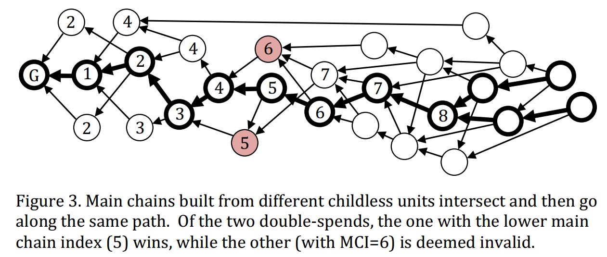

#  DAG Blockchains

## IOTA

The IOTA is a new micro payment cryptocurrency optimized for the Internet of Things, with tamper-proof data, feeless micro transactions and low resource requirements. The main innovation of IOTA is Tangle, which is scalable, lightweight, and exchange value and data securely, without any fees. It ensures that the information is trustworthy and cannot be tampered with nor destroyed. We will introduce the details of Tangle in the following.

### Basic Concepts

Compare to PoW and PoS, Tangle has higher throughput because it allows different branches to merge into the main chain eventually. 
As shown in Fig.1, Tangle uses directed acyclic graph topology to record transaction, and the unit of Tangle should be a recorded **transaction, approved tips, digital signature, own weight, and cumulative weight**. The basic concepts of Tangle are represented as follows:

* **Tip:** the transaction(or block) that has not been approved by any other trasnaction(or block). That is, tips are unapproved transactions in tangle graph;
* **Direct Approval:** two transactions(or blocks) is connected by a direct edge, we can say one transaction is directly approved by another transaction.
* **Indirect Approval:** two transactions are not connected by a direct edge, but there is a directed path of lenth at least two between the two transactions, then we can say the two transactions are indirectly approved.
* **Own Weight:** trasnation's own weight is propotional to the amount of work(computational power or stakes) that issuing node conssumes on proposing a trasnaction(or block).
* **Cumulative Weight:** the sum of the transaction's own weight  and the overall own weight of all transactions that directly or indirectly approve this transaction.
* **Confirmation Weight Threashold:** the threshold value of trasnaction's cumulative weight, when the cumulative weight meet this value, the transaction should be confirmed.

### Consensus Process

The main procedures of consensus process in Tangle are as follows:

* A node finds a nonce to solve a cryptographic puzzle to meet the difficult target.
* The node creates a new transaction which will select two nonconflicting tips to approve by MCMC tips selction algorithm;
* The node uses its private key to sign this new transaction, and broadcasts the transaction to others;
* Other nodes receive the new transaction and check it to confirm legality. If the new transaction is legal on the digital signature and nonce, then it will become a new tip and wait for the direct or indirect approvement for confirmation. 

A transaction is confirmed when its cumulative weight is large enough. The consensus process of an issued transaction is divided into two stages: reveal stage and weight accumulating stage.

  * **Reveal Stage:** The observed transaction is appended into the DAG-based blockchain, that is all nodes can see the transaction.
  * **Weight Accumulating Stage:** the cumulative weight of the observed transaction increases from its own weight to confirmation threshold gradually.

问题：Tangle中的共识过程使用Tips选择算法只有在大多数交易都是诚实的情况下才有效。这个方法对于对于冲突现象发生时，结局过程比较缓慢，并且容易导致错误的交易最终被确认（双花攻击）。那么对于冲突交易的平均解决时间大概是多长？是否有其他的方法加快节点之间交易的确认，并且降低冲突交易中欺诈交易最终被确认的概率？
 
## Byteball

Byteball is a decentralized	system that allows	tamper proof storage of	arbitrary data. Storage	units are linked to	each other such that each	storage	unit includes one or more hashes of	earlier	storage	units, which serves	both to	confirm	earlier	units and establish	their partial order. The set	of links among units forms a DAG (directed acyclic graph). 

### Basic Concepts

The Storage unit in Byteball include **unit message, signature and parent unit**
* **Unit Message:** A unit message includes more than one data package.
* **Signature:** A unit contains the signatures of users who creates the unit.
* **Parent Unit:** A unit contains the hash of referenced previous units.

Byteball adopts UXTO transaction model.  The	message	contains:
* An array of outputs: one or more addresses that receive the bytes	and	the amounts	they receive.
* An array of inputs: one or more references to	previous outputs that are used to fund the transfer. These are outputs that were sent to the author address(es)	in the past and are	not yet	spent.

Storage units connected into a DAG,units are werticesand parent-child links are the edges of the DAG. Soecially, the arrows of the DAG are from child unit to parent unit. 

The basic concepts of Byteball are represented as follows:
* **Parent Unit & Child Unit:** If unit A directly arrows unit B, i.e. the path length from unit A to unit B is $1$, then the unit B is the parent of unit A and unit A is unit B's child.
* **Directly Include:** If unit A is the children of unit B, then unit A directly include or verify unit B.
* **Indirectly Include:** If the length of the path that from unit A to unit B is bigger than $1$, then the unit A indirectly include or verify unit B.
* **Top Unit:** A unit is defined as top unit if the unit has no child unit. We also call it  unverified unit.
* **Genesis Unit:** The unit that constructed by the genesis transaction is called genesis unit. The genesis unit has no parent unit. The index of genesis unit is $0$

Every new child unit in	the	DAG	confirms its parents, all parents of parents. Thus, it is impossible to revise a unit without cooperating with all its childrens or stealing their private keys. Once a unit is broadcast	into	the	network,and	other	users	start	building their units on	top of it	(referencing it	as parent),	the	number	of	secondary	revisions required to	edit this	unit hence	grows	like	a	snowball.

###  The Main Chain Selection Rule

In Byteball, the optimal paths from any tipits to the genesis unit are denoted as **Candidate Main Chain**. The main chain is constructed by selecting the "best parent" unit from all parent units of a child unit. The main chain built starting from a specific unit will never change as new unit are added. If nodes star from another tip, they will build another main chain. Different candidate main chains will intersection in some intersection points, which is called **stable point**. (the worst case is that chains are intersection in genesis unit). For all candidate main chain, the path from stable point to genesis unit is exactly same, which is called **stable main chain**. Stable main chain is a deterministic path, and transition from a candidate path to a stable path is a process that gradually changes from uncertain to certain. Thus, the main chain can establish a total order beyween two conflicting nonserial units. The genesis unit has index $0$, the next main chain unit that is a child of genensis has index$1$ and the main chain index can be assigned so on. For units that not lie on the main chain, we can find a main chain indes where this units is first included(directly or indirectly).

Witnesses is the participants of network that are non-anonymous, high reputable and mainning the network healthy. Nodes select the best parent unit of a new incoming unit according to the level of unit and witnessed.
* **Unit Level:** the level of a unit is defined as the path length from the unit to genesis unit;
* **Witnessed Level:** Backtracking along the main chain from current unit, and count the number of different witnesses in the path until encountering enough witnesses. Witnessed level is the unit level of the backtracking stop position.

The best parent unit selection strategy consists of the following three components:
* When selecting the best parent unit, a parent unit with higher witness level is the best parent unit;
* If the witness level is the same, the one with smaller unit level is regared as the best parent unit;
* If both witness level and unit level are the same, the one with lower unit hash value should be selected as the best parent unit.

In the mentioned strategy, witnesses become the historical perspective of a unit. Each unit can maintian its own witnesses list, and can also refer other units' witnesses list through witnesslistunit function. Ifthe witnesslist of  two units differs at most $1$ mutation, then the two units is **Unit Compatible**.

**The "near-conformity rule":** best parent must be selected among those parents whose witness list differs from child's by at most $1$ mutation. That is, the best parent unit can only be selected from the parents unit that compatible with the current unit to ensure the continuity of the historical perspective. Incompatible parent units are still recognized, but they cannot be the best parent unit. In particular, if a new unit is incompatible with all tips, the parent of the unit should be selected from the parent units of the previous level. 

Byteball requires	that the number of witnesses	is exactly $12$.
* it is sufficiently large to protect against the occasional failures of a few witnesses (they might prove dishonest, or be hacked,	or go offline for a long time, or lose their private keys and go offline forever);
* it is sufficiently small that humans can keep track of all the witnesses to know who is who and change the list when necessary;
* the	one allowed	mutation is sufficiently small compared with the $11$ unchanged witnesses.

### Consensus Process

The main procedures of consensus process in Byteball are as follows:

* A witness composed a new unit, and select parents from candidates according to the best parent selction algorithm. 
* The witness sign the new unit, pays a fee equal to the size of added date in bytes, and broadcasts the unit to others;
* Other nodes receive the new unit and check it to confirm legality. If the new unit is legal on the digital signature, then it will become a new tip and wait for the direct or indirect approvement for confirmation. 

The main chain inroduces a total order of all unit in DAG-based blockchain. All new incoming units would like to be the units of his current main chain. The current main chain	may	be different at different nodes because	they may see different sets of childless units.	

## TrustNote

TrustNote is a minable public DAG-ledger with an innovative, two-tier consensus mechanism designed for new applications. 

### Basic Concepts

In TrustNote, a transaction is viewed as a message. multiple messages can be combined in to a data block which is called **unit**, and a DAG is formed by inter-referenced units. In TustNote, each Unit must reference multiple previous Units, nodes do not require to *spend computing power and time* for solving consensus problem, nor need to wait for the *completion of strong inter-node data synchronization*.

The basic concepts of Byteball are represented as follows:
* **Unit:** a data structure which can contains many messages generated by the nodes including: Transactions messages, text messages and etc. A unit consists of multiple messages(transactions) of various types.
  * *Header:* The hash value of the previous Unit(parent unit);
  * *Messages:* A Unit contains one or more messages, there are various types of message, and each message type has its own unique data structure.
  * *Signatures:* A Unit contains one or more users’ signatures.
  * *Address:* A user can have multiple addresses; the addresses are generated with BIP- 0044 algorithm.
* **Message Types:** Different types of TrustNote message are recognizable by the message’s app field.
  * *Mine solution (app = PoW-Equihash):* “PoW-Equihash” message is generated by Super nodes, PoW message includes: consensus round’s number, seed, difficulty, Equihash solution and Attestor reward address.
  * *Attestation (app = TrustME):* TrustME messages(only can be generated by Attestation node) are used to store the Attestation results which super Nodes have. The contents of TrustME message includes: consensus round’s number, PoW unit hash, priority of the Attestor and Attestation reward (Coinbase) of (i-2)th Stable Consensus Round. 
  * *Transaction (app = payment):* “Transaction” messages are used to hold tokens’ transactional information. 
  * *Text (app = text):* “Text” messages are used to hold arbitrary string data.
  * *Structured Data (app = data):* “Structured Data” messages are used to store arbitrary structured data.
  * *Data Feed (app = data_feed):* “Data Feed” messages are sent by trusted third parties to trigger Smart Contract.
  * *Address Definition Change (app = address_definition_change):* “Address Definition Change” messages are used to update the address definition while retain the old address.
  * *Asset Definition (app = asset):* “Asset Definition” messages are used to define new digital assets.
  * *Asset Attestors (app = asset_attestors):* “Asset Attestors” messages are used by asset definers to update the Attestors of the asset.
  * *Poll (app = poll):* “Poll” messages are used to initiate a poll.
  * *Vote (app = vote):* “Vote” messages are used for initiating a vote.
* **Nodes:**Aany active user, installed TrustNote client (any devices such as phone, pc, IoT, etc.) and having a valid wallet address.TrustNote supports four types of Nodes: Super Node, Full Node, Light Node and Micro Node.
  * *Super Node:* Mining Systems, Cloud Host Server/Workstation, and PC, which generates a deposit contract and paying the deposit, and running the TrustME-PoW mining program.
  * *Full Node:* Cloud Host Server/Workstation, and PC, which maintaining synchronization and verification of ledger data. 
  * *Micro-Node:* Client running on Microcontrollers and Smart Cards.
  * *Light Node:* Client running on Smartphone and Tablet PC.
* **Parent unit & Child unit:** If unit A directly arrows unit B, then the unit B is the parent of unit A and unit A is unit B's child. Each unit in TrustNote should reference multiple tips;
* **Attestor:** A Super node, which participates in a round of consensus and successfully obtains Attestation power.
* **PoW Unit:** A unit containing Equihash solution.
* **TrustME unit:** A unit used to determine the MC and its first message is a TrustME Coinbase message.
* **Tips:** Units have no Parent-Child relationship with each other.  The new Unit will preferentially reference the Units with more Parents.
* **Main Chain:**  A single chain along Child-Parent links within the DAG which is determined by applying the Parent Selection Algorithm recursively.
* **MCI:** Main Chain Idex.
* 

### Consensus Process

TrustNote adopts a two-tier consensus mechanism comprising base consensus and TrustME consensus:
* The based Consensus(DAG consensus) requires new transaction Units sent by Nodes verify the previous units by referencing them. 
* The Attested consensus(TrustME consensus) requires that the sequences of Non-TrustME Units be rigorously determined by TrustME Units generated by the Attestors. (TrustME-PoW scheme, TrustME-BA scheme)

When a TrustME Unit becoming a stable Unit in the Main Chain, it could finally justify that an Attestor has contributed to TrustNote positively, and thus receive the Attestation reward. A transaction fee is divided and paid to:
* The Node(s) who generate newer Unit and reference this Unit as Parent.
* The Attestor who attested the Unit.

If a Unit is referenced by multiple Child Units, the Node who sends the Child Unit with the smallest hash value will get the referencing fee. To qualifying the rewards, the Main Chain Index (MCI) of the Child Unit must equal or be slightly greater than its Parent’s MCI.

## Hashgraph