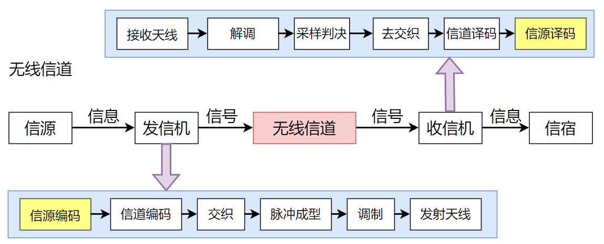
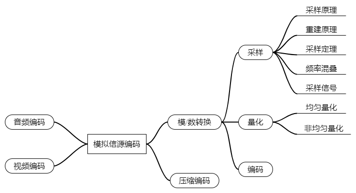

# 信源编码学习笔记

## 1. 概述

信源编码在通信系统模型中的位置如下图所示：

对于模拟信源来说，信源编码的过程包括模/数转换和压缩编码，通过采样、量化和编码，将模拟信号转换成数字信号的过程，就是模/数转换。

* **采样**：从时域上看，是利用冲激信号按照一定的时间间隔对模拟信号进行抽样，从频域看，是以采样频率为间隔对模拟信号频谱进行周期性拓展。
  * **奈奎斯特采样定理**： 采样频率必须大于模拟信号最高频率的2倍。**
  * **频率混叠**：若以小于2倍信号最高频率（信号带宽）的采样频率对信号进行采样，会出现频率混淆，在频域中，周期性拓展的信号频谱交叠在了一起
* **量化**：将采样信号的电平归一化到有限个量化电平上，实现采样信号幅度的离散化，其中，量化电平的个数称为**量化级数**，信号电平的量化值和实际值之差称为**量化误差**，也叫**量化噪声**，量化噪声的幅度最大等于量化间隔的1/2，信号功率与量化噪声功率的比值叫做**量化信噪比**。
  * **均匀量化**：量化电平取值等间隔的量化。对于均匀量化来说，量化级数越多，量化间隔越小，量化噪声越小，但在信号电平比较低的情况下，量化信噪比比较低。
  * **非均匀量化**：   量化间隔随信号电平增大而增大的量化，可以保证信号电平比较小、较大场景下的量化信噪比差不多，一般在发送端使用一个压缩器串接一个均匀量化器来实现非均匀量化，相应的在接收端要有一个扩展器。
* **编码**：将量化后的信号电平值用二进制数字表示，量化电平数为N时，信号电平值需要 $\log_{2}N$ 位二进制数字来表示。