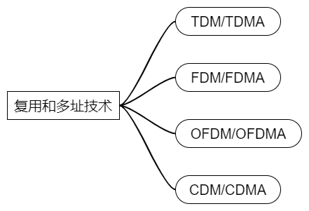
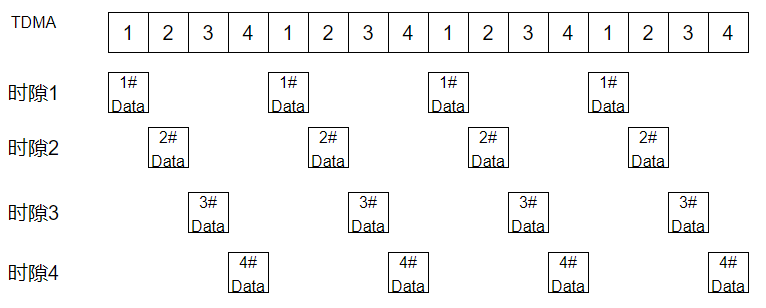
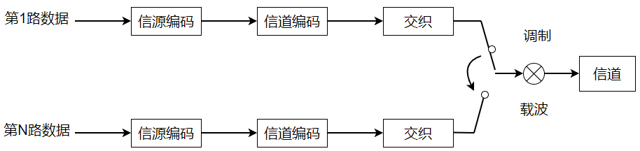
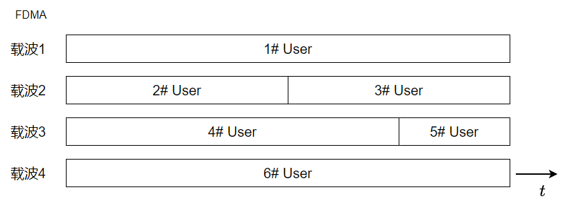
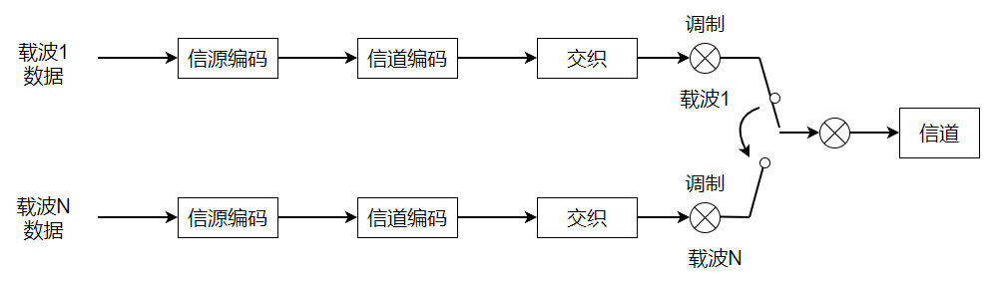
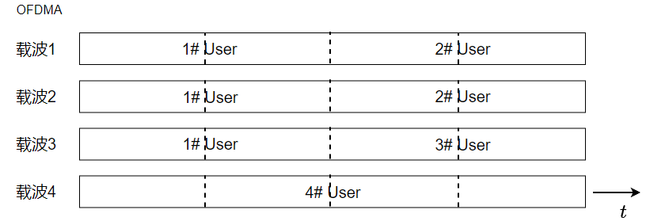
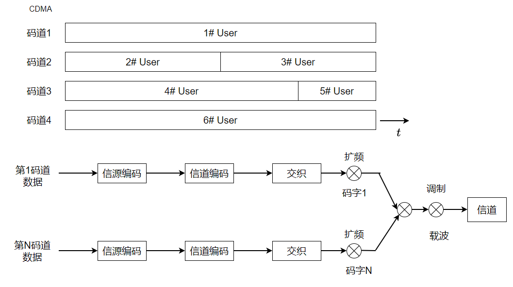

# 信道的复用和多址技术学习笔记

常见的复用、多址技术如下图：

## 1. TDM/TDMA

按时间将信道划分为N个时隙，并行传输N路数据，这就是**时分用TDM**。将N个时隙动态分配给多个用户使用，就是时分多址TDMA。

经过信源编码、信道编码、交织等处理的多路数据按照一定的时序关系对载波进行调制，即可实现TDM/TDMA。

**E1接口**使用了TDM技术，电路交换网络中E1接口很常见，例如：PSTN电话交换网中程控交换机间、GSM网络中MSC和BSC之间，采用的都是E1接口。**E1接口将传输分成32个时隙，第0时隙用于传输同步和控制信息，其他31个时隙并行传输31路数据，每个时隙在125us的时间内可以传输8bit数据，数据传输速率为64bit/s，刚好可以传输一路PCM编码语音数据**，可以计算E1接口32个时隙的总传输速率为：64x32=2.048Mbit/s。

GSM空中接口使用了TDM/TDMA技术：将1个载波资源分成8个时隙，最多分配给8个用户同时使用。

## 2. FDM/FDMA

按频率将信道划分为N个载波，并行传输N路数据，这就是**频分复用FDM**。将N个载波动态分配给多个用户使用，就是频分多址FDMA。

利用调制技术，将多个用户的多路数据分别调制到多个载波上，即可实现FDM/FDMA。

## 3. OFDM/OFDMA

**正交频分复用**，一般的FDM，为了避免载波之间相互干扰，增加了保护带宽，造成了频谱浪费，导致频谱利用率低，为了提高频谱利用率，采用了相互正交的子载波，子载波间不需要增加保护带宽，这就是OFDM。**将N个子载波和M个符号动态分配给多个用户使用**，这就是OFDMA。

OFDM的本质就是发送端用待调制的数据对一系列复指数信号进行加权，合成一个复信号，利用IQ调制发送出去，接收端通过IQ解调恢复出复信号，求出加权系数，也就是傅里叶系数，就得到了调制数据。

在实际的通信系统中，一般使用IDFT来实现基带OFDM调制，通过IDFT将并行的N个频域样点数据变换为并行的N个时域样点数据，再通过并/串转换、数/模转换，得到OFDM基带调制信号，最后利用IQ调制将实部和虚部调制到射频载波上。

一般使用DFT来实现基带OFDM解调。通过IQ解调从射频信号中恢复出OFDM基带信号的实部和虚部，经模/数转换后合成数字复信号，再进行串/并转换，最后通过DFT将并行的N个时域样点数据变换为并行的N个频域样点数据，完成OFDM基带解调。 

OFDM调制实际上就是由N个IQ调制叠加的结果，通过IQ解调恢复出实部和虚部，合成复信号，分别与4路复指数子载波相乘，在基波周期内积分，即可恢复出各子载波上调制的数据。

## 4. CDM/CDMA

按码字将信道划分为N个码道，并行传输N路数据，这就是**码分复用CDM**。将N个码道动态分配给多个用户使用，就是码分多址CDMA。

利用扩频技术，对多个用户的多路数据用不同码字进行扩频处理，即可实现CDM/CDMA。**扩频就是指频谱扩展**，将输入码流与扩频码相乘，将低速码流转换成高速码片流。高速码片流与解扩码相乘，求和，结果为正判决为，结果为负判决为，即可恢复出原始码流，实现解扩。**为不同用户分配相互正交的扩频码，用户数据与各自的扩频码相乘再叠加，将低速码流转换成高速码片流，到了接收端通过解扩将各自的数据恢复出来，即实现了码分多址。**

扩频码与解扩码常用Walsh码，因为Walsh码的正交性，使得用自身的扩频码可以解扩出信号，而用其他的扩频码无法解扩出信号。Walsh码可以通过哈达玛矩阵或Walsh码树生成。Walsh码的正交性有个前提是码必须同步，可以使用PN码（伪随机码）实现码同步。

