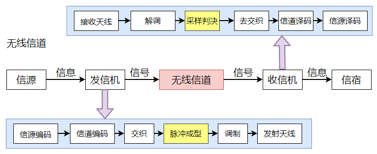
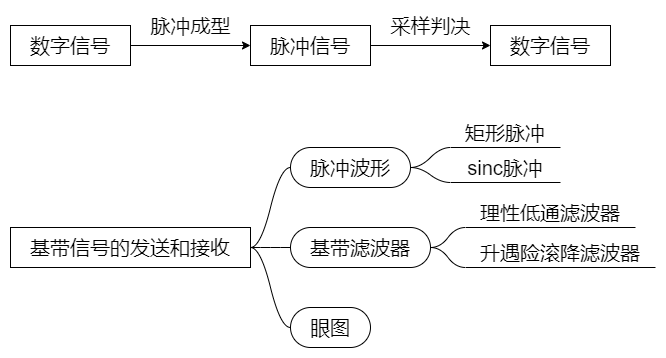

# 基带信号的发送与接收——学习笔记

基带信号的发送和接收在通信系统模型中的位置如下图所示：

**数字信号**想要在信道中传输，必须在发射机的基带部分进行**脉冲成形**，将数字信号转换成**脉冲信号**，脉冲信号到达接收机后，在基带部分进行**采样判决**，将**数字信号**恢复出来。脉冲成形需要用到脉冲波形，实现脉冲成形要用到基带滤波器，评估基带滤波器要用到眼图。

* **矩形脉冲**：0映射为正，1映射为负，但由于矩形脉冲信号的频谱带宽是无限的，而信道带宽总是有限的，所以要做到矩形脉冲无失真的由发送端通过信道传输到接收端是不可能的。
* **sinc脉冲信号**：sinc脉冲的频谱带宽是有限的，经过带宽有限的信道进行传输时不会出现失真。
* **理想低通滤波器**：只要将单位冲激信号输入理想低通滤波器，即可得到sinc脉冲信号，设理想低通滤波器带宽为 $B$，则只要sinc脉冲信号发送间隔取 $\frac{1}{2B}$，即码元传输速率 $R_{B}=2B$，就可以实现无码间串扰。采用理想低通滤波器对单位冲激信号进行滤波得到的sinc脉冲信号。拖尾振荡幅度比较大、衰减速度比较慢，当定时出现偏差时，码间串扰会比较大，考虑到实际的系统总是存在一定的定时误差，所以脉冲成形一般不采用理想低通滤波器。
* **升余弦滚降滤波器**：拖尾振幅小、衰减快，对于减小码间串扰和降低对定时的要求均有利。
* **眼图**： 评估一个实际系统的码间串扰情况要用到眼图，从眼图上可以观察出码间串扰和噪声的影响，从而估计系统优劣程度。**眼图中“眼睛”张开的大小反映着码间串扰的强弱**：“眼睛”张得越大，且眼图越端正，表示码间串扰越小，反之表示码间串扰越大。当存在噪声时，噪声将叠加在信号上，观察到的眼图的线迹会变得模糊不清，若同时存在码间串扰，“眼睛”将张开得更小。
