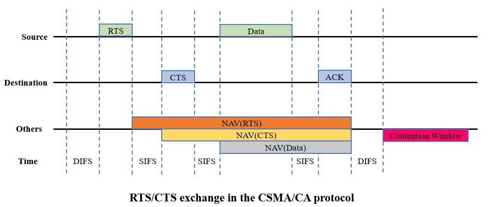

## 无线网络通信协议

这里对WIFI的802.11协议中的基本知识做了一个简单的总结和整理，方便之后的研究和学习。主要内容如下：
* 基本概述
* 802.11协议
* CSMA/CA协议
* 信号干扰噪声比

### 基本概述

目前比较著名的有线网络是以太网（Ethenet)，无线局域网络也是很有发展前景的一个领域，其中最受关注的应该是WIFI。下面介绍无线网络相关内容。

**无线网络：** 是指无需布线就能实现各种通信设备互联的网络。相较于有线网络，无线网络不需要铺设电缆，安装比较简单。但是无线网络也面临如下挑战：
* 通信双方因为是通过无线进行通信，所以通信之前需要建立连接；而有线网络就直接用线缆连接，不用这个过程了。
* 通信双方通信方式是半双工的通信方式；而有线网络可以是全双工。（低带宽会导致原链路容量受限。）
* 通信时在网络层以下出错的概率非常高，所以帧的重传概率很大，需要在网络层之下的协议添加重传的机制（不能只依赖上面TCP/IP的延时等待重传等开销来保证）；而有线网络出错概率非常小，无需在网络层有如此复杂的机制。
* 数据是在无线环境下进行的，所以抓包非常容易，存在安全隐患。（信道质量恶劣导致数据丢失。）
* 由于地形、环境和移动性导致断续连接而产生波动的拓扑结构。（无线网络拓扑具有很大的波动性，用户或网络移动时，拓扑结构会变化比较大。这里的拓扑结构是指的所有网络节点铺设时的拓扑结构吗？）
* 平台局限性导致尺寸、重量、功率和复杂性的限制。

### 802.11 协议

802.11协议包含许多子部分。其中按照时间顺序发展，主要有：

1. 802.11a，1999年9月制定，工作在5gHZ的频率范围（频段宽度325MHZ），最大传输速率54mbps，但当时不是很流行，所以使用的不多。
2. 802.11b，1999年9月制定，时间比802.11a稍晚，工作在2.4g的频率范围（频段宽度83.5MHZ），最大传输速率11mbps。
3. 802.11g，2003年6月制定，工作在2.4gHZ频率范围（频段宽度83.5MHZ），最大传输速率54mbps。
4. 802.11n，2009年才被IEEE批准，在2.4gHZ和5gHZ均可工作，最大的传输速率为600mbps。

这些协议均为无线网络的通信所需的基本协议，最新发展的一般要比最初的有所改善。此外，由于无线电几乎总是半双工的，这意味着不能在一个频率上传输的同时侦听该频率上的突发噪声。因此，802.11试图避免冲突，采用的协议称作带冲突避免的CSMA(CSMA/CA)。下面主要介绍该协议的工作原理。

### CSMA/CA协议

802.11无线网络的组成：分布式系统、接入点(Access Point, AP)、无线媒体和移动台(Mobile Station, MS)。 多个AP连接形成一个大的覆盖区域时，分布式系统负责帧转发。AP是连接无线802.11网络和有线网络的桥接设备，MS是网络的使用者，生成或者接收无线媒体传输的数据。

#### 802.11MAC

802.11MAC主要由四部分组成：认证和关联过程、信道接入过程、数据链路控制过程以及帧机制。

* **认证和关联过程：** MS在使用数据服务（接入网络）之前，必须执行认证和关联。三个状态：状态1是MS初始状态（未完成认证，尚未关联）；状态2时完成认证（尚未关联）；状态3时完成认证和关联。MS一旦进入状态3，就可以使用数据分布式系统服务连接到比接入点更远的目的地。MS的认证过程：**开放式系统认证**和**共享密钥认证**。802.11标准中的是开放系统认证。一旦认证成功，MS就可以与一个接入点建立关联获得对于网络和数据服务的完全访问。
  
* **信道接入过程：** MS有两种方式接入无线802.11信道（基于竞争接入和非竞争接入）。控制接入无线媒体的协调功能：分布式协调功能（DCF，分布式协调功能提出载波监听多路接入/冲突避免）和点协调功能（PCF，建立在DCF之上）。
  * **分布式协调功能** （见4-8）允许多个相互独立的MS在没有中心管控的情况下相互通信。在传输数据帧之前，DCF首先检查确保无线媒体的可用性。为了避免冲突，在第一个用户占用信道期间，其他MS在每一帧传输之后生成随机回退时间。
    * 两种载波监听功能：物理载波监听和虚拟载波监听。其中虚拟载波监听通过利用网络分配矢量（Network Allowcation Vector, NAV）来进行，MS将NAV设定为信道预期使用时间（当前所有帧完成处理的总时间）。当NAV非零时，媒体正在使用状态，其他MS不会试图竞争该媒体；当NAV为零时，媒体处于空闲时间，其他MS可以竞争使用该媒体。
    * 协调接入过程的重要机制是引入帧间隔(见图4-7)：**短帧间隔（SIFS），PCF帧间隔(PIFS)、DCF帧间隔（DIFS）和扩展帧间隔(EIFS)**。优先级最高的为**SIFS**， 它的时间长度在所有帧间隔中是最短的，这使得一个拥有高优先级帧的MS可以在其他MS有机会接入信道之前占用信道。应用SIFS进行传输包括请求发送/清除发送（RTS/CTS）帧和肯定确认(ACK)。PCF 非竞争阶段使用**PIFS**（30us）。在非竞争阶段传输数据的MS能够在PIFS结束并且已经有效抢占基于竞争的通信量后进行发送。 对于基于竞争的服务来说**DIFS**(50us)是最小的媒体空闲时间。如果媒体在比DIFS还长的期间内是空闲的，那么运行在基于竞争模式的MS会接入该媒体。**EIFS** 不是一个固定的间隔，仅在帧传输过程中出现错误时才被使用（在接收帧中检测出错误）
    
    
    * 隐藏节点问题：802.11允许基站使用RTS/CTS来清空缠讼区域。MS发送一个RTS，目标接收方发送CTS作为响应。从而根据RTS/CTS来对NAV进行设置。
    

 #### CSMA/CA 的机制
 
 与以太网的CSMA/CD机制（冲突检测）相对，802.11采用的CSMA/CA机制（冲突避免）。发送数据前，先检测到信道状态，等到信道空闲后，再等待一段时间后，再次检测信道是否空闲，如果还是空闲，那么立刻发送数据，否则，随机等待一定时间，等时间到期后，再次发送检测。采用这个机制，可以保证每次通信的原子性（即每次通信所需要传输的多种不同类型的帧之间没有夹杂其它通信的帧的干扰），大体过程是：

 1. 源站点在在发现信道空闲之后，在发送帧之前都首先等待DIFS时间。若DIFS时间之后信道依然空闲，源站点立即发送数据帧；
 2. 目的站接收到数据帧之后，会给源站点响应一个ACK帧，告知源站点数据已经被接收；
 3. 当源站点正确接收到ACK帧时，表示本次传输过程成功；
 4. 如果出现信道忙时，就执行退避算法。所有的站点进入竞争时间窗口（就是竞争期间），将这个竞争时间窗口分割成多个时隙（退避时间间隔），然后每个站点随机选择一个时隙。当某个站点到达它的时隙对应的时间之后，就开始发送数据。选择的时隙越靠前，则表示站点在DIFS之后再等待的时间（退避时间）越短，也就会越早发送实际数据。 当一个站点发送数据之后，所有站点会检测到链路忙，于是放弃尝试发送，等那个站点发送完数据之后，链路开始空闲，于是又进入到1重新开始这个过程。
基本的CSMA/CA协议如下图所示：

当站点要传输数据时，流程大致如下：

1. 源站点在发送数据之前必须先确定信道状态。若信道空闲，会先等待一个 DIFS时间，若是在这一个 DIFS 结束时信道状态依然空闲，那么以广播形式发送一个请求发送 RTS 控制帧（帧当中写入了源站地址、目的站地址和此次通信过程将要占用信道的时间。这里信道空闲时再等待一个 DIFS 的原因是：若是其他站点有高优先级帧要发送，则让其他站有机会优先发送，而本站将退避等待，延后发送。）
2. 目的站接收到此 RTS 帧时，若信道空闲，同样以广播形式给源站回送一个允许发送 CTS 帧，并且会将 RTS 帧中的“持续期”字段值复制到 CTS 帧中。当其他站收到 RTS 帧时，就会读取其中的时间值，并将自身的网络分配向量 NAV定时器的值进行比较，取两者中较大的值重新设置为 NAV 的值。设置之后，在该定时器时间之内不能使用信道。
3. 源站点正确收到此 CTS 帧时，就表示信道预约成功，再等待一个 SIFS时间就开始发送 DATA 帧。其他站收到此 CTS 帧时，同样会读取其中的时间值，并重新设置其 NAV。
4. 目的站收到 DATA 帧后，会给源站点响应一个 ACK 帧（确认收到数据），以此告知源站数据已被接收。当源站正确接收到 ACK 帧时，就表示对方接收完毕，本次传输过程就此顺利完成。
带有RTS/CTS的CSMA/CA协议如下图所示：

CSMA/CA通过信道空闲检测、RTS-CTS和ACK确认，提供避免碰撞的无线信道分时访问。     

信道的空闲检测有三种方式，分布是通过能量检测、载波检测和能量载波混合检测三种方式来检测信道，统称为CCA。无线网络中，空气作为传输介质，必须采用其他的碰撞检测机制。CSMA/CA提供了三种检测信道空闲(CCA)的方式：
1. **能量检测(ED)   :**  对接收信号的能量大小进行判断，当功率大于某一确定值时，就认为信道被占用。（是直接用物理层接收的能量来判断是否有信号进行接入，若信号强度大于ED_threshold，则认为信道是忙，若小于ED_threshold，则认为信道是闲。）
2.  **载波检测(CS) :** 对接收信号与本地的伪随机码(PN码)进行运算比较，如果其值超过某一极限，就认为信道被占用。（802.11中的preamble部分采用特定的序列所构造，该序列对于发送方和接收方都是已知的，监听的节点会不断采样信道信号，用其做相关运算，其计算值需要与一个阈值进行判断。若大于，则认为检测到了一个信号，若小于则没有检测到。节点在识别到数据包头部以后，对数据包进行接收并进行解调，并通过解调出数据包内部的Length字段来识别数据包的终止边界。）
3.  能量和载波混合检测(ED & CS)

### 信道干扰噪声比（SINR）

采用无线电信号发射的方式传递消息的无线网络都是通过接收到的信号来提取消息内容。由于是在空气中传输，因此需要考虑信号发射过程中存在噪声和干扰。一旦接受条件变差，信号就很容易被噪声淹没。信号的性能通常采用信噪比来衡量，信噪比通常定义为有用信号和无用噪声之间的比率（信号平均功率与噪声平均功率的比率）
$$SNR = \frac{P_{sinnal}}{P_{noise}}$$

除了噪声会对信号产生影响以外，干扰也会影响信号的性能，比如同频干扰、多径干扰等。信号干扰噪声比（SINR）是指接收到的有用信号的强度与接收到的干扰信号（噪声和干扰）的强度的比值
$$SNR = \frac{P_{signal}}{P_{noise} +P_{interference}}$$

信号干扰噪声比是度量通信质量可靠性的重要指标，信号干扰噪声比越大，通信质量越好。通常可以通过减小干扰和增大设备能力来提升信号干扰噪声比。无线通信协议可以通过信道干扰噪声比来判定信道是处于空闲或忙碌的状态。

* 信道传输的干扰模型主要采用信号干扰噪声模型 $SINR = \frac{\mathcal{S}}{(\mathcal{I}+\mathcal{N})} \geq \beta$，其中 $\mathcal{S} = P\cdot d(u,v)^{-\alpha}$ 是节点 $v$ 从节点 $u$ 处接收信号功率(路径损失：大范围内信号强度随距离变化，应该是与距离的平方成正比，本质上表现为电波能量扩散现象。)，而 $P$ 是均匀信号发射功率；
* 在节点 $v$ 处的干扰(多径干扰)为 $\mathcal{I} = \sum_{w\in W\setminus{u}} P\cdot d(w,v)^{-\alpha}$，其中 $W$ 是在当前轮中传输的节点的集合；
* 记环境噪声为 $\mathcal{N}$，路径损耗指数为 $\alpha\in(2,6]$，阈值 $\beta > 1$ 取决于硬件。为了捕获细粒度噪声，定义 $\mathcal{N} = \mathcal{ADV}(v)$ 是由环境和敌手生成的组合噪声。
* 信号干扰噪声模型的假设：
  * 每个节点都使用先沟通的噪声阈值 $\theta$ 并且任意两节点之间的距离的界为 $R_0 = (\frac{P}{\beta\theta})^{\frac{1}{\alpha}}$； 
  * 每个节点都可以执行物理载波监听。若节点 $v$至少有一个邻居 $u$ 广播消息，那么 $v$ 要么接收消息，要么感应到信道忙碌。
   $$ v=\left\{
    \begin{aligned}
    \text{ sense idle channel} &  & \text{if } \mathcal{I+N} < \theta, \\
    \text{ receive a message}  &  & \text{if }  \mathcal{I+N} > \theta \text{ and }  SINR \geq \beta,\\
     \text{ sense busy channel}  &  & \text{if }  \mathcal{I+N} > \theta \text{ and } SINR < \beta.
    \end{aligned}
  \right.$$
