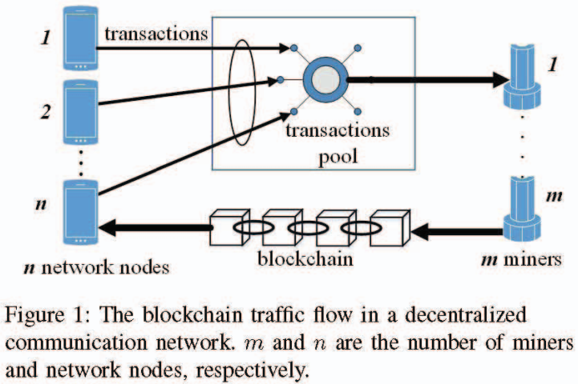
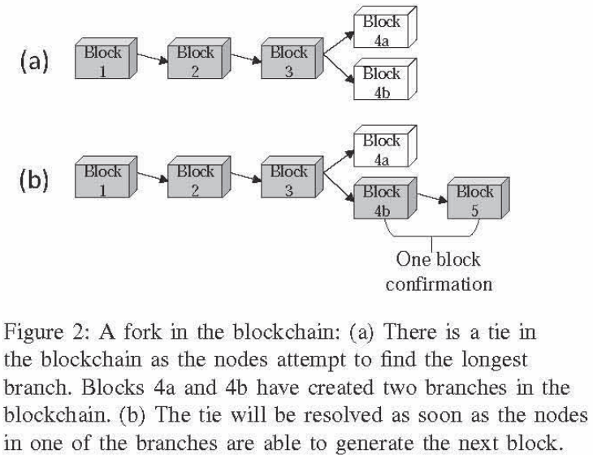
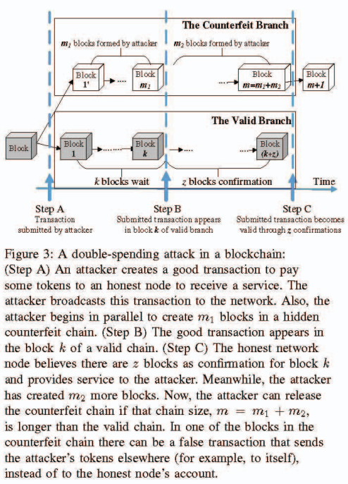
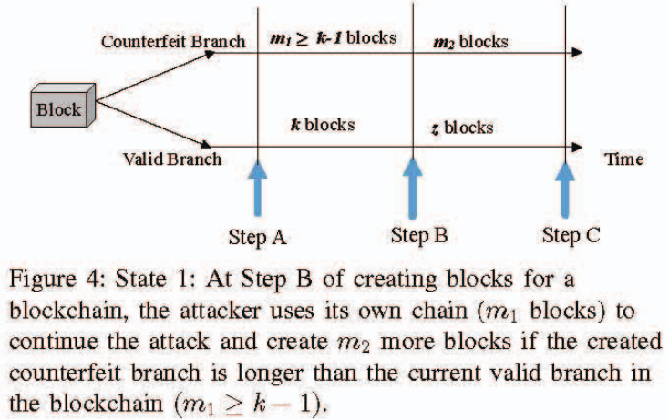
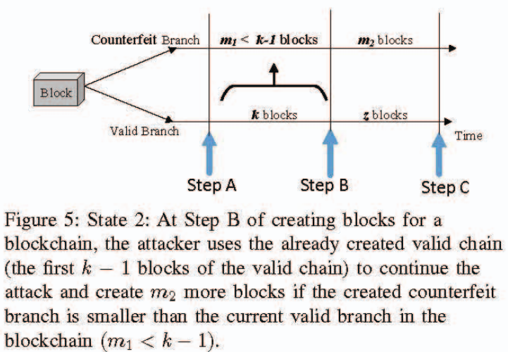

# A Strong Adaptive, Strategic Double-Spending Attack on Blockchains(G.Ramezan&etal, 2018)

主要从文章创新点、模型假设、理论分析、仿真结果以及最终结论几个部分来介绍本文。

## 文章创新点

本文提出了一种区块链上的自适应策略双花攻击模型。攻击者通过观察诚实矿工维护主链的情况（主要是链长度）来做攻击决策。通过理论推导计算出采用自适应策略的双花攻击成功的概率相较于传统的双花攻击具有更高的成功概率。通过计算攻击者成功后获得奖励的期望发现随着确认块数量的增大，奖励期望会降低直至为零。

## 模型假设
### 系统模型假设

系统由网络节点、矿工、交易池、区块链代币等重要组件组成，并做了如下系统假设：
1. 网络节点之间可以通信提供或者请求服务（节点通过发送交易到矿工）；
2. 矿工竞争添加区块（包含接收交易）到主链；
3. 假设被提交的交易进入网络中的交易池中；
4. 网络节点和矿工在区块链代币的值上将达成一致；
5. 矿工的挖矿奖励是由区块链的规则决定；
6. 假设任意节点可以加入矿工或者网络节点（网络是开放的）。
7. 假设代币只能由区块链定义的机制产生。

### 攻击模型假设

 
1. 假设攻击者在发送交易到矿池之后就立即生成伪分支链，并且攻击者在观察到提交的交易出现在区块中时会比较伪分支与诚实分支的长度；
2. 若假分支长，则攻击者继续生成更多区块，直到分支足够长可以成功攻击系统；若诚实分支更长攻击者将会用诚实链替换假分支，并重新发起攻击。
3. 假设攻击者是能够联合好几个矿工通过攻击区块链控制网络的矿工或网络节点；
4. 攻击者可以访问网络的控制信道和获取区块链的副本，从而获取区块链交易相关的信息；
5. 攻击者通过提供服务可以获取代币，利用代币可以提交错误交易；
6. 假设节点不被破坏，从而攻击者不能访问合法网络节点或矿工的私钥；
7. 攻击者蹦年生成错误交易（比如添加一个无效数字签名在交易上）。
8. 假设攻击者在全网的总算力小于诚实矿工的总算力。

## 理论分析
### 攻击原理
区块链双花攻击过程图如下：

1. 攻击者发起一笔交易之后，立即创建一条伪分支，随后开始增长伪分支；
2. 在观察到包含之前交易的区块出现时，比较伪分支和有效分支的长度；
3. 若m1>= k-1，则继续增长伪分支，经过m2个区块增长后，双花攻击成功；否则就复制有效分支的前k-1个区块，并在第k-1个区块之后重新构建新的伪分支；
4. 攻击者会联合多个矿工共同发起攻击，并且攻击者不能访问其他网络节点或矿工的私钥。

两种攻击状态示意图如下：

 
 

通过计算攻击者成功攻击区块链的概率表达式，之后进行理论分析。

## 仿真结果

本文并没有在区块链系统上实际进行仿真实验，最终的结果都是理论分析的结果，如下：

1. 随着区块链中确认区块数量的增加，攻击者成功攻击的概率将降低，这意味着确认区块数量提升使得区块链更加安全；
2. 在相同的条件下，自适应决策双花攻击比传统的双花攻击具有更大的成功概率；
3. 双花攻击成功的概率会随着目标交易被添加到链上时的等待区块数量的增加而降低，因此网络传输的速率以及目标交易的价值（拥有更高交易费用的交易会更先被打包进区块，但在论文中作者并没有讨论）会影响双花攻击成功的概率，目标交易越晚被打包进区块则区块链系统会越安全；
4. 等待区块数量与最小确认区块数量没有太大的关系，但是双花攻击以多大的概率成功将存在一个确认区块数量的界。
5. 奖励的期望受到等待区块数量和确认区块数量的影响，这个数量与矿工创建新块的延时相关。等待区块数量和确认区块数量越多，则攻击者获得奖励的期望越低，由此区块链将越安全。

## 最终结论

通过计算自适应决策双花攻击成功的概率以及成功的奖励期望的表达式，理论分析了两者与等待区块数量和确认区块数量之间的关系，使得我们更加了解区块链系统的在什么情况下更加安全。

## 问题讨论

1. 自适应决策双花攻击成功的概率将与目标交易的价值的大小有很大的关系，但是在本文中，作者并没有分析；
2. 此外，通信协议也将是重要影响因素之一，网络传输快使得目标交易能够快速进入交易池被打包，这将使得等待区块数量降低，从而增加被攻击的风险。以此看来，区块生成速率和区块的大小也是影响攻击成功率的重要因素。