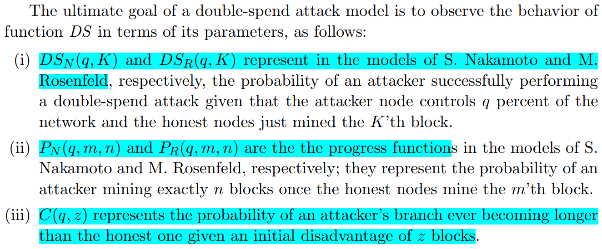

# Double-spend Attack Models with Time Advantange for Bitcoin(C.Pinzon, 2016)

主要从文章创新点、模型假设、理论分析结果以及最终结论几个部分来介绍本文。

## 文章创新点

本文提出两种双花攻击模型的块生成不能仅仅受攻击者的哈希算力的影响，也会受到时间的影响，并将不考虑时间的基于哈希率的攻击模型进行算法比较。本文证明了攻击者在有足够时间下秘密挖块或对网络进行控制的优势是不可忽略的（即，攻击者总是容易成功发起攻击的）。本文的结论有利于正确建模比特币网络和检查网络中的双花攻击。

## 模型假设
主要考虑两种模型（两种模型的攻击模型都是基于哈希率的攻击模型）：
1. 一般模型
2. 基于时间的模型

### 系统模型

本文主要针对比特币区块链系统的爽滑攻击模型进行讨论。
1. 每个人都能创建比特币账号，即使是离线或者不是矿工；
2. 比特币的账户是一个基于非对称密码学的公私钥对；
3. 比特币账户中的BTC余额不是由单个数字表示的；
4. 挖矿奖励由系统定义的机制决定；
5. 系统血药确定交易的输出是否已经被花费。

### 攻击模型

1. 攻击模型的定义：

2. 双花攻击函数的定义：
 

这两种模型都是通过离散时间下，区块生成过程来分析双花攻击成功的概率。

3. 两种新的攻击模型

在S.Nakamoto 与 M. Rosenfeld攻击模型的基础上进行推广，攻击者具有时间优势（提前秘密挖掘区块），提出基于时间的双花攻击模型。

## 理论分析结果

在区块链网络中，对一般攻击模型和基于时间的攻击模型进行比较，主要结果如下：
1. 当预测比特币网络中双花攻击成功的概率时，本文提出的推广模型与基于哈希率的模型的救国相同；
2. 推广模型和基于时间的模型时一致的。

## 最终结论

1. 双花攻击的概率随确认区块数量的降低/攻击者算力的提升而提升；
2. 在实际中，当攻击者的时间优势有限时，不太可能进行双花攻击；
3. 当攻击者控制全网40%的算力时，双花攻击几乎不可能被阻止；
4. S.Nakamoto攻击模型与其他三种攻击模型很不一样。

## 问题讨论

1. 本文的结论基本上都是基于理论分析的，实际的仿真结果并没有；
2. 本文中的模型没有考虑收益对于双花攻击成功的影响。
3. 本文只是比较了推广模型与基于时间的模型结相同，既然相同，那么这个模型的提出有意义吗？