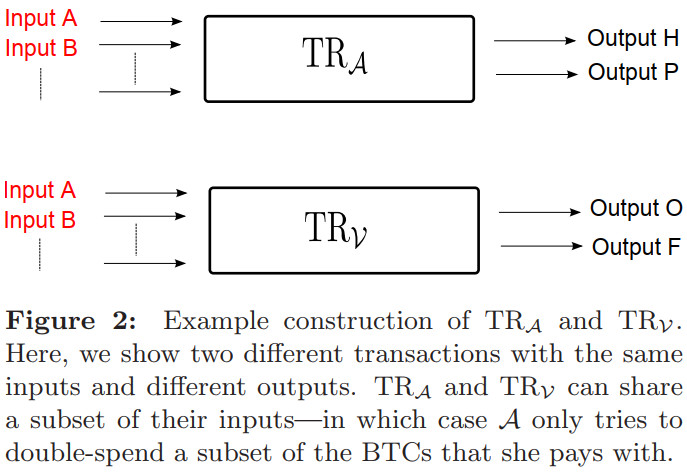

# Two Bitcoins at the Price of One -- Double-Spending Attacks on Fast Payments in Bitcoin(G.O.Karame&E.Androulaki, 2012)

主要从文章创新点、模型假设、理论分析、仿真结果以及最终结论几个部分来介绍本文。

## 文章创新点

针对快速支付的双花攻击的成本非常低，本文发现常规的方法并不能有效对抗双花攻击。通过分析快速支付交易的双花攻击，本文提出一种轻量级的对策，能够检测快速支付交易双花攻击。

## 模型假设
### 系统模型
1. 都是在比特币区块链系统下讨论和分析；
2. 每个地址通过转换函数映射到唯一的公钥/私钥对；
3. 每个peer通过发起交易将币转移到其他peer；
4. 对于比特币中的低成本交易，可以使用零确认来进行快速支付。
### 攻击模型

1. 假设攻击者配备了运行比特币的设备；
2. 假设攻击者期望从受害者出获得服务而不用支付费用；
3. 假设攻击者可以控制网络中介个节点，但并不能访问受害者的密钥或机器；
4. 允许攻击者直到受害者的比特币和IP地址；
5. 除了被攻击者控制的节点，网络中其他节点都是诚实的并且正确执行比特币协议；
6. 攻击者和其同盟者的算力不能高于诚实节点的总算力；
7. 即使网络中能够检测到攻击者的恶意行为，但也不能通过攻击者使用的地址集合识别出攻击者。
8. 假设攻击者具有一个或多个帮手；
9. 假设攻击者与其帮手使用低延时保密信道通信，且这些帮手与受害者都不直接相连。
10. 假设在 $t_0$ 时刻，两个交易同时出现在比特币网络中，但都并没有被打包进区块中。

## 理论分析

比特币快速支付的交易能够被攻击者成功攻击的必要条件是：
1. 受害者接收到交易 $TR_v$ 要早于双花交易 $TR_A$；
2. 最终交易 $TR_A$ 在区块链上被确认。
   
   通过计算两个必要条件被满足时的累积概率，可以得到最终交易 $TR_A$ 被打包进区块中（即，双花攻击最终成功）的概率。

## 仿真结果

### 仿真过程中客户端的实现：
1. 攻击者只连接到受害者的机器；
2. 攻击者使用相同的币创建交易 $TR_V$ 和交易 $TR_A$。攻击者通过比特币网络发送交易$TR_V$给受害者；并且在初始延时$\Delta t$之后，通过直接TCP连接发送交易$TR_A$到帮手节点；
3. 帮手节点一旦接收到交易$TR_A$就立即广播到比特币网络；
4. 受害者一旦接收到交易$TR_A$就立即接受支付。

### 结果

为了估计比特币中快速支付双花攻击的灵活性，本文评估了攻击成功的概率与帮手数量、受害者连接的数量以及延时$\Delta t$之间的关系。

1. 双花攻击成功的概率随着$\Delta t$ 的增加而降低，$\Delta t$越大，则交易$TR_V$被打包进区块的概率越大，从而交易$TR_A$在区块链上被确认的概率则越小，即双花攻击的概率降低；
2. 双花攻击的概率随帮手节点数量的提升而提升，帮手节点越多，则交易$TR_A$能够更快的广播到系统，更快的被确认到区块链上，从而提升攻击成功的概率；
3. 双花攻击成功概率随着受害者连接性的增加而降低，连接越高，则交易$TR_V$在比特币网络中传输越快，从而降低交易$TR_A$被确认到区块链上的概率，即双花攻击成功的概率。

  ### 解决方案

  为了避免双花攻击，受害者可以采用以下两种策略：
  1. Listening Period:在为攻击者提供服务之前，受害者先听一段时间。通过观察所有接收到的交易，并且检查是否存在由攻击者发出的双花交易。这种方式可以提升$\Delta t$，从而降低双花攻击成功的概率；
  2. Inserting Observers: 通过插入观察者（可以直接妆发所有收到的交易给受害者），使得受害者能够更快的发现双花交易，一旦观察者接收到$TR_A$时，受害者就会立即被警告，从而拒绝给攻击者提供服务，以此检测双花攻击。

## 最终结论

比特币快速支付的双花攻击使得传统的抵抗双花攻击的策略将不再适用。本文通过分析快速支付时双花攻击的必要条件，计算得到双花攻击成功的概率表达式，通过分析发现双花攻击成功的概率受到延时、帮手节点数量以及受害者连接性的影响。以此为基础，提出两种检测双花攻击的策略，避免受害者受到双花攻击。

## 问题讨论

1. 本文的结论主要适用于零确认交易，并且比特币网络中节点的连接性将是影响性能的关键因素；
2. 本文主要考虑一跳邻居下，双花攻击检测的有效性。那么，针对无线网络中，网络的拓扑将会影响快速支付的性能。比如：通过构建Spanner结构进行交易收集，是否会减少甚至避免双花攻击。
3. 针对tangle结构的交易的双花攻击，这个结论是否适用？可能不适用，Tangle是通过权重来添加交易的确认，与快速支付的情形不太一样。