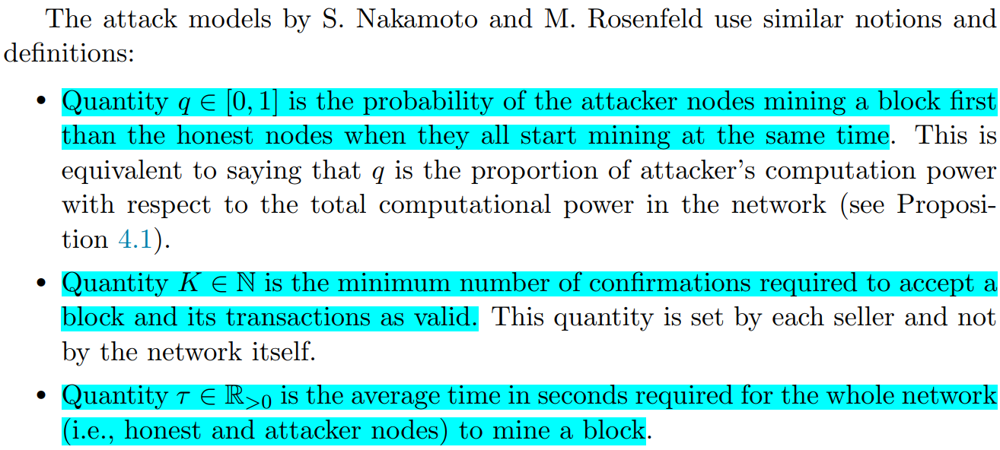
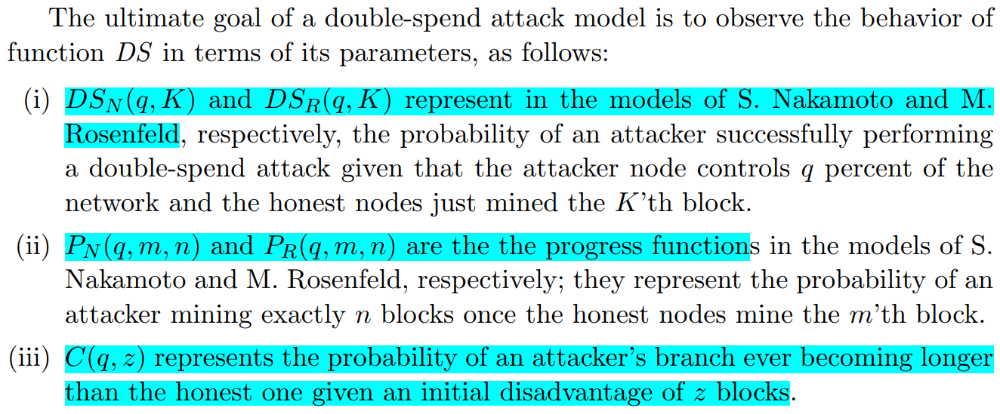

# Double-spend Attack Models with Time Advantange for Bitcoin(C.Pinzon, 2016)

[相关论文链接](./../Papers/2.%20Double-spend%20Attack%20Models%20with%20Time%20Advantange%20for%20Bitcoin(C.Pinzon,%20Dec.2016).pdf)

## 文章创新点

本文提出两种双花攻击模型的块生成不能仅仅受攻击者的哈希算力的影响，也会受到时间的影响，并将不考虑时间的基于哈希率的攻击模型进行算法比较。本文证明了攻击者在有足够时间下秘密挖块或对网络进行控制的优势是不可忽略的（即，攻击者总是容易成功发起攻击的）。本文的结论有利于正确建模比特币网络和检查网络中的双花攻击。

## 模型假设
主要考虑两种模型（两种模型的攻击模型都是基于哈希率的攻击模型）：
1. 一般模型
2. 基于时间的模型

### 系统模型

本文主要针对比特币区块链系统的爽滑攻击模型进行讨论。
1. 每个人都能创建比特币账号，即使是离线或者不是矿工；
2. 比特币的账户是一个基于非对称密码学的公私钥对；
3. 比特币账户中的BTC余额不是由单个数字表示的；
4. 挖矿奖励由系统定义的机制决定；
5. 系统需要确定交易的输出是否已经被花费。

### 攻击模型

1. 攻击模型的定义：

2. 双花攻击函数的定义：
 

这两种模型都是通过离散时间下，区块生成过程来分析双花攻击成功的概率。

3. 两种新的攻击模型

在S.Nakamoto 与 M. Rosenfeld攻击模型的基础上进行推广，攻击者具有时间优势（提前秘密挖掘区块），提出基于时间的双花攻击模型。

## 理论分析结果

### S.Nakamoto 模型下的双花攻击

双花攻击模型可以计算当诚实矿工在挖第$K$个确认区块时，攻击者生成了$n$个区块时的概率，攻击者需要追赶$K-n$个区块才能攻击成功。考虑了一个欺诈块的初始优势。
1. 攻击者的潜在进程函数(Portential progress function)：这个过程对应了泊松分布：
   $P_N(q,m,n) = \frac{e^{-\lambda}\lambda^n}{n!}$，其中$\lambda = \frac{mq}{1-q}$
2. 追赶函数是基于随机游走，成功与失败是基于攻击者或者诚实者挖掘一个区块，因此追赶函数为:
   $C(q,z)=\left\{
      \begin{aligned}
      (\frac{q}{p})^{z+1} &  & \text{if } q<0.5 \wedge z>0, \\
      1 &  & \text{otherwise}.
      \end{aligned}
      \right.$
    其中$q, p = 1-q$分别是攻击者的算力和诚实者的算力，而$z$是攻击者初始时落后的区块数量。
3. 双花攻击成功的概率为：
   $DS_N(q,K) = \sum_{n=0}^\infty P_N(q,K,n)C_N(q,K-n-1) = 1 - \sum_{n=0}^K P_N(q,K,n)(1 - C_N(q,K-n-1))$
### M.Rosenfeld 模型下的双花攻击

与S.Nakamoto模型一样，也考虑了一个欺诈块的初始优势。
1. 攻击者的潜在进程函数(Portential progress function)：对应于一个非负二项式分布
   $P_R(q,m,n)=\left\{
      \begin{aligned}
      1 &  & \text{if }m = n = 1, \\
      C_{m+n-1}^n q^n p^m &  & \text{otherwise}.
      \end{aligned}
      \right.$
    其中$P_R(q,m,n)$是在诚实者挖出$m$个区块时攻击者成功挖出$n$个区块的概率。
2. 追赶模型与S.Nakamoto的追赶模型相同。
3. 双花攻击成功的概率为：
   $DS_R(q,K) = \sum_{n=0}^\infty P_R(q,K,n)C_R(q,K-n-1) = 1 - \sum_{n=0}^K P_R(q,K,n)(1 - C_R(q,K-n-1))$

4. 给定算力在全网算力的比例$q$，则最先生成区块（挖矿成功）的概率也为$q$。
   
### 本文提出关于双花攻击的两个模型：推广模型和基于时间的模型

1. 推广模型是由M.Rosenfeld模型的推广，添加额外的参数来表示分配给攻击者的时间优势，即攻击者尝试挖块的时间。令$a(q,t,n) = \frac{e^{-qt}(qt)^n}{n!}$表示在哈希算力占比为$q$时，在时间$t\tau$区间内能挖出$n$个区块的概率。
    * 潜在进程函数为：
        $P(q,m,n,t) = \sum_{z=0}^n a(q,t,z)P_R(q,m,n-z)$，
        其中$a(q,t,n)=\left\{
            \begin{aligned}
            1 &  & \text{if }t = n = 1, \\
            0 &  & \text{if }t\leq 0,\\
            \frac{e^{-qt}(qt)^n}{n!} &  & \text{otherwise}.
            \end{aligned}
            \right.$
    * 追赶函数与之前定义的追赶函数相同：
        $C(q,z)=\left\{
        \begin{aligned}
         (\frac{q}{p})^{z+1} &  & \text{if } q<0.5 \wedge z>0, \\
        1 &  & \text{otherwise}.
        \end{aligned}
        \right.$
        其中$q, p = 1-q$分别是攻击者的算力和诚实者的算力，而$z$是攻击者初始时落后的区块数量。
    * 双花攻击成功的概率为：
         $DS(q,K,n,t) = \sum_{z=0}^\infty P(q,K,z,t)C_R(q,K-n-z) = 1 - \sum_{z=0}^{K-n} P(q,K,z,t)(1 - C_R(q,K-n-z))$.
    * 当时间$t=0$时，则有$P_N(q,m,n)\approx P_R(q,m,n) = P(q,m,n,0)$，以及$DS_N(q,K) \approx DS_R(q,K) = DS(q,K,1,0)$。
2. 基于时间的攻击模型：状态主要由两个值$t,n$组成。表示诚实矿工和攻击者挖第$n$个区块的时间差$t$。
   * 潜在进程函数为：$P_T(q,m,n,t)$表示攻击者挖第$n$个块的时间正好是诚实节点挖第$m$个块时间之后的$t\tau$秒的概率。挖掘一个区块所需时间服从指数分布，期望值为$\lambda = \frac{1}{q\tau}$，因此在算力比例为$q$时，攻击者挖掘$n$个区块的时间$T_{q,n}$是由$n$个独立指数分布的和，服从Erlang分布，概率密度函数为$h_{q,n}(t) = \frac{t^{n-1}q^ne^{-qt}}{(n-1)！}$。进程函数是在时间中的潜在过程函数是随机变量$X = T_{q,n} - T_{p,m}$的密度函数，因此潜在过程函数为
        $P_T(q,m,n,t) = \int_{-\infty}^{\infty} h_{q,n}(x)h_{p,m}(t-x)dx$
    * 追赶函数：$C_T()q,t$表示攻击者分支比有效分支长的概率，前提是诚实节点在攻击者挖掘最后一个区块$t\tau$秒之前挖掘了其最后一个块：
        $C_T(q,t)=\left\{
        \begin{aligned}
         \frac{qe^{-(p-q)t}}{p} &  & \text{if } t>0, \\
        1 &  & \text{otherwise}.
        \end{aligned}
        \right.$
        因此就有
        $P_T(q,1,1,t)=\left\{
        \begin{aligned}
         pqe^{-qt} &  & \text{if } t>0, \\
         pqe^{pt} &  & \text{otherwise}.
        \end{aligned}
        \right.$
    * 双花攻击成功的概率为：
        $DS_T(q,K,n_0,t_0) = \int_{-\infty}^{\infty} P_T(q,K+1,K-n_0-1,t)C_T(q,t-t_0)dt$

在区块链网络中，对一般攻击模型和基于时间的攻击模型进行比较，主要结果如下：
1. 当预测比特币网络中双花攻击成功的概率时，本文提出的推广模型与基于哈希率的模型的结果相同；
2. 推广模型和基于时间的模型是一致的。

## 最终结论

1. 双花攻击的概率随确认区块数量的降低/攻击者算力的提升而提升；
2. 在实际中，当攻击者的时间优势有限时，不太可能进行双花攻击；
3. 当攻击者控制全网40%的算力时，双花攻击几乎不可能被阻止；
4. S.Nakamoto攻击模型与其他三种攻击模型很不一样。

## 问题讨论

1. 本文的结论基本上都是基于理论分析的，实际的仿真结果并没有；
   * 提出的这两种模型都是针对双花攻击成功概率的计算模型，只是从不同角度来进行计算，论文中的仿真结果都是在理论分析的基础上绘制出来的，而不是在实际的区块链网络中进行相应的仿真结果分析，因此，通过在实际网络中仿真双花攻击成功概率与理论分析的成功概率进行比较，在得出结论。
2. 本文中的模型没有考虑收益对于双花攻击成功的影响。
   * 通过计算出双花攻击成功的概率，可以计算得到双花攻击收益的期望：
    $\mathbb{E}(R_b+R_p|p,K,m,n,t) = P_{sucessful}*(R_p+\sum_{i=0}^n(R_b^i + R_T^i-C_b^i) + P_{Fail} * (-\sum_{i=0}^nC_b^i)$
    从而计算出双花攻击成功的收益的期望，以此来衡量系统是否安全。一般收益越高，攻击者越愿意发起攻击，因此系统越发不安全。