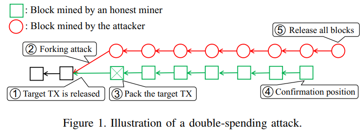
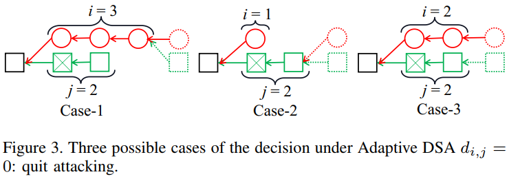
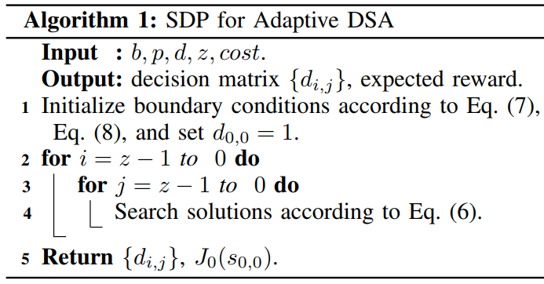

# Revisiting Double-Spending Attacks on the Bitcoin Blockchain -- New Findings(J.Zheng&etal, 2021)

主要从文章创新点、模型假设、理论分析、仿真结果以及最终结论几个部分来介绍本文。

## 文章创新点

本文提出一个新的自适应双花攻击模型，并且采用随机动态规划架构对该模型进行严谨的分析。为了达成攻击者收益最大化的目标，本文采用随机动态规划算法计算攻击者的决策矩阵。最后，通过数值模拟，研究了不同参数与攻击者奖励之间的关系。这篇研究有利于用户和区块链设计者评估区块链的安全性

## 模型假设
### 系统模型

1. 交易只有被打包进区块并收到足够数量的的新区块后被认为是已确认的；
2. 假设系统中只存在两种矿工：双花攻击者和诚实矿工；
3. 攻击者想更改已确认的交易需要发起分叉攻击，并生成比有效链更长的链；
4. 假设在一个时隙中最多能够生成一个区块；
5. 假设挖矿难度保持不变；
6. 诚实矿工都遵循最长链原则；
7. 根据攻击者控制的分叉长度，结果可能为：fail, match, success；
8. 攻击者要持续在为分叉上生成区块；
9. 一旦攻击者成功攻击，奖励 = 挖矿奖励 - 维护费用

## 理论分析

### 定义

1. 决策点：每新生成一个区块，矿工需要决定是否分叉；
2. 攻击决策矩阵：对于不同的决策点，攻击者都要做个攻击决策，决定是否公布或者放弃分叉，亦或是继续增长伪分支。
3. 发生概率矩阵：主要给定决策矩阵后，达到决策点的概率。

给定攻击决策矩阵后，可以计算出一个发生概率矩阵，从而计算出期望的奖励表达式。从而提出一个收益最大化问题，通过随机动态规划算法进行求解，最终得到一个最有决策。

## 仿真结果

通过数值分析仿真之前提出的新自适应双花攻击的分析模型。主要的度量为：攻击者期望的奖励和目标交易最小值。通过分析发现，双花攻击成功的收益主要受到确认区块数量、攻击者的哈希算力的影响。
1. 攻击者的收益随着确认区块数量的增加而降低。这意味着，确认区块数量越多，攻击者收益越小，理性攻击者越不愿意攻击区块链，从而区块链也更加安全；
2. 攻击者的收益随着攻击者哈希算力的增加而增加。攻击者算管理越高，越容易生成新区块，从而越容易攻击成功；
3. 随着攻击者算力的增加，目标交易中最小费用的阈值会降低。当算力不够多时，攻击者会尽可能攻击具有高费用的交易，从而实现收益最大化，当算力足够时，攻击的目标交易就会增多，从而阈值降低。

## 最终结论

1. 对于双花交易而言，确认区块的数量以及攻击者的哈希算力时影响攻击成功的主要因素；
2. 理性的攻击者会根据收益的该地来选择是否决定继续发起攻击，因此可以从经济收益方面做出限制，从而降低攻击成功的概率。

## 问题讨论

1. 通常矿工会选择打包交易费用高的交易到区块中，因此交易费用和区块的大小也将是影响攻击概率的重要因素；
2. 本文没有说明攻击者时在什么时候发起双花攻击，形成分叉（通常是发送一笔目标交易后，攻击者就开始分叉区块链），那么也应该考虑一下目标交易打包进区块的延时对双花攻击的影响；
3. 在发现目标交易被打包进区块放在诚实链上时，再对决策是否继续攻击。因此延时也是决策矩阵应该考虑的重要因素。
4. 当攻击者做决策时，不仅要考虑挖矿奖励和交易费用，还要考虑放弃攻击的损失由多大（这是一个纳什均衡问题）。

