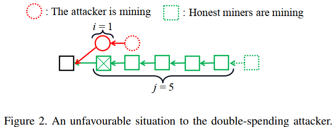
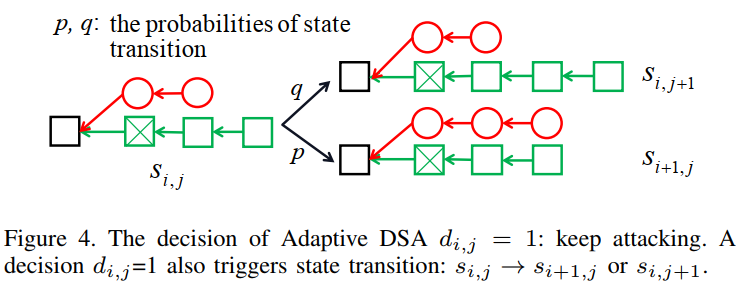

# Revisiting Double-Spending Attacks on the Bitcoin Blockchain -- New Findings(J.Zheng&etal, 2021)

[相关论文链接](./../Papers/4.%20Revisiting%20Double-Spending%20Attacks%20on%20the%20Bitcoin%20Blockchain_New%20Findings(J.Zheng&etal,%20Jun.2021).pdf)

## 文章创新点

本文提出一个新的自适应双花攻击模型，并且采用随机动态规划架构对该模型进行严谨的分析。为了达成攻击者收益最大化的目标，本文采用随机动态规划算法计算攻击者的决策矩阵。最后，通过数值模拟，研究了不同参数与攻击者奖励之间的关系。这篇研究有利于用户和区块链设计者评估区块链的安全性

## 模型假设

双花攻击是指攻击者产生两笔具有相同输入的交易，其中目标交易会被确认在诚实链分支上，与此同时，攻击者会生成一条欺诈链来确认欺诈交易，并最终使得欺诈分支的长度长于诚实链分支成为主链。双花攻击如下图所示：

### 系统模型

1. 交易只有被打包进区块并收到足够数量的的新区块后被认为是已确认的；
2. 假设系统中只存在两种矿工：双花攻击者和诚实矿工；
3. 攻击者想更改已确认的交易需要发起分叉攻击，并生成比有效链更长的链；
4. 假设在一个时隙中最多能够生成一个区块；
5. 假设挖矿难度保持不变；
6. 诚实矿工都遵循最长链原则；
7. 根据攻击者控制的分叉长度，结果可能为：fail, match, success；
8. 攻击者要持续在为分叉上生成区块；
9. 一旦攻击者成功攻击，
  $$奖励 = 挖矿奖励 - 维护费用$$

## 理论分析

本文提出一种自适应双花攻击，计算最优双花攻击决策以及通过发起自适应双花攻击奖励的期望的理论界。当诚实链远远长于欺诈链时，攻击者可能会放弃攻击从而避免损失更多。这类情形如下图所示：

通过分析这类不利场景来分析自适应双花攻击。攻击者的成本包括维护矿机的费用和挖矿消耗的损失，当双花攻击成功后，
$$攻击者的奖励=挖矿奖励-维护成本$$
当诚实链比欺诈链更快达到确认区块数量，此时目标交易被确认，从而攻击者将停止继续在欺诈链上挖块。当欺诈链在诚实链生成第 $z$ 个区块之前，率先生成第 $z+1$ 个区块，则攻击成功，其中 $z$ 是确认区块的数量。为最大化收益，在诚实链生成第 $z$ 个区块之前，攻击者都会持续在欺诈链上挖块。
   * 当 $i\geq z, i>j$ 时，攻击者将会在欺诈分支上持续挖块；
   * 当 $j > z$ 时，攻击者停止挖块；
   * 在 $0 \leq i, j \leq z$ 时，攻击者不能做决定。

因此，找到最优攻击决策矩阵使得自适应双花攻击收益最大化时本文最主要的目标。

1. 在详细讨论自适应双花攻击之前，我们先给出一些简单的术语：
    * 决策点：每新生成一个区块，所有矿工需要决定是跟随主链还是分叉，定义新块生成的时刻为决策点，记作 $s_{i,j}, i,j\in N$ 分别表示欺诈分支和诚实分支的区块数量。当在决策点时，攻击者要决定是继续攻击还是退出；
    * 攻击决策矩阵：令 $d_{i,j} = 0/1$ 表示攻击者在特殊决策点 $s_{i,j}$ 时的攻击决策。对于攻击决策矩阵 $\{d_{i,j}\}$ 中每个元素 $d_{i,j}$ 的值为：
      $$d_{i,j}=\left\{
      \begin{aligned}
      1, &  & \text{if } i = j = 0, \\
      0, &  & \text{if } i = z \text{ or } j = z, \\
      0 \text{ or } 1, &  & \text{otherwise}.
      \end{aligned}
      \right.$$
      当$d_{i,j} = 0$时，攻击者释放分支，会出现三种可能的情况， 如下图所示：
      
        * 若$i > j$，则在攻击期间欺诈链长于诚实链，攻击者立刻获得挖块奖励。若$i>j\& j \geq z$，则攻击者双花攻击成功；
        * 若$i<j$，则攻击者就不会有任何收益；
        * 若$i=j$, 则攻击者将会继续在其分支上挖块。

    当 $d_{i,j} = 1$ 时，攻击者在下一个决策点出现之前将一直在欺诈分支上挖块，继续攻击。如下图所示，决策点 $s_{i,j}(0\leq i,j\leq z-1, i,j \in N)$ 可能会转换成以下两个状态：$s_{i+1, j}， s_{i,j+}(0\leq i,j\leq z-1)$。
    

    * 发生概率矩阵：记$\{P_{i,j}\}$为发生概率矩阵。其中$P_{i,j}$表示在给定决策矩阵$\{d_{i,j}\}$下的攻击期间，实现决策点$s_{i,j}$的概率。决策点$s_{0,0}$的概率为$P_{0,0} = 1$，这是因为$s_{0,0}$是任何攻击的开始。对于决策点$s_{i,j}$有：若$d_{i-1,j} = 1$，则从$S_{i-1,j}$到$s_{i,j}$的概率为$p$；若若$d_{i,j-1} = 1$，则从$S_{i,j-1}$到$s_{i,j}$的概率为$q$。其中$p, q$分别是攻击者和诚实者在系统中算力的比例。因此对于发生概率矩阵$\{P_{i,j}\}$中的元素可以表示为：
    $P_{i,j}=\left\{
      \begin{aligned}
      & 1, \text{if } i = j = 0, \\
      & d_{i-1,j}\cdot p\cdot P_{i-1,j}, \text{if } j = 0 \text{ or } i = z, \\
      & d_{i,j-1}\cdot q\cdot P_{i,j-1}, \text{if } i = 0 \text{ or } j = z, \\
      & d_{i-1,j}\cdot p\cdot P_{i-1,j} + d_{i,j-1}\cdot q\cdot P_{i,j-1}, \text{otherwise}.
      \end{aligned}
      \right.$

2. 收益最大化问题

    在给定攻击决策矩阵$\{d_{i,j}\}$后，根据随机状态变换可以得到发生概率矩阵$\{P_{i,j}\}$。当攻击者在决策点$s_{i,j}$处停止攻击后，奖励的期望记作$R_{i,j}$表示为：
    $R_{i,j}=\left\{
      \begin{aligned}
      & -(i+j)\cdot cost, \text{if } i < j, \\
      & i\cdot d - (i+j)\cdot cost, \text{if } z>i>j, \\
      & p\cdot i\cdot d - (i+j)\cdot cost, \text{if } z>i=j, \\
      & p[b + d(z+1) - (i+j+1)\cdot cost + q\cdot R_{i,j+1}, \text{if } i = z, j \leq z-2, \\
      & p[b + d(z+1) - (i+j+1)\cdot cost + q[p(b+z\cdot d)-2z\cdot cost], \text{if } i = z, j = z-1,.
      \end{aligned}
      \right.$

    这个计算公式是错误，当停止攻击后，必然有一条链上的区块是能获得奖励的，因此，如果只是计算攻击者收益的期望应该是：
    $R_{i,j}=\left\{
      \begin{aligned}
      & -i\cdot cost, \text{if } i < j, \\
      & i\cdot d - i\cdot cost, \text{if } z>i>j, \\
      & p\cdot i\cdot d - i\cdot cost, \text{if } z>i=j, \\
      & p[b + d(z+1) - (i+1)\cdot cost + q\cdot R_{i,j+1}, \text{if } i = z, j \leq z-2, \\
      & p[b + d(z+1) - (i+1)\cdot cost] + q[p(b+z\cdot d)-z\cdot cost], \text{if } i = z, j = z-1.
      \end{aligned}
      \right.$
    
给定攻击决策矩阵$\{d_{i,j}\}$后，奖励的期望记作$f(\{d_{i,j}\})$。可以计算出一个发生概率矩阵，从而计算出期望的奖励表达式。从而提出一个收益最大化问题：
    $\max f(\{d_{i,j}\}) = \sum_{i = 0}^z\sum_{j=0}^z(1-d_{i,j})\cdot P_{i,j}\cdot R_{i,j}$
    s.t. $P_{i,j}, R_{i,j}$
    变量 $d_{i,j} \in\{0, 1\}, 0\leq i,j\leq z, i,j \in N$。

3. 基于随机动态规划问题求解
   
   上述最大化奖励期望的问题可以通过随机动态规划算法进行求解，最终得到一个最优决策。就这个二维多段随机动态规划问题具有马尔科夫链的性质。

   * 基于SDP的公式
        SDP模型主要包括以下几个组成部分：
        * 阶段：决策矩阵的大小为$z\times z$，每个子对角矩阵表示一个阶段。从左上角到右下角，子对角线分别记为$0,1,2,\cdots, 2z-1$。
        * 状态：在阶段$n > 0$的状态记作$S[n] = \{s_{i,j}, i+j = n\}\cup \{s'_{i,j}, i+j = n - 1\}$；当$n=0$时，$S[n] = \{s_{i,j}, i+j = n\}$。其中$s'_{i,j}$表示攻击者公布所有子链，并且没开始在最长链上挖掘。
        * 决策：使用$d_{i,j}$为状态$s_{i,j}$的决策变量，$d_{i,j}\in U_{i,j}$，其中$U_{i,j}$包含了所有决策的集合；
        * 转换概率：转换概率函数$T(s_{i,j}, d_{i,j})$返回通过执行决策$d_{i,j}$将当前状态$s_{i,j}$转换为下一状态的概率。状态转换概率函数为：
            
            $T(s_{i,j}, d_{i,j})=\left\{
            \begin{aligned}
            & p, \text{if } s_{i,j}\rightarrow s_{i+1,j}, d_{i,j} = 1, \\
            & q, \text{if } s_{i,j}\rightarrow s_{i,j+1}, d_{i,j} = 1, \\
            & 1, \text{if } s_{i,j}\rightarrow s'_{i,j}, d_{i,j} = 0.
            \end{aligned}
            \right.$

        * 奖励函数：奖励函数$g(s_{i,j}, d_{i,j})$返回在当前状态$s_{i,j}$执行决策$d_{i,j}$的奖励，表示为：
            $g(s_{i,j}, d_{i,j})=\left\{
            \begin{aligned}
            & 0, \text{if } d_{i,j} = 0, \\
            & - cost, \text{if } d_{i,j} = 1.
            \end{aligned}
            \right.$
    * 最优决策：当决策矩阵$\{d_{i,j}\}$固定时，可计算得到攻击者的收益，记$J_{n}(s_{i,j})$为收益矩阵，其中$i+j = n$。因此目标函数为：
        $J_{n}(s_{i,j}) = \max_{d_{i,j}}\{g(s_{i,j},d_{i,j}) + E[J_{n+1}|s_{i,j},d_{i,j}]\} = \max_{d_{i,j}}\{g(s_{i,j},d_{i,j}) + T(s_{i,j},d_{i,j})\cdot J_{n+1}(S[n+1])\} = \max_{d_{i,j}}\{J_{n+1}(s'_{i,j}), -cost + p\cdot J_{n+1}(s_{i+1,j}) + q\cdot J_{n+1}(s_{i+1,j})\}, 0\leq i, j \leq z-1, i,j \in N$。
        构建自适应双花攻击的约束的界为：
            $J_n(s_{i,j})=\left\{
            \begin{aligned}
            & 0, \text{if } 0 \leq i \leq z - 1, j = z, \\
            & p\cdot[b + (z+1)\cdot d] + q\cdot J_{z,j+1} - cost, \text{if } i = z, 0\leq j\leq z-1, \\
            & p\cdot[b + z\cdot d], \text{if } i = z, j = z.
            \end{aligned}
            \right.$
        特殊状态$s'_{i,j}$的收益界为：
            $J_{n+1}(s'_{i,j})=\left\{
            \begin{aligned}
            & 0, \text{if } 0 \leq i < j \leq z - 1, \\
            & i\cdot d, \text{if } 0 \leq j < i \leq z-1, \\
            & p\cdot i\cdot d, \text{if } 0 \leq i = j \leq z-1.
            \end{aligned}
            \right.$
    根据收益最大化的界，能使用后向递推计算求得收益最大化时，决策的最优解。使用随机动态规划计算在自适应双花攻击下问题的求解伪代码如下图所示：
        

## 仿真结果

通过数值分析仿真之前提出的新自适应双花攻击的分析模型。主要的度量为：攻击者期望的奖励和目标交易最小值。通过分析发现，双花攻击成功的收益主要受到确认区块数量、攻击者的哈希算力的影响。
1. 攻击者的收益随着确认区块数量的增加而降低。这意味着，确认区块数量越多，攻击者收益越小，理性攻击者越不愿意攻击区块链，从而区块链也更加安全；
2. 攻击者的收益随着攻击者哈希算力的增加而增加。攻击者算管理越高，越容易生成新区块，从而越容易攻击成功；
3. 随着攻击者算力的增加，目标交易中最小费用的阈值会降低。当算力不够多时，攻击者会尽可能攻击具有高费用的交易，从而实现收益最大化，当算力足够时，攻击的目标交易就会增多，从而阈值降低。

## 最终结论

1. 对于双花交易而言，确认区块的数量以及攻击者的哈希算力时影响攻击成功的主要因素；
2. 理性的攻击者会根据收益的该地来选择是否决定继续发起攻击，因此可以从经济收益方面做出限制，从而降低攻击成功的概率。

## 问题讨论

1. 通常矿工会选择打包交易费用高的交易到区块中，因此交易费用和区块的大小也将是影响攻击概率的重要因素；
   * 添加交易费用后，记$R_T^i$为第$i$个区块的交易处理费用，攻击者收益应该表示为：
    $R_{i,j}=\left\{
      \begin{aligned}
      & -i\cdot cost, \text{if } i < j, \\
      & i\cdot d + \sum_{k=1}^iR_T^i - i\cdot cost, \text{if } z>i>j, \\
      & p\cdot (i\cdot d + \sum_{k=1}^iR_T^i) - i\cdot cost, \text{if } z>i=j, \\
      & p[b + d(z+1) + \sum_{k=1}^zR_T^i - (i+1)\cdot cost + q\cdot R_{i,j+1}, \text{if } i = z, j \leq z-2, \\
      & p[b + d(z+1) + \sum_{k=1}^{z+1}R_T^i - (i+1)\cdot cost] + q[p(b+z\cdot d + \sum_{k=1}^zR_T^i)-z\cdot cost], \text{if } i = z, j = z-1.
      \end{aligned}
      \right.$

2. 本文没有说明攻击者时在什么时候发起双花攻击，形成分叉（通常是发送一笔目标交易后，攻击者就开始分叉区块链），那么也应该考虑一下目标交易打包进区块的延时对双花攻击的影响；
   * 从本文中的分析来看，当目标交易出现在区块中时，双花攻击才会被发起，因此本文中的所有分析的前提是需要观察到目标交易。以此来看，网络的传输将会极大的影响双花攻击能否成功。当网络传输慢，使得包含目标交易的区块不能尽快传输到攻击者，那么攻击者观察到目标交易时，诚实链已经增加比较长，这使得攻击者有很大的概率会放弃攻击。从而提高系统的安全性。因此，区块传输延时是影响双花攻击的重要因素。
3. 当攻击者做决策时，不仅要考虑挖矿奖励和交易费用，还要考虑放弃攻击的损失由多大（这是一个纳什均衡问题）。
   * 本文中在共失败时，造成的损失应该为$cost = M_c + M_b$，其中$M_c$是攻击者维护矿机所需要的费用（矿机折损费用），而$M_b$是挖掘一个区块所需要消耗的算力成本。因此这才是挖掘一个区块矿工所消耗的成本的组成。

