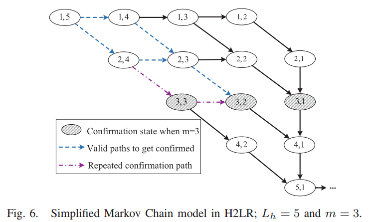
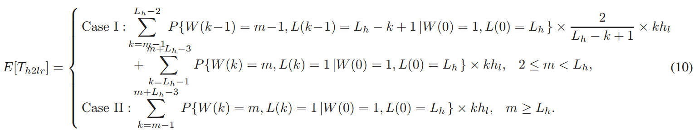
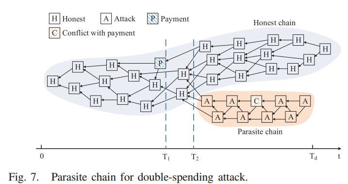
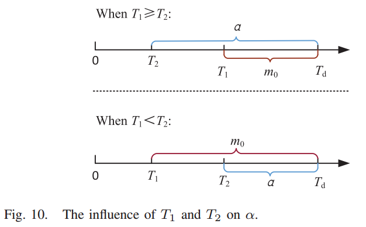

# Direct Acyclic Graph-based Blockchain for Internet of Things_Performance and Security Analysis(Y.Li&etal, Aug.2020)

## 文章创新点

本文主要调查了网络负载对于基于DAG的账本的性能和安全性的影响。考虑不稳定的网络负载，本文首先提出马尔科夫链模型来捕捉在动态负载情况下时共识过程的行为。基于DAG的账本的主要性能度量指标为累计权重和确认延时，本文通过在提出的模型上本溪这两个指标的变化来衡量性能。随后，本文利用随机过程模型来分析在不同网络负载下双花攻击成功的概率。最终这些分析结果可以用于直到基于DAG的账本的实际部署。

基于PoW和基于PoS的链式区块链系统的不足：
* **吞吐量有限：** 区块中区块的容量是有限的，这使得交易吞吐量通常被限制在几十个交易（Bitcoin:7TPS;Ethereum:20~30TPS）。有限的吞吐量不适用于物联网中呈指数倍增长的节点以及需求。
* **确认延时高：** 低区块生成速率导致比较长的交易确认时延（Bitcoin:60 minutes; Ethereum:3minutes）。生成的区块需要包含高算力或币龄，这也是物联网中的一个瓶颈。
* **公平性：** 只有拥有高算力和高币龄的节点才有权力生成区块。这对于资源有限的物联网不适用，并且物联网也没有办法为每一个节点提供足够的代币。
* 高交易费用：不公平性使得具有专业的和强算力的节点才能成为矿工。这遂于拥有高频微支付的物联网而言，向矿工反馈信息是非常沉重的负担。

## 预定义

### 基本术语

最为典型的基于DAG的区块链是最初的Tangle，其共识过程如上图所示，下面给出相关定义：
* **区块：** 记录交易、数字签名和哈希值的存储单位；
* **Tips：** 尚未有任何支持的交易（区块）；
* **直接支持：** 两个交易之间只存在一条直接相连的有向边；
* **间接支持：** 两个交易（区块）之间存在多跳时，则是间接支持；
* **自权重：** 交易的自权重与发起者投入的工作量成比例；
* **累积权重：** 一个交易所有支持交易权重的总和加上交易本身的自权重。

### 共识过程

节点对于新交易达成共识的主要过程如下：
* 节点创建一个存储单位来存储新交易；
* 该节点根据马尔科夫链蒙特卡洛选择算法选择两个Tips作为被支持的交易；
* 该节点找到一个随机数可以解决一个密码学难题（类似于PoW，但是不会有很大的难度）；
* 该节点利用私钥对新交易签名并广播到其他节点；
* 当其他节点接收到该交易后，根据签名和随机数来检查交易的合法性来决定是否接受该交易。

### 分叉问题和解决办法

在分布式账本中，构建分叉以重做工作是篡改存储数据的唯一方法。基于此，双花攻击的主要思想是将两个冲突交易并行放置在同一区块链系统的两个分支链上。在第一个交易用于服务之后支付费用，攻击者会扩展包含冲突交易的链，并让它超过诚实交易所在的分支链。当此操作成功时，第一个交易将被孤立并且攻击者在获得服务的情况下不需要支付费用，攻击者可以多次使用相同的代币。

为了处理分叉问题，不同结构的区块链将采取不同的方法。链式区块链通常采用最长链原则。节点为了最大化自身的利益，通常会选取更长的分支作为主链，并继续增长该链。而图式区块链则采用最重链原则。理性的节点通常使用MCMC(马尔科夫链蒙特卡洛算则算法)来扩展最重的DAG。拥有较少覆盖的累积权重的子DAG渐渐地将不再被新的交易所支持。具体图示如下：

## 共识过程的马尔科夫链模型

### 系统模型

* 在DAG账本中一个观察到的交易的共识过程分为两个阶段：揭示阶段和权重累积阶段。
  * **Reveal Stage:** 将观察到的交易添加到基于DAG的分类账中，使得所有节点都可以看到该交易。记在揭示阶段的平均持续时间为 $h_r$，这个时间是由计算时间和传输时间决定的。
  * **Weight Accumulation Stage:** 观察到的交易的累积权重将慢慢的从其自权重增加到确认阈值（通常记作 $m$）。通常记交易的自权重为 $1$，累积权重将为 $1$ 加上该交易直接或者间接支持的交易总数量。
* 记诚实节点的新交易到达速率为 $\lambda$。

### 网络负载情况影响分析

不同的网络负载情况将会对于区块链系统由不同的影响，接下来主要考虑四种网络负载情况：高负载情况、低负载情况、高变低负载情况以及低变高负载情况。

#### 高负载情况(HR)

 * 记两个交易之间的平均到达间隔时间为 $h = \frac{1}{\lambda}$。当 $h \leq h_r$ 时，网络负载时高的，定义为 $HR$。
 * 在 $t$ 时刻最重DAG中的Tips数量记作 $L(t)$。当系统处于稳定的网络负载时，将保持稳定数量的Tips为一个常数 $L$。因此就有 $L(t) = L(t - h_r) = L$。
 * 在时间间隔 $h_r$ 中时间区间内有 $\lambda h_r$ 个新交易到达。因此在 $t$ 时刻将会有 $\lambda h_r$ 个新Tips替换 $t-h_r$ 时刻中旧的 $\lambda h_r$ 个Tips。因此就有 $L(t) - r + \lambda h_r$，其中 $r$ 是旧的Tips，而 $\lambda h_r$ 是在 $h_r$ 时间段内被新交易选中的Tips。对于在 $t$ 时刻到达的交易，将会从 $L(t)$ 中随机选择两个Tips。当 $\lambda h_r$ 不是Tips时，从 $\lambda h_r$ 或 $r$ 中选取Tips将会影响之后 $L(t)$ 的数量。
    * 若新交易从 $r$ 中选择了零个Tip，则 $L(t)$ 会增加1；
    * 若从 $r$ 中选择一个Tip，则 $L(t)$ 保持不变；
    * 若从 $r$ 中选择两个Tips，则 $L(t)$ 会减小1。期望为：
        
        根据 $L(t)$ 的稳定性就有 $\frac{2r}{r + \lambda h_r} = 1$，即有 $r = \lambda h_r$ 并且 $L = L(t) = 2\lambda h_r$。

#### 低负载情况(LR)

当两个交易平均到达时间间隔 $h > h_r$ 时，网络是低负载。此时在新交易到达之前，早期的交易已经被揭示到基于DAG的账本中。由于一个交易需要覆盖两个Tips，因此在低负载时Tips的数量将降低最终为$1$。 $L = 2\lambda h_r \approx 1$ 在低负载情况下也适用。

#### 高变低负载情况(H2LR)

之前的两种情况都是针对的都是稳定网络负载的情况。但是网络负载在实际情况中应该是动态变化的。记高负载时的交易到达率为 $\lambda_h$，低负载时的交易到达率为 $\lambda_l$。那么当交易到达率从 $\lambda_h$ 变为 $\lambda_l$时，此时网络处于不稳定状态，可以定义为高变低负载情况（H2LR）。Tips的数量将会从 $2\lambda_h h_r$ 降低为 $2\lambda_l h_r = 1$。
* 记 $W(t)$ 是一个随机过程，表示交易在 $t$ 时刻的累积权重；
* 记 $L(t)$ 是一个随机过程，表示在 $t$ 时刻系统中总德Tips数量；
* 当交易到达率变低时，下一时刻的 $\{W(t), L(t)\}$ 值取决于当前情况，而与过去的状态无关。因此  $\{W(t), L(t)\}$ 可以看作时一个离散的马尔可夫链 $\{W(k), L(k)\}, k = 0, 1, 2 , \cdots, \infty$，当新交易到达时状态将发生变化。
  * 初始状态为  $\{W(0) = 1, L(0) = 2\lambda_hh_r\}$，假设当 $W(t) = m$ 时，交易被确认。
  * 当新交易到达时，累积权重将 $W(t) = W(t-h_r) + 1$；由于新交易将从 $L(k)$ 中随机选择两个Tips，观察到的交易的累积权重为 $W(k+1) = W(k)+1$ 的选择的概率为 $\frac{1}{L(k)} \times\frac{L(k) - 1}{L(k)-1} + \frac{L(k) - 1}{L(k)}\times\frac{1}{L(k)-1} = \frac{2}{L(k)}$，观察到的交易的累计权重为 $W(k+1) = W(k)$ 时的选择概率为 $1 - \frac{2}{L(k)}$。
  * 当新交易到达时将选择两个Tips支持，此时新交易成为Tip，而被选中的两个两个交易将不再是Tips，此时满足 $L(k+1) = L(k)-1$，最终 $L(k) = 1$。当 $L(k) = 2$ 时，观察的交易将以概率 $1$ 被即将到来的新交易支持，此时 $W(k+1) = W(k) +1, L(k+1) = L(k) -1$。
  * 关于一次转换的概率为：
  $$\left\{
      \begin{aligned}
      P\{i+1,j-1 | i,j\} = \frac{2}{j}, &  & i = 1, 2, \cdots, L_h - 1, j = 2,3,\cdots, L_h, \\
      P\{i,j-1 |i,j\} = 1 - \frac{2}{j}, &  & i = 1, 2, \cdots, L_h - 1, j = 2,3,\cdots, L_h, \\
      P\{i+1, 1 | i,j\} = 1, & & i = 2, \cdots, \infty, j = 1.
      \end{aligned}
      \right.$$
  其中 $P\{i+1,j-1 | i,j\} = P\{W(k+1) = i+1,L(k+1) = j-1 | W(k) = i,L(k) = j\}$
  
  * 最差的情况是当 $W(0) = 1$ 时，交易到达率从 $\lambda_h$ 变为 $\lambda_l$；最好的情况是当 $W(k) = m$ 时，交易到达率从 $\lambda_h$ 变为 $\lambda_l$，类似于在HR时的共识过程。

#### 低变高负载情况(L2HR)

对于网络负载由低变高的情况是交易到达率从 $\lambda_l$ 突然提升至 $\lambda_h$，系统中Tips的数量从 $1$ 慢慢变成 $2\lambda_hh_r$。对于观察交易在L2HR中的马尔科夫链模型如下图所示：

* 在L2HR的转换概率为 $P\{W(k+1) = i+1|W(k) = i\} = 1, i = 1, 2, \cdots, \infty$。
* 最好的情况是在 $W(0) = 1$ 时，交易到达率从 $\lambda_l$ 变为 $\lambda_h$；最差的情况是在 $W(k) = m$ 时，交易到达率才从 $\lambda_l$ 变为 $\lambda_h$，此时可以使用LR的共识过程。

## 性能分析

为了分析基于DAG的区块链的性能，主要是分析不同网络负载时，度量累积权重和确认延时的情况。

### 累计权重

* **HR:** 这是一个稳定情况，权重积累的阶段包含两个时期：适应期和线性增长期
  * 适应期：直到几乎所有的Tips都是该交易的非直接支持交易的时间。这一时期的累积权重的期望为 $\mathbb{E}[W(t)] = 2\exp(0.352\frac{t}{h_r})$;
  * 线性增长期：在适应期结束后，新到的交易数量将作为累计权重的增值，因此累计权重的期望以速度 $\lambda_h$ 增长。
  * 一个交易的累计权重的期望为：
    $$\mathbb{E}[W(t)_{hr}] = \left\{
      \begin{aligned}
      2\exp(0.352\frac{t}{h_r}), &  & 0\leq t \leq t_0, \\
      \frac{L_h}{0.704} + \lambda_h(t-t_0), & & t > t_0.
      \end{aligned}
      \right.$$
* **LR:** 这也是一个稳定情况，党 $L(0) = 1$ 时，新交易必然是支持观察到的交易，平均累计权重增长速率为 $\lambda_l$，因此累计权重的期望为 $\mathbb{E}[W(t)_{lr}] =1 + \lambda_lt$。
* **H2LR:** 根据Fig 4可知，在不同的状态下有不同的概率。
  * 因此在第 $k$ 步时H2LR的累计权重的期望为 $$\mathbb{E}[W(k)_{h2lr}] = \sum_{\forall i}\sum_{\forall j} P\{W(k) - i,L(k) = j|W(0) = 1, L(0) = L_h\}\times i$$
  * 一个新交易的到达是一个泊松过程，记 $\{H_i, i = 1,2,\cdots,\infty\}$ 是两个相邻交易的时间间隔，其中 $H_i$ 是均值为 $\frac{1}{\lambda_l}$ 的独立同分布指数随机变量。由于 $t = \sum_{i=1}^kH_i$，因此在 $t$ 时刻的累计权重的期望为 $$\mathbb{E}[W(k)_{h2lr}] = \sum_{\forall i}\sum_{\forall j} P\{W(t) - i,L(t) = j|W(0) = 1, L(0) = L_h\}\times i$$
    其中 $t = 0, H_1, H_1 + H_2, \cdots, \infty$。
* **L2HR:** 由于 $L(0) = 1$，所有新交易都会成为观察交易的间接支持交易。因此每个交易到达间隔中 $W(k)$ 都会加一。
  * 因此在L2HR中第 $k$ 步的累积权重的期望为 $$\mathbb{E}[W(k)_{l2hr}] = 1 + k, k = 0,1,2,\cdots, \infty.$$
  * 根据之前的时间划分可知L2HR中 $t$ 时刻的累计权重的期望为 $$\mathbb{E}[W(t)_{l2hr}] = 1 + k, t = \sum_{i=1}^kH_i.$$

### 确认延时

确认延时定义为一个交易的权重从 $W(0)=1$ 累积到 $W(t) = m$ 的时间间隔。

* **HR:** 记 $\mathbb{E}[T_{hr}]$ 为在HR中的确认延时的期望。
  * 适应期：当一个交易的确认阈值 $m\leq [W(t_0)]$，则该交易在适应期就会被确认，此时就有 $m = 2\exp(\frac{0.352\mathbb{E}[T_{hr]}}{h_r})$;
  * 线性增长期：当 一个交易时在线性增长时期被确认，那么 $m = \frac{L_h}{0.704} + \lambda_h(\mathbb{E}[T_{hr}] - t_0)$。
  * 一个交易的确认延时的期望为：
    $$\mathbb{E}[T_{hr}] = \left\{
      \begin{aligned}
      \frac{h_r}{0.325}\ln(\frac{m}{2}), &  & 2\leq m \leq [W(t-0)], \\
      \frac{h_r}{0.325}\ln(\frac{L_h}{1.408}) + \frac{1}{\lambda_h}(m-\frac{L_h}{0.704}), & & m > [W(t-0)].
      \end{aligned}
      \right.$$
* **LR:** 记 $\mathbb{E}[T_{lr}]$ 为在HR中的确认延时的期望。根据此种情况下确认延时的期望为 $\mathbb{E}[T_{lr}] =(m-1)h_{l}, m\geq 2, h_l = \frac{1}{\lambda_l}$。
* **H2LR:** 根据Fig 4可知，存在从初始状态 $\{1, L_h\}$ 到确认状态 $\{m, L(k)\}$ 的多条变量路径。最短路径和最长路径所需新交易数量分别为 $m-1, m+L_h-3$。记 $\frac{2}{L_h-k+1}$ 是 $P\{W(k)=m-1,L(k)-L_h-k|W(k-1) = m-1, L(k-1) = L_h-k+1\}$ 是的概率。
  
  当 $2\leq m<L_h$ 时，根据确认延时的定义，共识过程不能通过重复确认路径。当 $m \geq L_h$ 时，唯一的确认状态是 $\{W(k) = m,L(k) = 1\}$。因此在H2LR中确认延时的期望为
    

* **L2HR:** 由于 $L(0) = 1$，所有新交易都会成为观察交易的间接支持交易。因此在L2HR中确认延时的期望为 $$\mathbb{E}[T_{l2hr}] = \mathbb{E} \sum_{i=1}^{m-1}H_i = (m-1)h_h, m\geq 2, h_h = \frac{1}{\lambda_h}.$$

## 双花攻击模型

### 攻击描述和假设

* 假设诚实节点的累积算力与累计权重成比例；
* 当交易到达率低时，累计权重的增长速率也会降低；
* 共识过程受限于网络负载，攻击者会根据网络的负载来优化策略从而提升攻击成功的概率；

双花攻击的过程如下：
* 记 $T_1$ 时刻为攻击者发起一个支付，并且诚实节点开始支持该交易；
* 记 $T_2$ 时刻为攻击者创建一个离线分支（诚实节点不知道该分支），欺诈链包含了与之前支付冲突的交易（允许$T_1 > T_2, T_2 > T_1$）；
* 攻击者持续使用算力执行哈希运算发起新交易来扩展欺诈链并增加冲突交易的累积权重；
* 记 $T_d$ 为支付交易达到确认阈值 $m$ 的时间，此时商人将会发送商品给攻击者；
* 只要在 $T_d$ 之后欺诈链的累计权重超过诚实链，攻击者就将欺诈链广播到全网。城市节点将会根据MCMC选择算法慢慢的选择欺诈链，最终支付交易所在分支将会被孤立。但此时商品已经被发送给攻击者，因此双花攻击成功。

### 成功攻击的概率

**模型假设**
* 假设诚实节点的的新交易发起过程服从均值为 $\lambda$ 的泊松过程；
* 假设攻击者执行哈希计算达到目标值的时间是服从均值为 $\frac{1}{\mu}$ 的指数分布；
* 假设每个交易的自权重为 $1$；
* 在 $T_d$ 时刻之后攻击者生成的交易数量大于诚实节点的交易数量时，双花攻击成功；
* 假设攻击者在 $T_2$ 时刻通过扩展Tips创建欺诈链，此时竞争开始，两个分支的发起交易数量为 $0$。

记 $\{H_i, i = 1,2,\cdots, \infty\}$ 是两个相邻交易的时间间隔，其中 $H_i$ 是均值为 $\frac{1}{\lambda}$ 的独立同分布指数随机变量。记 $\{A_j, j = 1, 2, \cdots, \infty\}$ 是攻击者发起的交易的时间间隔序列，其中 $A_i$ 是均值为 $\frac{1}{\mu}$ 的独立同分布指数随机变量。
* 在一个时间间隔中交易由城市节点发起和攻击者节点发起的概率分别为 $p = P\{\text{交易由诚实节点发起}\} = \frac{\lambda}{\lambda + \mu}; q = P\{\text{交易由攻击者发起}\} = 1 - \frac{\lambda}{\lambda + \mu} = \frac{\mu}{\lambda + \mu}$。
* 攻击者的攻击过程可以看成是一个伯努利试验。在 $T_2$ 时刻之前，即使欺诈链重于诚实链，也不能广播（此时还没有将商品给攻击者）。记 $\alpha$ 是诚实节点从 $T_2$ 时刻到 $T_d$ 时刻发起的交易数量。记 $N$ 是当城市节点发起 $\alpha$ 个交易时攻击者发起交易的可能数量，此时攻击者发起交易的数量服从负二项分布 $P\{N=n\} = C_{n+\alpha}^{\alpha-1}p^\alpha q^n, \alpha \geq 1$。
* 当 $N > \alpha$ 时，欺诈链将在 $T_d$ 时刻攻击成功；当 $N \leq \alpha$ 时，攻击者需要追赶在 $T_d$ 之后两个分支链交易数量的差值才能攻击成功。这个过程是一个赌徒输光问题，此时攻击需要追赶至少 $\alpha - N + 1$ 个交易，当 $p>q$ 时追赶成功的概率为 $P_c(\alpha-N+1) = (\frac{q}{p})^{\alpha-N+1}$.
* 最终双花攻击成功的概率为 $$P_s = P\{N>\alpha\}\times 1 + P\{N\leq \alpha\}\times P_c(\alpha-N+1) = 1 - \sum_{n=0}^\alpha C_{n+\alpha-1}^{\alpha-1}(p^\alpha q^n - p^{n-1}q^{\alpha-1}), p>q, \alpha\geq 1.$$

## 安全性分析

### 攻击策略

如何将欺诈链连接到DAG中：
* 当在 $T_2$ 时诚实链已经领先 $\beta$ 个交易时，如果在 $T_d$ 时欺诈链没有超过诚实链，则需要追赶的交易差额为 $\alpha + \beta -N +1$，对应的概率为 $P_c(\alpha+\beta - N + 1) = (\frac{q}{p})^{\alpha+\beta - N + 1}, p > q, \alpha \geq 1$。
* 当 $\alpha = 0$ 时，在相差 $\beta$ 个交易时双花攻击成功的概率为 $P_c(\beta + 1)$；当 $\alpha\geq 1$ 时，在相差 $\beta$ 个交易时双花攻击成功的概率为 $$P_s = P\{N>\alpha + \beta\}\times 1 + P\{N\leq \alpha + \beta\}\times P_c(\alpha + \beta - N + 1)$。
* 在 $T_2$ 时刻两分支链交易的差额 $\beta$ 也会影响双花攻击成功的概率。随着 $\beta$ 变大，双花攻击成功的概率会降低。

最小化诚实链在 $T_2$ 到 $T_d$ 时间区间内的交易数量 $\alpha$：
* 当 $p>q$ 时，诚实链的交易到达率要大于欺诈链，因此双花攻击成功的概率会随着 $\alpha$ 的增大而降低。这是因为大的 $\alpha$ 意味着诚实链更高的累计权重，此时链也更加安全。因此攻击者需要投入更多的算力来抵抗比较大的 $\alpha$。可以通过最小化 $\alpha$ 来提升攻击成功的概率，记 $m_0$ 为诚实节点从 $T_1$ 到 $T_d$ 时间内生成的交易数量。
  * 当 $T_1 \geq T_2$ 时，为了降低 $\alpha$  $T_1$ 与 $T_2$ 之间的间距应该要比较小；
  * 当 $T_1 < T_2$ 时，为了降低 $\alpha$  $T_1$ 与 $T_2$ 之间的间距应该要比较大。
  

总之，为了更好的发起欺诈链攻击，攻击者应该在所有Tips交易间接支持诚实支付付款之前的最后一次选择选择Tips来建立欺诈链，从而最小化 $\alpha, \beta$。

### 不同负载下采用攻击策略

讨论根据网络负载决定攻击策略来提升双花攻击成功的概率。对于不同的HR和LR网络负载下的 $p, q$ 分别记为 $p_h = \frac{\lambda_h}{\lambda_h + \mu}, q_h = \frac{\mu}{\lambda_h + \mu}$ 和 $p_l = \frac{\lambda_l}{\lambda_l + \mu}, q_l = \frac{\mu}{\lambda_l + \mu}$。

* **网络负载为HR:** 攻击者应当在适应阶段结束时建造欺诈链（这是 $T_2$ 最好的时间），此时城市支付将会很快得到所有Tips的间接支持，且诚实支付在 $T_2$ 时刻的累积权重的期望是 $W(t_0) - 1$。根据 $\alpha$ 的定义有 $\alpha = \max\{m - [W(t_0)] + 1, 0\}$。记 $f_h(x) = 1 - \sum_{n=0}^xC_{n+x-1}^{x-1}(p_h^xq_h^n - p_h^{n-1}q_h^{x+1}$。当 $p_h > q_h$ 时网络负载为HR的双花攻击成功的概率为 $$P_{hr} = \left\{
      \begin{aligned}
      \frac{q_h}{p_h}, &  & 2\leq m < [W(t-0)], \\
      f_h(m-[W(t_0)] + 1), & & m > [W(t-0)].
      \end{aligned}
      \right.$$

* **网络负载为LR:** 在低网络负载的情况下，如果 $L(0) = 1$ 则基于DAG的区块链是一条单一链。诚实支付交易在 $T_1$ 时刻就被所有Tips间接支持，因此在LR中攻击者会选择 $T_2 = T_1$ 作为发起攻击的时间。最好的情况就是 $\beta = 1$，由于交易自权重为 $1$，因此 $\alpha = m-1$ >1(m\geq 2)。在低网络负载且 $p-l > q_l$ 时，双花攻击成功的概率为 $$P_{lr} = 1 - \sum_{n=0}^mC_{n+m-2}^{m-2}(p_l^{m-1}q_l^n - p_l^{n-2}q_l^{m+1}).$$

* **网络负载为H2LR:** 当网络负载由高变低不稳定时，系统中Tips的数量将由 $L(0) = L_h = 2\lambda_hh_r$ 变为 $L(k) = 1$。当Tips数量变为 $2$ 时，诚实支付将会被所有Tips间接支持。在 $T_2$ 时刻可能的状态为 $\{W(L_h -2) = i， L(L_h-2) = 2, i =1,2, \cdots, L_h-1$。在 $T_2$ 之后诚实支付需要 $\max\{m-i, 0\}$ 使得达到确认阈值，即 $\alpha = \max\{m-i, 0\}$。 
  * 当 $p_l > q_l$ 且网络负载由低变高时，双花攻击成功的概率为 
      $$P_{h2lr} = \left\{
      \begin{aligned}
      \sum_{i=1}^{m-1}P_{\{i, 2\}}\times f_l(m-i) + \sum_{i=m}^{L_h-1}P_{\{i, 2\}}\times\frac{q_l}{p_l}, &  & 2\leq m < L_h, \\
      \sum_{i=1}^{L_h-1}P_{\{i, 2\}}\times f_l(m-i), & & m \geq L-h].
      \end{aligned}
      \right.$$
    其中 $f_l(x) = 1 - \sum_{n=0}^xC_{n+x-1}^{x-1}(p_l^xq_l^n - p_l^{n-1}q_l^{x+1}$ 且 $P_{\{i, 2\}} = P\{W(L_h-2) = i, L(L_h-2) = 2| W(0) = 1, L(0) = L_h\}, i = 1, 2, \cdots, L_h - 1$。

  * 使用期望值 $W(t_0)$ 可以更精确的分析双花攻击成功的概率。基于H2LR中的期望值和分布函数可得双花攻击成功的概率为 $$P_{h2lr} = \left\{
      \begin{aligned}
      \frac{q_l}{p_l}, &  & 2\leq m < [W(t-0)], \\
      flh(m-[W(t_0)] + 1), & & m \geq [W(t-0)].
      \end{aligned}
      \right.$$
    其中 $f_l(x) = 1 - \sum_{n=0}^xC_{n+x-1}^{x-1}(p_l^xq_l^n - p_l^{n-1}q_l^{x+1}$，诚实支付在H2LR中的适应期结束时的平均累计权重为 $W_0 = \sum_{i=1}^{L_h-1}P_{\{i,2\}}\times i$ 且 $P_{\{i, 2\}} = P\{W(L_h-2) = i, L(L_h-2) = 2| W(0) = 1, L(0) = L_h\}, i = 1, 2, \cdots, L_h - 1$。

* **网络负载为L2HR:** 类似于低负载网络，网络负载由低变高时的初期也是一条链。因此在 $T_1$ 时诚实支付将会被所有Tips间接支持，此时双花攻击成功的概率为 $$P_{l2hr} = 1 - \sum_{n=0}^mC_{n+m-2}^{m-2}(p_h^{m-1}q_h^n - p_h^{n-2}q_h^{m+1}).$$

## 数值结果和讨论

通过度量累积权重和确认延时对DAG共识过程的性能进行评估分析，同时表明不同网络负载下的双花攻击成功的概率也有所不同。参数设置如下：
* $h_r = 1s$ ： 交易揭示延时；
* $\lambda_h = 50$ : 在高网络负载下的交易到达率；
* $\lambda_l = 0.5$ : 在低网络负载下的交易到达率；
* $L_h = 2\lambda_hh_r = 100$ : 是高网络负载时的Tips数量；
* $L_l = 2\lambda_lh_r = 1$ : 是低网络负载时的Tips数量；
* $m = 50, 100, 200$ : 设置不同的交易确认权重阈值进行比较。

比较不同负载下累积权重的增长情况：

* 通过使用交易的平均间隔时间($\frac{1}{\lambda_h}$ 或 $\frac{1}{\lambda_l}$)计算数值结果，使用泊松分布来仿真新交易的到达过程并得到结果：
  * 随着时间的推移，所有负载状态的累积权重都会增加。因为新交易不断出现，因此选择Tips来间接支持未确认的交易；
  * 虽然交易到达率同为 $\lambda_h$，但是L2HR比HR更快达到 $m$。因为HR的初始Tips数量远大于L2HR中的Tips数量，使得在HR中观察交易被选中的概率更低，因此使得增长速率比较低；
  * 虽然交易到达率同为 $\lambda_l$，但是LR比H2LR更快达到 $m$。因为H2LR也存在一个适应期，此时观察交易还未得到所有Tips的间接支持，因此H2LR中观察交易的累计权重的增长率低于 $\lambda_l$。而LR中累计权重的增长速率一直都是 $\lambda_l$，始终都是全部Tips都是观察交易的间接支持。

通过改变交易到达率 $\lambda$ 来比较不同负载下的确认延时：

* 确认延时随着交易到达率的的增加而减少；
* 给定 $m$ 之后，H2LR中的确认延时高于LR，由于适应期的影响，HR的确认延时高于L2HR;
* 当 $m$ 增加时，所有网络负载状态下的确认延时都会增加。由于适应期与整个共识过程相比只占很小一部分，因此非稳定状态与稳定状态下的的确认延时非常接近；
* HR的确认延时不会随着 $\lambda$ 的增加而线性降低。因为较高的 $\lambda$ 会导致较大的 $W(t_0) = \frac{2\lambda h_r}{0.704}$。当 $m < W(t_0)$ 时，观察交易会在适应期内被确认，此时 $\lambda$ 并不会影响确认延时；
* 随着 $W(t_0)$ 的增加，高负载网络中确认阈值越小的越快达到延时确认的下界。

比较不同网络负载下成功攻击的概率：

* 当 $\lambda > \mu$，成功攻击的概率随着 $\mu$ 的增加而增加，当 $\lambda \leq \mu$ 时，攻击成功概率为 $1$；
* 给定确认阈值 $m$，当 $\lambda > \mu$ 时HR成功攻击的概率高于L2HR。因为HR有适应期，攻击者通过创建欺诈链来窃取还未支持诚实支付的交易的算力，从而提升攻击成功概率；
* 当 $m < W(t_0)$ 时，诚实支付将在适应期内被确认，因此就有 $T_2 = T_d$，攻击者只需超过诚实节点一个交易即可。
* 当诚实支付在线性增长期内被确认时，较高的 $m$ 会导致较低的成功攻击概率，因为 $m$ 越大，城市节点从 $T_2$ 到 $T_d$ 内的发出交易越多（$\alpha$ 越大），攻击者就越难超过诚实链（因为 $\lambda > \mu$）。
* 对于LR和H2LR，攻击者可以以更小的事务到达率 $\mu$ 攻击成功。因为 H2LR和LR中诚实节点的交易到达率非常低，因此诚实支付的累计权重增长非常缓慢（低负载不利于系统安全）；
* 当 $m$ 越高时，攻击者在LR和H2LR中的成功概率越接近。即 $m$ 越大，适应期与共识过程的比率月底，可以降低适应期对安全性的不利影响。

总之，较大的 $m$ 可以减少适应期的不利影响，并降低在任何情况下成功攻击的概率。但是较大的 $m$ 会导致比较大的确认延时。因此设置合理的确认阈值是平衡好系统安全性和性能的关键。

问题与思考：

* 对于低负载情况下，当 $L(0) = 1$ 时，新交易没办法选择两个Tips的情况，只选一个Tip作为支撑合理吗？是否违反了系统的规则？
  * 对于这种情况下，基于DAG的分布式账本就会变成是一条单独的链，类似于链式区块链结构。但是这是非常极端的情况，并且这种情况下，系统的安全性非常的弱，极易受到攻击。因此在这种场景下新交易没有别的选择方式，只能选择唯一的交易支持，剩下一个则为空。
* 影响系统性能和安全的主要因素有哪些？
  * **系统性能：** 交易到达速率 $\lambda$，网络负载情况以及交易确认阈值等都能能直接影响基于DAG的区块链的性能。区块链的性能主要通过交易的累计权重和确认延时来衡量。当交易到达速率增加时，交易的累计权重增长会提升（除非是确认阈值在适应期内就达到）。当交易确认阈值降低时，确认延时会降低。因为需要达到确认的累计权重数量会降低。
  * **安全性：** 讨论安全性主要从双花攻击成功的概率方面进行深入探讨。因此主要分析影响双花攻击成功概率的因素。攻击者的交易到达速率和确认阈值等会影响攻击成功的概率。当攻击者交易到达率增加时，攻击成功概率会增加；确认阈值增大时，攻击成功的概率会降低，此时区块链系统更加安全。
* 对于双花攻击中的三个时间点 $T_1, T_2, T_d$ 时如何确定？
  * 对于时间 $T_1$ 是诚实交易成为Tips的时刻，即诚实交易第一次出现在账本中。这个时间比较固定，一旦发起诚实交易之后，将很快通过网络传输到其他节点；
  * 对于时间 $T_2$ 是攻击者发起交易的时间，即生成欺诈分支的时间。这个时间可以出现在 $T_1$ 之前，也可以出现在 $T_1$ 之后。要注意离线生成欺诈链的第一个交易选择的Tips不能支持诚实交易，否则攻击没有意义。
  * 对于时间 $T_d$ 是诚实交易被确认的时刻。此时攻击者会比较欺诈分支和诚实分支的权重，如果欺诈分支领先，就立即公布，否则将在之后超过诚实分支后再公布。但最好是再所有Tips都成为诚实分支的间接支持交易之前公布，否则将会导致攻击失败。
  这三个时间是分析双花攻击非常重要的时间，因此在分析攻击成功的概率时需要重点关注！
* 在无线网络中，不考虑完美传输的情况，即考虑通信协议时，对于基于DAG的区块链性能和安全性分析有何不同，具体如何分析？
  * 可能需要写一篇单独的分析文档，待补充！
* 攻击者发起双花攻击时，收益的期望如何计算？基于DAG的区块链如何设置奖励机制？是否可以通过最大化收益来决定攻击策略，从而避免不必要的损失？
  * 可能需要写一篇单独的分析文档，待补充！
