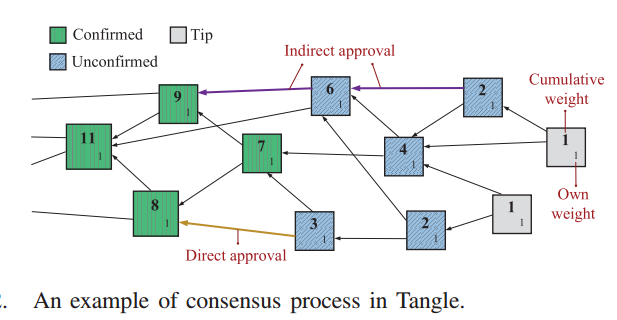
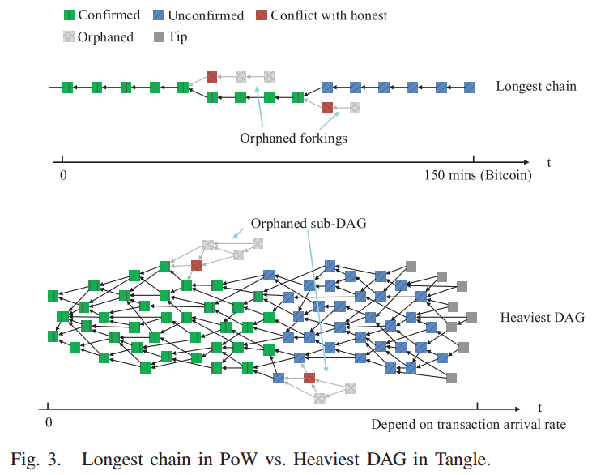
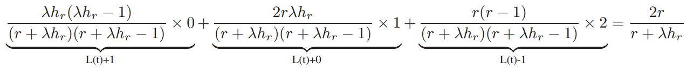
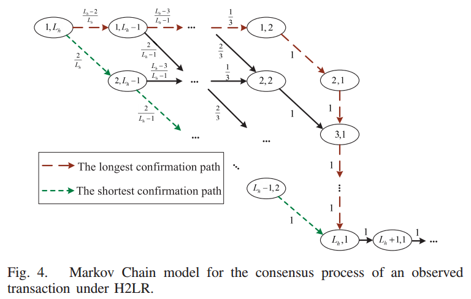
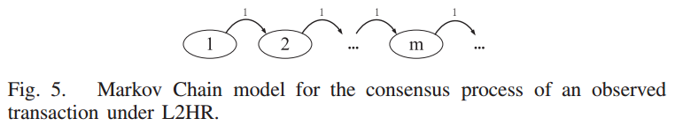

# Direct Acyclic Graph-based Blockchain for Internet of Things_Performance and Security Analysis(Y.Li&etal, Aug.2020)

## 文章创新点

本文主要调查了网络负载对于基于DAG的账本的性能和安全性的影响。考虑不稳定的网络负载，本文首先提出马尔科夫链模型来捕捉在动态负载情况下时共识过程的行为。基于DAG的账本的主要性能度量指标为累计权重和确认延时，本文通过在提出的模型上本溪这两个指标的变化来衡量性能。随后，本文利用随机过程模型来分析在不同网络负载下双花攻击成功的概率。最终这些分析结果可以用于直到基于DAG的账本的实际部署。

基于PoW和基于PoS的链式区块链系统的不足：
* **吞吐量有限：** 区块中区块的容量是有限的，这使得交易吞吐量通常被限制在几十个交易（Bitcoin:7TPS;Ethereum:20~30TPS）。有限的吞吐量不适用于物联网中呈指数倍增长的节点以及需求。
* **确认延时高：** 低区块生成速率导致比较长的交易确认时延（Bitcoin:60 minutes; Ethereum:3minutes）。生成的区块需要包含高算力或币龄，这也是物联网中的一个瓶颈。
* **公平性：** 只有拥有高算力和高币龄的节点才有权力生成区块。这对于资源有限的物联网不适用，并且物联网也没有办法为每一个节点提供足够的代币。
* 高交易费用：不公平性使得具有专业的和强算力的节点才能成为矿工。这遂于拥有高频微支付的物联网而言，向矿工反馈信息是非常沉重的负担。

## 预定义

### 基本术语

最为典型的基于DAG的区块链是最初的Tangle，其共识过程如上图所示，下面给出相关定义：
* **区块：** 记录交易、数字签名和哈希值的存储单位；
* **Tips：** 尚未有任何支持的交易（区块）；
* **直接支持：** 两个交易之间只存在一条直接相连的有向边；
* **间接支持：** 两个交易（区块）之间存在多跳时，则是间接支持；
* **自权重：** 交易的自权重与发起者投入的工作量成比例；
* **累积权重：** 一个交易所有支持交易权重的总和加上交易本身的自权重。

### 共识过程

节点对于新交易达成共识的主要过程如下：
* 节点创建一个存储单位来存储新交易；
* 该节点根据马尔科夫链蒙特卡洛选择算法选择两个Tips作为被支持的交易；
* 该节点找到一个随机数可以解决一个密码学难题（类似于PoW，但是不会有很大的难度）；
* 该节点利用私钥对新交易签名并广播到其他节点；
* 当其他节点接收到该交易后，根据签名和随机数来检查交易的合法性来决定是否接受该交易。

### 分叉问题和解决办法

在分布式账本中，构建分叉以重做工作是篡改存储数据的唯一方法。基于此，双花攻击的主要思想是将两个冲突交易并行放置在同一区块链系统的两个分支链上。在第一个交易用于服务之后支付费用，攻击者会扩展包含冲突交易的链，并让它超过诚实交易所在的分支链。当此操作成功时，第一个交易将被孤立并且攻击者在获得服务的情况下不需要支付费用，攻击者可以多次使用相同的代币。

为了处理分叉问题，不同结构的区块链将采取不同的方法。链式区块链通常采用最长链原则。节点为了最大化自身的利益，通常会选取更长的分支作为主链，并继续增长该链。而图式区块链则采用最重链原则。理性的节点通常使用MCMC(马尔科夫链蒙特卡洛算则算法)来扩展最重的DAG。拥有较少覆盖的累积权重的子DAG渐渐地将不再被新的交易所支持。具体图示如下：

## 共识过程的马尔科夫链模型

### 系统模型

* 在DAG账本中一个观察到的交易的共识过程分为两个阶段：揭示阶段和权重累积阶段。
  * **Reveal Stage:** 将观察到的交易添加到基于DAG的分类账中，使得所有节点都可以看到该交易。记在揭示阶段的平均持续时间为 $h_r$，这个时间是由计算时间和传输时间决定的。
  * **Weight Accumulation Stage:** 观察到的交易的累积权重将慢慢的从其自权重增加到确认阈值（通常记作 $m$）。通常记交易的自权重为 $1$，累积权重将为 $1$ 加上该交易直接或者间接支持的交易总数量。
* 记诚实节点的新交易到达速率为 $\lambda$。

### 网络负载情况影响分析

不同的网络负载情况将会对于区块链系统由不同的影响，接下来主要考虑四种网络负载情况：高负载情况、低负载情况、高变低负载情况以及低变高负载情况。

#### 高负载情况(HR)

 * 记两个交易之间的平均到达间隔时间为 $h = \frac{1}{\lambda}$。当 $h \leq h_r$ 时，网络负载时高的，定义为 $HR$。
 * 在 $t$ 时刻最重DAG中的Tips数量记作 $L(t)$。当系统处于稳定的网络负载时，将保持稳定数量的Tips为一个常数 $L$。因此就有 $L(t) = L(t - h_r) = L$。
 * 在时间间隔 $h_r$ 中时间区间内有 $\lambda h_r$ 个新交易到达。因此在 $t$ 时刻将会有 $\lambda h_r$ 个新Tips替换 $t-h_r$ 时刻中旧的 $\lambda h_r$ 个Tips。因此就有 $L(t) - r + \lambda h_r$，其中 $r$ 是旧的Tips，而 $\lambda h_r$ 是在 $h_r$ 时间段内被新交易选中的Tips。对于在 $t$ 时刻到达的交易，将会从 $L(t)$ 中随机选择两个Tips。当 $\lambda h_r$ 不是Tips时，从 $\lambda h_r$ 或 $r$ 中选取Tips将会影响之后 $L(t)$ 的数量。
    * 若新交易从 $r$ 中选择了零个Tip，则 $L(t)$ 会增加1；
    * 若从 $r$ 中选择一个Tip，则 $L(t)$ 保持不变；
    * 若从 $r$ 中选择两个Tips，则 $L(t)$ 会减小1。期望为：
        
        根据 $L(t)$ 的稳定性就有 $\frac{2r}{r + \lambda h_r} = 1$，即有 $r = \lambda h_r$ 并且 $L = L(t) = 2\lambda h_r$。

#### 低负载情况(LR)

当两个交易平均到达时间间隔 $h > h_r$ 时，网络是低负载。此时在新交易到达之前，早期的交易已经被揭示到基于DAG的账本中。由于一个交易需要覆盖两个Tips，因此在低负载时Tips的数量将降低最终为$1$。 $L = 2\lambda h_r \approx 1$ 在低负载情况下也适用。

#### 高变低负载情况(H2LR)

之前的两种情况都是针对的都是稳定网络负载的情况。但是网络负载在实际情况中应该是动态变化的。记高负载时的交易到达率为 $\lambda_h$，低负载时的交易到达率为 $\lambda_l$。那么当交易到达率从 $\lambda_h$ 变为 $\lambda_l$时，此时网络处于不稳定状态，可以定义为高变低负载情况（H2LR）。Tips的数量将会从 $2\lambda_h h_r$ 降低为 $2\lambda_l h_r = 1$。
* 记 $W(t)$ 是一个随机过程，表示交易在 $t$ 时刻的累积权重；
* 记 $L(t)$ 是一个随机过程，表示在 $t$ 时刻系统中总德Tips数量；
* 当交易到达率变低时，下一时刻的 $\{W(t), L(t)\}$ 值取决于当前情况，而与过去的状态无关。因此  $\{W(t), L(t)\}$ 可以看作时一个离散的马尔可夫链 $\{W(k), L(k)\}, k = 0, 1, 2 , \cdots, \infty$，当新交易到达时状态将发生变化。
  * 初始状态为  $\{W(0) = 1, L(0) = 2\lambda_hh_r\}$，假设当 $W(t) = m$ 时，交易被确认。
  * 当新交易到达时，累积权重将 $W(t) = W(t-h_r) + 1$；由于新交易将从 $L(k)$ 中随机选择两个Tips，观察到的交易的累积权重为 $W(k+1) = W(k)+1$ 的选择的概率为 $\frac{1}{L(k)} \times\frac{L(k) - 1}{L(k)-1} + \frac{L(k) - 1}{L(k)}\times\frac{1}{L(k)-1} = \frac{2}{L(k)}$，观察到的交易的累计权重为 $W(k+1) = W(k)$ 时的选择概率为 $1 - \frac{2}{L(k)}$。
  * 当新交易到达时将选择两个Tips支持，此时新交易成为Tip，而被选中的两个两个交易将不再是Tips，此时满足 $L(k+1) = L(k)-1$，最终 $L(k) = 1$。当 $L(k) = 2$ 时，观察的交易将以概率 $1$ 被即将到来的新交易支持，此时 $W(k+1) = W(k) +1, L(k+1) = L(k) -1$。
  * 关于一次转换的概率为：
  $$\left\{
      \begin{aligned}
      P\{i+1,j-1 | i,j\} = \frac{2}{j}, &  & i = 1, 2, \cdots, L_h - 1, j = 2,3,\cdots, L_h, \\
      P\{i,j-1 |i,j\} = 1 - \frac{2}{j}, &  & i = 1, 2, \cdots, L_h - 1, j = 2,3,\cdots, L_h, \\
      P\{i+1, 1 | i,j\} = 1, & & i = 2, \cdots, \infty, j = 1.
      \end{aligned}
      \right.$$
  其中 $P\{i+1,j-1 | i,j\} = P\{W(k+1) = i+1,L(k+1) = j-1 | W(k) = i,L(k) = j\}$
  
  * 最差的情况是当 $W(0) = 1$ 时，交易到达率从 $\lambda_h$ 变为 $\lambda_l$；最好的情况是当 $W(k) = m$ 时，交易到达率从 $\lambda_h$ 变为 $\lambda_l$，类似于在HR时的共识过程。

#### 低变高负载情况(L2HR)

对于网络负载由低变高的情况是交易到达率从 $\lambda_l$ 突然提升至 $\lambda_h$，系统中Tips的数量从 $1$ 慢慢变成 $2\lambda_hh_r$。对于观察交易在L2HR中的马尔科夫链模型如下图所示：

* 在L2HR的转换概率为 $P\{W(k+1) = i+1|W(k) = i\} = 1, i = 1, 2, \cdots, \infty$。
* 最好的情况是在 $W(0) = 1$ 时，交易到达率从 $\lambda_l$ 变为 $\lambda_h$；最差的情况是在 $W(k) = m$ 时，交易到达率才从 $\lambda_l$ 变为 $\lambda_h$，此时可以使用LR的共识过程。

## 性能分析

为了分析基于DAG的区块链的性能，主要是分析不同网络负载时，度量累积权重和确认延时的情况。

### 累计权重

* **HR:** 这是一个稳定情况，权重积累的阶段包含两个时期：适应期和象形增长期
  * 适应期：直到几乎所有的Tips都是该交易的非直接支持交易的时间。这一时期的累积权重的期望为 $\mathbb{E}[W(t)] = 2\exp(0.352\frac{t}{h_r})$;
  * 线性增长期：在适应期结束后，新到的交易数量将作为累计权重的增值，因此累计权重的期望以速度 $\lambda_h$ 增长。
  * 一个交易的累计权重的期望为：
    $$\mathbb{E}[W(t)_{hr}] = \left\{
      \begin{aligned}
      2\exp(0.352\frac{t}{h_r}), &  & 0\leq t \leq t_0, \\
      \frac{L_h}{0.704} + \lambda_h(t-t_0), & & t > t_0.
      \end{aligned}
      \right.$$
* **LR:** 这也是一个稳定情况，党 $L(0) = 1$ 时，新交易必然是支持观察到的交易，平均累计权重增长速率为 $\lambda_l$，因此累计权重的期望为 $\mathbb{E}[W(t)_{lr}] =1 + \lambda_lt$。
* **H2LR:** 根据Fig 4可知，在不同的状态下有不同的概率。
  * 因此在第 $k$ 步时H2LR的累计权重的期望为 $$\mathbb{E}[W(k)_{h2lr}] = \sum_{\forall i}\sum_{\forall j} P\{W(k) - i,L(k) = j|W(0) = 1, L(0) = L_h\}\times i$$
  * 一个新交易的到达是一个泊松过程，记 $\{H_i, i = 1,2,\cdots,\infty\}$ 是两个相邻交易的时间间隔，其中 $H_i$ 是均值为 $\frac{1}{\lambda_l}$ 的独立同分布指数随机变量。由于 $t = \sum_{i=1}^kH_i$，因此在 $t$ 时刻的累计权重的期望为 $$\mathbb{E}[W(k)_{h2lr}] = \sum_{\forall i}\sum_{\forall j} P\{W(t) - i,L(t) = j|W(0) = 1, L(0) = L_h\}\times i$$
    其中 $t = 0, H_1, H_1 + H_2, \cdots, \infty$。
* **L2HR:** 由于 $L(0) = 1$，所有新交易都会成为观察交易的间接支持交易。因此每个交易到达间隔中 $W(k)$ 都会加一。
  * 因此在L2HR中第 $k$ 步的累积权重的期望为 $$\mathbb{E}[W(k)_{l2hr}] = 1 + k, k = 0,1,2,\cdots, \infty.$$
  * 根据之前的时间划分可知L2HR中 $t$ 时刻的累计权重的期望为 $$\mathbb{E}[W(t)_{l2hr}] = 1 + k, t = \sum_{i=1}^kH_i.$$

### 确认延时

## 双花攻击模型

## 安全性分析

## 数值结果和讨论