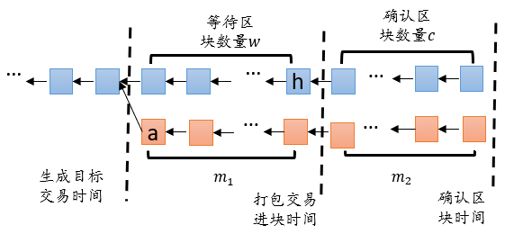
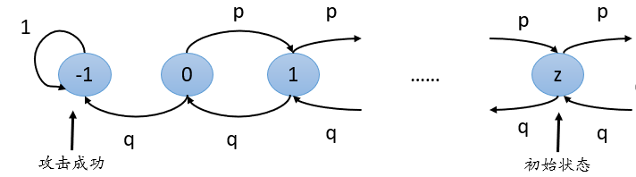
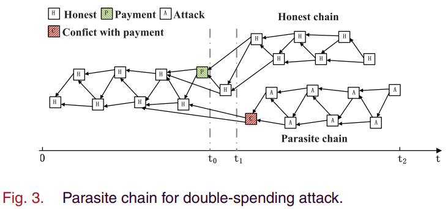

# 区块链中双花攻击分析

在区块链领域，不管何种区块链系统都面临双花攻击的威胁。区块链中双花攻击会造成很大的经济损失。双花攻击是攻击者利用网络传输延时将相同的一笔钱花费两次，从而获得额外收益。区块链主要包含两种存储结构：一种是链式区块存储结构，一种是有向无环图交易存储结构。针对两种不同的结构的双花攻击成功的计算概率有所不同。本文考虑在完美通信的情况下，不同区块链结构双花攻击成功的概率以及双花攻击成功时的收益。

## 1. 基于链式结构区块链的双花攻击分析

对于链式存储结构的区块链，双花攻击是将两个具有相同输入的交易打包到区块中，但是最终攻击交易被确认到区块链上使得攻击者获益的一种攻击。对于这类区块链的双花攻击模型有基于区块数量的攻击模型和基于时间的双花攻击模型。下面分别给出两种攻击模型的分析和计算。我们首先需要定义清晰的区块链系统的模型：
  
  **系统模型假设**
  * 假设系统由 $N$ 个节点构成，并且节点可以随意加入网络；
  * 假设每个节点通过竞争生成区块，并达成一致添加到区块链主链上；
  * 假设节点在区块生成时期内只能生成一个区块；
  * 系统中的节点可以分成两类：诚实节点和攻击者节点； 
  * 假设攻击节点决定发起双花攻击，会生成一个目标交易，随后生成一个攻击交易；
  * 当确定攻击成功时，攻击者会选择公布欺诈链分支。

### 1.1 基于区块数量的攻击模型
在本小节，我们主要分析基于区块数量的双花攻击模型。在分析双花攻击模型之前，我们先给出在链式存储的区块链系统中双花攻击成功的定义。

**定义 1.** 双花攻击是成功的如果满足以下条件：
* **区块确认：** 目标交易所在区块被确认；
* **竞争成功：** 欺诈分支的长度长于诚实分支的长度。

链式区块链中双花攻击有几个比较重要的时间点：**攻击者生成目标交易的时间、目标交易第一次出现在区块中的时间以及目标交易被确认的时间**，示意图如下：

假设攻击者在目标交易生成并广播后立即发起攻击。攻击者私密的生成一条欺诈链分支并不断地延长该分支。由于网络延时，目标交易可能会在好几个区块之后才被的打包进诚实链分支上。随后诚实链分支等待生成一定数量的区块确认目标交易，当目标交易被确认之后若欺诈分支长于诚实分支则攻击成功。

#### 1.1.1 双花攻击成功概率计算
下面我们定量分析双花攻击模型：
**问题描述**
  * 假设一个区块由攻击者生成的概率为$q$，由诚实节点生成区块的概率为$p = 1 - q$；
  * 假设目标交易被确认时诚实链分支长度为 $n$，欺诈链分支长度为 $m$。诚实链分支领先 $z = n - m$ 个区块的长度，并且当 $z = -1$ 时表明双花攻击成功。图示如下；
    
  * 求解双花攻击成功概率。

**定量分析**
  在不考虑成功的时间的情况下，上述问题可以等价为一个[离散的马尔可夫过程](https://zhuanlan.zhihu.com/p/31411951)。当目标交易所在区块被确认时欺诈链分支落后于诚实链分支的 $z$ 个区块时，双花攻击成功的概率计算如下：
  * 记 $a_z$ 是欺诈链落后于诚实链 $z$ 个区块攻击成功的概率，因此就有 $a_z = a_{z+1}*p + a_{z-1}*q$, 且 $a_{-1} = 1, a_0 = \frac{q}{p}$。区块链两个分支差额状态的马尔科夫链示意图如下：
    
  * 当 $q > p$ 时，即攻击节点的算力大于诚实节点的总算力，此时无论欺诈链落后诚实链多少个区块，最终均可攻击成功。当 $q < p$ 时，计算得到在欺诈链落后诚实链 $z$ 个区块攻击者双花攻击成功的概率为 $p(z) = (\frac{q}{p})^{z+1}$。攻击者成功的概率随着落后的区块个数而呈现指数型衰减。攻击节点成功的概率与落后区块个数有关，与生成区块的时间间隔大小无关。

计算双花攻击成功概率的累积分布函数(CDF)。新产生的区块由攻击者节点和诚实节点生成的概率分别为 $q,p(p + q = 1)$。因此一个时期 $T$ 内区块是由谁生成是一个[伯努利试验](https://baike.baidu.com/item/%E4%BC%AF%E5%8A%AA%E5%88%A9%E8%AF%95%E9%AA%8C/238488)。对于总共 $m+n$ 次试验可以看成是一个 $m+n$ 重伯努利试验，攻击节点成功生成新区块数量 $m$ 是一个随机变量，服从负二项分布，并且**概率密度函数(pdf)为 $p(m) = C_{m+n-1}^m p^nq^m, q < q$**，由此计算出双花攻击成功的概率为 
$$P(m) = \sum_{m = 0}^{\infty}p(m) = \sum_{m=0}^{n-1} p(m)\cdot \min(a_{n-m-1},1) + \sum_{m=n}^{\infty} p(m) \\
= \left\{
  \begin{array}{rl}
  1 & \text{if } q \geq p, \\
  1 - \sum_{m=0}^{n} C_{m+n-1}^m(p^nq^m - p^mq^n) & \text{if } q < p.
  \end{array}
  \right.$$

根据双花攻击成功的概率分布函数，可以计算出双花攻击成功的概率与攻击者算力、确认区块数量（可以设为 $n$）密切相关。

#### 1.1.2 双花攻击成功收益计算

当节点成功挖出一个区块之后，将获得系统的奖励，而在挖矿过程中也需要消耗资源进行挖矿，因此，我们可以计算节点成功攻击后的收益的变化来分析系统的安全性。

* 当一个节点成功生成一个区块后，其收益主要是挖矿奖励 $R_B$ 和交易费用 $R_b$，但在生成区块的过程中会产生消耗，从而产生一个区块的成本为 $C_b$。在考虑挖矿奖励、交易费用和挖矿成本时，计算双花攻击成功的收益的概率。
* 假设每一笔交易都支付相同的交易费用 $R_f$，区块 $i$ 中对应的交易数量为 $N_T^i$，因此区块 $i$ 的交易总费用为 $R_T^i = R_f* N_T^i$。记双花攻击一笔交易的收益为 $R_p$，成功生成一个区块的系统奖励为 $R_p$，挖掘一个区块的成本是 $C_b(d)$。因此，每个区块的网络奖励为：
      
  $$R_{net}(R_b, R_f, R_d, C_b)=\left\{
  \begin{aligned}
  R_b + R_f* N^b_T - C_b&  & \text{if attack successful}, \\
  -C_b &  & \text{otherwise}.
  \end{aligned}
  \right.$$
  
  $$R_{net}(R_b, R_f, R_d, C_b)=\left\{
  \begin{array}{rl}
  R_b + R_f* N^b_T - C_b, & \text{if attack successful}, \\
  -C_b, & \text{otherwise}.
  \end{array}
  \right.$$

  $$R_{net}(R_b, R_f, R_d, C_b)=
  \begin{cases}
  R_b + R_f* N^b_T - C_b, & \text{if attack successful},\\
  -C_b, & \text{otherwise}.
  \end{cases}$$

* 当双花攻击成功时，奖励的期望为：

  $\mathbb{E}_{(m,n)}(R_{net}+R_p|R_b,R_f,C_b) = (1 - \sum_{m=0}^{n} C_{m+n-1}^m(p^nq^m - p^mq^n))(R_p+\sum_{i=1}^{m}(R_b + R_f*N_T^i-C_b) + (\sum_{m=0}^{n} C_{m+n-1}^m(p^nq^m - p^mq^n))(-C_b\cdot m)$

#### 1.1.3 自适应策略的攻击
攻击者通过观察诚实链分支的状态以及自身的资源来决定是继续发起攻击，还是更新状态后发起攻击。通过自适应系统的状态，调整发起攻击，可以提高双花攻击成功的概率。

1. 攻击模型
  * 假设攻击者在发送目标交易到矿池之后就立即生成欺诈分支链，并且攻击者在观察到提交的交易出现在区块中时会比较伪分支与诚实分支的长度；
  * 若假分支长，则攻击者继续生成更多区块，直到分支足够长可以成功攻击系统；若诚实分支更长攻击者将会用诚实链替换假分支，并重新发起攻击。
  * 假设攻击者是能够联合好几个矿工通过攻击区块链控制网络的矿工或网络节点；
  * 攻击者可以访问网络的控制信道和获取区块链的副本，从而获取区块链交易相关的信息；
  * 攻击者通过提供服务可以获取代币，利用代币可以提交错误交易；
  * 假设节点不被破坏，从而攻击者不能访问合法网络节点或矿工的私钥；
  * 攻击者蹦年生成错误交易（比如添加一个无效数字签名在交易上）。
  * 假设攻击者在全网的总算力小于诚实矿工的总算力。

##### 1.1.3.1 双花攻击成功概率计算

1. 问题描述
  *  假设在一个时期中攻击节点和诚实节点生成区块的概率分别为 $q$ 和 $p$，且有 $p + q = 1$；
  *  假设在第一阶段（攻击者发送目标交易到网络最后第一次出现在区块中）欺诈链和诚实链的区块数量分别为 $m_1, k$；
  *  假设在第二阶段（提交的目标交易被确认，即诚实链又增加 $z$ 个区块）欺诈链和诚实链的区块数量分别为 $m_2, z$；
  * 求解攻击节点生成欺诈链超过诚实链的概率。

2. 定性分析
对于自适应策略的双花攻击会根据第一个阶段两个分支链状态来调整攻击策略：
  * 当 $m_1 \geq k - 1$ 时，攻击节点继续增长欺诈分支，经过 $m_2$ 个区块增长后，双花攻击成功需要满足 $m_1 + m_2 > k + z$；
  * 当 $m_1 < k$ 时，攻击节点会停止攻击，并且复制前 $k-1$ 个诚实分支上的区块后再次发起攻击，双花攻击成功要满足 $m_2 > z$。
  * 不考虑攻击时间的情况下，双花攻击的过程时一个离散的马尔可夫过程。
  * 当诚实链领先欺诈链 $z$ 个区块时，双花攻击成功时，下面关系成立：
    $$z^{i + 1}=\left\{
    \begin{array}{rl}
    z^i + 1 & \text{概率为 } p, \\
    z^i -1 & \text{概率为 } q.
    \end{array}
  \right.\\
  p + q = 1;\\
  a_z = p*a_{z+1} + q*a_{z-1}；\\
  a_{-1} = 1.$$
  其中 $a_z$ 是欺诈链落后于诚实链 $z$ 个区块攻击成功的概率，因此就有 $a_z = a_{z+1}*p + a_{z-1}*q$, 且 $a_{-1} = 1$。最终计算得到在诚实链领先欺诈链 $z$ 个区块长度时攻击成功的概率为 $a_z = (\frac{q}{p})^{z+1}$，即有： 
  $$p(z)=\left\{
  \begin{array}{rl}
  1 &  \text{if } q \geq p, \\
  a_z = (\frac{q}{p})^{z+1} &  \text{if } q < p.
  \end{array}
  \right.$$

1. 定量分析
根据自适应策略双花攻击模型可知，双花攻击成功的概率为 
  $$P_{V}(k, z) = P(m_1\geq k-1, m_1+m_2>k+z) + P(m_1<k-1, m_2>z)$$
  * 新产生的区块由攻击者节点和诚实节点生成的概率分别为 $q,p(p + q = 1)$。因次一个时期 $T$ 内区块是由谁生成是一个[伯努利试验](https://baike.baidu.com/item/%E4%BC%AF%E5%8A%AA%E5%88%A9%E8%AF%95%E9%AA%8C/238488)。对于总共 $m+n$ 次试验可以看成是一个 $m+n$ 重伯努利试验，攻击节点成功生成新区块数量 $m$ 是一个随机变量，服从负二项分布，并且概率密度函数(pdf)为 $p(m,n) = C_{m+n-1}^m p^nq^m, q < q$；
  * 给定确认区块数量为 $z$ 时，双花攻击成功的概率为 
    $P_V(k,z) = \sum_{m_1 = k-1}^\infty\sum_{m_2 = 0}^\infty p(m_1, k)p(m_2, z)a_{((k+z)-(m_1 +m_2))} + \sum_{m_1 = 0}^{k-2}\sum_{m_2 = 0}^\infty p(m_1, k)p(m_2, z)a_{(z-m_2)}$

##### 1.1.3.2 双花攻击成功收益计算
  * 记节点生成一个区块的成本为 $C_d$，其中 $d$ 表示区块的挖矿难度。当难度越高，则成本越高；
  * 记节点生成一个区块的的奖励为 $R_b$，该奖励主要由挖矿奖励和交易费用构成；
  * 攻击者每个区块获得网络收益是:
    $$R_{net}(R_b, C_h, d)=\left\{
    \begin{array}{rl}
    R_b - C_b(d) & \text{if attack successful}, \\
    -C_b(d) &  \text{otherwise}.
    \end{array}
    \right.$$
  * 记目标交易的价值为 $C_t$；
  * 攻击者双花攻击成功的概率为 $P_V(k,z)$ 可以计算得到奖励的期望:
  $\mathbb{E}_{(m_1,m_2)}(R_{net}|z,k,R_b,C_d) = \sum_{m_1 = k-1}^\infty\sum_{m_2 = 0}^\infty p(m_1, k)p(m_2, z)a_{((k+z)-(m_1 +m_2))}(C_t + (R_b-C_b(d)(m_1+m_2)) + \sum_{m_1 = 0}^{k-2}\sum_{m_2 = 0}^\infty p(m_1, k)p(m_2, z)a_{(z-m_2)}(C_t + R_bm_2-C_b(d)(m_1 +m_2)) + \sum_{m_1 = k-1}^\infty\sum_{m_2 = 0}^\infty p(m_1, k)p(m_2, z)(1-a_{((k+z)-(m_1 +m_2))})((-C_b(d))(m_1+m_2) + \sum_{m_1 = 0}^{k-2}\sum_{m_2 = 0}^\infty p(m_1, k)p(m_2, z)(1- a_{(z-m_2)})(-C_b(d)(m_1 +m_2))$

##### 1.1.3.3 讨论分析

根据双花攻击的成功概率可知，影响双花攻击成功概率的主要因素是确认区块数量 $z$ 、等待区块数量 $k$ 以及攻击者的算力 $q$。
  * 给定等待区块数量 $k$ 和攻击者的算力 $q$ 后，攻击成功的概率 $P_V(k,z)$ 会随着确认区块数量 $z$ 的增加而降低。这是因为当 $z$ 增加时，攻击者需要等待目标交易确认的区块数量会增加，从而使得诚实链领先欺诈链的数量增加，进而此时攻击成功的概率 $p(z) = (\frac{q}{p})^{z+1}$ 的概率会降低，最终双花攻击成功的概率会降低；
  * 给定等待区块数量 $k$ 和确认区块数量 $z$ 后，攻击成功的概率 $P_V(k,z)$ 会随着攻击者算力 $q$ 的增加而增加。这是因为当 $q$ 增加时，攻击者生成区块的概率会增加，根据攻击成功的概率 $p(z) = (\frac{q}{p})^{z+1}$ 的概率会提升，最终双花攻击成功的概率会增加；
  * 给定确认区块数量 $z$ 和攻击者的算力 $q$ 后，攻击成功的概率 $P_V(k,z)$ 会随着等待区块数量 $k$ 的增加而降低。这是因为当 $k$ 增加时，攻击者需要满足 $m_1 \geq k-1$ 的累积概率 $\sum_{m_1 = k-1}^\infty p(m_1, k)$ 的会降低。此外欺诈链与诚实链在第一阶段有很大的概率会满足 $m_1 < k-1$，此时累积概率 $\sum_{m_1 = 0}^{k-2} p(m_1, k)$ 会降低。最终攻击成功的概率 $P_V(k,z) $ 会降低。

根据双花攻击成功的收益的期望可知，当期望 $\mathbb{E}_{(m_1,m_2)} < 0$ 时，就算双花攻击成功也不会有收益。该期望主要受到双花攻击成功概率、目标交易的价值、挖矿的奖励和成本等因素的影响。
  * 当目标交易的价值 $C_t$ 增加时，双花攻击成功奖励的期望会降低。这是因为当其他条件不变时，随着目标交易价值变大，双花攻击成功时的收益将会增加，因此最终会使得奖励的期望增加；
  * 当生成区块的奖励增加时，攻击成功时奖励的期望也会增加。通常区块的挖矿奖励是固定的，主要改变的是交易费用的大小。当区块变大时交易数量会增加，进而使得交易费用增加。因此双花攻击成功后奖励会增加，最终奖励的期望会增加；
  * 当提升挖矿难度使得成本增加时，奖励的期望会降低。成本增加，而奖励和攻击成功概率并不会发生变化，此时双花攻击成功需要消耗更多的成本，进而降低了奖励的期望。
  * 其他条件不变时，双花攻击成功概率的降低也会降低奖励的期望。因此影响双花攻击概率的因素也会影响奖励的期望。

通过分析双花攻击成功后奖励的期望的大小，可以进一步分析系统的安全性。对于理性攻击者而言，不会无限制的浪费资源来进行无收益的攻击。
  * 当奖励的期望 $\mathbb{E} < 0$ 时，就算双花攻击成功也是没有收益的。

### 1.2 基于时间的攻击模型

攻击者不会无限期的等待攻击成功，因为如果在较长时间攻击成功后，攻击者也无法获得收益。因此引入了一个切割时间 $t_{cut}\in \mathbb{R}^+$。攻击者会计算双花攻击实现时间 $T_{DSA}$ 的概率分布，根据切割时间为 $t_{cut}$ 的双花攻击成功概率计算出 $T_{DSA} < t_{cut}$ 的概率，由此估计出攻击的收益。当收益较小或者无收益时，理性的攻击者会选择停止攻击。因此，可以以此为切入点，分析双花攻击在有限时间内成功所需要的资源，从而在设计区块链时将这些影响参数设置在安全线以内去日报区块链系统的安全性。

1. 双花攻击的必要条件：
  定义1. 双花攻击是成功的，如果存在一个双花攻击实现(DSA)时间 $T_{DSA}$ 使得下面两个条件成立：
     * 区块确认 $\mathcal{G}^{(1)}$：诚实链在 $T_{DSA}$ 时间段内增长的长度要远远长于最长确认区块数量 $N_{BC}$；
     * PoW竞争成功 $\mathcal{G}^{(2)}$：欺诈链在 $T_{DSA}$ 时间段内增长的比诚实链更长。

2. 双花攻击模型假设
  区块生成过程可以看作是随机模型中一个给定区块生成速率为 $\lambda$ 的泊松计数过程。因此，诚实链和欺诈链的长度在时间 $t\in(0, \infty]$ 内的增长是两个泊松计数过程，记作 $H(t)$ 的区块生成速率为 $\lambda_H$ 以及 $A(t)$ 的区块生成速率为 $\lambda_A$。初始时间 $t=0$ 时有 $H(0)=A(0)=0$。在一个时间点上，整个系统只能生成一个区块，要么是诚实挖矿者生成要么是攻击者生成。在一个离散时间域中，$H(t)$与$A(t)$的差可以表示一个[一维随机游走过程](https://www.zhihu.com/question/21354595)。
  * 随机过程 $M(t) = H(t)+A(t)$ 是生成率为 $\lambda$ 的泊松计数过程；
  * 随机过程 $S(t) = H(t)-A(t)$ 连续时间内的类随机游走过程。令 $T_i = \inf\{t\in\mathbb{R}^+, M(t) = i\}$ 是状态发展时间，则 $S_i = S(T_i)$ 是 $T_i$ 时刻诚实链和欺诈链的差。随机游走 $S_i$ 是初始 $S_0 = 0$ 的稳定[马尔科夫链](https://baike.baidu.com/item/%E9%A9%AC%E5%B0%94%E5%8F%AF%E5%A4%AB%E9%93%BE/6171383)。
  * 状态转换的概率分别为 $p_A = Pr(S_i = n-1|S_{i-1} = n) = \frac{\lambda_A}{\lambda_T}, p_H = Pr(S_i = n+1|S_{i-1} = n) = \frac{\lambda_H}{\lambda_T}$。
  * 因此，可以定义一个独立同分布状态变换随机变量服从[伯努利分布](https://baike.baidu.com/item/%E4%BC%AF%E5%8A%AA%E5%88%A9%E5%88%86%E5%B8%83/7167021) $\Delta_i = S_i-S_{i-1}\in\{\pm1\}\sim Bernoulli(p_H)$，且 $S_i = \sum_{k=0}^i\Delta_k$

#### 1.2.1 双花攻击成功概率计算

1. 问题描述
  * 假设系统区块生成速率 $\lambda$；
  * 攻击者在一个时期中生成区块的概率为 $p_A = Pr(S_i = n-1|S_{i-1} = n) = \frac{\lambda_A}{\lambda_T}$，诚实节点在一个时期中生成区块的概率为 $p_H = Pr(S_i = n+1|S_{i-1} = n) = \frac{\lambda_H}{\lambda_T}$，且有 $p_A + q_H = 1$；
  *  假设 $t$ 时刻诚实链长度为 $H(t)$，欺诈链长度为 $A(t)$；
  * 求解双花攻击实现时间小于切割时间的概率。
2. 定性分析
双花攻击过程可以看成是一个选取样本 $\omega\in\Omega$ 的随机试验，其中 $\omega = ((T_1,\Delta_1), (T_2,\Delta_2), \dots, (T_\infty,\Delta_\infty))$，集合 $\Omega = \{\omega\in\{\mathbb{R}^+\times\{\pm1\}\}^\infty\}$。对于给定的 $DS$ 样本 $\omega$以及状态指标$i$，投影表示 $\pi_{T_i}(\omega) = T_i, \pi_{\Delta_i}(\omega) = \Delta_i$。
  * 双花攻击实现时间 $T_{DSA}$ 的概率密度函数需要两个随机事件的概率
    * 状态进程时间 $T_i$ 服从[埃尔朗分布](https://baike.baidu.com/item/%E5%9F%83%E5%B0%94%E6%9C%97%E5%88%86%E5%B8%83/19127136) $f_{T_i}(t) = \frac{\lambda_T(\lambda_T t)^{i-1}e^{-\lambda_T t}}{(i-1)!}$；
    * 给定状态指标 $i$ 满足 $\omega\in\mathcal{D}_j^{(1)}\cap\mathcal{D}_{i,j}^{(2)}$。其中集合 $\mathcal{D}_j^{(1)}, \mathcal{D}_{i,j}^{(2)}$ 分别表示满足双花攻击必要条件1和2的双花攻击样本的集合，且有 $j \geq N_{BC}, i \geq j, i,j \in \mathbb{N}$。随机试验的样本 $w$ 同时满足双花攻击成功必要条件的概率为 
    $$p_{DSA,i} = Pr(\exist j\in\mathbb{N}: \omega\in\mathcal{D}_j^{(1)}\cap\mathcal{D}_{i,j}^{(2)}) = \sum_{j = N_{BC}}^\infty Pr(\omega\in\mathcal{D}_j^{(1)}\cap\mathcal{D}_{i,j}^{(2)}) \\ = \sum_{j = N_{BC}}^{2N_{BC}}Pr(\omega\in\mathcal{D}_j^{(1)})Pr(\omega\in\mathcal{D}_{i,j}^{(2)}) + \sum_{j = 2N_{BC} + 1}^{\infty}Pr(\omega\in\mathcal{D}_i^{(1)}) \\ =  \sum_{j=N_{BC}}^{2N_{BC}}C_{j-1}^{N_{BC}-1}p_H^{N_{BC}}p_A^{j-N_{BC}}\cdot C_{\frac{i-1-2N_{BC}}{2}, 2N_{BC} - j}p_H^{\frac{i-1-2N_{BC}}{2}}p_A^{\frac{i-1-2N_{BC}}{2} + 2N_{BC}-j +1} + \sum_{j = 2N_{BC} + 1}^\infty C_{i-1}^{N_{BC}-1} p_H^{N_{BC}}p_A^{i-N_{BC}} \\ = \sum_{j=N_{BC}}^{2N_{BC}}C_{j-1}^{N_{BC}-1} (C_{i-j-1}^{\frac{i-1-2N_{BC}}{2}}\cdot \frac{2N_{BC}-j+1}{\frac{i+1}{2}+2N_{BC} -j})p_H^{\frac{i-1}{2}}p_A^{\frac{i+1}{2}} + \sum_{j = 2N_{BC} + 1}^\infty C_{i-1}^{N_{BC}-1} p_H^{N_{BC}}p_A^{i-N_{BC}}$$
3. 定量分析
  * 不考虑成功攻击时间（即切割时间 $t_{cut} = \infty$）时，双花攻击成功概率为 
    $$\mathbb{P}_{DSA}=\left\{
    \begin{array}{rl}
    1 & \text{if } p_H\leq p_A, \\
    1-\sum_{j=N_{BC}}^{2N_{BC}}C_{j-1}^{N_{BC}-1}(p_H^{N_{BC}}p_H^{j-N_{BC}} - p_H^{j-N_{BC}-1}p_A^{N_{BC}+1}) & \text{if }p_H > p_A.
    \end{array}
    \right.$$
  * 因此计算得到双花攻击实现时间 $T_{DSA}$ 的概率密度函数为 
    $$f_{T_{DSA}}(t) = \sum_{i=2N_{BC}+1}^\infty p_{DSA,i}f_{T_i}(t) + (1-\mathbb{P}_{DSA})\delta(t-\infty)$$
    其中 $\delta(t)$ 是[狄拉克 $\delta$ 函数](https://wuli.wiki//online/Delta.html)。
  * 双花攻击函数在有限时间内成功的概率为：
    $$\mathbb{P}_{AS}(t_{cut}) = Pr(T_{DSA} < t_{cut})$$
    当$t_{cut} = \infty$时，$\mathbb{P}_{AS}(t_{cut}) = \mathbb{P}_{DSA}$.
  * 双花攻击成功时间的概率密度函数为
    $$f_{T_{AS}}(t)=\left\{
    \begin{array}{rl}
    f_{T_{DSA}}\cdot\mathbb{P}_{AS}^{-1} & \text{for } 0 < t < t_{cut}, \\
    0 & \text{for } t \geq t_{cut}.
    \end{array}
    \right.$$
  * 攻击成功时间的期望为 
    $$\mathbb{E}_{T_{AS}}(t_{cut}) = \frac{\int_0^{t_{cut}}tf_{T_{DSA}}(t)dt}{\mathbb{P}_{AS}(t_{cut})}.$$

#### 1.2.2 双花攻击成功收益计算

  * 根据攻击时间定义收益函数为 
    $$P=\left\{
    \begin{aligned}
    C+R(\lambda_A, T_{AS})-X(\lambda_A, T_{AS})&  & \text{if } T_{DSA} < t_{cut}, \\
    -X(\lambda_A, T_{AS}) &  & \text{otherwise}.
    \end{aligned}
    \right.$$
    其中 $C$ 是欺诈交易的收益，$R(\lambda_A, T_{AS})$ 是攻击节点生成区块处理交易的奖励函数，$X(\lambda_A, T_{AS})$ 是攻击节点算力租赁费用函数。
  * 攻击者总收益函数的期望为 
    $$\mathbb{E}_P = \mathbb{P}_{AS}(t_{cut})\cdot (C + \mathbb{E}[R(\lambda_A, T_{AS})] - \mathbb{E}[X(\lambda_A, T_{AS})]) - (1- \mathbb{P}_{AS}(t_{cut}))\cdot X(\lambda_A, T_{AS})$$
    攻击者租赁费用函数的期望
    $$\mathbb{E}_X = \mathbb{P}_{AS}(t_{cut})\cdot \mathbb{E}[X(\lambda_A, T_{AS})]) + (1- \mathbb{P}_{AS}(t_{cut}))\cdot X(\lambda_A, T_{AS})$$
#### 1.2.3 讨论分析
  * 当 $\mathbb{E}_P > 0$ 时，双花攻击是有收益的。根据收益函数的定义可知，欺诈交易的价值 $C$ 是影响收益的主要因素。目标交易的需求价值可计算为 $C_{req} = \frac{\mathbb{E}_X - \mathbb{P}_{AS}(t_{cut})\cdot \mathbb{E}[R(\lambda_A, T_{AS})]}{\mathbb{P}_{AS}(t_{cut})}$。因此当 $C > C_{req}$ 时攻击者是有收益的。
  * 影响攻击成功的概率 $\mathbb{P}_{AS}$ 、成功攻击时间的期望 $\mathbb{E}_{T_{AS}}$ 、租赁费用的期望 $\mathbb{E}_X$ 、目标交易的需求值 $C_{req}$ 的主要因素有区块确认时间 $N_{BC}$ 和攻击者算力 $p_A$。
    * 攻击成功的概率 $\mathbb{P}_{AS}$ 随着区块确认数量 $N_{BC}$ 的增加而降低。这是因为攻击者需要等到目标交易被确认在诚实链分支上延长欺诈链分支长于诚实链分支才能确认成功。随着确认区块数量增加，需要等待诚实链分支确认目标交易所在区块的时间和成本就高了，根据概率计算公式可知攻击成功的概率会下降；
    * 攻击成功的概率 $\mathbb{P}_{AS}$ 随着攻击者算力比率的增加而增加。这是因为当算力增加后，攻击节点生成区块的概率会增加，由此使得最终攻击成功的概率会增加。
    * 成功攻击时间的期望 $\mathbb{E}_{T_{AS}}$ 会随着区块确认数量 $N_{BC}$ 的增加而增加。攻击者需要等待更长时间才能确定目标交易所在区块被确认到诚实链分支上，因此直接成倍数的增加了攻击时间，因而会使得成功攻击时间的期望 $\mathbb{E}_{T_{AS}}$增加；
    * 成功攻击时间的期望 $\mathbb{E}_{T_{AS}}$ 受到算力的影响没有确认区块数量的影响那么大。这是因为算力主要是影响攻击者生成区块的概率，影响主要是在成功攻击概率上，但概率的取值范围都在 $[0,1]$ 区间内。但确认当确认区块数量是成倍数的影响时间。因此相较而言，成功攻击时间的期望 $\mathbb{E}_{T_{AS}}$ 基本上不受算力的影响。
    * 租赁费用的期望 $\mathbb{E}_X$ 随着确认区块数量的增加而增加。这是因为确认区块数量增加，攻击者需要生成更多的区块来确保攻击成功。这就使得所需要的算力将要增加，由此使得攻击者租赁算力的费用将增加；
    * 租赁费用的期望 $\mathbb{E}_X$ 随着算力的增加而增加。为了提高区块生成概率，就需要更大的算力支撑，从而算力租赁费用就增加了。
    * 目标交易的需求值 $C_{req}$ 随着区块确认数量的增加而增加。根据其计算公式，当确认区块数量增加时，攻击者成功攻击的区块数量会增加，从而导致成本也会增加。于此同时区块的收益也会增加，但是相对于成本威严增加没那么多，因此使得成功攻击时所需要的目标交易的需求值 $C_{req}$ 会增加；
    * 目标交易的需求值 $C_{req}$ 随者算力的增加而降低。当算力增加后，攻击成功的概率会增加，从而会使得成本的期望降低，而收益的期望并不会有太大的变化，由此使得目标交易的需求值 $C_{req}$会降低。

## 2. 基于DAG结构区块链的双花攻击分析

典型的基于DAG的区块链系统就是Tangle，交易的确认与链式结构通过确认区块数量确认交易的机制不同，Tangle中交易根据交易的权重大小来确认交易。在设计此类区块链系统时，会给定一个交易权重的阈值，一旦交易权重超过这个阈值就被确认。
### 2.1 系统假设
  * 假设在Tangle中有 $n$ 个用户，其中有一个攻击者，其余 $n-1$ 个都是诚实的；
  * 每个用户的交易到达都遵从[泊松点过程](https://www.cnblogs.com/jwmeng/p/7698651.html)。
  * 根据双花攻击成功的定义，攻击者在发起一笔目标交易之后会立即私密生成一条新的分支，使得欺诈交易所在分支最终被确定在区块链主链上时公布该分支，从而攻击成功。Tangle中双花攻击的过程如下：
   
     * 在 $t_0$ 时刻攻击者广播一笔目标交易，诚实用户将会支持这笔交易；
     * 在 $t_1$ 时刻，攻击者以离线的方式建造一条欺诈链来支持攻击交易，并将该链秘密附加到tips。并且 $t_1$ 时在 $t_0$ 交易的适应期结束时刻；
     * 在 $t_2$ 时刻，交目标易的累积权重达到 $w$ 被确认，随后受害者会发送产品给攻击者；
     * 在 $t_1$ 时刻之后，攻击者利用其自身的算力持续产生交易来提升攻击交易的累计权重；
     * 只要攻击交易的累计权重超过 $t_2$ 时刻实现支付的权重，攻击者就会向整个无线区块链网络广播离线分支；
     * 攻击者广播离线分支立即更新Tangle，并且由于较高的累积权重，区块链网络中的其他诚实用户将接受欺诈交易。最后，目标交易将会在Tangle中被孤立，即使提供了产品，也无法收到付款（将被取消）。此时，双重支出攻击成功。
  * 上述攻击过程可以看作是一个[马尔科夫链](https://baike.baidu.com/item/%E9%A9%AC%E5%B0%94%E5%8F%AF%E5%A4%AB%E9%93%BE/6171383)。假设在 $t_1$ 到 $t_2$ 时间内，诚实用户和攻击者生成的交易数量分别是 $i_h, i_a$。记 $\lambda, \mu$ 分别是诚实用户和攻击者的新交易到达速率，且每个交易的权重为 $1$。

### 2.2 双花攻击成功概率计算

1. 问题描述
  * 假设在一个时隙中系统只能生成一个交易，交易由诚实用户和攻击者生成的概率为 $p_H = \frac{(n-1)\lambda}{(n-1)\lambda + \mu}, p_A = \frac{\mu}{(n-1)\lambda + \mu}$，且有 $p_A + p_H = 1$。
  * 假设在 $t_2$ 时刻目标交易的权重达到系统设定确认的阈值；
  * 求解攻击者生成的欺诈交易最终被切人到链上的概率。（即双花攻击成功的概率）

2. 定性分析
  * 攻击者在 $[t_1,t_2]$ 时间段内产生的交易数量可以看作是一个服从负二项分布的随机过程，是一个 $i_a + i_h$ 的伯努利试验，并且最后一次试验必然是诚实用户生成交易。因此攻击者生成交易数量的概率密度函数为 
    $$p(i_a) = C_{i_a + i_h -1}^{i_h - 1} p_H^{i_h}p_A^{i_a}.$$
  * 当目标交易领先于欺诈交易时，攻击者需要追赶落后的交易数量才能最终双花攻击成功。但是目标交易与欺诈交易的权重之差是一个随机游走的过程，因此当目标交易领先欺诈交易 $z$ 个权重双花攻击成功时，下面的状态转化关系成立：
    $$z^{i + 1}=\left\{
    \begin{array}{rl}
    z^i + 1 & \text{概率为 } p_H, \\
    z^i -1 & \text{概率为 } p_A.
    \end{array}
    \right.\\
    p_H + p_A = 1;\\
    a_z = p_H*a_{z+1} + p_A*a_{z-1}；\\
    a_{-1} = 1.$$

  其中 $a_z$ 是欺诈交易落后于目标交易 $z$ 个权重攻击成功的概率，因此根据 $a_z = a_{z+1}*p_H + a_{z-1}*p_A$ 和 $a_{-1} = 1$ 计算得到 $a_z = (\frac{p_A}{p_H})^{z+1}$。最终推导出攻击者双花攻击成功的概率： 
  $$p(z)=\left\{
  \begin{array}{rl}
  1 & \text{if } p_A \geq p_H, \\
  a_z = (\frac{q}{p})^{z+1} & \text{if } p_A < p_H.
  \end{array}
  \right.$$

3. 定量分析

双花攻击成功时分为以下两种情况下：
  * 双花攻击在 $t_2$ 时刻成功。此时目标交易达到确认权重，但欺诈交易的权重早已经超过阈值。因此攻击者会公布欺诈链，并且欺诈交易被全网接受；
  * 双花攻击在 $t_2$ 时刻之后成功。在目标交易达到确认权重的时刻，欺诈交易的权重还未达到确认阈值。在此之后，攻击者会努力追赶权重差额，直到欺诈交易的权重超过目标交易，就公布欺诈链被全网接受。

针对这两种情况，可以计算出双花攻击成功的概率为 
   $$P\{\text{attack succeed}\} = P_1(t_2) + P_0(t_2)P_{01} = \sum_{i_a = i_h + 1}^\infty C_{i_a + i_h -1}^{i_h-1}\alpha^{i_h}\beta^{i_a} + \sum_{i_a = 0}^{i_h} C_{i_a + i_h -1}^{i_h-1}\alpha^{i_h}\beta^{i_a}(\min(\beta/\alpha, 1))^{i_h - i_a +1} \\
   = \left\{ 
    \begin{array}{rl}
    1 - \sum_{i_a = 0}^{i_h} C_{i_a + i_h -1}^{i_h-1}(\alpha^{i_h}\beta^{i_a} - \alpha^{i_a - 1}\beta^{i_h + 1}) & \text{if } \alpha > \beta, \\
    1 & \text{if } \alpha \leq \beta
    \end{array}
    \right.$$

### 2.3 双花攻击成功收益计算

基于DAG结构的区块链暂时还未又具体的奖励机制，生成交易不需要给任何人支付报酬。因此，当攻击成功后主要的收益来源于目标交易的价值 $C_t$。在设计此类区块链系统时，交易的价值应该设置一个上界，否则交易价值过大容易引诱攻击者对交易发起攻击。

### 2.4 讨论分析
  * 双花攻击成功的概率受到受到攻击者与诚实用户的交易到达率 $\mu, \lambda$ 的影响。当攻击者的交易到达率增加时，在一个时隙中攻击者生成交易的概率会增加，同时在目标交易领先欺诈交易一定权重后攻击成功的概率也会增加。因此，最终双花攻击成功的概率也会增加；
  * 双花攻击成功的概率会受到确认权重阈值的影响。假设目标交易在 $t_1$ 时刻的累积权重为 $W(t_1) - 1$。因此在 $t_2$ 时刻就有 $i_h = w - W(t_1) +1$。根据双花攻击成功概率的公式可知，当确认权重 $w$ 变大时，在 $t_2$ 时刻的 $i_h$ 会随之变大，由此双花攻击成功的概率会降低。当确认权重变大而交易到达速率不变时，需要等待确认的时间会增加，攻击者需要等待更长的时间才能使得攻击成功，此时双花攻击成功的概率会降低。

