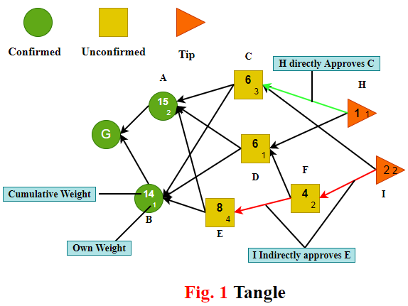

# Double-Spending Analysis of DAG-Based Blockchain in Wireless Blockchain Network

## Abstract

## Introduction 

As an emerging technology that provides trustworthy in a decentralized manner without any third party, blockchain has received great attention from academia and industry. Blockchain first appears as the foundation of the famous cryptocurrency Bitcoin [7].  Various applications of blockchain technology have appeared, such as Ethereum [8], Tendermint [11], HyperLedger fabric [12], etc. Due to the characteristics of decentralization, security, interoperation, and trustwarth, blockchain has shown a great potential to be used in the Internet of Thing(IoT) ecosystems, such as smart vehicles[], supply chain[9], healthcare[10] etc. . At earlier time, blockchain systems are designed in stable wired communication environment and running in advanced devices.  However, these blockchain systems may not suit for high dynamic wireless connected IoT, which consists of  massive low-power wireless devices. Wireless network is vulnerable due to wireless channel fading and openness, which pose a bottleneck on the blockchain system performance and security.

Consensus protocol is the core of blockchain system, which ensures all new blocks (or transactions) can be inserted into the main chain by the network connected nodes efficiently and securely. Proof of Work(PoS) [7] and Proof of Stake(PoS)[13] are two widely used consensus protocols in existing blockchain with "single chain" structure.  Because of the illegal of forking, this structure will limit the transaction throughput and increase consensus delay. Resources limited and large-scale IoT systems require consensus protocols satisfy resource efficiency, low cost and high transaction throughput. Blockchain with direct acyclic graph (DAG) structure allows forking to ensure new transaction can be inserted as soon as possible. DAG-based blockchain allows multiple transactions to be processed simultaneously, transaction confirmation delay can be increased significantly. Transaction per second of DAG-based blockchain can be very large if transaction arrival rate is big enough.

Wilreless Network

Double-spending attack is  a classical problem in blockchain system. S. Nakamoto [7] and M. Rosenfeld [14] have shown that attacker with high computing power can have higher successful probability of double-spending attack in PoW-based blockchain.DAG-based blockchain adopts some effective approaches(Markov Chain Monte Carlo algorithm [4]) to dicrease the successful probability of double-spending attack. When analyzing the double-spending attack, many works assume that communications among the nodes are perfect without any throughput and delay constraints in the traditional blockchain systems. In wireless connected blockchain networks,  the assumption is hard to meet because of unstable channel quality, interference, limited resource, and various network topologies etc. Thus, communication plays an important role in wireless blockchain system, and its impact on the system is far from perfect to be ignored. For example, the broadcast in CSMA/CA comminication protocol should be competitive, which resulting longer transaction confirmation delay and reducing the wireless blockchain security. There is small number of analytical attack models considered the wireless communication impacts on the double-spending successful attack probability of DAG-based blockchain security. Moreover, There is also no detailed analyzation that successful double-spending attack probability of different attack strategies in wireless blockchain network. 

Those observations inspire us analyze the double-spending attack in DAG-based blockchain with CSMA/CA communication protocol. The main contributions of this article are shown as follows.
* We first introduce a system model for wireless blockchain system with CSMA/CA communication protocol;
* We theoretically analyze the double-spending attack in a DAG-based blockchain under wireless network. In order to study the impact of communication protocol, we investigate the probability of successful double-spending attack by a stochastic model.
* We introduce different double-spending attack strategies in a DAG-based blockchain, and derive the format of the successful double-spending attack probabilities that adopt different attack strategies in wireless blockchain network. 

In the rest of this paper is organized as follows. Section 2 introduce some basic concepts of wireless network and DAG-based blockchain. The system model and double-spending attack model introduced in Section 3. InSection 4, we theoretically analyze a double-spending attack process in a DAG-based blockchain under wireless network,  and derive the expression of successful attack probabilities of different double-spending attack strategies in wireless blockchain network. Simulations result show the impact of CSMA/CA on the double-spending attack of wireless blockchain network in Section 5. Section 6 gives the conclusion of of this paper.

## Preliminaries

In this section, we introduce the characteristics of wireless network and the consensus protocol of DAG-based blockchain respectively. Then, we describe the main procedures that a new transaction is accepted by all nodes in the wireless network whose communication protocol is CSMA/CA protocol.

### Wireless Network 

Wireless Local Area Networks(WLANs)[1-2] with high flexibility and convenience can provide high quality services for users in limited geographical area. Currently, as the de facto standard of WLANs, IEEE 802.11[1] has been wirdly used in wireless network. This standard include Distributed Coordination Function(DCF)[3] as Medium Access Control(MAC)[1] mechanism. The DCF, which based on Carrier Sense Multiple Access with Collision Avoidance(CSMA/CA) and binary slotted exponential backoff, can support asynchronous data transfer on a best effort basis. In this paper, we consider that any node competing for wireless channel broadcast packets by using CSMA/CA as media access protocol.

### DAG-based Blockchain

DAG-based blockchain allows that appending new transaction in a forking topology. The first proposed consensus algorithm for DAG-based blockchain is Tangle[4]. In this paper, we use Tangle as consensus algorithm to analyze the consensus process of DAG-based blockchain. Compare to PoW and PoS, Tangle has higher throughput bacause it allows different branches to merge into the main chain eventually. 
As shown in Fig.1, Tangle uses directed acyclic graph topology to record transaction, and the unit of Tangle should be a recorded trasaction. The basic concepts of Tangle are represented as follows:

* **Tip:** the transaction(or block) that has not been approved by any other trasnaction(or block). That is, tips are unapproved transactions in tangle graph;
* **Direct Approval:** two transactions(or blocks) is connected by a direct edge, we can say one transaction is directly approved by another transaction.
* **Indirect Approval:** two transactions are not connected by a direct edge, but there is a directed path of lenth at least two between the two transactions, then we can say the two transactions are indirectly approved.
* **Own Weight:** trasnation's own weight is propotional to the amount of work(computational power or stakes) that issuing node conssumes on proposing a trasnaction(or block).
* **Cumulative Weight:** the sum of the transaction's own weight  and the overall own weight of all transactions that directly or indirectly approve this transaction.
* **Confirmation Weight Threashold:** the threshold value of trasnaction's cumulative weight, when the cumulative weight meet this value, the transaction should be confirmed.

### Consensus process of DAG-Based Blockchain under Wireless Network

While the broadcast procedure following CSMA/CA in wireless network, the consensus protocol should work to make sure that new issued transaction is accepted by the other nodes. For simplicity,we only consider all nodes under same local area network. Thus, the main procedures that consensus process in wireless network are as follows:

* A node finds a nonce to solve a cryptographic puzzle to meet the difficult target.
* The node issues a new transaction which will select two nonconflicting tips to approve based on local information;
* The node uses its private key to sign this new transaction. The new transaction will enter into cache waiting for broadcasting through wireless channel;
* The node competes for wireless channel following CSMA/CA while the new transaction queues in cache following first in first out(FIFO) rule;
* The node either broadcasts the transaction successfully or rebroadcasts with backoff;
* Other nodes receive the new transaction and check it to confirm legality. If the new transaction is legal, then it will become a new tip and wait for the direct or indirect approvement for confirmation. 

The consensus process of an issued transaction is divided into two stages: reveal stage and weight accumulating stage.

  * **Reveal Stage:** The observed transaction is appended into the DAG-based blockchain, that is all nodes can see the transaction.
  * **Weight Accumulating Stage:** the cumulative weight of the observed transaction increases from its own weight to confirmation threshold gradually.

In order to simplify later analysis, we can define the second to five procedures as reveal stage, and procedure six as the weight accumulating stage of new transaction. As we can see that communication in network may cause a serious delay when nodes compete for wireless channel to broadcast the new transaction.

##  System Model and Definitions

In this section, we first introduce the double-spending attack of DAG-based blockchain. And then we analyze the successfull attack probability of double-spending under wireless network with imperfect CSMA/CA protocol.

###  System Model
 We now present some assumptions for double-spending attack analysis.
* Assume that there are $n$ nodes running Tangle, they communicate with each other directly throught wireless channel.
* Let $m$ be the maximum number of transactions at one broadcast.
* Assume that each node selects two tips with no-conflict by Markov Chain Monte Carlo(MCMC) tips selection algorithm[4].
* Let the own weight of each transaction be one.
* Let $h$ be the average transmission delay to broadcast a packet through CSMA/CA protocol. In addition, $h$ is also the reveal time to update the new transaction discussed in Tangle. 
* let $\lambda$ be the transaction arrival rate of each node in wireless blockchain network.
* Let $L(t)$ be the number of tips in DAG-based blockchain at time $t$ when considering CSMA/CA protocol. 
* Let $W(t)$ be the cumulative weight of an observed transaction at time $t$ in CSMA/CA.

In CSMA/CA, all nodes will compete to send messages. We always split time into multiple slots, and let the probability of each node sending messages in a slot be $\tau = \frac{1}{n}$. If there are $n$ nodes in wireless blockchain network, the probability of at least one node broadcasting in a slot time  is 
$$P_{tr} = 1 - (1 - \tau)^{n}.$$

The probability of one node broadcasts successfully in a slot time is 
$$P_s = C_n^1 \tau(1 - \tau)^{n-1} = n\cdot\tau\cdot(1 - \tau)^{n-1}$$
 
 The probability of broadcast collision occuring in a slot time is 
 $$P_c = 1 - (1 - \tau)^{n} - P_s.$$

Let $T_s$ be the average time that channel is detected busy due to a successful broadcasting, and its probability is $P_s$. Denoting $T_c$ is the average time that channel is collision, the probability of broadcast collision is $P_c$. Besides, when the channel is free that no node broadcast in a slot time, let $\sigma$ be the duration time of the empty slot time, the probability of this regime is $1 - P_{tr}$. Therefore, the average transmission delay $h$ is the expected value of the above three situations:
$$h = (1 - P_{tr})\cdot\sigma + P_s\cdot T_s + P_c\cdot T_c.$$

**Proposition** Condidering wireless network that all nodes communicate with each other according to CSMA/CA protocol consists of $n$ independent nodes. If the during time of two neighbor transactions is $h$, and the transaction arrival rate of each node is $\lambda$, then the number of tips in DAG-based blockchain is $L(t)=2n\lambda h$.

**Proof:** Due to the faireness of CSMA/CA, the average time to compete the broadcasting  on each node is $nh$. When the network load is stable, $L(t) = L(t-nh) = L$ for any time $t$, where $L$ is a constant value. There are $n\lambda h$ new transactions between $t - nh$ and $t$ on average. Therefore, we can write $L(t) = r + n\lambda h$, where $r$ is the number of old tips and $n\lambda h$ is the number of tips chosen by new transactions during $t-nh$ to $t$ (they are not tips anymore, but other nodes do not know). When a new transaction arrives at time $t$, two tips from $L(t)$ will be chonsen randomly by the transaction. Since $n\lambda h$ are not tips anymore, tips selection from $r$ or $n\lambda h$ will affect the value of $L(t)$. 
* If new transaction selects two tips both from $n\lambda h$, then $L(t)$ will increase by $1$; 
* If it selects one tip from $r$ and $n\lambda h$, $L(t)$ will unchange; 
* If it selects two tips from $r$, then $L(t)$ will decrease by $1$.

The expected number of selected tips in $r$ can be computed as $\frac{n\lambda h(n\lambda h - 1)}{(r + n\lambda h)(r + n\lambda h -1)}\times 0 + \frac{2rn\lambda h}{(r + n\lambda h)(r + n\lambda h - 1)}\times 1 + \frac{r(r - 1)}{(r + n\lambda h)(r + n\lambda h - 1)} \times 2 = \frac{2r}{r + n\lambda h}$.

Because of the stability of $L(t)$, we have $\frac{2r}{r + n\lambda h} = 1$. Therefore, $r = n\lambda h, L = L(t) = 2n\lambda h$.

### Network Load

Because of the fairness of CSMA/CA, each node has same probability $\tau$ to compete broadcasting in wireless channel. In order to describe the queuing state in detail, we divide the network network load into two regimes.

* **Light Regime:** When the network load is light, the cache on each node may be less than $m$ transactions, where $m$ is the maximum number of transaction containing in a packet. Let $\lambda_l$ be the the transaction arrival rate of light load regime, and we have $n\lambda_lh \leq m$. In this case, all the waited transactions in cache can be broadcasted immediately when the node successfully competes for wireless channel. And the number of tips in the DAG-based blockchain should be $L(t) = 2n\lambda_lh$. While the value of $\lambda_l$ is very small, then we have $L(t) = 2n\lambda_lh \approx 1$, and the DAG-based blockchain will be convert to a single chain. 
* **Heavy Regime:** When the network load is heavy, the cache on each node is always full.  Let $\lambda_h$ be the the transaction arrival rate of heavy load regime, The cumulative transaction on each node is $n\lambda_hh$, which satisfies $n\lambda_hh > m$. If a node compete successfully, it will broadcast at most $m$ transactions, and $m$ new transactions can be stored in cache accordingly. Based on the steady characteristic, the number of tips in DAG-based blockchain should be $L(t) = 2m$ at any time.

## Double-Spending Attack in Wireless Blockchain Network

In this subsection, we analyze the successful attack probability from the perspective of wireless communication. In this case, attacker should win the transaction competition and broadcast the fraudulent chain successfully. In CSMA/CA, the maximum number of broadcast transactions is limited to $m$, thus, the maximum new transaction arrival rate is $\frac{m}{nh}$. 

### Attack Process

The double-spending attack process of  DAG-based blockchain in wireless network is different to that in perfect network. As shown in Fig. 3, the typical way that a malicious attacker lunches double spending attack is to construct a fraudulent chain in blockchain system, the main procedures are shown as follows:

* At time $t_0$, attacker broadcasts an honest transaction, and honest nodes will approve it.
* At time $t_1$, the attacker builds a fraud chain in offchain to approve a fraudulent transaction that is conflicted with the honest transaction.
* After time $t_1$, the attacker will continually issue trasnactions to grow the cumulative weight of the fraudulent transaction. The time $t_1$ should be earlier than the end of adaption periof of the honest transaction.
* At time $t_2$, the honest transaction has been confirmed while its cumulative weight attaches $w$. In this case, the victim will send goods or services to the attacker.
* While the cumulative weight of the fraudulent transaction overweights the confirmed honest transaction after time $t_2$, the attacker will broadcast the fraudulent chain to the whole wireless blockchain network.
* Once the attacker contending for wireless channel to broadcast fraudulent branch updating the DAG-based blockchain, the fraud transaction will be accepted by other honest nodes based on the MCMC algorithm due to the higher cumulative weight. The confirmed honest transaction will be orphened in DAG-based blockchain, the victim cannot receive the payment even though it has provided goods or services. In this case, the attacker issues double-spending attack successfully.

An attacker launches double-spending attack should be earlier than the end of adaptive period time of target honest transaction. Because all new incoming transactions after adaptive period will indirectly approve the honest transaction. There is no doubt that the double-spending attack will fail. Before providing goods or services to the attacker, honest nodes will choose to wait for some transactions on the honest subtangle  to ensure the cumulative weight of honest transaction reaches threshold $N_{cw}$, which includes the own weight of the honest transaction. The attacker will publish the parasite chain if its attack was successful. Therefore, we can define two necessary conditions for double-spending attack as follows:

**Definition** A double-spending attack succeeds if the follwing two conditions satisfied:
* **Transaction Confirmation:** the cumulative weight of the honest transaction is greater than or equal to $N_{cw}$, and
* **Success in competition:** the number of tips in fraudulend subtangle is greater than that in honest subtangle.

### MCMC Selection Algorithm

In Tangle[4], S.Popov proposed two approaches for double-spending attack, one is large weight attack and another is parasite chain attack. Due to the assumption that all transactions have same own weight, we only consider the parasite chain attack that an attacker privately builds a fraudulent subtangle which occasionally references the main tangle to gain higher cumulative weight. 

In order to analyze attack process, we should know the details of MCMC tips selection algorithm.  Recall the assumption that all own weights are equal to $1$, the cumulative weight of a tip should be $1$. In Tangle, the standard of main chain is cumuleitive computational power. The greater the cumulative computational power of the link approved by tips, the more worthy the link to be approved. The idea is to place some random walkers on transactions with at least $2$ cumulative weight of Tangle, and let them randomly walk towards tips. The MCMC algorithm is given as follows.

<pre class="pseudocode" lineNumber="true">
\begin{algorithm}
\caption{ Markov Chain Monte Carlo Selection Algorithm}
\begin{algorithmic}
\PROCEDURE{MCMC}{$BC_{DAG}, N_{cw}, C_N$}
  \STATE $C_N = []$
  \IF{$len(C_N) \leq N$}
     \STATE $walker = $\CALL{RandomSelect}{$BC_{DAG}$}
      \IF{$N_{cw} \leq CW_{walker} \leq 2N_{cw}$}
        \STATE $C_N = C_N \cup \{walker\}$ 
    \ENDIF
  \ENDIF
  \STATE $WTT = []$
  \WHILE{$len(WTT) < 2$}
    \STATE walker = \CALL{FirstToTip}{$BC_{DAG}, C_N$}
    \STATE path = \CALL{PathToTips}{$BC_{DAG},walker$}
    \IF{$len(path) > \alpha$}
      \STATE $WTT = WTT\cup\{walker\}$
    \ENDIF
  \ENDWHILE
\ENDPROCEDURE
\end{algorithmic}
\end{algorithm}
</pre>

All selected walkers will perform independent discrete-time random walks "from transaction with high cumulative weight towards the tips", meaning that a path from $x$ to $y$ is possible if and only if $y$ approves $x$. To defend "lazy tips", the algorithm will discard those random walkers that reach the tips too fast. The path probability of a walker is defined as follows: let $W_x$ be the cumulative weight of transaction $x$. If transaction $y$ approves transaction $x$, then the path probability should be 
$$P_{xy} = \frac{\exp(-\alpha(W_x - W_y))}{\sum_{z:\text{z approves x}}\exp(-\alpha(W_x - W_z))}$$
where $\alpha$ is a parameter that determines the amplification degree of the difference of between $W_x$ and $W_y$. Based on the MCMC selection algorithm, random walker would like to choose the path that with higher cumulative weight transaction. 

**Proposition:** Let $x$ be the transaction whose weight in interval $[N_{cw}, 2N_{cw}]$, where $N_{cw}$ is the cumulative weight confirmation threshold. Let $W_{h}$ and $W_{c}$ be the weights of an honest trasnaction $h$ and corresponding conflict transaction $c$ respectively. If $W_c > W_h$, then the walker will choose the path from $x$ to $c$ with high probability. 
**Proof:** The path probabilities from $x$ to $h$ and from $x$ to $c$ can be computed respectively:
$$\left\{
  \begin{aligned}
   P_{xh} = \frac{\exp(-\alpha(W_x - W_h))}{\sum_{z:\text{z approves x}}\exp(-\alpha(W_x - W_z))},\\
   P_{xc} = \frac{\exp(-\alpha(W_x - W_c))}{\sum_{z:\text{z approves x}}\exp(-\alpha(W_x - W_z))}.
    \end{aligned}
  \right.$$ 
When $W_c > W_h$, we have $W_x - W_c < W_x - W_h$. Thus, we can obtain that $P_{xc} \gg P_{xh}$, which means the path from $x$ to $c$ will be chosen by the random walker with high probability.

 ## The Successful Double-Spending Attack Probability

In this section, we adopt stochastic model to investigate the successful double-spending attack probability.

### Stochastic Model

We can describe the abovementioned double-spending attack process as a Markov chain. In this paper, we fit the transaction arrival process of each node using Poisson Process[5] with transaction arrival rate $\lambda$(transactions per second). 

We denote the weight of the honest subtangle and fraudulent subtangle by two independent Poisson counting processes[6]. Let $H(t)$ be the weight of honest subtangle with transaction arrival rate $\lambda$ at time $t$ and $A(t)$ be the weight of fraudulent subtangle with transaction arrival rate $\mu$ at time $t$. Assume that attacker broadcasts an honest trasnaction at time $t_0$, and launches double-spending attack at time $t_1$. We assume that the states of these two subtangles should satisfy $H(t_1) = A(t_1) = 1$. In this case, the two subtangles have common profix before DAG-based blockchain forking occurs. The difference between $H(t)$ and $A(t)$ in a discrete-time can be represented as a random walk.

Due to the characteristics of CSMA/CA, the time interval between two new transactions should be $nh$, where $n$ is the number of nodes and $h$ is the transimission delay of a packet under wireless blockchain network. Recall that we assume there are $n-1$ honest nodes and $1$ attacker in a one-hop wireless blockchain network, the arrival rates of new trasnactions on a honest node and a malicious attacker shold be 
$$\left\{
  \begin{aligned}
   \lambda' = \min\{\lambda, \frac{m}{nh}\},\\
   \mu' = \min\{\mu, \frac{m}{nh}\}.
    \end{aligned}
  \right.$$ 
where $m$ is the maximum number of transactions of a packet that can be broadcast in wireless channel at once. In each time interval, the propabilities that a new transaction is issued by honest nodes and attacker are as follows:
$$\left\{
  \begin{aligned}
   p = \frac{(n-1)\lambda'}{(n-1)\lambda' + \mu'},\\
   q = \frac{\mu'}{(n-1)\lambda' + \mu'}.
    \end{aligned}
  \right.$$ 

Assume that the time slot is sufficiently small that no two new transactions from the attacker and honest nodes can arrive simultaneously. The number of transactions issued by attacker in interval $[t_1, t_2]$ can be regarded as a random process obying negative binomial distribution[]. 

Let $N_h$ be the number of transactions issued by honest nodes from time $t_1$ to time $t_2$, and $N_a$ be the possible number of trasnactions issued by the attacker. Thus, potential progress function corresponds to a negative binomial distribution given by
$$P_R(p, q, N_h, N_a) = C_{N_a + N_h - 1}^{N_a}p^{N_h}q^{N_a},$$ 
Where $p, q$ are the propabilities that a new transaction is issued by honest nodes and attacker respectively.

### General Attack Strategy

An attacker launches double-spending attack immediately after broadcasting the target honest transaction. The attacker can take control of the DAG-based blockchain as soon as it create a fraudulent subtangle heavier than the honest one. When discussing the successfull probability of double-spending attack, we should consider two scenarios:
* When confirming the honest transaction, the weight of the fraudulent subtangle is greater than that of the honest subtangle. In this case, attacker will publish the  fraudulent subtangle, which indicates attacker launches double-spending attack successfully;
* When confirming the honest transaction,  the weight of the fraudulent subtangle is smaller than or equal to that of the honest subtangle. In this case,instead of publishing the fraudulent subtangle immediately, attacker will catch up the difference between thw two subtangle. Once the weight of the fraudulent subtangle is greater than that of the honest subtangle, attacker will reveal its subtangle to ensure attack successfully.  

When $N_a > N_h$, the attacker launches double-spending attack successfully at time $t_2$. Otherwise, the attacker requires to catch up the difference of transactions that issued by honest node and attacker until the cumulative weight of fraudulent transaction outnumbers that of honest transaction after time $t_2$. This process can be thought as a Gambler’s Ruin problem[]. The attacker needs to catch up the difference of $N_h - N_a + 1$ transactions at least. If $p \leq q$, the attacker will eventually catch up successfully with probability $1$. If $p > q$, the attacker will catch up successfully with probability $a_g$. Thus, the probability that an attacker constructs a fraudulent subtangle which is heavier than the honest one at any time is denoted
$$p(g) = \left\{
  \begin{aligned}
   1, & & p \leq q,\\
   a_g, & & p > q, 
    \end{aligned}
  \right.$$ 
where $g$ is the number of transactions that fraudulent subtangle falls behind the honest subtangle.

**Proposition:** Let the probabilities with which an attacker and honest nodes issue a new transaction be $q$ and $p = 1-q$ respectively. If the current fraudulent subtangle constructed by the attaclker is smaller than the honest subtangle made by honest nodes $g$ transactions, then, the probability that the fraudulent subtangle can outweigh the honest subtangle is $a_g = (\frac{q}{p})^{g+1}$.

**Proof:** $a_g = a_{g+1}p + a_{g-1}q, g = 0, 1,2$

Thus, the catch up function should be given by 
$$C(p, q, g) = \left\{
  \begin{aligned}
   1, & & p \leq q,\\
    (\frac{q}{p})^{g+1}, & & p > q, 
    \end{aligned}
  \right.$$ 

**Proposition:** Let $p,q$ be the probabilities with which an attacker and honest nodes issue a new transaction respectively, and $p > q, p + q = 1$. When an attacker launches double-spending attak, the probability of a successful attack under $z-$ confirmation transaction validation is given by 
$$\begin{align*}
  P_S(p, q, z) & = P\{N_a > N_h\}\cdot 1 + P\{N_a \leq N_h\}\cdot C(p, q, N_h - N_a) \\
   & = \sum_{N_a = N_h + 1}^\infty C_{N_a + N_h -1}^{N_a}p^{N_h}q^{N_a} + \sum_{N_a = 0}^{N_h} C_{N_a + N_h -1}^{N_a}p^{N_h}q^{N_a}(\frac{q}{p})^{N_h - N_a +1} \\
   &= 1 - \sum_{N_a = 0}^{N_h} C_{N_a + N_h -1}^{N_a}(p^{N_h}q^{N_a} - p^{N_a - 1}q^{N_h + 1}),
   \end{align*}$$

At time $t_1$, the number of transactions approcving the honest transaction is $0$. Therefore, we can have $N_h = N_{cw} - 1$ transactions from $t_1$ to $t_2$. The successful attack probability can be expressed as 
$$P_S(p, q, N_{cw}) =  1 - \sum_{N_a = 0}^{N_{cw} - 1} C_{N_a + N_{cw} - 2}^{N_a}(p^{N_{cw} - 1}q^{N_a} - p^{N_a - 1}q^{N_{cw}}).$$ 

Propabilitis with which honest nodes and an attacker issue a new transaction are   $p = \frac{(n-1)\lambda'}{(n-1)\lambda' + \mu'}, q = \frac{\mu'}{(n-1)\lambda' + \mu'}$, where $\lambda' = \min\{\lambda, \frac{m}{nh}\}, \mu' = \min\{\mu, \frac{m}{nh}\}$, and $p > q$.

We use $\lambda, \mu$ representing the transaction arrival rates of honest nodes and an attacker to model double-spending attack. Besides, our analysis depends on wireless communication protocol, we use $m$ presenting the number of broadcast trasnactions in wireless blockchain network.

### Advanced Attack Strategy

To enhance the successful probability of double-spending attack, an attaker would like to builds a fraudulent subtangle on erliar transactions that will be approved by some other transactions before issuing a target honest transaction. The  number of transactions from the start of the honest subtangle to the target transaction is denoted as $N_s$. Thus, at time $t_2$, the attacker should issue at least $N_{cw} + N_s$ transactions to succeed. Otherwise, to ensure attack successful, the attacker have to catch up $N_{cw} + N_s - N_a$ transactions. The catch-up function in this strategy should be given by
$$C_a(p, q, N_s, N_{cw}, N_a) = \left\{
  \begin{aligned}
   1, & & p \leq q,\\
    (\frac{q}{p})^{N_{cw} + N_s - N_a}, & & p > q, 
    \end{aligned}
  \right.$$ 

Therefore, when the attacker constructs a fraudulent subtangle on earlier trasnaction, the probability of a successful attack is giwen by 
$$P_S(p, q, N_s, N_{cw}) =  1 - \sum_{N_a = 0}^{N_s + N_{cw}} C_{N_a + N_s + N_{cw} - 1}^{N_a}(p^{N_s  + N_{cw}}q^{N_a} - p^{N_a - 1}q^{N_s  + N_{cw} + 1}).$$ 

Propabilitis with which honest nodes and an attacker issue a new transaction are   $p = \frac{(n-1)\lambda'}{(n-1)\lambda' + \mu'}, q = \frac{\mu'}{(n-1)\lambda' + \mu'}$, where $\lambda' = \min\{\lambda, \frac{m}{nh}\}, \mu' = \min\{\mu, \frac{m}{nh}\}$, and $p > q$.

### Adaptive Attack Strategy

In Tangle, each node who wants to issue a transaction requires compute a result for a puzzle to meet the target that a  hash value which begin with a specified number of zero bits announced by system. An attacker may give up attacking to avoid too much waste of computational power if the successful attack probability is small. There is an adaptive attack strategy that can improve the probability of a successful attack.

Assume that an attacker builds fraudulent subtangle  on earlier transaction. In this case, attacker will observed the difference between the honest subtangle and its own in time interval from the start of attack to the first time that target honest transaction appears in DAG-based blockchain. The attacker decides whether to continue launch attack base the the observation. Let $N_{h1}, N_{a1}$ be the number of transactions issued by honest nodes anf attacker in interval $[t_1, t_0]$ respectively. Let  $N_{h2}, N_{a2}$ be the number of transactions issued by honest nodes anf attacker in interval $[t_0, t_2]$ respectively. If $N_{a1} \geq N_{h1}$ at time $t_0$, attacker will continue to attack. Otherwise, the attacker doest not continue with the fraudulent subtangle. Instead, it launches attack on transaction  that directly approved by the target transaction.

An attacker launches double-spending attack at time $t_1$, and the target honest transaction is issued at time $t_0$, $t_1 < t_0$. IWhen the attacker observes that the honest subtangle has $N_{s}$ transaction in interval $[t_1, t_0]$, the probability of a successful attack umer $N_{cw}-$ confirmeation transaction validation is given by
$P_S(p, q, N_s, N_{cw}) =  \sum_{N_{a1} = N_s}^{\infty}\sum_{N_{a2} = 0}^{\infty} P(p,q,N_s, N_{a1})\cdot P(p, q, N_{a2}, N_{cw}-1)a_{(N_s + N_{cw} - 1) - (N_{a1} + N_{a2})} + \sum_{N_{a1} = 0}^{N_s}\sum_{N_{a1} = 0}^{\infty} P(p,q,N_s, N_{a1})\cdot P(p, q, N_{a2}, N_{cw}-1)a_{(N_{cw} - 1 - N_{a2})},$

where $ P(p,q,N_s, N_{a1})$ is the probability that number of transactions in the fraudulent and honest subtangle are $N_{a1}$ and $N_s$ at time $t_0$ respectively, $ P(p,q,N_{cw} - 1, N_{a2})$ is the probability that number of transactions in the fraudulent and honest subtangle are $N_{a1}$ and $N_s$ in interval$[t_0, t_2]$ respectively, and $a_g$ is the successful attack probability when the fraudulent subtangle is $g$ transaction behind the honest subtangle. Propabilitis with which honest nodes and an attacker issue a new transaction are   $p = \frac{(n-1)\lambda'}{(n-1)\lambda' + \mu'}, q = \frac{\mu'}{(n-1)\lambda' + \mu'}$, where $\lambda' = \min\{\lambda, \frac{m}{nh}\}, \mu' = \min\{\mu, \frac{m}{nh}\}$, and $p > q$.

##  Simulation and Discussion

In this section, we conduct several experiments to evaluate the the impact of CSMA/CA protocol on the double-spending attack od DAG-based blockchain in wireless network. 

### Impact of the Number of Confirmation  Weight

### Impact of the Transaction Arrival Rate of  Attacker

### Impact of Network Load Ragimes

## Conclusion

## Related Work

Recent years, several DAG-based blockchain systems have been proposed. In 2015, S. D. Lerner[20] first proposed the concept of DAG-Chain, and upgraded the DAG network from block-based level to transaction-based level. IOAT emerged as a new blockchain system in 2015. The innivation of this system is Tangle[4], which is a newly designed distributed ledger with DAG-based structure. In IOAT, there is no concept of block, mining, miners and transaction fee. In 2016, Byteball allows	tamper	proof	storage	of	arbitrary	data. Compared to Tangle, the difference of Byteball is that transaction fee is collected by other nodes who later confirm the newly added unit in this consensus. TrustNote[18] is a minable public DAG-ledger with an innovative, two-tier consensus mechanism. It supports high concurrency transactions, benefits from fast transaction confirmation. Besides, TrustNote  advanced declarative Smart Contracts. Hashgraph[19] is proposed for replicated state machines with guaranteed Byzantine fault tolerance. The participants build distributed ledger for recording each transaction based on a gossip protocol, and Byzantine agreement to be achieved through virtual voting.

There are some works study the double-spending attak of blockchain in perfect network. S.Nakamoto[7] used  Poisson distribution method and Gambler's Ruin theorem to study tht double-spending attack in Bitcoin. Since Poisson distribution method requiring a constant time interval, it may be not rational to adot it to study attack process while the block generation time of Bitcoin is variable. Thus, M. Rosendeld[14] proposed to use negative binomial distribution method insted of Poisson distribution method. This method is only relying on the randomness of block(or transaction) confirmation delay. Besides, G. Ramezan etal.[15] illustrated that a strong adaptive strategic double-spending attack can improve the successful attack probability on blockchain. The mentioned double-spending analyses are based on PoW algorithm. a quantitative analysis for double-spending in DAG-based blockchain is studied by Y.Li etal[16].

The above work have not  have not fully considered the limitation of the underlying wireless network, and no research focuses on the different  analysis on the perspectives of blockchain system and wireless network simultaneously.

12月30日再继续

## References

[1] L. S. Committee, "ANSI/IEEE Std 802.11: Wireless LAN Medium Access Control (MAC) and Physical Layer (PHY) Specifications". IEEE Computer Society, 1999.
[2] B. P. Crow, J.G. Kim, "IEEE 802.11 Wireless Local Area  Networks", IEEE Communications magazine, Sept. 1997.
[3] H. Wu, S. Cheng, Y. Peng, K. Long and J. Ma, "IEEE 802.11 Distributed Coordination Function (DCF): Analysis and Enhancement," 2002 IEEE International Conference on Communications. Conference Proceedings. ICC 2002 (Cat. No.02CH37333), 2002, pp. 605-609 vol.1, doi: 10.1109/ICC.2002.996924.
[4] S. Popov, "The tangle", White paper, 2018. [Online]. Available:
https://www.iota.org/research/academic-papers.
[5] R. G. Gallager, "Discrete Stochastic Processes". Kluwer Academic Publishers, 1996.
[6] A. Papoulis and S. U. Pillai, “Random walks and other applications,” in Probability, Random Variables and Stochastic Processes, 4th edition., Boston, Mass.: McGraw-Hill Europe, 2002.
[7] S. Nakamoto. Bitcoin: A Peer-to-Peer Electronic Cash System. https://bitcoin.org/bitcoin.pdf, 2008.
[8]	G. Wood. Ethereum: A Secure Decentralized Generalized Transaction Ledger. Ethereum Project Yellow Paper, vol. 151, pp. 1-32, 2014.
[9] G. Perboli, S. Musso, and M. Rosano, “Blockchain in Logistics and Supply Chain: A lean approach for designing real-world use cases,” IEEE Access, vol. 6, pp. 62018–62028, Oct. 2018.
[10] X. Liang et al., “Integrating Blockchain for Data Sharing and Collaboration in Mobile Healthcare Applications,” in Proc. IEEE 28th Annu. Int. Symp.,
Oct. 2017, pp. 1–5.
[11] J. Kwon. Tendermint: Consensus without mining. Draft v. 0.6, fall, 1(11), 2014.
[12]	E. Androulaki, A. Barger,  and et al. Hyperledger Fabric: A Distributed Operating System for Permissioned Blockchains. In Proceedings of the Thirteenth EuroSys Conference, page 1–15. ACM, Apr 2018.
[13]	S. King, S. Nadal. PPCoin: Peer-to-peer crypto-currency with proof-of-stake. https://archive.org/details/PPCoinPaper (2012).
[14] M. Rosenfeld, “Analysis of Hashrate-Based Double Spending,” ArXiv14022009 Cs, Feb. 2014, Accessed: Oct. 11, 2018. [Online]. Available: http://arxiv.org/abs/1402.2009.
[15] G. Ramezan, C. Leung and Z. Jane Wang, "A Strong Adaptive, Strategic Double-Spending Attack on Blockchains," 2018 IEEE International Conference on Internet of Things (iThings) and IEEE Green Computing and Communications (GreenCom) and IEEE Cyber, Physical and Social Computing (CPSCom) and IEEE Smart Data (SmartData), 2018, pp. 1219-1227, doi: 10.1109/Cybermatics_2018.2018.00216.
[16] Y. Li et al., "Direct Acyclic Graph-Based Ledger for Internet of Things: Performance and Security Analysis," in IEEE/ACM Transactions on Networking, vol. 28, no. 4, pp. 1643-1656, Aug. 2020, doi: 10.1109/TNET.2020.2991994.
[17] A. Churyumov, " Byteball: A Decentralized System for Storage and Transfer of Value". [Online]. Available: https://byteball.org/Byteball.pdf, 2016.
[18] White Paper, "TrustNode: Fast, Scalabile, Developer Friendly," [Online]. Available:https://github.com/trustnote/document, 2018.
[19] L. Baird, "The Swirlds Hashgraph Consensus Algorithm: Fair, Fast, Byzantine Fault Tolerance". [Online]. Available: http://www.swirlds.com/developer-resources/whitepapers/, 2016.
[20] S. D. Lerner, "DagCoin: A, Cryptocurrency without Blocks," [Online]. Available: https://bitslog.com/2015/09/11/dagcoin/, 2015.

