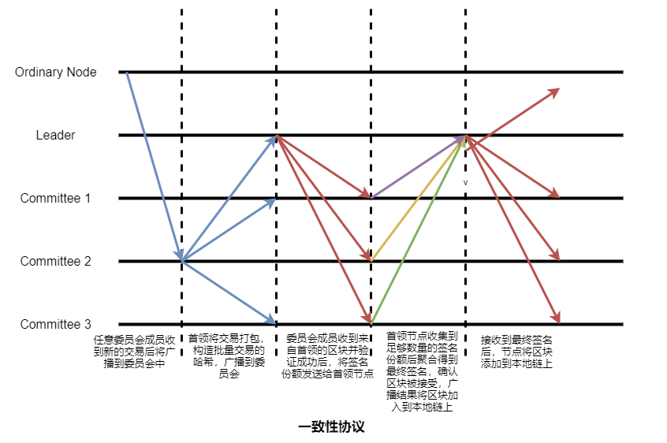

# 稳定的分片区块链共识算法

## 模型假设

【简单描述：（一）区块链模型，包括节点之间的网络结构和特征、区块结构、存储结构等，例如，节点通信模型（节点拓扑或路由结构、信噪比模型等）、区块链存储模型（链式、DAG、…）等；（二）区块生成过程，包括交易打包、区块生成（包括共识）、区块上链等过程；（三）其它，包括其它与本论文紧密相关的部分。注意：重点剖析与本论文紧密相关的部分。】

###（一）区块链模型

在大规模无线自组织网络环境中，链式存储的区块链。
* **网络模型**：考虑一个无线自组织网络，$N$个节点随意部署在一个二维平面中。记$d(u,v)$为两个节点之间的欧氏距离，$DR(v)$ 为以节点v为中心，通信半径为 $R$ 的圆盘。每个节点都拥有唯一的ID。假设节点可以在网络区域中随意移动，并且节点可以随意进入和离开这个区域。
* **区块结构**：每个节点局部地维护一个区块链。各区块通过引用前一个区块的哈希最终形成一条链的形式。每个区块中包含多个交易、自身区块的哈希、前一个区块的哈希、时间戳、区块的组合签名、区块的高度等信息。假设节点可以被公钥基础设施支持，并且系统中采用的密码学原语是安全的，因此没有恶意实体可以伪造消息。
* **干扰和SINR模型**：采用信号干扰模型能够很好的捕获无线网络的干扰。标准信号干扰的信噪比模型为 
$$SINR(u,v) =\frac{S}{I+N}\geq \beta$$
其中 $S = P\cdot d(u,v)^(-\alpha)$ 是节点 $v$ 接收到的节点 $u$ 的信号的功率，$P$是平均信号发射功率，在节点$v$处的干扰为
 $$I=∑_{w∈W∖u}P\cdot d(w,v)^{-\alpha} $$
其中$W$是在当前传输节点的集合，$N$为环境噪声，路径损耗指数为$α∈(2,6]$，阈值$β>1$取决于节点的硬件。假设节点可以进行物理载波监听。

###（二）区块生成过程
	
* **交易的提交和广播**：节点发现新交易后广播到网络。节点接收到新的交易验证交易的合法性后放入在本地交易池中。
* **委员会选举和分配**：根据节点的稳定度决定节点被选中的概率。采用随机抽签算法选举当前任期每个分片委员会，使用基于平均跳数或者基于节点位置的方式选择出每个分片委员会的首领节点。首领节点将作为根委员会的成员，采用与分片委员会相同的方式选举根委员会的首领。
* **分片区块生成**：每个分片首领会从交易池中取出交易打包成区块作为提案广播给分片委员会成员。每个分片委员会内执行基于门限签名的一致性协议对分片区块达成一致。随后分片首领将区块提交给根委员会。
* **最终区块的确认和上链**：根委员会首领节点收集并验证分片区块，最终形成一个总区块广播给根委员会成员。根委员会内部执行基于门限签名的一致性协议对总区块达成一致，总区块被确认添加到委员会的本地链上并广播总区块到各个分片中。分片中各节点对于接收到的区块放入自己的本地链上，实现全局一致性。

###（三）其它

## 研究问题

【从技术层面描述：各个问题产生的背景和原因，针对每个问题分别给出若干个可能可行的方案。重点描述“研究问题”产生的原因和进行研究的必要性，对问题分析得越清晰、透彻，越有利于后面的研究；对方案只需进行简单描述，在下一节中再详细描述研究方案。】

在无线自组织网络环境中，当节点数量增加会导致节点之间的通信增加。为了降低网络资源的消耗，提高交易处理效率，需要设计一个适用于大规模无线自组织网络中的分片委员会共识算法。
* **通信资源耗费巨大**：原因？【共识节点之间的通信会随着节点数量增加而增加，导致达成共识所需的网络资源非常大】方案？【采用网络分片的方式减少共识节点之间的相互通信；基于位置/跳数的方式选择委员会中的成员，确保委员会中的成员能够覆盖尽可能大的区域，降低共识节点网络通信资源的消耗】
* **交易处理效率低**：原因？【区块的大小是有限的，因此单一委员会处理交易的效率比较低】方案？【将节点按照网络特性（比如位置）进行分片，并行处理交易提高效率；将节点的位置和跳数作为选择首领节点的依据，降低节点达成一致的网络时延，提高交易的处理效率；】
* **跨分片交易死锁**：原因？【跨分片通信延时高，由于分片内交易处理速度快导致跨分片交易处理过程出现死锁】方案【采用原子提交协议确保跨分片交易处理时相关交易不会再分片中被处理；采用分片融合的方式使得跨分片交易相关交易处于同一个分片中，避免出现跨分片交易死锁的问题；将一个跨分片交易拆分为多个交易，并在不同分片中处理，从而避免了跨分片通信的问题；】

## 研究方案

【详细描述“研究问题”中各方案的关键技术方案或算法，包括：方案或算法的细节、重点和难点、该技术方案解决“研究问题”中的哪个问题等。】

###（一）定义稳定度

无线区块链系统中，新节点加入后要质押金钱获得在系统中活动的时间。活动的时长与交付的押金成正比。

记$T_v$ 为无线网络节点 $v$ 在区块链系统中的活跃时间，记 $r_v = \frac{N_v}{K}$ 为节点在最近$K$个确认区块中参与共识比值，其中 $N_v$ 是节点 $v$ 生成区块的数量。定义无线网络节点 $v$ 的稳定度为 
$$S_v= \alpha\times T_v+ \beta\times r_v$$
其中，权重系数 $\alpha, \beta$ 可根据偏好设置。在区块链系统运行初期，确认区块数量不足 $K$个时记节点的共识比 $r_v = 0$，此时节点的稳定度主要受节点的活动时间的影响。

重点：计算节点的剩余活动时间、节点的共识比和这两个度量的权重系数。
难点：计算影响节点稳定度的度量的权重系数，测量节点的共识比，计算其他节点的稳定度，验证首领节点的合法性。
解决的问题：解决工作量证明选取首领节点消耗巨大算力，解决首领节点突然离开系统导致，押金机制也可以一定程度上防止敌手发起女巫攻击。

###（二）共识算法

区块链系统需要共识算法确保所有节点维护相同的区块链。共识算法主要分为几部分：分片委员会、根委员会和首领节点的选举、一致性协议和委员会重置。我们将根据节点的稳定度和分片情况随机选举分片委员会成员、根委员会成员和首领节点。稳定度高的节点具有更大的概率被选中，稳定度低的节点被选中的概率将更小。一致性协议则是采用门限签名方式，让委员会成员不需要二次通信就能对区块达成一致。
* **委员会选举和分配**：采用随机方式分别选举和分配分片委员会，将上一个区块的哈希和最终签名的哈希作为随机种子，计算随机可验证函数得到抽签结果和证明，其他节点可以根据证明验证结果的有效性。
	* **轮盘赌抽签**
    轮盘赌方式中根据节点的稳定度决定节点被选中的概率。记$w_i$ 是节点 $i (i = 1, \cdots N)$ 的稳定度，所有节点的稳定度之和为 $W= ∑_iw_i$ ，那么节点i被选中的概率为 $p_i=  \frac{w_i}{W}$ 且有 $∑_{i=1}^Np_i=1$。为了确定被选中的节点，将区间[0,1]分为连续的多个区间
    $$[0,∑_{k=0}^i p_k],i=1],(∑_{k=0}^{i-1} p_k ,∑_{k=0}^i p_k],i=2,…, N.$$
    随机可验证函数将区块的哈希和最终签名作为输入计算得到一个值和证明
    $$(value,proof)=VRF(sk,Block||Signature_{group})$$
    满足 $\frac{value}{2^{bits(value)}} > \lambda$ 的前 $C$ 个节点被选举为委员会成员。
	* **验证抽签结果**
    根据随机可验证函数输出的值和证明，其他节点也可以验证委员会成员选举结果的合法性。
    $$result=VerifyVRF(pk, value, proof, Block,Signature_{group})$$
    如果验证结果为 $result= 1$，则委员会节点的验证成功，该成员是合法的；如果结果为 $result= 0$，则委员会节点的合法性将不被承认。
* **分片委员会和根委员会中首领节点选举**：每个委员会将有一个任期，每个任期又分为多个轮。每轮需要选举首领节点生成区块在委员会内部达成一致。无线自组织网络中节点之间通信信道不稳定并且通信时延高。因此，为了降低共识时延可以选择委员会中相互之间通信少的节点作为首领，降低网络资源消耗的同时提高委员会达成一致的效率。
    * **【方案一】** 通过路由算法委员会成员可以得知到其他成员节点的跳数，最终选择最小平均跳数的节点作为首领。记委员会成员数量为$C$，则委员会节点到其他节点跳数的矩阵记为
    $$H = \begin{bmatrix}
    h_{11}  &   h_{12}  &   \cdots  &  h_{1C}\\
    h_{21}  &   h_{22}  &   \cdots  &  h_{2C}\\
    \vdots  &   \vdots  &   \vdots  &  \vdots\\
    h_{C1}  &   h_{C2}  &   \cdots  &  h_{CC}\\
    \end{bmatrix}$$
    其中 $h_{ij}$ 表示节点 $i$ 到节点 $j$ 之间的最小路由跳数，当 $i=j$ 时 $h_{ij}=0$，表示节点到其自身的跳数为零。
    * **【方案二】** 在无线网络通信中，节点的欧式距离会反映节点之间的通信情况。因此可以根据节点之间的欧式距离来选举出到其他节点平均欧式距离最短的节点作为首领节点。记委员会成员数量为$C$，则委员会节点到其他节点的欧式距离矩阵记为
    $$D = \begin{bmatrix}
    d_{11}  &   d_{12}  &   \cdots  &  d_{1C}\\
    d_{21}  &   d_{22}  &   \cdots  &  d_{2C}\\
    \vdots  &   \vdots  &   \vdots  &  \vdots\\
    d_{C1}  &   d_{C2}  &   \cdots  &  d_{CC}\\
    \end{bmatrix}$$
    其中 $d_{ij}$ 表示节点 $i$ 和节点 $j$ 之间的欧式距离，当 $i=j$ 时 $d_{ij}=0$，表示节点到其自身的欧式距离为零。
    * **【方案三】**：将节点之间的欧式距离（或跳数）和节点的活动时间作为首领选举的影响参数。记 $T_a$ 为节点的活动时间，节点之间平均欧式距离（跳数）记为 $\mathbf{\hat{d}}$。节点根据公式  $\gamma_1\cdot T_a + \gamma_2\cdot \mathbf{\hat{d}}$ 对委员会内成员进行排序，选择值最大的节点作为首领。
* **委员会一致性协议**：确定委员会成员和首领之后，首领节点会生成和分发密钥份额给委员会其他成员。首领节点生成新的区块广播给委员会成员。委员会成员会验证区块、首领节点的合法性。委员会成员需要验证区块当前签名份额的有效性，并且有效签名份额的数量不能小于门限值。当签名数量达到阈值后会组成区块的最终签名，区块会被确认达成一致。委员会成员将区块链接到区块链并广播给其他非委员会成员。接收到确认区块的节点验证区块合法性成功后将区块连接到本地链上。在一个由 $C$ 个移动无线网络节点组成的委员会中，能够容忍 $f = \lfloor\frac{C-1}{3}\rfloor$ 个节点发生拜占庭故障，能够保证达成共识的节点数量为 $Quorum = \lceil\frac{C+f+1}{2}\rceil$。

    委员会首领负责将未处理的交易进行排序打包，所有成员执行交易的逻辑顺序相同。
    * **交易广播阶段**：任意节点生成交易之后都将提交给任意当前委员会成员；委员会内成员接收到交易之后广播给其他委员会成员。
    * **准备阶段**：首领节点将交易排序并打包到区块，将区块消息作为提案广播到委员会。
    * **确认阶段**：委员会成员接收到来自首领的区块提案后，对区块和首领节点验证合法性。一旦验证成功就发送签名份额到首领节点。首领节点收集到一定数量的签名份额后聚合成最终签名，将区块放入本地链并广播最终签名到全网。
    * **更新区块链**：一旦接收到最终签名，节点将区块链接到本地链上，更新区块链。

    
* **跨分片交易**：多委员会区块链共识算法面临着跨分片交易死锁问题和跨分片交易处理缓慢的问题。考虑无线网络通信不稳定和跨分片交易通信时延高等问题，需要一个安全高效的跨分片交易处理方式。
  * 【方案一】采取一个原子提交协议提交协议。当出现跨分片交易时，与该交易相关的分片中的交易将被锁住。如果与该跨分片交易相关的交易都是合法有效的，确认该交易的有效性。否则该跨分片交易将被拒绝，随后分片中的交易被解锁。原子提交协议确保跨分片交易处理的安全性问题，防止交易死锁。
  * 【方案二】采取交易分离的方式。将跨分片交易分割为几个不同分片的交易，并将交易发送到所属分片中处理。这种方式可以极大的降低跨分片交易处理是网络通信，提高交易处理的性能。
  * 【方案三】采用分片临时融合的方式。如果两个分片频繁出现跨分片交易，则将两个分片融合为一个分片。这种方式会直接将跨分片交易转变为分片内部的交易，降低跨分片交易处理所需的节点之间的网络通信。但是分片融合的时候会出现分片委员会重新确定的问题。针对这个问题可以直接选取其中一个委员会作为新分片的委员会，也可以从两个原来的委员会中随机选举或者排序选举新的委员会成员。
* **委员会重置**：为了确保根委员会和分片委员会的稳定性和防止敌手腐蚀委员会成员，每个委员会任期结束之后需要更换部分委员会成员。
  * 【方案一】采用随机的方式更换委员会成员。委员会中能够容忍拜占庭故障节点的数量为 $f = \frac{C-1}{3}$，为了确保系统的安全性，委员会成员每次最多只随机更换 $\lfloor\frac{C-1}{3}\rfloor$ 个委员会节点。
  * 【方案二】采用排序的方式更换委员会成员。对委员会中成员的稳定性排序，最多更换稳定度最低的 $\lfloor\frac{C-1}{3}\rfloor$ 个委员会节点。
  * 【方案三】采用轮循的方式更换委员会成员。新选举的委员会节点会替换委员会任期开始之后生成区块的前 $\lfloor\frac{C-1}{3}\rfloor$ （最多）个节点。

重点：利用轮盘赌的方式选举委员会成员，基于跳数或者位置的方式选举首领节点。采用基于门限签名的一致性协议在委员会内对区块达成一致。
难点：快速计算每个节点的稳定度和被选中概率，快速选举委员会成员和首领。获取其他节点的跳数信息和位置信息。计算门限签名中密钥份额的计算和分发，区块签名份额的收集和最终组合。跨分片交易死锁的问题。
解决的问题：解决节点公平性问题，确保每个节点都可能被选中成为委员会成员获得奖励。解决区块链分叉问题，委员会机制确保所有的节点都维护相同的区块链。解决跨分片交易死锁问题。

###（三）奖惩机制
	
* **奖励机制**：委员会任期结束，委员会内所有节点将平分任期内所有生成区块的奖励和交易费用。这样的奖励机制能激励系统中的节点积极维护系统区块链，提升系统的活性。
* **惩罚机制**：如果节点在未到活动时间结束之前离开系统，则会扣除部分押金。当发现有节点作恶后系统也会扣除押金。这个机制会降低节点离线和作恶的机会。

重点：采用奖励机制提高节点的活性和系统的安全性，使用惩罚机制降低节点作恶的动机。
难点：交易费用的计算，快速分配奖励给委员会成员。
解决的问题：解决节点缺乏活性问题，奖励机制可以激励节点积极地参与共识维护区块链。节点如果长期离线就会蒙受经济损失，解决节点长期离线的问题。

## 仿真实验

【描述：（一）实验目标，（二）实验方案（详细的实验方案，包括实验环境、实验步骤等），（三）技术难点（目前的技术难点、还需要补充的知识等）。】

###（一）实验目标

通过仿真实验测试交易吞吐量和区块确认延时分析区块系统的性能。
* **交易吞吐量**：单位时间内处理交易的数量；
* **区块确认延时**：区块确认的平均时延。

在仿真实验中需要测试不同区块大小、节点数量、节点密度的情况下区块链系统的交易吞吐量和区块确认延时。

考虑网络带宽，网络通信协议、单位时隙大小、编程语言、运行设备、测试次数等。

影响因素包括：区块大小、网络大小、节点密度等。

###（二）实验方案

【如何来完成实验？在自己设计的区块链中采集数据进行分析？在公链上进行实验？实验步骤是什么？】

无线自组织网络中测试区块链系统的性能需要在自己设计一个区块链进行数据采集和分析。实验步骤如下：
* **搭建无线自组织网络**：每个节点都以相同的移动速率在网络区域中随机移动，且在区域中的活动时间是有限的。对于节点之间的通信采用CSMA/CA作为通信协议。
* **记录节点的活动时间**：为每个节点赋予不同的活动时间，当活动时间结束则该节点离开网络。记录节点进入网络的时间。
* **生成交易**：构造一批不同的交易，确保他们的哈希不同。发送交易到网络中，并记录开始发送交易的时间。
* **选举委员会成员**：记录委员会选举开始的时间,根据任期长度记录委员会结束的时间。
* **生成区块**：每一轮开始从委员会成员中选举首领节点，首领节点生成区块并广播到网络中，记录每轮开始时间和区块发送时间。
* **确认区块**：委员会对区块达成一致结果确认区块。记录委员会节点的日志中区块确认的时间、每轮轮结束的时间和区块中交易的数量。
* **计算区块确认延时**：计算区块生成时间和确认时间可以得出区块的确认延时。
* **计算平均交易吞吐量**：计算一个委员会任期中所有区块中处理交易的数量，除以任期时长，可以得到平均交易吞吐量。

###（三）技术难点

【根据设计的实验方案，目前的技术难点或需要学习的知识有哪些？】

* **技术难点**：在无线自组织网络上搭建区块链系统，计算稳定度依据的权重系数，获取其他节点的稳定度。节点活动起止时间记录，区块发送和确认时间记录，区块中交易数量计数，更换委员会成员。
* **待学习的知识**：分片区块链共识的仿真实验和在公链上测试性能的方法。树莓派搭建共识区块链系统

