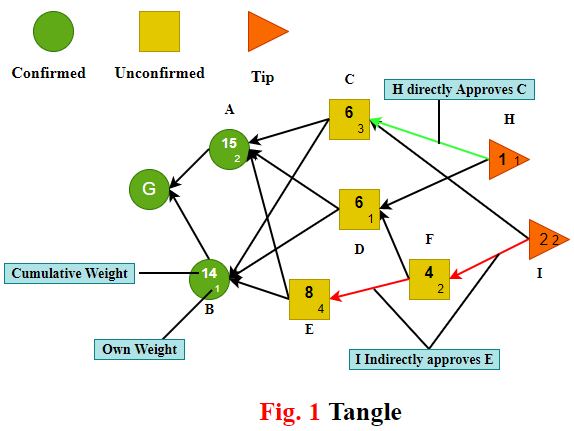
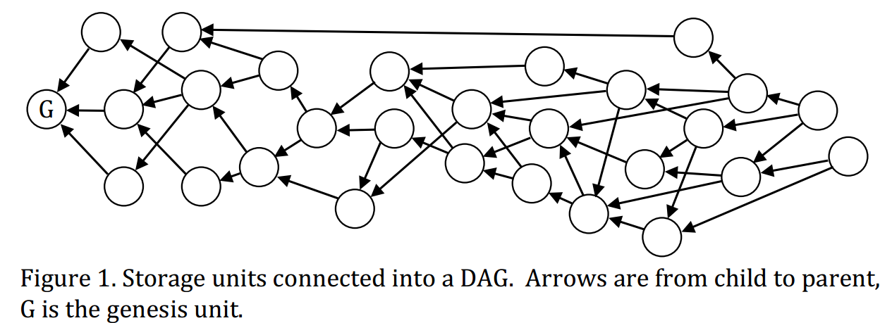
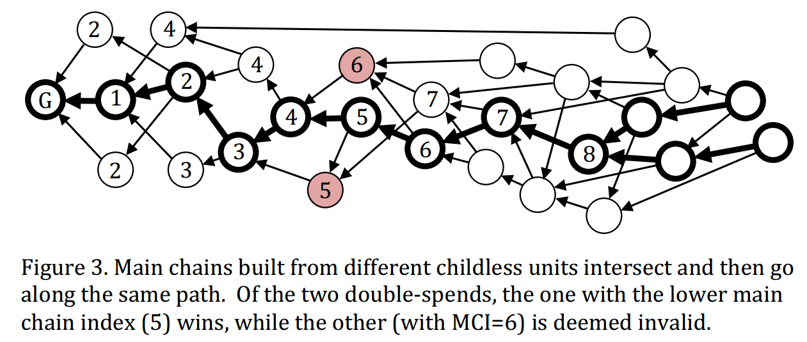
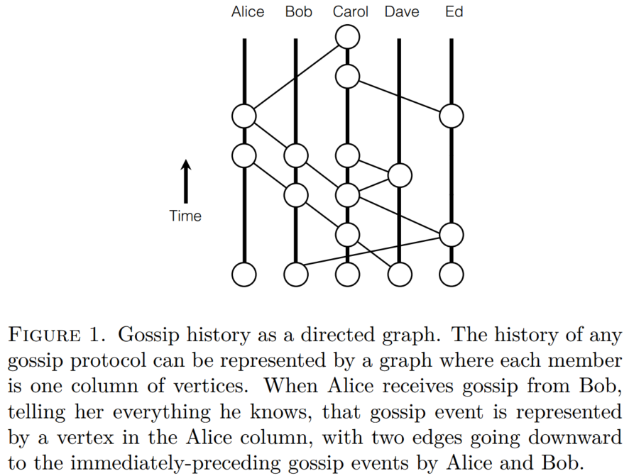
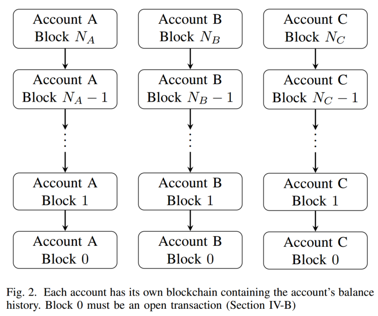
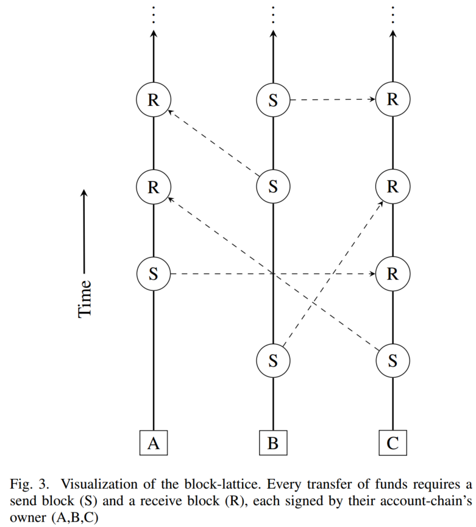
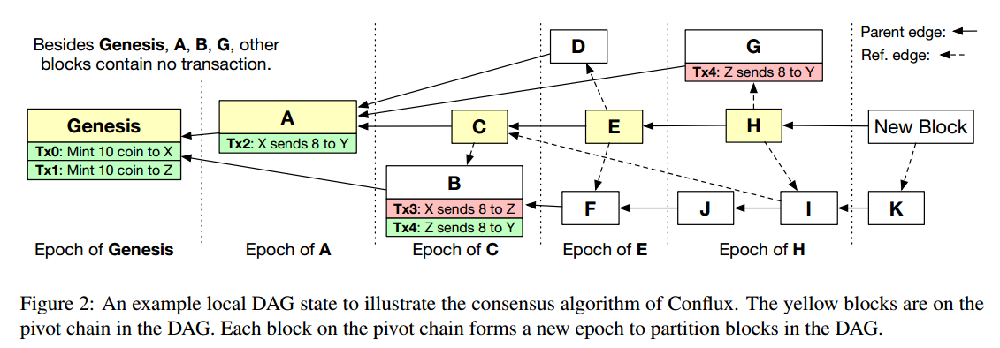

#  DAG Blockchains

## IOTA

The IOTA is a new micro payment cryptocurrency optimized for the Internet of Things, with tamper-proof data, feeless micro transactions and low resource requirements. The main innovation of IOTA is Tangle, which is scalable, lightweight, and exchange value and data securely, without any fees. It ensures that the information is trustworthy and cannot be tampered with nor destroyed. We will introduce the details of Tangle in the following.

### Basic Concepts

Compare to PoW and PoS, Tangle has higher throughput because it allows different branches to merge into the main chain eventually. 
As shown in Fig.1, Tangle uses directed acyclic graph topology to record transaction, and the unit of Tangle should be a recorded **transaction, approved tips, digital signature, own weight, and cumulative weight**. The basic concepts of Tangle are represented as follows:

* **Tip:** the transaction(or block) that has not been approved by any other trasnaction(or block). That is, tips are unapproved transactions in tangle graph;
* **Direct Approval:** two transactions(or blocks) is connected by a direct edge, we can say one transaction is directly approved by another transaction.
* **Indirect Approval:** two transactions are not connected by a direct edge, but there is a directed path of lenth at least two between the two transactions, then we can say the two transactions are indirectly approved.
* **Own Weight:** trasnation's own weight is propotional to the amount of work(computational power or stakes) that issuing node conssumes on proposing a trasnaction(or block).
* **Cumulative Weight:** the sum of the transaction's own weight  and the overall own weight of all transactions that directly or indirectly approve this transaction.
* **Confirmation Weight Threashold:** the threshold value of trasnaction's cumulative weight, when the cumulative weight meet this value, the transaction should be confirmed.

### Consensus Process

The main procedures of consensus process in Tangle are as follows:

* A node finds a nonce to solve a cryptographic puzzle to meet the difficult target.
* The node creates a new transaction which will select two nonconflicting tips to approve by MCMC tips selction algorithm;
* The node uses its private key to sign this new transaction, and broadcasts the transaction to others;
* Other nodes receive the new transaction and check it to confirm legality. If the new transaction is legal on the digital signature and nonce, then it will become a new tip and wait for the direct or indirect approvement for confirmation. 

A transaction is confirmed when its cumulative weight is large enough. The consensus process of an issued transaction is divided into two stages: reveal stage and weight accumulating stage.

  * **Reveal Stage:** The observed transaction is appended into the DAG-based blockchain, that is all nodes can see the transaction.
  * **Weight Accumulating Stage:** the cumulative weight of the observed transaction increases from its own weight to confirmation threshold gradually.

问题：Tangle中的共识过程使用Tips选择算法只有在大多数交易都是诚实的情况下才有效。这个方法对于对于冲突现象发生时，结局过程比较缓慢，并且容易导致错误的交易最终被确认（双花攻击）。那么对于冲突交易的平均解决时间大概是多长？是否有其他的方法加快节点之间交易的确认，并且降低冲突交易中欺诈交易最终被确认的概率？
 
## Byteball

Byteball is a decentralized	system that allows	tamper proof storage of	arbitrary data. Storage	units are linked to	each other such that each	storage	unit includes one or more hashes of	earlier	storage	units, which serves	both to	confirm	earlier	units and establish	their partial order. The set	of links among units forms a DAG (directed acyclic graph). 

### Basic Concepts

The Storage unit in Byteball include **unit message, signature and parent unit**
* **Unit Message:** A unit message includes more than one data package.
* **Signature:** A unit contains the signatures of users who creates the unit.
* **Parent Unit:** A unit contains the hash of referenced previous units.

Byteball adopts UXTO transaction model.  The	message	contains:
* An array of outputs: one or more addresses that receive the bytes	and	the amounts	they receive.
* An array of inputs: one or more references to	previous outputs that are used to fund the transfer. These are outputs that were sent to the author address(es)	in the past and are	not yet	spent.

Storage units connected into a DAG,units are werticesand parent-child links are the edges of the DAG. Soecially, the arrows of the DAG are from child unit to parent unit. 

The basic concepts of Byteball are represented as follows:
* **Parent Unit & Child Unit:** If unit A directly arrows unit B, i.e. the path length from unit A to unit B is $1$, then the unit B is the parent of unit A and unit A is unit B's child.
* **Directly Include:** If unit A is the children of unit B, then unit A directly include or verify unit B.
* **Indirectly Include:** If the length of the path that from unit A to unit B is bigger than $1$, then the unit A indirectly include or verify unit B.
* **Top Unit:** A unit is defined as top unit if the unit has no child unit. We also call it  unverified unit.
* **Genesis Unit:** The unit that constructed by the genesis transaction is called genesis unit. The genesis unit has no parent unit. The index of genesis unit is $0$

Every new child unit in	the	DAG	confirms its parents, all parents of parents. Thus, it is impossible to revise a unit without cooperating with all its childrens or stealing their private keys. Once a unit is broadcast	into	the	network,and	other	users	start	building their units on	top of it	(referencing it	as parent),	the	number	of	secondary	revisions required to	edit this	unit hence	grows	like	a	snowball.

###  The Main Chain Selection Rule

In Byteball, the optimal paths from any tipits to the genesis unit are denoted as **Candidate Main Chain**. The main chain is constructed by selecting the "best parent" unit from all parent units of a child unit. The main chain built starting from a specific unit will never change as new unit are added. If nodes star from another tip, they will build another main chain. Different candidate main chains will intersection in some intersection points, which is called **stable point**. (the worst case is that chains are intersection in genesis unit). For all candidate main chain, the path from stable point to genesis unit is exactly same, which is called **stable main chain**. Stable main chain is a deterministic path, and transition from a candidate path to a stable path is a process that gradually changes from uncertain to certain. Thus, the main chain can establish a total order beyween two conflicting nonserial units. The genesis unit has index $0$, the next main chain unit that is a child of genensis has index$1$ and the main chain index can be assigned so on. For units that not lie on the main chain, we can find a main chain indes where this units is first included(directly or indirectly).

Witnesses is the participants of network that are non-anonymous, high reputable and mainning the network healthy. Nodes select the best parent unit of a new incoming unit according to the level of unit and witnessed.
* **Unit Level:** the level of a unit is defined as the path length from the unit to genesis unit;
* **Witnessed Level:** Backtracking along the main chain from current unit, and count the number of different witnesses in the path until encountering enough witnesses. Witnessed level is the unit level of the backtracking stop position.

The best parent unit selection strategy consists of the following three components:
* When selecting the best parent unit, a parent unit with higher witness level is the best parent unit;
* If the witness level is the same, the one with smaller unit level is regared as the best parent unit;
* If both witness level and unit level are the same, the one with lower unit hash value should be selected as the best parent unit.

In the mentioned strategy, witnesses become the historical perspective of a unit. Each unit can maintian its own witnesses list, and can also refer other units' witnesses list through witnesslistunit function. Ifthe witnesslist of  two units differs at most $1$ mutation, then the two units is **Unit Compatible**.

**The "near-conformity rule":** best parent must be selected among those parents whose witness list differs from child's by at most $1$ mutation. That is, the best parent unit can only be selected from the parents unit that compatible with the current unit to ensure the continuity of the historical perspective. Incompatible parent units are still recognized, but they cannot be the best parent unit. In particular, if a new unit is incompatible with all tips, the parent of the unit should be selected from the parent units of the previous level. 

Byteball requires	that the number of witnesses	is exactly $12$.
* it is sufficiently large to protect against the occasional failures of a few witnesses (they might prove dishonest, or be hacked,	or go offline for a long time, or lose their private keys and go offline forever);
* it is sufficiently small that humans can keep track of all the witnesses to know who is who and change the list when necessary;
* the	one allowed	mutation is sufficiently small compared with the $11$ unchanged witnesses.

### Consensus Process

The main procedures of consensus process in Byteball are as follows:

* A witness composed a new unit, and select parents from candidates according to the best parent selction algorithm. 
* The witness sign the new unit, pays a fee equal to the size of added date in bytes, and broadcasts the unit to others;
* Other nodes receive the new unit and check it to confirm legality. If the new unit is legal on the digital signature, then it will become a new tip and wait for the direct or indirect approvement for confirmation. 

The main chain inroduces a total order of all unit in DAG-based blockchain. All new incoming units would like to be the units of his current main chain. The current main chain	may	be different at different nodes because	they may see different sets of childless units.	

## TrustNote

TrustNote is a minable public DAG-ledger with an innovative, two-tier consensus mechanism designed for new applications. 

### Basic Concepts

In TrustNote, a transaction is viewed as a message. multiple messages can be combined in to a data block which is called **unit**, and a DAG is formed by inter-referenced units. In TustNote, each Unit must reference multiple previous Units, nodes do not require to *spend computing power and time* for solving consensus problem, nor need to wait for the *completion of strong inter-node data synchronization*.

The basic concepts of Byteball are represented as follows:
* **Unit:** a data structure which can contains many messages generated by the nodes including: Transactions messages, text messages and etc. A unit consists of multiple messages(transactions) of various types.
  * *Header:* The hash value of the previous Unit(parent unit);
  * *Messages:* A Unit contains one or more messages, there are various types of message, and each message type has its own unique data structure.
  * *Signatures:* A Unit contains one or more users’ signatures.
  * *Address:* A user can have multiple addresses; the addresses are generated with BIP- 0044 algorithm.
* **Nodes:** Aany active user, installed TrustNote client (any devices such as phone, pc, IoT, etc.) and having a valid wallet address.TrustNote supports four types of Nodes: Super Node, Full Node, Light Node and Micro Node.
  * *Super Node:* Mining Systems, Cloud Host Server/Workstation, and PC, which generates a deposit contract and paying the deposit, and running the TrustME-PoW mining program.
  * *Full Node:* Cloud Host Server/Workstation, and PC, which maintaining synchronization and verification of ledger data. 
  * *Micro-Node:* Client running on Microcontrollers and Smart Cards.
  * *Light Node:* Client running on Smartphone and Tablet PC.
* **Parent unit & Child unit:** If unit A directly includes unit B, then the unit B is the parent of unit A and unit A is unit B's child. Each unit in TrustNote should reference multiple parents;
* **Genesis Unit:** The genesis unit has no parent and is the first unit in TrustNote DAG ledger.
* **Childness Unit:** Units have no Parent-Child relationship with each other. 
* **Unit Level:** The unit level is defined as the longest path length from that unit to Genesis unit. 
* **Attestor:** A Super node, which participates in a round of consensus and successfully obtains Attestation power.
* **Attestation Level:** To determine the Attestation Level for any unit labelled as starting unit, follow the path along best parent chain, until finding more than half of all Attestors’ Attestation unit along the path. Then calculating the unit level of the stop unit, this value is the Attestation Level of the starting unit. The genesis unit is created by all initial Attestors, so it’s the best parent naturally.
* **PoW Unit:** A unit containing Equihash solution.
* **TrustME unit:** A unit used to determine the MC and its first message is a TrustME Coinbase message.

* **Main Chain:**  A single chain along Child-Parent links within the DAG which is determined by applying the Parent Selection Algorithm recursively.
* **MCI:** Main Chain Idex.
* 

### Consensus Process

TrustNote adopts a two-tier consensus mechanism comprising base consensus and TrustME consensus:
* **The based Consensus(DAG consensus)** requires new transaction Units sent by Nodes verify the previous units by referencing them. 
* **The Attested consensus(TrustME consensus)** requires that the sequences of Non-TrustME Units be rigorously determined by TrustME Units generated by the Attestors. (TrustME-PoW scheme, TrustME-BA scheme)

When a TrustME Unit becoming a stable Unit in the Main Chain, it could finally justify that an Attestor has contributed to TrustNote positively, and thus receive the Attestation reward. A transaction fee is divided and paid to:
* The Node(s) who generate newer Unit and reference this Unit as Parent.
* The Attestor who attested the Unit.

If a Unit is referenced by multiple Child Units, the Node who sends the Child Unit with the smallest hash value will get the referencing fee. To qualifying the rewards, the Main Chain Index (MCI) of the Child Unit must equal or be slightly greater than its Parent’s MCI.

The **best parent unit selection algorithm** is showed as below:
1) Start from a unit.
2) Selecting the parent unit with the highest Attestation level as its best parent unit.
3) If there are multiple candidate units, the unit with the lowest unit level will be selected as the best parent unit;
4) If there are still multiple candidate units, the unit with the smallest unit hash is the best parent.

The main procedures of consensus process in TrustNote are as follows:

* A node issues a new unit, and select parents from candidates according to the best parent selction algorithm. 
* The node signs the new unit, and broadcasts the unit to other nodes;
* Other nodes main curretn main chain. when receiving the new unit, nodes will check it to confirm legality. If the new unit and its parent-child link is legal, then it will become a new tip and wait for the direct or indirect approvement for confirmation. 
* TrustNote will select a small number of super nodes as Attestors using TrustME-PoW or TrustME-BA. These Attestors have the authority to send TrustME Units and are rewarded accordingly. Only when the TrustME Unit becomes the stable Unit on the MC, the corresponding attestation reward can be obtained. 

在获得新的单元时，每个节点会持续追踪自身的主链。不同节点各自的当前主链也许是不同的，因为他们可能看到不同的非稳定单元的集合。当新单元到达时，当前的主链会不断变化，但是当前主链足够老的那部分会保持不变。因此，未来所有的主链在回溯时最终都会汇聚到某个主链单元。这个主链单元及之前的所有的引用单元都是稳定的。因此，创世单元是一个最初的稳定点。若基于当前的非稳定单元集合构造一条当前主链，并且这条链上已有一些之前认定的稳定节点，随后沿着统一路径回溯。被这个稳定点所引用的单元将获得确定的MCI，包含在这些单元中的所有消息也将被确认。

发布交易需要支付交易费用发。节点根据生成单元的字节数计算交易费用。交易费用分为60%的单元引用费和40%的公证费。引用费将被该单元的子单元获得；公证费将被累加到主链中MCI值最接近的公正单元所在共识轮的公正奖金池中。公正单元也需要支付交易非，计算方式与普通单元相同。

|               | IOTA      | Byteball  | TrustNote | Nano(RaiBlocks)|
|----------|----------|-----------|------------|------------|
| Token      | IOTA    | Byte        | TTT          | XRB          |
| Consensus Mechanism| PoW Cumulative Weight| 12 Witnesses| Decentralized TrustME Consensus Mechanism| DPoS Consensus Mechanism Balance-Weighted Vote |
|Reward| No |Transaction Reference and Attestation| Transaction Reference and Mining| No |
| Nodes| Full Node Light Node| Full Node Light Node| Super Node Full Node Light Node Micro Node| Full Node Light Node |
|Transaction Fee | No | Yes | 60% Referencing Fee 40% Attestation Fee | No
|Double-Spending| PoW Wight Comparison | Main Chain Sequencing | Main Chain Indexing|
| Low-Frequency Trading | Centralized Coordinator | Weak Centralized Attestor | TrustME Attestor| Balance-weighted Voter|

## Hashgraph

Hashgraph is a distributed ledger technology that has been described as an alternative to blockchains. The hashgraph technology is currently patented, and the only authorized ledger is Hedera Hashgraph.

### Basic Concepts

The hashgraph consensus algorithm is based on the following core concepts.
* **Transactions:** any member can create a signed transaction at any time. All members get a copy of it, and the community reaches Byzantine agreement on the order of those transactions.
* **Gossip:** information spreads by each member repeatedly choosing another member at random, and telling them all they know
* **Hashgraph:** a data structure that records who gossiped to whom, and in what order.
* **Event：** an even includes transactions, two events, timestamp,signature, and communicates with each other by Gossip protocol.
* **See:** If some event $w$ has even$x$ as ancestor, then the event $w$ see event $x$.
* **Strongly See:** An event $x$ can strongly see event $y$ if $x$ can see $y$ and there is a set $S$ of events by more than $\frac{2}{3}$ of the members such that $x$ can see every event in $S$, and every event in $S$ can see $y$.
* **Ancestor & Self-ancestor:** An event $x$ is defined to be an ancestor of event $y$ if $x$ is $y$, or a parent of $y$, or a parent of a parent of $y$, and so on. It is also a self-ancestor of $y$ if $x$ is $y$, or a self-parent of $y$, or a self-parent of a self-parent of $y$ and so on.
* **Round Created Number:** The round created number (or round) of an event $x$ is defined to be $r + i$, where $r$ is the maximum round number of the parents of $x$ (or 1 if it has no parents), and $i$ is defined to be $1$ if $x$ can strongly see more than $\frac{2n}{3}$ witnesses in round $r$ (or 0 if it can’t).
* **Round Received Number:** The round received number (or round received) of an event $x$ is defined to be the first round where all unique famous witnesses are descendants of $x$.
* **Witness:** A witness is the first event created by a member in a round.
* **Famous witnesses:** A famous witness is a witness that has been decided to be famous by the community. Informally, the community tends to decide that a witness is famous if many members see it by the start of the next round. A **unique famous witness** is a famous witness that does not have the same creator as any other famous witness created in the same round. In the absence of forking, each famous witness is also a unique famous witness.

### Consensus Process

The main procedures of consensus process in Hashgraph are as follows:

* Node A randomly syncs to node B, and sends all events it knowns that B doesn't. 
* Node B creates a new event to record these events with valid signatures containing valid hashes of parent events it has.
* After gossip sync, the node calls three procedures to determined the consensus order for as many events as possible:
  * Divide Rounds: All known events are then divided into rounds. And node B should assign the round numberto all known events.
  * Decide Fame: Then the first events by each member in each round (the “witnesses”) are decided as being famous or not, through purely local Byzantine agreement with virtual voting. 
  * Find Order: The total order is found on those events for which enough information is available.First, the received round is calculated. Then, the received time is calculated. Then the consensus order is calculated. 

Hashgraph共识算法通过一个拜占庭一致性协议来对事件进行虚拟排序。该算法不需要选举出主节点来对事务进行排序。排序也只需要极小的通信开销，比较适用于在联盟链环境中参与共识的节点数量较多的场景。但是对于公链的场景就有些不足。因为该算法需要知道全网的总数量，且从算法上来看至少需要两轮才能确定当前轮中事务的顺序，算法的效率和事务处理的时效性也许不高。共识算法主要是两个部分：
* 首先随机选择一个节点同步，创建一个新的事务。
* 随后对于当前的所有事务进行排序：
  * 对所有事务划分轮数。每轮中创建的第一个事务就是一个见证； 
  * 随后我们执行局部的拜占庭一致性算法判定当前轮的每个见证是否是著名见证。主要是通过后一轮中的见证来判定当前一轮的见证是否是著名见证。如果后一轮的见证能够“看见”前一轮的那个见证，则会投票为“是”，否则否票为“否”。一旦有超过 $\frac{2n}{3}$ 个都能“看见”前一轮的那个见证，则说明那个见证是著名见证。随后在后两轮中对于投票进行计数。如果后两轮的某个见证能够“强看见“后一轮中的见证，则计数，否则不进行计数。根据最终计数结果来判定最终当前轮的见证是否是著名的。
  * 对于不是见证的事件，是没有投票的。大多数见证者在第一轮投票中几乎一致地投票被宣布是著名的，所以大多数选举不会储蓄较长时间。在确定了当前轮中每个见证的声望之后，就可以为一组的事件找到接收轮和共识时间戳。对于能够被当前轮中每个著名见证看见的事务，其接收轮就是当前轮数。随后在各节点上找到一个事件既是该事件的后代又是当前轮著名见证的祖先。取出这些事件的时间戳，选择中位数时间戳作为该事件的共识时间戳。
  
最终对当前轮所有达成共识的事件（收到了接收轮数的事件）按照所有节点都同意的顺序排序，这个顺序就是共识顺序。这个排序就是通过它们的round received来进行的。通过中位数时间戳来打破联系

## Nano(RaiBlocks XRB)

Nano is a cryptocurrency with a novel block-lattice architecture where each account has its own blockchain, delivering near instantaneous transaction speed and unlimited scalability.

### Basic Concepts

The individual components of Nano are shown as follows:
* **Account:** An account is the public-key portion of a digital signature key-pair. One user may control many accounts, but only one public address may exist per account.
* **Block/Transaction:** A block contains a single transaction. Transaction specifically refers to the action while block refers to the digital encoding of the transaction. 
* **Ledger:** The ledger is the global set of accounts where each account has its own transaction chain. 
* **Node:** A node is a piece of software running on a computer that conforms to the Nano protocol and participates in the Nano network. A node may either store the entire ledger or a pruned history containing only the last few block of each account’s blockchain. Nodes only have to record and rebroadcast blocks for most transactions.
* **Open Transaction:** An open transaction is the first transaction of every account-chain and can be created upon the first receipt of funds.
* **Genesis Balance:** The genesis balance is a fixed quantity and can never be increased. The genesis balance is divided and sent to other accounts via send transactions registered on the genesis account-chain. 
* **Representative:** 
* **Change Transaction:** A change transaction changes the representative of an account by subtracting the vote weight from the old representative and adding the weight to the new representative.
* **Vote Weight:** The weight of a node’s vote is the sum of the balances of all accounts that have named it as its representative.
* **Transaction Verification：** For a block to be considered valid, it must have the following attributes:
  * The block must not already be in the ledger (duplicate transaction).
  * Must be signed by the account’s owner.
  * The previous block is the head block of the accountchain. If it exists but is not the head, it is a fork.
  * The account must have an open block.
  * The computed hash meets the PoW threshold requirement

Nano uses a block-lattice structure. Each account has its own blockchain (account-chain) equivalent to the account’s transaction/balance history. Each account-chain can only be updated by the account’s owner.

Every transfer of funds requires a send block (S) and a receive block (R).

### Consensus Process

The main procedures of consensus process in Nano are shown as follows:

* Each Node creates an account by issuing an open transaction. On account creation, a representative must be chosen to vote on your behalf; this can be changed later. (The system is initiated with a genesis account containing the genesis balance. )
* when transfering a fund, source account should create a send block(transaction).Once broadcasted to the network, fund is immediately deducted from the balance of the source account and waits as pending until the receiving party signs a block to accept
this fund.
* when receiving the fund, destination account will  create a receive block(transaction) on its own account-chain. Once this block is created and broadcasted, the destination account's balance is updated and the fund have officially moved into its account. 
* When detecting a conflicting view on the status of an account, a representative(node) will create a vote referencing the block in its ledger and broadcast it to the network.
* The node will observe incoming votes from the other $M$ online representatives and keep a cumulative tally for $4$ voting periods(1
minute total), and confirm the winning block. The most popular block will have the majority votes and will  be retain in the node's ledger( If a representative replaces a block in its ledger, it will create a new vote with a higher sequence number and broadcast the new vote to the network. This is the only scenario where representatives vote.)

Nano一个节点可以存贮所有账户的历史账本，也可以只存贮每个账户的最后修剪记录。当一笔交易发生的时候，发出金额的一方会生成一个send tx的区块，包含记录扣除的金额；而收款账户则生成receive tx区块记录对应获得的金额。交易数据的收发是可以异步进行的，所以就算同时有多笔金额汇入一个账户也没有问题，最终的金额是收到的所有金额的加法。如果接收方不在线也没关系，未到账的金额会单独标记，等到接收账户上线之后，这笔金额就会从未结算区打入接收区块，完成交易。

对于分叉问题，NANO使用了DPOS共识机制。账户可以指定代表为其投票，得票最多的代表将处理分叉，这个代表会将分叉广播到网络，并观察来自其他代表节点在固定时间内的投票接结果，以此来确定保留哪一个区块。DPOS可以保证区块的合理低能耗运行。NANO也使用到了POW机制，确认交易需要非常少的工作证明（PoW）。因此，Nano系统采用的是PoW+DPoS混合共识机制。

## Conflux

 Conflux is a fast, scalable, and decentralized
blockchain system that can process thousands of transactions per second while confirming each transaction in minutes. 

### Basic Concepts

Some basic concepts of Conflux are shown in the following"
* **Block:** a block consists of transactions, parent ID, reference ID and the signature of its creator ect.
* **Genesis Block:** The firt generated block in conflux.
* **Parent Edge:** Each block except Genesis has exactly one outgoing parent edge (solid line arrows in Figure 2). The parent edge corresponds to a voting relationship, i.e., the node that generates the child block votes for the transaction history represented by the parent block. 
* **Reference Edge:** Each block can have multiple outgoing reference edges (dashed lines arrows in Figure 2). A reference edge corresponds to generatedbefore relationships between blocks. 
* **Pivot Chain:** Note that all parent edges in a DAG together form a parental tree in which the genesis block is the root. In the parental tree, Conflux selects a chain from the genesis block to one of the leaf blocks as the *pivot chain*. Pivot chain Selection rule that Conflux does not select this longest chain because the subtree of A contains more blocks than the subtree of B. Therefore, the chain selection algorithm selects A over B at its first step.
* **Local DAG State:** Each node maintains a local state that contains all blocks which the node is aware of. Because in Conflux each block may contain links to reference several previous blocks not just one, the result state is a direct acyclic graph (DAG)
* **Epoch:** Parent edges, reference edges, and the pivot chain together enable Conflux to split all blocks in a DAG into epochs. 
* **Generating New Block:** Whenever a node generates a new block, it first computes the pivot chain in its local DAG state and sets the last block in the chain as the parent of the new block.
* **Block Total Order:** Conflux determines the total order of the blocks in a DAG as follows. Conflux first sorts the blocks based on their corresponding epochs and then sorts the blocks in each epoch based on their topological order. If two blocks in an epoch have no partial order relationship, Conflux breaks ties deterministically with the unique ids of the two blocks. 
* **Transaction Total Order:** Conflux first sorts transactions based on the total orders of their enclosing blocks. If two transactions belong to the same block, Conflux sorts the two transactions based on the appearance order in the block.
* **Transaction Confirmation:** The user locates the first epoch that contains a block including the confirming transaction. The user identifies the corresponding pivot chain block of the epoch. The user then decides how much risk it can tolerate based on the estimations of the block generation power that the attacker controls. The user finally estimates the risk of the pivot chain block being reverted to decide whether to confirm the transaction.

### Consensus Process

The main procedures of consensus process in Hashgraph are as follows:

* Node packets some transactions from Pending Transaction Pool, and generates a new block.
* The node computes the pivot chain in its local DAG state by pivot chain selection algorithm, and sets the last block in the chain as the parent of the new block. Then the Node selects a sibling block as the reference block of the new block.
*  The node will update its local  DAG state, and broadcasts the ipdated local DAG blockchain to other nodes.
*  Other nodes receiving the updated local  DAG state, and broadcasts the updated local  DAG state to others.

Conflux共识算法主要流程：
* 流程一：当一个节点从其他节点接收到了一个DAG的更新信息时，该节点立即更新其局部状态，并且将传递该局部状态到网络中；
* 流程二：当一个节点成功生成一个新区块时，节点将新区块添加到局部DAG中，且更新 $G$. 先获取一个该DAG中心链的最后一个区块作为该新区块的双亲区块，并在他们之间添加一条双亲边；随后找到所有没有入度的叶子区块，添加新区块到这些叶子区块的引用边；最后节点将更新的 $G$ 广播到网络中。

Conflux通过构建一个全局区块序来避免分叉问题：
* 先按照GHOST规则排序只包含父边的块，形成一个枢轴链(pivot chain),它类似于比特币的主链，不一样之处在于它还会引用比特币系统中丢弃的块
* 根据枢轴链对区块分成各个纪元（epoch）,然后对每个epoch里面的区块拓扑排序。确定epoch包含的区块的划分原则是需要同时满足以下两个条件：
  * 该区块可以通过枢轴链的父边或者引用边遍历到 该区块没有被之前的epoch包含
  * 根据happens-before原则(就是谁在谁前面）对不同epoch之间的块进行排序。

最终区块的确认是根据攻击者空着的区块算力的估计来决定他以承受的风险，根据风险的估计值来确认交易。

