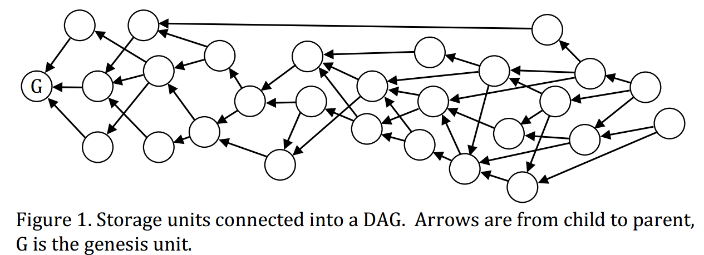

#  DAG Blockchains

## IOTA

The IOTA is a new micro payment cryptocurrency optimized for the Internet of Things, with tamper-proof data, feeless micro transactions and low resource requirements. The main innovation of IOTA is Tangle, which is scalable, lightweight, and exchange value and data securely, without any fees. It ensures that the information is trustworthy and cannot be tampered with nor destroyed. We will introduce the details of Tangle in the following.

### Basic Concepts

Compare to PoW and PoS, Tangle has higher throughput because it allows different branches to merge into the main chain eventually. 
As shown in Fig.1, Tangle uses directed acyclic graph topology to record transaction, and the unit of Tangle should be a recorded **transaction, approved tips, digital signature, own weight, and cumulative weight**. The basic concepts of Tangle are represented as follows:

* **Tip:** the transaction(or block) that has not been approved by any other trasnaction(or block). That is, tips are unapproved transactions in tangle graph;
* **Direct Approval:** two transactions(or blocks) is connected by a direct edge, we can say one transaction is directly approved by another transaction.
* **Indirect Approval:** two transactions are not connected by a direct edge, but there is a directed path of lenth at least two between the two transactions, then we can say the two transactions are indirectly approved.
* **Own Weight:** trasnation's own weight is propotional to the amount of work(computational power or stakes) that issuing node conssumes on proposing a trasnaction(or block).
* **Cumulative Weight:** the sum of the transaction's own weight  and the overall own weight of all transactions that directly or indirectly approve this transaction.
* **Confirmation Weight Threashold:** the threshold value of trasnaction's cumulative weight, when the cumulative weight meet this value, the transaction should be confirmed.

### Consensus Process

The main procedures of consensus process in Tangle are as follows:

* A node finds a nonce to solve a cryptographic puzzle to meet the difficult target.
* The node creates a new transaction which will select two nonconflicting tips to approve by MCMC tips selction algorithm;
* The node uses its private key to sign this new transaction, and broadcasts the transaction to others;
* Other nodes receive the new transaction and check it to confirm legality. If the new transaction is legal on the digital signature and nonce, then it will become a new tip and wait for the direct or indirect approvement for confirmation. 

A transaction is confirmed when its cumulative weight is large enough. The consensus process of an issued transaction is divided into two stages: reveal stage and weight accumulating stage.

  * **Reveal Stage:** The observed transaction is appended into the DAG-based blockchain, that is all nodes can see the transaction.
  * **Weight Accumulating Stage:** the cumulative weight of the observed transaction increases from its own weight to confirmation threshold gradually.

问题：Tangle中的共识过程使用Tips选择算法只有在大多数交易都是诚实的情况下才有效。这个方法对于对于冲突现象发生时，结局过程比较缓慢，并且容易导致错误的交易最终被确认（双花攻击）。那么对于冲突交易的平均解决时间大概是多长？是否有其他的方法加快节点之间交易的确认，并且降低冲突交易中欺诈交易最终被确认的概率？
 
## Byteball

Byteball is a decentralized	system that allows	tamper proof storage of	arbitrary data. Storage	units are linked to	each other such that each	storage	unit includes one or more hashes of	earlier	storage	units, which serves	both to	confirm	earlier	units and establish	their partial order. The set	of links among units forms a DAG (directed acyclic graph). 

### Basic Concepts

The Storage unit in Byteball include **unit message, signature and parent unit**
* **Unit Message:** A unit message includes more than one data package.
* **Signature:** A unit contains the signatures of users who creates the unit.
* **Parent Unit:** A unit contains the hash of referenced previous units.

Byteball adopts UXTO transaction model.  The	message	contains:
* An array of outputs: one or more addresses that receive the bytes	and	the amounts	they receive.
* An array of inputs: one or more references to	previous outputs that are used to fund the transfer. These are outputs that were sent to the author address(es)	in the past and are	not yet	spent.

Storage units connected into a DAG,units are werticesand parent-child links are the edges of the DAG. Soecially, the arrows of the DAG are from child unit to parent unit. 

The basic concepts of Byteball are represented as follows:
* **Parent Unit & Child Unit:**
* **Directly Include:**
* **Indirectly Include:**
* **Tops Unit:**
* **Genesis Unit:**

## TrustNode

## Hashgraph