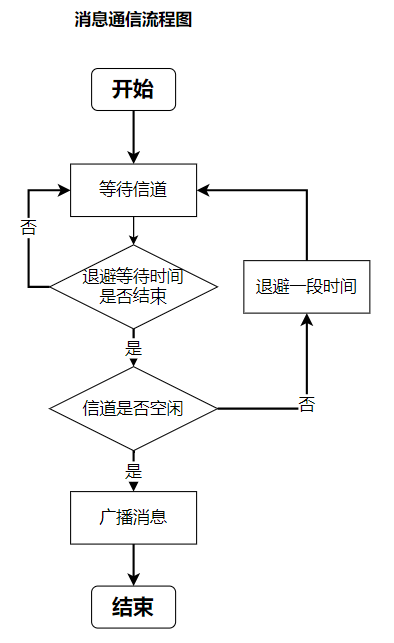
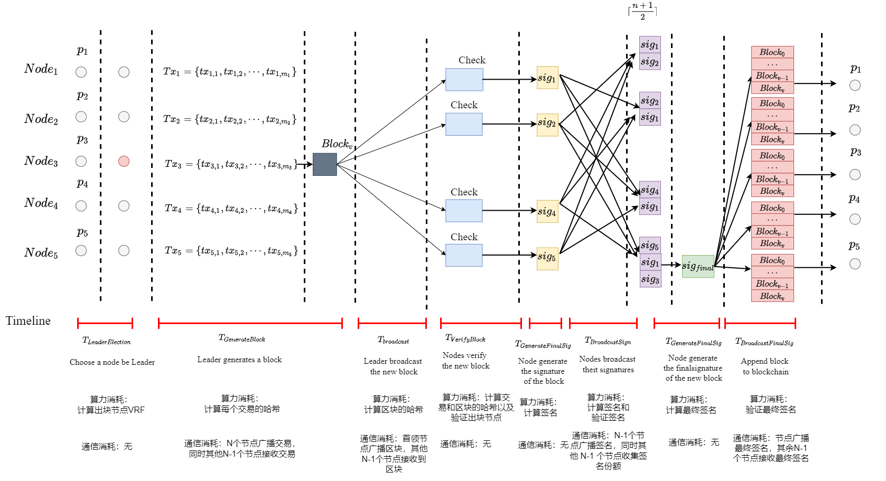
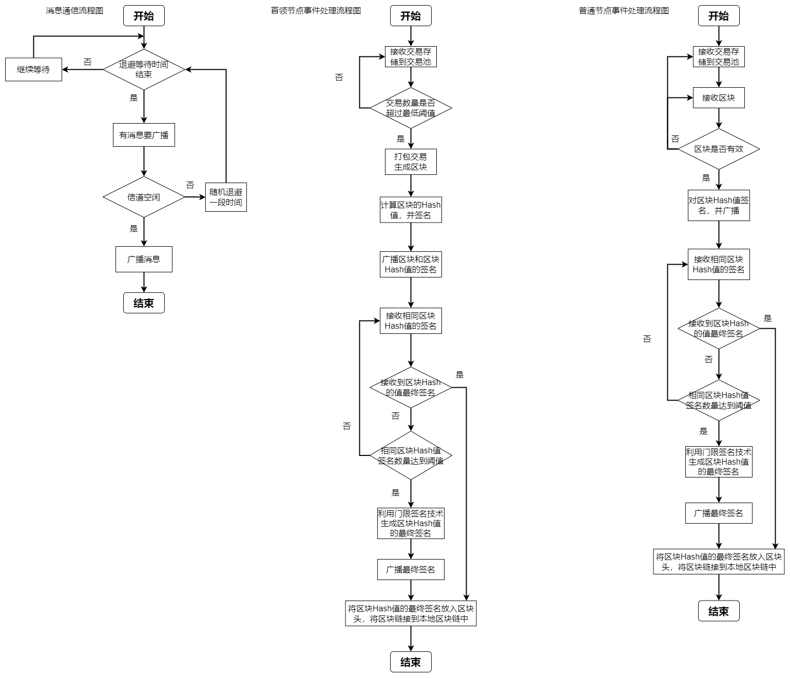

# 代码仓库

## 1. 网络基本设置

共识协议是运行于节点随机分布的全连接无线网络，网络中任意两个节点都在彼此的通信范围之内。假设：

* 每个节点配有半双工收发器，可以发送或接收消息，或感知信道，但不能同时发送和接收或发送和感知；每个节点拥有唯一的ID，并且知道其他节点的身份和公钥。

* 系统是开放的，任意节点都不需要事先的身份授权就加入系统；节点可以在网络区域中随意移动，可以随意进入和离开网络。此外，每个节点在一个网络中的活动时间是有限的。

当节点发送消息时，先看自己的退避时间是否结束。如果结束并且侦听信道为空闲，则节点发送消息；如果信道忙碌，则再退避一段时间。通信的流程图如下所示：

## 2. 共识过程

共识协议的共识过程是由四个阶段组成：出块节点选举阶段、区块生成阶段、区块验证阶段和链更新阶段，具体如下：
  
* **出块节点选举阶段：** 网络中有一个节点被选举为出块节点；
  
* **区块生成阶段：** 被选中的出块节点将近期的交易打包，创建一个新区块，随后广播该区块；
  
* **区块验证阶段：** 节点接收到新区块之后，验证出块节点的合法性和区块的有效性。一旦出块节点的合法性和区块的有效性都得到确认后，节点对区块进行签名并广播签名。其他节点收集并验证收到签名。
  
* **链更新阶段：** 当节点接收到的有效签名数量超过某个阈值时，组合形成最终签名，确认区块并将区块添加到本地链上，同时广播最终签名。其他节点接收到最终签名后，将区块添加到本地区块链上。至此，所有节点对新区块达成共识，开始新一轮的共识过程。

共识流程如下图所示：

## 3. 项目代码结构

项目代码包括：交易类、区块类、节点类和网络类。

## 1. 节点设计

稳定共识协议主要分为四个部分：首领选举、区块提出、区块验证和区块上链。根据节点的稳定度选举出出块的首领节点，因此节点可以分为首领节点和普通节点。此外，节点还需要进行通信，主要通信的消息由交易、区块和签名。节点设计中相应的通信处理和事件处理流程图如下：

### 1.1 交易类

交易类主要包含：
* 交易的ID
* 交易内容
* 交易签名

### 1.2 区块类

区块类中主要包含了：
* 区块ID
* 前一个区块的Hash
* 出块节点ID
* 交易集合
* 区块的Hash
* 区块的最终签名

### 1.3 节点类

节点类中包括：
* 节点的ID
* 节点的位置
* 节点的通信范围
* 节点的活动时间
* 节点在最近 $K$个区块中节点生成区块的数量
* 存储交易
* 存储区块链
* 存储邻居节点
* 节点信道忙碌情况
* 节点消息发送队列
* 当前处理的区块
* 当前首领节点ID
* 当前接受区块Hash签名集合
* 最终签名
* 当前对区块Hash签名

节点具有的功能有：
* 生成交易
* 生成区块
* 生成签名
* 验证签名
* 验证区块有效性
* 更新交易池
* 同步最新区块链
* 计算消息传输时间
* 将要传输的消息添加到消息发送队列
* 信道忙碌处理
* 消息传输成功后更新消息

### 1.4 网络类

网络类主要包括：
* 网络中节点集合
* 当前首领
* 当前首领节点ID

主要类函数有：
* 创建节点
* 寻找所有节点的邻居节点
* 生成创世区块
* 添加新节点
* 首领选举：（计算稳定度和选举首领节点）
* 更新节点信息
* 传输消息
* 事件处理

